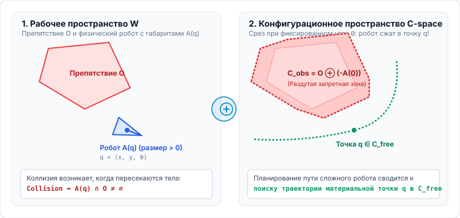
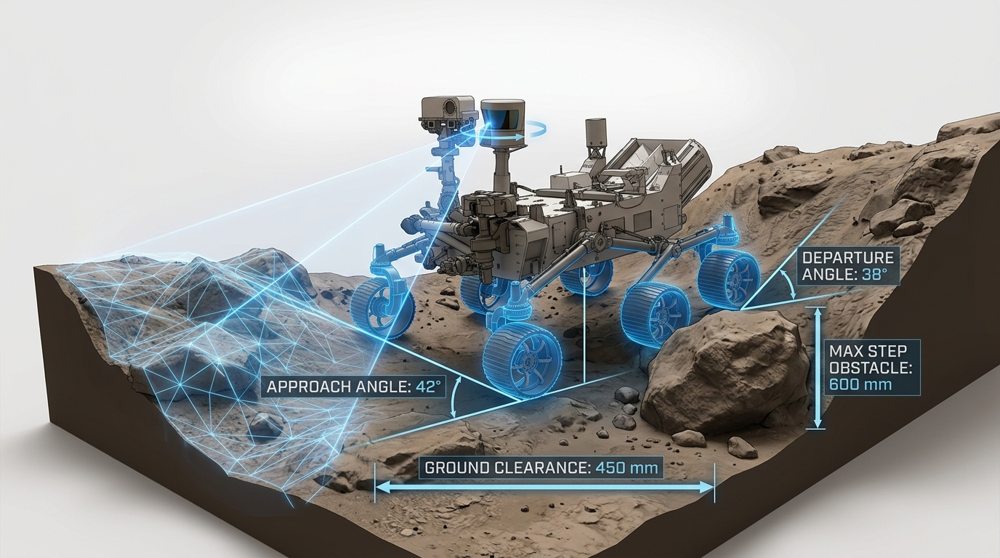
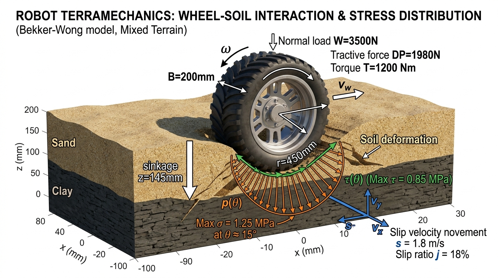
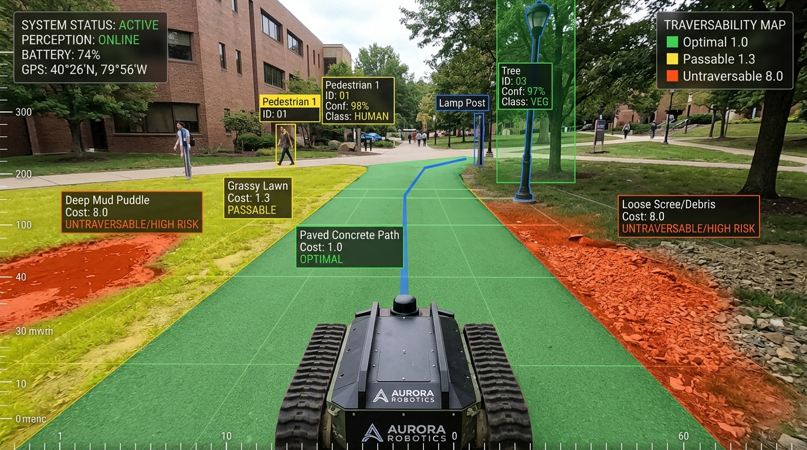
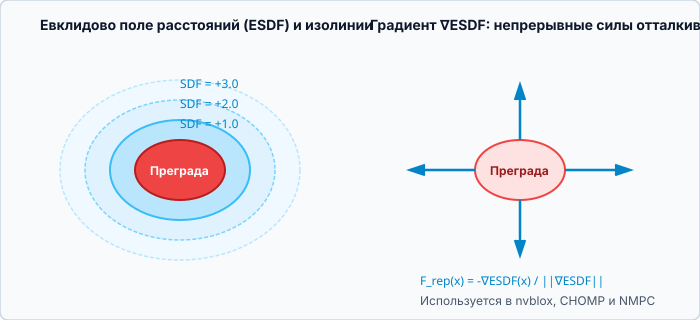

<!-- _class: lead invert -->
<!-- _header: "" -->
<!-- _footer: "" -->

# **Планирование движений мобильных роботов**
## Лекция 01: Постановка задачи планирования, репрезентация среды и ландшафт методов

⏱️ 90 минут
Фундаментальный обзор
LaValle • ETH Zürich • MIT • SOTA 2026

---

<!-- _header: "Лекция 01 | Введение и мотивация" -->

## Чему посвящена эта лекция ? Контекст и цели

### 🎯 Роль планирования в робототехнике

Автономный мобильный робот решает классическую триаду задач:
**«Где я?»** (локализация) $\rightarrow$ **«Что вокруг?»** (восприятие) $\rightarrow$ **«Как достигнуть цели?» (планирование)**.

Планирование — это ключевая задача автономного мобильного робота, связывающая сенсорное восприятие пространства с низкоуровневым управлением двигателями исходя из вышестоящей задачи.

**💡 Результат занятия:** Строго формулировать задачу планирования в $\mathcal{C}$-space, выбирать оптимальную репрезентацию среды под физику робота (колеса, гусеницы, шагающая платформа) и ориентироваться в современных индустриальных фреймворках восприятия и моделирования мира.

### 🔍 Ключевые вопросы лекции

- **В чем разница** между планированием движения, геометрическим путем и динамической траекторией?
- **Как сжать робота в точку?** Конфигурационное пространство ($\mathcal{C}$-space) и сумма Минковского.
- **Почему геометрии мало?** Профильная, опорная (террамеханика) и семантическая проходимость.
- **Как оцифровать среду?** Сетки, октадеревья, GPU ESDF (`nvblox`, `wavemap`) и World Models.

---

<!-- _header: "Лекция 01 | Структура занятия" -->

## План лекции на 90 минут ⏱️ 90 минут

### Часть 1: Понятия, C-Space и Проходимость (45 мин)

- **00–15 мин:** Понятийный аппарат: Motion Planning, Path vs Trajectory. Локальное и глобальное планирование.
- **15–30 мин:** Конфигурационное пространство ($\mathcal{C}$-space) и сумма Минковского.
- **30–45 мин:** Проходимость среды: профильная (геометрическая), опорная (сцепление/грунт) и семантическая.

### Часть 2: Репрезентации, Теория и World Models (45 мин)

- **45–60 мин:** Способы представления мира: Grids, Octree, **SOTA: nvblox, wavemap, elevation_mapping_cupy**. SDF/ESDF и градиенты.
- **60–70 мин:** Графы видимости, Вороной, Lattice, аналитическое описание для Optimal Control.
- **70–80 мин:** Свойства алгоритмов: полнота, оптимальность, асимптотическая оптимальность.
- **80–90 мин:** Нейросетевые методы: Latent Spaces, **World Models** (неявная физика) и Q&A.

---

## 1. Понятийный аппарат: Путь, Траектория, Движение 00–15 мин

### 1. Путь (Path)

$$\sigma: [0, 1] \to \mathcal{C}_{free}$$

- Чисто **геометрическая кривая** в пространстве конфигураций.
- Параметризована длиной дуги $s \in [0, 1]$.
- **Не содержит времени**, скоростей и ускорений.

### 2. Траектория (Trajectory)

$$\tau: [0, T] \to \mathcal{X}_{free}$$

- Путь с **временной параметризацией**: $x(t), v(t), a(t)$.
- Учитывает кинематические и динамические возможности приводов шасси.

### 3. Motion Planning

Комплексная задача синтеза управлений $u(t)$ и состояний $x(t)$:

$$\dot{x}(t) = f(x(t), u(t))$$

переводящих систему из $x_0$ в $x_{goal}$ без столкновений и сбоев приводов.

---

## Локальное vs Глобальное планирование 00–15 мин

### Глобальное планирование (Global Planner)

- **Входные данные:** глобальная статическая карта окружения (SLAM / CAD / OSM).
- **Горизонт:** от текущей точки до финишной цели миссии (десятки/сотни метров).
- **Частота работы:** низкая ($\sim 0.2\text{--}2$ Гц) или разово по запросу.
- **Результат:** глобальный опорный путь $\sigma(s)$ без учета мгновенной динамики.

### Локальное планирование (Local Planner / Controller)

- **Входные данные:** поток локальных сенсоров в реальном времени (лидары, камеры глубины).
- **Горизонт:** короткий горизонт безопасности ($2\text{--}8$ метров вперед, $1\text{--}3$ секунды).
- **Частота работы:** высокая ($\mathbf{20\text{--}50}$ Гц).
- **Результат:** команды приводов $(v, \omega)$, парирующие внезапные препятствия и снос.

---

## 2. Конфигурационное пространство ($\mathcal{C}$-space) 15–30 мин

### Редукция робота к материальной точке

Конфигурация $q \in \mathcal{C}$ — минимальный вектор координат, однозначно определяющий положение каждой точки робота $\mathcal{A}(q)$ в рабочем пространстве $\mathcal{W} \subset \mathbb{R}^d$.

$$\mathcal{C}_{obs} = \{ q \in \mathcal{C} \mid \mathcal{A}(q) \cap \mathcal{O} \neq \emptyset \}$$
$$\mathcal{C}_{free} = \mathcal{C} \setminus \mathcal{C}_{obs}$$

В $\mathcal{C}$-space робот сложной формы сжимается в точку, а препятствия $\mathcal{O}$ раздуваются на геометрию робота.

$$\mathcal{C}_{obs} = \mathcal{O} \oplus (-\mathcal{A}(0)) = \{ p - a \mid p \in \mathcal{O}, a \in \mathcal{A}(0) \}$$

---

<!-- _header: "Интерактивная практика | Сумма Минковского" -->

## Интерактивный симулятор: Формирование $\mathcal{C}_{obs}$ ⏱️ 20–30 мин

<i class="interactive-dot"></i> Интерактивная сумма Минковского: Робот $\mathcal{A}(q)$ + Препятствие $\mathcal{O} \rightarrow \mathcal{C}_{obs}$
Перетаскивайте робота мышью | Вращайте угол $\theta$ ползунком

<iframe src="http://localhost:5500/widgets/cspace-minkowski/index.html" class="interactive-frame"></iframe>

---

## 3. Проходимость среды (Traversability Analysis) 30–34 мин

### 1. Профильная (Геометрия)
- **Клиренс:** дорожный просвет днища
- **Углы свесов:** въезд $\alpha_{\text{app}}$ и съезд $\alpha_{\text{dep}}$
- **Предельный уклон:** $\theta \le \theta_{\max}$
- **Предельный шаг ступени:** $h \le h_{\text{step}}$
- **Сенсоры:** 3D LiDAR, TSDF / ESDF
- **Критерий:** корпус и днище не касаются препятствий

### 2. Опорная (Террамеханика)
- **Коэффициент трения $\mu$:** лед, мокрая глина, сырой песок
- **Несущая способность грунта:** провал колес (*sinkage* $z$)
- **Проскальзывание:** *wheel slip* $s$
- **Модель:** Беккера–Вонга
- **Критерий:** передача тяги приводов без пробуксовки и посадки

### 3. Семантическая (ИИ)
- **Классификация поверхности:**
  - Асфальт / бетон: $\text{Cost} = 1.0$ (норма)
  - Трава / гравий: $\text{Cost} = 1.3$ (безопасно)
  - Лужи / песок / кусты: $\text{Cost} = 8.0$ (риск)
- Разметка, зоны пешеходов, ПДД
- **Критерий:** штрафы в целевой функции стоимости $J$

💡 **Фундаментальный вывод:** Бинарного $\mathcal{C}_{\text{free}} / \mathcal{C}_{\text{obs}}$ недостаточно: геометрия допускает проезд, но террамеханика гарантирует пробуксовку колес, а семантика налагает запреты безопасности.

---

## 1. Профильная проходимость: Клиренс, углы и ступени 34–38 мин

### Геометрические пороги проходимости:
- **Дорожный просвет ($h_{\text{clear}}$):** минимальный зазор между грунтом и нижней точкой шасси/дифференциала.
- **Угол въезда ($\alpha_{\text{app}}$) и съезда ($\alpha_{\text{dep}}$):** предельный наклон рампы без удара бампером или оборудованием.
- **Угол переката ($\beta_{\text{ramp}}$):** порог преодоления гребня без посадки на «брюхо» (*high-centering*).
- **Предельный вертикальный шаг:** $h \le h_{\text{step}} \approx 0.5 \cdot D_{\text{wheel}}$.
- **Сенсорный стек:** 3D LiDAR, стереокамеры $\rightarrow$ 2.5D Elevation Map (`elevation_mapping_cupy`) и GPU ESDF.

💡 **Критерий:** ни одна точка шасси не входит в контакт с рельефом $\operatorname{dist}(p_{\text{robot}}, \mathcal{O}_{\text{terrain}}) > 0$.

---

## 2. Опорная проходимость: Террамеханика Беккера–Вонга 38–41 мин

### Взаимодействие колеса с грунтом:
- **Уравнение осадки Беккера ($z$ — глубина колеи):**
$$p(z) = \left( \frac{k_c}{b} + k_\phi \right) z^n$$
$b$ — ширина протектора, $k_c, k_\phi, n$ — модули грунта.
- **Сдвиговые напряжения Яна–Беккера:**
$$\tau(j) = (c + p \tan \phi)\left(1 - e^{-j/K}\right)$$
- **Буксование колеса (Slip ratio $s$):**
$$s = 1 - \frac{v_x}{r \cdot \omega}$$
При $s > 0.25$ колесо зарывается, сопротивление качению $R_c$ растет, вызывая застревание даже на ровном месте.

---

## 3. Семантическая проходимость: ИИ-сегментация и Costmap 41–45 мин

### Оценка проходимости нейросетями:
- **Семантическая сегментация (RGB + LiDAR):**
  - Асфальт / ровный бетон: $C_{\text{surf}} = 1.0$ (оптимально)
  - Стриженый газон / гравий: $C_{\text{surf}} = 1.3$ (допустимо)
  - Рыхлый песок / грязь / лужи: $C_{\text{surf}} = 8.0$ (высокий риск)
  - Разметка, зоны пешеходов, ПДД
- **Штрафы в целевой функции планирования:**
$$J = \int_0^T \left( C_{\text{semantic}}(x(t)) + \|\mathbf{u}(t)\|_R^2 \right) dt$$
- **SOTA подходы:** Self-Supervised Traversability (Wayve, ETH Zurich Rüegg et al., DINOv2 visual features).

---

## 4. Способы декомпозиции и репрезентации среды 45–60 мин

### 1. Сетки занятости (Occupancy Grids)

- 2D / 2.5D / 3D регулярные воксельные массивы.
- Каждая ячейка хранит логарифм шанса занятости:
$$L(m_i) = \log \frac{P(m_i)}{1 - P(m_i)}$$
- **Плюсы:** простота, прямой маппинг с лидара.
- **Минусы:** гигантский расход памяти $\mathcal{O}(N^3)$ на больших картах.

### 2. Иерархические деревья (Octrees / VDB)

- **OctoMap / OpenVDB:** адаптивное разрешение.
- Пустые и сплошные области объединяются в крупные блоки.
- Разрешение детализируется только вблизи границ препятствий.
- **Экономия ОЗУ:** в 10–50 раз по сравнению с регулярной 3D-сеткой.

---

## Современные SOTA репрезентации (2024–2026) 45–60 мин

### nvblox (NVIDIA Isaac)

- GPU-ускоренное построение объемных карт на воксельных блоках.
- Мгновенный расчет TSDF (поверхности) и ESDF (поля расстояний) в реальном времени ($\ge 60$ fps).
- Интегрировано в ROS 2 Nav2.

### wavemap (ETH Zürich ASL)

- Многомасштабное картирование на основе вейвлет-преобразования Хаара.
- Точная интеграция лучей лидара без артефактов дискретизации.
- Экстремально низкое потребление памяти при миллиметровом разрешении.

### elevation_mapping_cupy (ETH RSL)

- 2.5D карты высот рельефа на базе CuPy (CUDA C++).
- В реальном времени вычисляет слои: уклон, шероховатость, проходимость.
- Стандарт для шагающих роботов ANYmal.

---

## Поля расстояний: SDF, ESDF и градиенты 50–60 мин

### Евклидово знаковое поле (ESDF)

Сопоставляет каждой точке пространства знаковое расстояние до ближайшего препятствия:

$$\operatorname{SDF}(x) = \begin{cases} -d(x, \partial \mathcal{O}), & x \in \mathcal{O} \\ +d(x, \partial \mathcal{O}), & x \in \mathcal{C}_{free} \end{cases}$$

**TSDF (Truncated):** обрезка диапазоном $[-\delta, +\delta]$ для быстрой 3D-реконструкции поверхностей.

Градиент $\mathbf{n}(x) = \nabla \operatorname{ESDF}(x)$ задает направление наискорейшего удаления от стен, позволяя строить гладкие траектории в оптимизаторах CHOMP, TrajOpt и MPC.

---

## 5. Свойства алгоритмов: Полнота и Оптимальность 70–80 мин

### Свойства полноты (Completeness)

- **Полный (Complete):** находит решение за конечное время, если оно существует, или сообщает об отсутствии (графы видимости).
- **Вероятностно полный:**
$$\lim_{N \to \infty} P(\text{путь найден}) = 1$$
(RRT, PRM при бесконечном числе сэмплов).
- **Разрешающе полный:** находит решение при данном дискретном шаге сетки $\varepsilon$ ($A^*$, Дейкстра).

### Свойства оптимальности (Optimality)

- **Оптимальный:** находит путь с минимальной стоимостью $J^*(Path)$.
- **Асимптотически оптимальный:**
$$P\left(\lim_{N \to \infty} \operatorname{Cost}(\tau_N) = c^*\right) = 1$$
($RRT^*$, $PRM^*$, Fast Marching). Базовый RRT не является асимптотически оптимальным!
- **Критерии качества:** длина пути, время проезда, расход батареи, максимальная кривизна $\max |\kappa|$.

---

## 6. Нейросетевые методы: Latent Space и World Models 80–90 мин

### Энкодеры и Latent Space

- Вместо вокселей нейросетевые автоэнкодеры сжимают лидарные облака и камеры в компактный вектор $z \in \mathbb{R}^k$:
$$z = \operatorname{Encoder}(I_{camera}, P_{lidar})$$
- Планирование ведется в латентном пространстве, где расстояние отражает семантическую проходимость.

### World Models (Модели мира, 2024–2026)

- Новейшая парадигма автономности (DreamerV3, GAIA-1, Sora для робототехники):
$$z_{t+1} \sim p(z_{t+1} \mid z_t, a_t)$$
- Робот «воображает» тысячи траекторий вперед в скрытом пространстве без физического риска (Latent Imagination Planning).

---

<!-- _class: invert -->
<!-- _header: "Лекция 01 | Заключение" -->

## Итоги вводной лекции и дорожная карта курса 85–90 мин

### Что мы узнали сегодня:

1. **Траектория** отличается от пути наличием временного профиля скорости и ускорений.
2. В $\mathcal{C}$-space робот становится точкой за счет раздутия препятствий через **сумму Минковского**.
3. **Проходимость** делится на профильную, опорную и семантическую.
4. **SOTA-репрезентации** (`nvblox`, `wavemap`) дают градиенты расстояний $\nabla \operatorname{ESDF}$ для гладкой оптимизации.

### Программа следующих лекций:

- **Лекция 02:** Дискретное планирование на графах и сетках ($A^*$, $\text{Theta}^*$, CBS)
- **Лекция 03:** Сэмплирующие методы (PRM, RRT, $RRT^*$)
- **Лекция 04:** Реактивные и локальные методы (DWA, VO, TEB)
- **Лекция 05:** Оптимальное управление (ПМП, LQR, Коллокация)
- **Лекция 06:** Предиктивное управление (Linear MPC, NMPC, CBF)
- **Лекция 07:** Учёт ограничений (Неголономность, Скобки Ли, TOPP)
- **Лекция 08:** Вычислительные аспекты и архитектура Nav2

