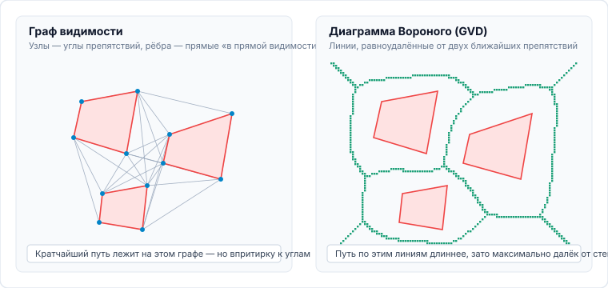
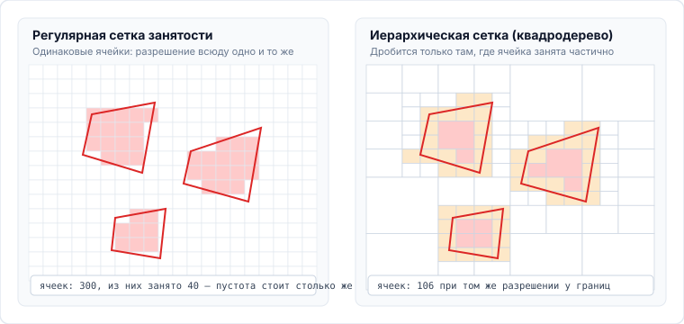
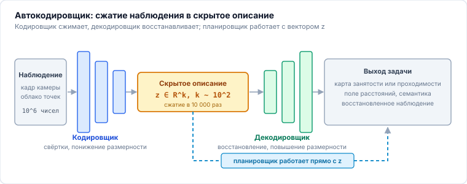

<!-- _class: lead -->
<!-- _header: "" -->
<!-- _footer: "" -->

# **Планирование движений мобильных роботов**
## Лекция 01: Постановка задачи планирования и представление среды

⏱️ 90 минут
Вводная лекция
LaValle • ETH Zürich • MIT

---

<!-- _header: "Лекция 01 | Введение и мотивация" -->

## Предмет и задачи лекции

### Место планирования в архитектуре робота

Автономный мобильный робот решает классическую триаду задач:
**«Где я?»** (локализация) $\rightarrow$ **«Что вокруг?»** (восприятие) $\rightarrow$ **«Как достигнуть цели?» (планирование)**.

Планирование связывает восприятие пространства с управлением приводами и подчинено задаче, поставленной вышестоящим уровнем.

**Ожидаемый результат.** Формулировать задачу планирования в конфигурационном пространстве, выбирать представление среды сообразно физике шасси (колёсного, гусеничного, шагающего) и ориентироваться в современных программных средствах восприятия и построения карт.

### Вопросы, рассматриваемые в лекции

- Чем различаются планирование движения, геометрический путь и траектория?
- Как свести робота конечных размеров к точке: конфигурационное пространство и сумма Минковского.
- Почему одной геометрии недостаточно: профильная, опорная и семантическая проходимость.
- Как представить среду в виде данных: сетки занятости, октодеревья, поля расстояний, обучаемые представления.

---

<!-- _header: "Лекция 01 | Структура занятия" -->

## План лекции на 90 минут ⏱️ 90 минут

### Часть 1. Понятия, конфигурационное пространство, проходимость (45 мин)

- **00–15 мин:** Понятийный аппарат: путь, траектория, планирование движения. Глобальный и локальный контуры.
- **15–30 мин:** Конфигурационное пространство ($\mathcal{C}$-space) и сумма Минковского.
- **30–45 мин:** Проходимость среды: профильная (геометрическая), опорная (сцепление/грунт) и семантическая.

### Часть 2. Представления среды, свойства алгоритмов, обучаемые модели (45 мин)

- **45–60 мин:** Представления среды: сетки занятости, октодеревья, дорожные карты. Поля расстояний и их градиенты. Современные реализации: `nvblox`, `wavemap`, `elevation_mapping_cupy`.
- **60–70 мин:** Граф видимости и диаграмма Вороного как примеры дорожных карт.
- **70–80 мин:** Свойства алгоритмов: полнота, оптимальность, асимптотическая оптимальность.
- **80–90 мин:** Обучаемые представления среды: кодировщик — декодировщик, модели мира. Ответы на вопросы.

---

## 1. Путь, траектория и планирование движения 00–15 мин

### Путь

$$\sigma: [0, 1] \to \mathcal{C}_{free}$$

- Чисто **геометрическая кривая** в пространстве конфигураций.
- Параметризована длиной дуги $s \in [0, 1]$.
- **Не содержит времени**, скоростей и ускорений.

### Траектория

$$\tau: [0, T] \to \mathcal{X}_{free}$$

- Путь с **временной параметризацией**: $x(t), v(t), a(t)$.
- Учитывает кинематические и динамические возможности приводов шасси.

### Планирование движения

Задача синтеза управлений $u(t)$ и состояний $x(t)$:

$$\dot{x}(t) = f(x(t), u(t))$$

переводящих систему из $x_0$ в $x_{goal}$ без столкновений и сбоев приводов.

---

## Глобальное и локальное планирование 00–15 мин

### Глобальный планировщик

- **Входные данные:** глобальная статическая карта окружения (SLAM / CAD / OSM).
- **Горизонт:** от текущей точки до финишной цели миссии (десятки/сотни метров).
- **Частота работы:** низкая ($\sim 0.2\text{--}2$ Гц) или разово по запросу.
- **Результат:** глобальный опорный путь $\sigma(s)$ без учета мгновенной динамики.

### Локальный планировщик

- **Входные данные:** поток локальных сенсоров в реальном времени (лидары, камеры глубины).
- **Горизонт:** короткий горизонт безопасности ($2\text{--}8$ метров вперед, $1\text{--}3$ секунды).
- **Частота работы:** высокая ($\mathbf{20\text{--}50}$ Гц).
- **Результат:** команды приводов $(v, \omega)$, парирующие внезапные препятствия и снос.

---

## 2. Конфигурационное пространство ($\mathcal{C}$-space) 15–30 мин

**Конфигурация** $q \in \mathcal{C}$ — минимальный вектор координат, однозначно задающий положение каждой точки робота $\mathcal{A}(q)$ в рабочем пространстве $\mathcal{W} \subset \mathbb{R}^d$.

$$\mathcal{C}_{obs} = \{ q \mid \mathcal{A}(q) \cap \mathcal{O} \neq \emptyset \}, \quad \mathcal{C}_{free} = \mathcal{C} \setminus \mathcal{C}_{obs}$$

**Сумма Минковского** даёт $\mathcal{C}_{obs}$ явно: робот сжимается в точку, препятствие раздувается на его геометрию.

$$\mathcal{C}_{obs} = \mathcal{O} \oplus (-\mathcal{A}(0)) = \{ p - a \mid p \in \mathcal{O},\, a \in \mathcal{A}(0) \}$$

---

<!-- _header: "Интерактивная практика | Сумма Минковского" -->

## Интерактивная модель: построение $\mathcal{C}_{obs}$ ⏱️ 20–30 мин

<i class="interactive-dot"></i> Интерактивная сумма Минковского: Робот $\mathcal{A}(q)$ + Препятствие $\mathcal{O} \rightarrow \mathcal{C}_{obs}$
Перетаскивайте робота мышью | Вращайте угол $\theta$ ползунком

<iframe src="http://localhost:5599/widgets/cspace-minkowski/index.html" class="interactive-frame"></iframe>

---

## 3. Анализ проходимости среды 30–34 мин

### Профильная (геометрическая)
- **Клиренс:** дорожный просвет днища
- **Углы свесов:** въезд $\alpha_{\text{app}}$ и съезд $\alpha_{\text{dep}}$
- **Предельный уклон:** $\theta \le \theta_{\max}$
- **Предельный шаг ступени:** $h \le h_{\text{step}}$
- **Сенсоры:** 3D LiDAR, TSDF / ESDF
- **Критерий:** корпус и днище не касаются препятствий

### Опорная (террамеханика)
- **Коэффициент трения $\mu$:** лед, мокрая глина, сырой песок
- **Несущая способность грунта:** погружение колеса $z$ (sinkage)
- **Буксование** колеса $s$ (wheel slip)
- **Модель:** Беккера–Вонга
- **Критерий:** передача тяги приводов без пробуксовки и посадки

### Семантическая
- **Классификация поверхности:**
  - Асфальт / бетон: $\text{Cost} = 1.0$ (норма)
  - Трава / гравий: $\text{Cost} = 1.3$ (безопасно)
  - Лужи / песок / кусты: $\text{Cost} = 8.0$ (риск)
- Разметка, зоны пешеходов, ПДД
- **Критерий:** штрафы в целевой функции стоимости $J$

**Вывод.** Бинарного $\mathcal{C}_{\text{free}} / \mathcal{C}_{\text{obs}}$ недостаточно: геометрия допускает проезд, но террамеханика гарантирует пробуксовку колес, а семантика налагает запреты безопасности.

---

## Профильная проходимость: клиренс, углы свесов, высота ступени 34–38 мин

### Геометрические пороги проходимости:
- **Дорожный просвет ($h_{\text{clear}}$):** минимальный зазор между грунтом и нижней точкой шасси/дифференциала.
- **Угол въезда ($\alpha_{\text{app}}$) и съезда ($\alpha_{\text{dep}}$):** предельный наклон рампы без удара бампером или оборудованием.
- **Угол переката ($\beta_{\text{ramp}}$):** порог преодоления гребня без посадки на «брюхо» (*high-centering*).
- **Предельный вертикальный шаг:** $h \le h_{\text{step}} \approx 0.5 \cdot D_{\text{wheel}}$.
- **Сенсорный стек:** 3D LiDAR, стереокамеры $\rightarrow$ 2.5D Elevation Map (`elevation_mapping_cupy`) и GPU ESDF.

**Критерий.** Ни одна точка шасси не входит в контакт с рельефом $\operatorname{dist}(p_{\text{robot}}, \mathcal{O}_{\text{terrain}}) > 0$.

---

## Опорная проходимость: модель Беккера–Вонга 38–41 мин

### Взаимодействие колеса с грунтом:
- **Уравнение осадки Беккера ($z$ — глубина колеи):**
$$p(z) = \left( \frac{k_c}{b} + k_\phi \right) z^n$$
$b$ — ширина протектора, $k_c, k_\phi, n$ — модули грунта.
- **Сдвиговые напряжения Яна–Беккера:**
$$\tau(j) = (c + p \tan \phi)\left(1 - e^{-j/K}\right)$$
- **Буксование колеса (Slip ratio $s$):**
$$s = 1 - \frac{v_x}{r \cdot \omega}$$
При $s > 0.25$ колесо зарывается, сопротивление качению $R_c$ растет, вызывая застревание даже на ровном месте.

---

## Семантическая проходимость: сегментация и карта стоимости 41–45 мин

### Оценка проходимости нейросетями:
- **Семантическая сегментация (RGB + LiDAR):**
  - Асфальт / ровный бетон: $C_{\text{surf}} = 1.0$ (оптимально)
  - Стриженый газон / гравий: $C_{\text{surf}} = 1.3$ (допустимо)
  - Рыхлый песок / грязь / лужи: $C_{\text{surf}} = 8.0$ (высокий риск)
  - Разметка, зоны пешеходов, ПДД
- **Штрафы в целевой функции планирования:**
$$J = \int_0^T \left( C_{\text{semantic}}(x(t)) + \|\mathbf{u}(t)\|_R^2 \right) dt$$
- **SOTA подходы:** Self-Supervised Traversability (Wayve, ETH Zurich Rüegg et al., DINOv2 visual features).

---

## 4. Способы дискретизации среды 45–60 мин

### А. Разбиение на ячейки

Мир нарезается на **клетки**, каждая помечена «занято / свободно». Планировщик ходит по клеткам.

- Годится для любой геометрии, строится прямо из лидара.
- Точность упирается в размер ячейки.

### Б. Построение дорожной карты

В свободном пространстве заранее прокладывается **сеть линий**, на которой заведомо нет столкновений. Планировщик ищет путь только по ней.

- Мало узлов — поиск быстрый.
- Качество пути определяется тем, как проведены линии.

**Разграничение материала.** В настоящей лекции рассматривается, что представляют собой эти структуры и чем они различаются. Алгоритмы их построения и поиска по ним изложены в лекции 02.

---

## Дорожные карты: граф видимости и диаграмма Вороного 45–60 мин

**Граф видимости.** Узлы — углы препятствий, рёбра — отрезки, которые ни одно препятствие не пересекает. Кратчайший путь в многоугольной среде обязательно лежит на таком графе, но проходит **впритирку к углам**: клиренс нулевой.

**Диаграмма Вороного (GVD).** Линии, каждая точка которых равноудалена от двух ближайших препятствий. Путь по ним **максимально далёк от стен**, но длиннее на 15–30% и плохо ложится на колёсную кинематику.

---

## Сетки занятости: регулярная и иерархическая 45–60 мин

**Регулярная сетка занятости.** Ячейки одного размера; каждая хранит логарифм шанса занятости $L(m_i) = \log \frac{P(m_i)}{1 - P(m_i)}$. Просто и прямо маппится с лидара, но **пустое поле стоит столько же памяти, что и стена**: $\mathcal{O}(N^3)$ в 3D.

**Иерархическая сетка (квадродерево, в 3D — октодерево).** Ячейка дробится, только если занята частично. Там, где пусто или сплошная стена, остаётся один крупный блок. На том же разрешении у границ — втрое меньше ячеек; `OctoMap` и `OpenVDB` дают выигрыш по ОЗУ в 10–50 раз.

---

## Современные представления среды (2024–2026) 45–60 мин

### nvblox (NVIDIA Isaac)

- GPU-ускоренное построение объемных карт на воксельных блоках.
- Мгновенный расчет TSDF (поверхности) и ESDF (поля расстояний) в реальном времени ($\ge 60$ fps).
- Интегрировано в ROS 2 Nav2.

**Отдаёт планировщику:** воксельный $\operatorname{ESDF}$ с готовым градиентом $\nabla d$.

**Берут, когда:** нужен 3D-объём и градиент для оптимизатора, а GPU уже есть на борту.

### wavemap (ETH Zürich ASL)

- Многомасштабное картирование на основе вейвлет-преобразования Хаара.
- Точная интеграция лучей лидара без артефактов дискретизации.
- Экстремально низкое потребление памяти при миллиметровом разрешении.

**Отдаёт планировщику:** многомасштабную карту занятости (грубое разрешение вдали, мелкое вблизи).

**Берут, когда:** карта большая, память ограничена, а тонкие препятствия терять нельзя.

### elevation_mapping_cupy (ETH RSL)

- 2.5D карты высот рельефа на базе CuPy (CUDA C++).
- В реальном времени вычисляет слои: уклон, шероховатость, проходимость.
- Стандарт для шагающих роботов ANYmal.

**Отдаёт планировщику:** стек 2.5D-слоёв — высота, уклон, шероховатость, стоимость.

**Берут, когда:** мир «почти двумерный» (рельеф без нависаний), и нужна опорная проходимость.

---

## Поля расстояний: SDF, ESDF и градиенты 50–60 мин

**Евклидово знаковое поле (ESDF)** сопоставляет каждой точке знаковое расстояние до ближайшего препятствия; **TSDF** — то же с обрезкой диапазоном $[-\delta, +\delta]$.

$$\operatorname{SDF}(x) = \begin{cases} -d(x, \partial \mathcal{O}), & x \in \mathcal{O} \\ +d(x, \partial \mathcal{O}), & x \in \mathcal{C}_{free} \end{cases}$$

**Зачем планировщику знак и градиент:** $\mathbf{n}(x) = \nabla \operatorname{ESDF}(x)$ задаёт направление наискорейшего удаления от стен. Это делает штраф за близость к препятствию $C^1$-гладким — и потому пригодным для CHOMP, TrajOpt и MPC, которым нужна производная, а не булев ответ «столкнулся / нет».

---

## 5. Полнота и оптимальность алгоритмов 70–80 мин

### Полнота

- **Полный:** за конечное время находит решение либо доказывает его отсутствие (граф видимости).
- **Вероятностно полный:**
$$\lim_{N \to \infty} P(\text{путь найден}) = 1$$
(RRT, PRM при неограниченном числе выборок).
- **Разрешающе полный:** находит решение при данном дискретном шаге сетки $\varepsilon$ ($A^*$, Дейкстра).

### Оптимальность

- **Оптимальный:** находит путь с минимальной стоимостью $J^*(\sigma)$.
- **Асимптотически оптимальный:**
$$P\left(\lim_{N \to \infty} \operatorname{Cost}(\tau_N) = c^*\right) = 1$$
($RRT^*$, $PRM^*$, Fast Marching). Базовый RRT не является асимптотически оптимальным!
- **Критерии качества:** длина пути, время проезда, расход батареи, максимальная кривизна $\max |\kappa|$.

---

## 6. Обучаемые представления среды 80–90 мин

**Скрытое описание вместо вокселей.** Кодировщик сжимает кадр камеры и облако точек в вектор $z \in \mathbb{R}^k$ порядка сотни чисел:
$$z = \operatorname{Enc}(I_{\text{кам}}, P_{\text{лидар}})$$
Декодировщик восстанавливает из $z$ то, что нужно задаче: карту занятости, поле расстояний или семантику поверхности.

**Почему это работает.** Обучение выстраивает пространство $z$ так, что близость векторов означает близость сцен *по смыслу*, а не по пикселям. Планировщик получает компактное описание, в котором уже учтены тип поверхности и её проходимость.

---

## Модели мира: предсказание динамики сцены 85–90 мин

### Отличие модели мира от кодировщика

Кодировщик описывает сцену **в текущий момент**. Модель мира (world model) дополнительно обучает переход — как описание изменится после действия $a_t$:

$$z_{t+1} \sim p(z_{t+1} \mid z_t, a_t)$$

Это позволяет оценивать последствия управления, не выполняя его: робот прогоняет варианты траекторий внутри модели.

**Примеры:** DreamerV3, GAIA-1, [NVIDIA Cosmos](https://www.nvidia.com/en-us/ai/cosmos/) — семейство базовых моделей мира для физического ИИ.

### Текущее состояние применения

- В промышленных системах физического ИИ (Physical AI) сегодня работают преимущественно **схемы «кодировщик — декодировщик»**: восприятие сжимается в признаки, а решение принимает классический планировщик или обученная политика.
- Модели мира пока применяет **ограниченный круг компаний** и главным образом как генератор синтетических данных и симулятор для обучения, а не как планировщик на борту.
- Основные препятствия: накопление ошибки предсказания на длинном горизонте, отсутствие гарантий безопасности и стоимость обучения.

**Вывод для курса:** модели мира — активное направление исследований, но проверяемые гарантии по-прежнему дают методы из лекций 2–8.

---

<!-- _class: accent -->
<!-- _header: "Лекция 01 | Заключение" -->

## Итоги лекции и программа курса 85–90 мин

### Основные положения лекции

1. **Траектория** отличается от пути наличием временного профиля скорости и ускорений.
2. В $\mathcal{C}$-space робот становится точкой за счет раздутия препятствий через **сумму Минковского**.
3. **Проходимость** делится на профильную, опорную и семантическую.
4. **Поля расстояний** (`nvblox`, `wavemap`) дают градиент $\nabla \operatorname{ESDF}$, пригодный для методов оптимизации.

### Программа следующих лекций:

- **Лекция 02:** Дискретное планирование на графах и сетках ($A^*$, $\text{Theta}^*$, CBS)
- **Лекция 03:** Методы, основанные на выборке (PRM, RRT, $RRT^*$)
- **Лекция 04:** Выборочные методы с моделью движения (DWA, MPPI)
- **Лекция 05:** Оптимальное управление: принцип максимума и численные решатели (IPOPT, FATROP, SQP)
- **Лекция 06:** Управление с прогнозирующей моделью (MPC)
- **Лекция 07:** Кинематические и динамические ограничения (неголономность, скобки Ли, TOPP)
- **Лекция 08:** Вычислительные аспекты и инженерные компромиссы

