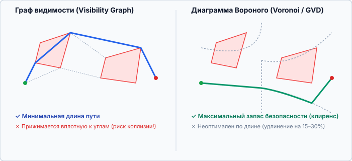
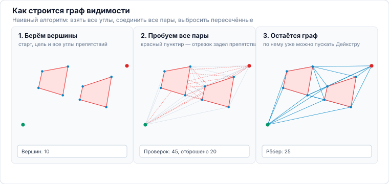
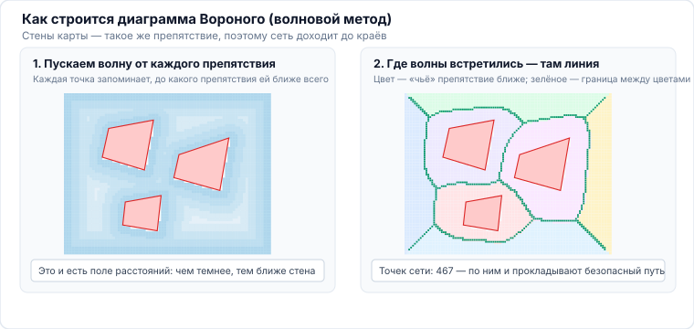
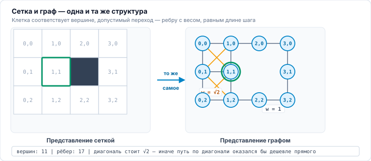
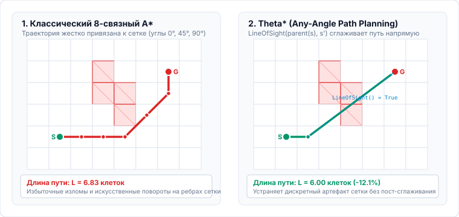

<!-- 
TODO: Расширение лекции с 60 до 90 минут (+30 минут):
1. Инкрементальный поиск и динамическое перепланирование: LPA* и D* Lite (перенос из лекции 08) [+15–20 мин].
2. Jump Point Search (JPS / JPS+) на регулярных ортогональных сетках [+10 мин].
3. Углубление многоагентного поиска (MAPF / CBS): дерево конфликтов с Sum of Costs, разбор тупиков [+5–10 мин].
Подробности см. в timing.md и ../PLAN.md
-->

<!-- _class: lead -->
<!-- _header: "" -->
<!-- _footer: "" -->

# **Планирование движений мобильных роботов**
## Лекция 02: Дискретное планирование на графах и сетках

⏱️ 90 минут
Графы и сетки
Visibility • Voronoi • A* • Theta* • Space-Time • CBS

---

<!-- _header: "Лекция 02 | Введение и мотивация" -->

## Предмет и задачи лекции

### От непрерывного пространства к графу

Рабочее пространство робота непрерывно, тогда как детерминированные алгоритмы поиска работают с дискретными структурами.

Лекция посвящена тому, как превратить свободное пространство $\mathcal{C}_{free}$ в топологическую или метрическую сеть и найти на ней кратчайший, безопасный и физически реализуемый маршрут для одного или десятков роботов.

**Ожидаемый результат.** Строить и оптимизировать графовые представления пространства, применять алгоритмы $\text{A}^*$ и $\text{Theta}^*$ без искусственных искажений метрики, а также координировать движение группы роботов во времени с разрешением пространственно-временных коллизий.

### Вопросы, рассматриваемые в лекции

- Как связать точки среды: граф видимости даёт кратчайший путь, диаграмма Вороного — наибольший клиренс.
- Как сократить объём поиска: переход от алгоритма Дейкстры к $A^*$, условия допустимости ($h \le h^*$) и монотонности эвристики.
- Как устранить изломы, порождённые сеткой: планирование под произвольным углом ($\text{Theta}^*$).
- Как учесть время и других роботов: пространственно-временной $A^*$, таблица резервирования, алгоритм CBS.
- Какими средствами дорожные карты строят на практике: от точной геометрии до преобразования расстояний на графическом процессоре.

---

<!-- _header: "Лекция 02 | Структура занятия" -->

## План лекции на 90 минут ⏱️ 90 минут

### Часть 1. Дорожные карты и алгоритм Дейкстры (45 мин)

- **00–06 мин:** Напоминание из лекции 01: граф видимости vs диаграмма Вороного.
- **06–18 мин:** **Как они строятся:** перебор пар вершин с проверкой видимости и волновой метод (brushfire) для GVD.
- **18–22 мин:** Программные средства: `scipy`, `cupy`, `PyTorch`, точная геометрия; место эталонных реализаций Nav2.
- **22–36 мин:** **Дейкстра**: $d(v)$, родители и ослабление ребра Разбор на графе из 6 узлов, затем переход к сетке.
- **36–50 мин:** $A^*$: эвристика, допустимость и монотонность Пошаговый разбор.

### Часть 2. Планирование под произвольным углом и многоагентная координация (45 мин)

- **50–64 мин:** $\text{Theta}^*$ и планирование под произвольным углом Разбор алгоритма и сравнение на произвольной карте.
- **64–70 мин:** Динамические препятствия и постановка MAPF (Vertex & Swap коллизии).
- **70–82 мин:** **Space-Time $A^*$**, таблица резервирования и действие WAIT Симулятор MAPF.
- **82–86 мин:** Пределы масштабирования и алгоритм **CBS (Conflict-Based Search)**.
- **86–90 мин:** Резюме, контрольные вопросы и Q&A.

---

## 1. Дорожные карты: краткое напоминание 00–06 мин

**Граф видимости (Visibility Graph):** вершины — старт, цель и углы препятствий ($V = \{q_s, q_g\} \cup \mathcal{V}_{obs}$), рёбра — лучи в прямой видимости. Находит **глобально кратчайший путь** в 2D, но прижимается вплотную к углам (клиренс 0).

**Диаграмма Вороного (GVD):** ребра равноудалены от препятствий. Обеспечивает **максимальный клиренс безопасности**, но путь длиннее на 15–30% и сложен для колесной кинематики.

---

## 2. Построение графа видимости 06–12 мин

**Наивный алгоритм в три строки:** берём старт, цель и все углы препятствий; соединяем **каждую пару**; выбрасываем отрезки, пересекающие хоть одно препятствие.

Проверка одной пары — это перебор всех рёбер препятствий, отсюда $\mathcal{O}(n^3)$ на весь граф.

**Как ускоряют:** вращающийся заметающий луч (Lee, 1978) обходит вершины по углу и поддерживает упорядоченный список пересекаемых рёбер — видимость соседней вершины проверяется за $\mathcal{O}(\log n)$, весь граф строится за $\mathcal{O}(n^2 \log n)$.

---

## 3. Построение диаграммы Вороного 12–18 мин

**Волновой метод (brushfire).** От каждого препятствия — включая стены карты — одновременно расходится волна. Каждая ячейка запоминает две вещи: расстояние до ближайшего препятствия и **чьё именно** оно. Там, где встречаются волны от **разных** препятствий, и проходит линия GVD.

**Почему это удобно:** побочным продуктом получается поле расстояний из лекции 01 — то же самое, из которого берут $\nabla \operatorname{ESDF}$. Для многоугольников есть точный вариант — алгоритм Форчуна за $\mathcal{O}(n \log n)$, но на картах с лидара волновой метод проще и параллелится на GPU.

---

## 4. Программные средства построения дорожных карт 18–20 мин

### Массивы и поля расстояний

- `scipy.ndimage.distance_transform_edt` — точное преобразование расстояний за $\mathcal{O}(N)$. Возвращает **и расстояние, и индекс ближайшего препятствия**, то есть сразу даёт разметку зон влияния для GVD.
- `scipy.spatial.Voronoi` — точная диаграмма для множества точек (Qhull).
- `cupy` повторяет тот же интерфейс на графическом процессоре: карта $1024^2$ пересчитывается за единицы миллисекунд.

### Тензорные конвейеры

- `PyTorch` используется здесь не ради обучения, а ради **пакетной обработки на GPU**: свёртка, морфология и построение поля расстояний выражаются тензорными операциями.
- Тот же граф вычислений даёт **градиент по карте** — его используют оптимизационные планировщики.
- `nvblox` решает ту же задачу на уровне библиотеки CUDA, отдавая поле расстояний прямо из потока датчиков.

### Точная геометрия

- `CGAL` и `Boost.Polygon` строят граф видимости и диаграмму Вороного на точной арифметике, без ошибок округления.
- Область применения — статичная известная геометрия: план этажа, разметка склада.
- На картах с лидара точная геометрия избыточна: шум измерений превышает погрешность растрового метода.

---

## О реализациях в ROS 2 Nav2 20–22 мин

### Почему эталонные реализации редко используют как есть

Планировщики и слои карт стоимости в Nav2 написаны **универсальными**: они работают через общий интерфейс, с произвольным типом карты и на центральном процессоре. Эта универсальность и есть источник накладных расходов.

В прикладных системах критичные по времени участки, как правило, заменяют: расчёт полей расстояний и оценку выборок переносят на массивы `numpy` / `cupy` либо на собственный код CUDA.

### Какую роль Nav2 сохраняет

- **Эталонная архитектура:** разделение на глобальный и локальный контуры, слоёная карта стоимости, дерево поведения.
- **Источник терминологии** и точка отсчёта при сравнении решений.
- **Среда интеграции:** обмен сообщениями, система координат, диагностика.

Инженерный вывод: заимствуется структура, а не реализация нагруженного контура.

---

## 5. Алгоритм Дейкстры: постановка задачи 22–26 мин

### Задача

Дан взвешенный граф $G(V, E)$, **не содержащий рёбер отрицательного веса**. Найти кратчайшие пути от заданной вершины $a$ до всех остальных вершин графа.

### Что хранится

- **Метка** $d(v)$ — наименьшее известное расстояние от $a$ до $v$. Величина предварительная: по ходу работы может уменьшаться.
- Вершины разделены на **посещённые**, для которых метка уже окончательна, и **непосещённые**.
- $\text{родитель}(v)$ — вершина, из которой пришли в $v$. Нужна, чтобы восстановить сам путь, а не только его длину.

### Описание алгоритма

1. Все вершины объявляются непосещёнными.
2. Метка начальной вершины полагается равной нулю, метки остальных — бесконечности.
3. Среди непосещённых выбирается вершина $u$ **с наименьшей конечной меткой**. Если таких нет — оставшиеся недостижимы, алгоритм завершается.
4. Для каждого непосещённого соседа $v$: если $d(v) > d(u) + w(u, v)$, то $d(v) \leftarrow d(u) + w(u, v)$ и $\text{родитель}(v) \leftarrow u$.
5. Вершина $u$ переносится в множество посещённых и больше не рассматривается.
6. Переход к шагу 3.

**Почему метка извлечённой вершины окончательна.** Веса неотрицательны, поэтому любой ещё не рассмотренный маршрут в $u$ проходил бы через непосещённую вершину с меткой не меньше $d(u)$ и дал бы длину не меньше $d(u)$. При отрицательных весах рассуждение неверно — требуется алгоритм Беллмана — Форда.

---

## Сложность и историческая справка 22–26 мин

### Простейшая реализация

Поиск минимальной метки — линейный просмотр массива на каждой итерации:

$$\mathcal{O}(|V|^2)$$

Именно так алгоритм был реализован в исходной работе 1959 года: структур данных типа кучи тогда ещё не применяли. На плотных графах эта оценка остаётся конкурентной.

### С двоичной кучей

Непосещённые вершины хранятся в очереди с приоритетом:

$$\mathcal{O}\big((|V| + |E|)\log |V|\big)$$

Вариант, используемый на практике для разреженных графов — в том числе для сеток, где $|E| \approx 8|V|$.

### С фибоначчиевой кучей

$$\mathcal{O}\big(|E| + |V| \log |V|\big)$$

Асимптотически наилучший известный результат для произвольных графов с неотрицательными весами. На практике применяется редко: константа велика, а реализация громоздка.

Алгоритм предложен нидерландским учёным **Эдсгером Дейкстрой** в 1959 году: *Dijkstra E. W.* A note on two problems in connexion with graphs // Numerische Mathematik. 1959. Vol. 1. P. 269–271.

---

<!-- _header: "Разбор алгоритма | Дейкстра на 6 узлах" -->

## Разбор алгоритма Дейкстры на графе из шести вершин ⏱️ 26–33 мин

<i class="interactive-dot"></i> 6 узлов, 9 рёбер — весь алгоритм укладывается в 6 итераций, таблица расстояний заполняется на глазах
Следите за $C$: сначала $d = 5$ через $A$, потом улучшается до $3$ через $B$

<iframe src="http://localhost:5599/widgets/dijkstra-graph/index.html" class="interactive-frame"></iframe>

---

## 6. Переход от графа к сетке 33–36 мин

**Соответствие.** Свободная клетка — вершина, допустимый переход между соседними клетками — ребро. Алгоритм Дейкстры при этом не меняется.

**Веса рёбер.** Переход по горизонтали и вертикали — $w = 1$, по диагонали — $w = \sqrt{2}$. При равных весах диагональный ход оказался бы дешевле прямого, и метрика пути была бы искажена.

**Следствие.** На карте $10 \times 7$ вершин уже 70. Алгоритм Дейкстры раскроет все 66 свободных клеток, поскольку не располагает сведениями о направлении на цель.

---

## 7. Эвристический поиск: алгоритм $A^*$ 36–42 мин

### Приоритетная функция $f(n)$

$$f(n) = g(n) + h(n)$$

- $g(n)$ — точная накопленная стоимость от старта до узла $n$.
- $h(n)$ — эвристическая оценка оставшегося расстояния от $n$ до цели.
- При $h(n) = 0$ — алгоритм Дейкстры (круговой фронт волны).
- При $h(n) > 0$ — направленный эллипсоидный поиск $A^*$.

### Свойства эвристики $h(n)$

- **Допустимость:** $h(n) \le h^*(n)$ — никогда не завышает стоимость; гарантирует **глобальную оптимальность** $A^*$.
- **Монотонность:** $h(n) \le c(n, n') + h(n')$ — неравенство треугольника; $f(n)$ не убывает вдоль пути, узел раскрывается **ровно 1 раз** (без затратного повторного открытия из CLOSED — *re-opening*).

**Манхэттен ($L_1$):** $|\Delta x| + |\Delta y|$
Допустима для 4-связной сетки. На 8-связной **недопустима** ($h > h^*$).

**Octile:** $\max + (\sqrt{2}-1)\min$
**Наиболее точная** допустимая эвристика для 8-связной сетки.

**Евклид ($L_2$):** $\sqrt{\Delta x^2 + \Delta y^2}$
Допустима, но занижает сеточный путь сильнее Octile $\to$ больше раскрытий.

---

<!-- _header: "Разбор алгоритма | Дейкстра и A* по шагам" -->

## Разбор итерации алгоритма $A^*$ ⏱️ 42–48 мин

<i class="interactive-dot"></i> Кнопка «Шаг» — одна строка псевдокода, «Итерация» — переход к следующему извлечению из очереди (44 итерации против 432 элементарных шагов)
При $h = 0$ алгоритм вырождается в Дейкстру: 66 итераций вместо 44 при той же длине пути

<iframe src="http://localhost:5599/widgets/graph-search-steps/index.html#astar" class="interactive-frame"></iframe>

---

## Влияние эвристики на объём поиска 48–50 мин

### Дейкстра ($h = 0$)

Ключ очереди — только $g(n)$. Фронт растёт **концентрической волной** во все стороны, включая направление «от цели».

**Раскрыто клеток: 66** из 66 свободных — обойдена вся карта.

### $A^*$ ($h$ — евклид)

Ключ — $f = g + h$. Волна **вытягивается эллипсом** к цели: узлы «за спиной» имеют большой $h$ и не всплывают наверх очереди.

**Раскрыто клеток: 44** — та же длина пути $12.66$ при $-33\%$ работы.

### На что обратить внимание в модели

- **Строка состояния:** «раскрыто клеток» — прямая цена работы алгоритма.
- **Столбец $h$** в таблице OPEN: у Дейкстры его нет, порядок задаёт один лишь $g$.
- **Цвет клеток:** оранжевый CLOSED показывает форму пройденного фронта.
- **Синяя нить** от $S$ к текущей клетке — это и есть расстояние, записанное в $g$ этой клетки.

---

## 8. Планирование под произвольным углом: алгоритм $\text{Theta}^*$ 50–54 мин

**Проблема сеточных ступенек $A^*$:** на 8-связной сетке путь скован ребрами с углами, кратными 45°. Выигрыш по длине мал, но изломов — десяток, и каждый требует остановки и разворота на месте.

**Идея $\text{Theta}^*$ (Nash et al., 2007):** при раскрытии соседа $s'$ проверяется прямая видимость `LineOfSight(parent(s), s')`. Если луч свободен — предком $s'$ назначается напрямую `parent(s)`, срезая лишние изломы.

**Квазиоптимальность:** алгоритм не гарантирует абсолютно кратчайший путь в непрерывном $\mathbb{R}^2$, но находит путь, практически неотличимый от оптимума, за время работы обычного $A^*$.

---

<!-- _header: "Разбор алгоритма | Theta* и проверка луча" -->

## Разбор алгоритма $\text{Theta}^*$: проверка прямой видимости ⏱️ 54–59 мин

<i class="interactive-dot"></i> Фиолетовая рамка — `родитель(s)`, из неё пускается луч; фиолетовый луч = срезаем угол, красный = отказ и связь через $s$
Тот же граф, что на схеме выше: 29 итераций, $L = 11.91$, изломов 1 вместо 10

<iframe src="http://localhost:5599/widgets/graph-search-steps/index.html#theta" class="interactive-frame"></iframe>

---

<!-- _header: "Интерактивная практика | Поиск на сетке" -->

## Сравнение алгоритмов на произвольной карте ⏱️ 59–64 мин

<i class="interactive-dot"></i> Сеточный планировщик: Дейкстра, $A^*$ и $\text{Theta}^*$ на произвольной карте
Рисуйте стены мышью | Сравнивайте длину пути и число раскрытых ячеек

<iframe src="http://localhost:5599/widgets/astar-grid/index.html" class="interactive-frame"></iframe>

---

## 9. Подвижные препятствия и задача многоагентного планирования 64–70 мин

### Пространство-время $\mathcal{C} \times \mathcal{T}$

Для движущихся препятствий координаты дополняются измерением времени:

$$\mathbf{s} = (x, y, t) \in \mathcal{C} \times \mathbb{R}_{\ge 0}$$

Каждое препятствие порождает запрещенную цилиндрическую или наклонную область в пространстве-времени.

### Два типа конфликтов

1. **Вершинная коллизия (Vertex Conflict):**
$$a_i(t) = a_j(t)$$
Два робота пытаются занять одну и ту же ячейку в момент $t$.

2. **Обменная коллизия (Edge / Swap Conflict):**
$$a_i(t) = a_j(t+1) \quad \text{и} \quad a_i(t+1) = a_j(t)$$
Два робота пытаются одновременно проехать навстречу по одному и тому же ребру.

---

## 10. Пространственно-временной $A^*$ и таблица резервирования 70–76 мин

### Приоритетное планирование

- Поиск ведется на графе $G_{st} = (V \times T, E_{st})$.
- К доступным действиям добавляется операция **$\text{WAIT}$** (ожидание в той же ячейке на месте: $(x, y, t) \to (x, y, t+1)$).
- Роботы планируются последовательно по приоритетам $R_1 \succ R_2 \succ \dots \succ R_k$.
- Траектория $R_1$ записывается в глобальную **таблицу резервирования (Reservation Table)**, превращаясь в запрещенные пространственно-временные воксели для $R_2$.

### Ограничения масштабируемости

- **Тупики (Deadlocks):** низкоприоритетный робот может оказаться заперт и не найти решения при жестких резервах.
- **Размерность:** полный совместный поиск имеет размерность $|V|^k$, что экспоненциально невычислимо для $k \ge 10$ агентов.
- **Решение:** алгоритм **CBS (Conflict-Based Search)**.

---

<!-- _header: "Интерактивная практика | Пространство-время" -->

## Интерактивная модель: пространственно-временной $A^*$ ⏱️ 76–82 мин

<i class="interactive-dot"></i> Мультиагентная навигация: Vertex &amp; Swap коллизии и действие WAIT
Переключайте режим: Столкновение vs Скоординированный пропуск

<iframe src="http://localhost:5599/widgets/mapf-spacetime/index.html" class="interactive-frame"></iframe>

---

## 11. Двухуровневый поиск: алгоритм CBS 82–86 мин

### Верхний уровень: дерево конфликтов

- Строит **Дерево Конфликтов (Conflict Tree — CT)**.
- Каждый узел дерева содержит набор индивидуальных путей для всех роботов и список ограничений $\mathcal{C}_{ons}$.
- При обнаружении коллизии между $R_i$ и $R_j$ в $(v, t)$ узел делится на **две ветви**:
- Ветвь 1: запретить роботу $R_i$ находиться в $v$ в момент $t$.
- Ветвь 2: запретить роботу $R_j$ находиться в $v$ в момент $t$.

### Нижний уровень: поиск для одного агента

- Пересчитывает путь **только одного робота**, для которого добавилось ограничение, стандартным Space-Time $A^*$.
- **Гарантии:** CBS является математически **полным и оптимальным** алгоритмом (Sharon et al., 2015)!
- Позволяет управлять флотами из сотен складских роботов (Kiva / Amazon Robotics).

---

<!-- _class: accent -->
<!-- _header: "Лекция 02 | Итоги и вопросы" -->

## Резюме лекции и контрольные вопросы 86–90 мин

### Основные положения лекции

1. **Граф видимости** минимизирует путь, а **диаграмма Вороного** максимизирует запас безопасности (клиренс).
2. **$\text{Theta}^*$** устраняет изломы, порождённые сеткой: ребро проводится под произвольным углом, если луч прямой видимости свободен.
3. **Space-Time $A^*$** решает динамические задачи через таблицу резервирования и действие $\text{WAIT}$.
4. **CBS** масштабирует многоагентное планирование на сотни роботов через разрешение дерева конфликтов.

### Контрольные вопросы

- Почему недопустимая эвристика ($h > h^*$) может привести к нахождению неоптимального пути в $A^*$?
- Чем проверка в алгоритме $\text{Theta}^*$ принципиально отличается от постобработки сглаживанием пути?
- В чем разница между Vertex Collision и Swap Collision в многоагентном планировании (MAPF)?
- Почему алгоритм CBS эффективнее полного совместного $A^*$ на объединенном графе?

