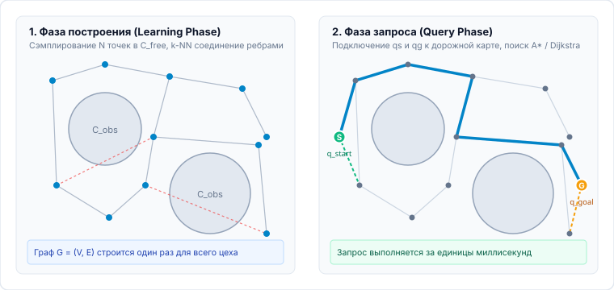
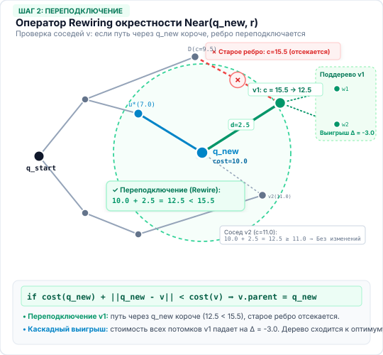
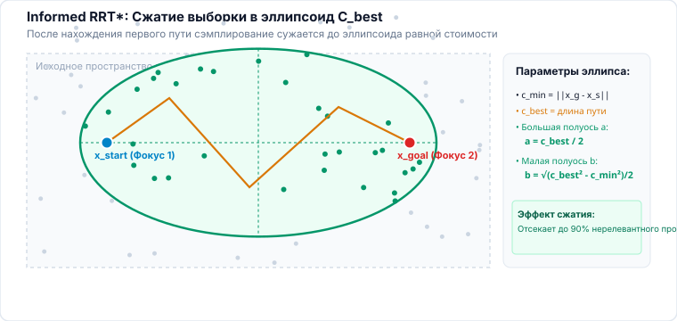
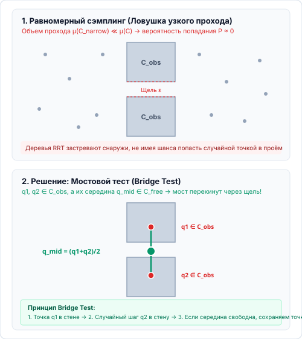
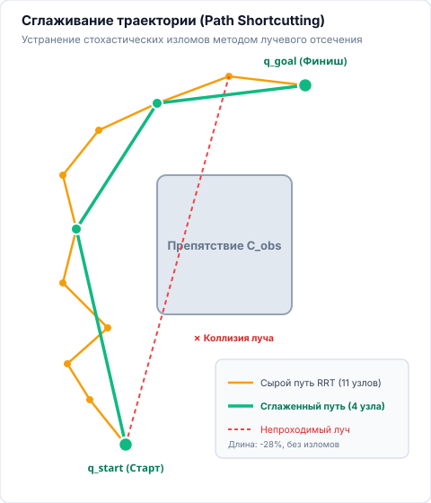

<!-- _class: lead -->
<!-- _header: "" -->
<!-- _footer: "" -->

# **Планирование движений мобильных роботов**
## Лекция 03: Методы планирования, основанные на выборке

<div class="mt-4">

<span class="badge badge-blue">⏱️ 90 минут</span>
<span class="badge badge-green">Сэмплирующие методы в C-space</span>
<span class="badge badge-purple">PRM • Lazy PRM • RRT • RRT-Connect • RRT* • Informed RRT* • Shortcutting • OMPL</span>

</div>

---

<!-- _header: "Лекция 03 | Введение и мотивация" -->

## Предмет лекции и результаты обучения <span class="badge badge-blue">Концепт-карта</span>

<div class="grid-2 mt-2">

<div class="card card-accent">

### 🎯 Зачем нужен переход к сэмплингу?

В Лекции 02 мы детально изучили сеточный поиск ($A^*$, $\text{Theta}^*$, CBS). Однако при увеличении числа степеней свободы робота ($d \ge 4$) сеточные методы терпят **вычислительный коллапс**.

Данная лекция посвящена методам случайной выборки (**Sampling-Based Planning**):
- Как исследовать непрерывное $\mathcal{C}$-пространство произвольной размерности без явного построения препятствий;
- Какими свойствами обладают вероятностные дорожные карты (**PRM**) и случайные деревья (**RRT**);
- Как преодолеть фундаментальные недостатки сэмплинга: неоптимальность, узкие проходы и изломанность траекторий.

</div>

<div class="card">

### 💡 Компетенции после занятия:

- **Понимать барьеры сеток:** обосновывать неприменимость сеток для $d > 3$ ($\mathcal{O}(\varepsilon^{-d})$) и метрические искажения.
- **Проектировать многократные запросы:** строить PRM и Lazy PRM с отложенной валидацией рёбер.
- **Управлять свойствами RRT:** настраивать смещение Вороного, Goal Bias и двунаправленный прорыв в RRT-Connect.
- **Обеспечивать оптимальность:** формулировать теорему Карамана–Фраццоли, реализовывать `ChooseParent` и `Rewire` в $RRT^*$, применять сжатие выборки в Informed $RRT^*$.
- **Устранять артефакты:** побеждать «узкие проходы» (Bridge Test) и сглаживать пути лучевым отсечением (Ray-Casting Shortcutting).

</div>

</div>

---

<!-- _header: "Лекция 03 | Фундаментальный кризис сеток" -->

## 1. Проклятие размерности в сеточных методах <span class="badge badge-time">03–06 мин</span>

<div class="grid-2">

<div class="col">

Дискретизация непрерывного конфигурационного пространства $\mathcal{C} \subset \mathbb{R}^d$ с шагом $\varepsilon$ порождает число ячеек:

<div class="formula-box">

$$N_{\text{cells}} = \left(\frac{L}{\varepsilon}\right)^d = \mathcal{O}\left(\varepsilon^{-d}\right)$$

</div>

- Пусть $L = 10$ м, разрешение $\varepsilon = 0.05$ м ($200$ отсчётов на координату):
  - **Плоский точечный робот ($d = 2$):** $200^2 = 4 \times 10^4$ ячеек ($\sim 160$ Кб, поиск за 2 мс).
  - **Робот с ориентацией ($d = 3$, $SE(2)$):** $200^2 \times 72 = 2.88 \times 10^6$ ($\sim 12$ Мб, $A^*$ за 0.1 с).
  - **Робот с прицепом ($d = 4$):** $200^2 \times 72^2 \approx 2.1 \times 10^8$ ($\sim 2$ Гб RAM).
  - **Манипулятор на мобильной базе ($d \ge 7$):** $\ge 1.28 \times 10^{16}$ ячеек (**петабайты памяти**).

</div>

<div class="col">

<div class="card card-alert">

### Экспоненциальный взрыв графа

Сеточный алгоритм поиска ($A^*$, Дейкстра) имеет временную сложность:
$$\mathcal{O}(|V| \log |V| + |E|)$$
где $|V| = \mathcal{O}(\varepsilon^{-d})$, а число смежных рёбер на узел $|E|/|V| \ge 3^d - 1$.

При росте размерности $d$ время работы и память сеточного планировщика **растут экспоненциально**.

</div>

<div class="card-success text-sm mt-2">

**Вывод:** Детерминированное покрытие пространства регулярной координатной сеткой принципиально неприменимо в задачах с размерностью $d > 3$.

</div>

</div>

</div>

---

<!-- _header: "Лекция 03 | Фундаментальный кризис сеток" -->

## Топологические дефекты и метрические искажения сеток <span class="badge badge-time">06–09 мин</span>

<div class="grid-2">

<div class="col">

<div class="card">

### 1. Дискретизационная неполнота

- Если шаг сетки $\varepsilon$ больше ширины узкого прохода в $\mathcal{C}_{free}$, ни один узел сетки не попадёт внутрь.
- Алгоритм $A^*$ вернёт ошибку («пути нет»), хотя в непрерывном пространстве физический проход **существует**.
- Уменьшение $\varepsilon$ вдвое увеличивает размер графа в $2^d$ раз.

</div>

<div class="card mt-2">

### 2. Дигитализационные изломы (Metric Error)

- Перемещение на сетке ограничено фиксированным набором направлений (4- или 8-связность).
- Отношение длины пути по сетке к евклидовому расстоянию в худшем случае составляет $\frac{4}{\pi} \approx 1.27$ (ошибка до 27%).

</div>

</div>

<div class="col">

<div class="card card-accent">

### 3. Зависимость от ориентации сетки

<div class="text-sm">

Поворот координатных осей сетки на угол $\alpha$ меняет топологию найденного сеточного пути, вызывая резкие скачки плановой траектории при переориентации карты.

</div>

<div class="formula-box text-sm mt-2">

$$\|q_A - q_B\|_{\text{Octile}} \neq \|q_A - q_B\|_2$$

</div>

<div class="card-alert text-sm mt-2">

**Сеточный тупик:** Сетка пытается дискретизировать **всё** пространство $\mathcal{C}$, включая огромные открытые пустоты, где в дискретизации нет никакой необходимости.

</div>

</div>

</div>

</div>

---

<!-- _header: "Лекция 03 | Сдвиг парадигмы" -->

## Невозможность построения $\mathcal{C}_{obs}$ и парадигма Black-Box <span class="badge badge-time">09–12 мин</span>

<div class="grid-2">

<div class="col">

<div class="card card-alert">

### Почему нельзя явно построить $\partial \mathcal{C}_{obs}$?

Точное построение границ $\mathcal{C}_{obs}$ требует вычисления сумм Минковского $\mathcal{W}_{obs} \oplus (-\mathcal{A}(q))$:
- В $d=2$ для многоугольников: $\mathcal{O}(n \cdot m)$ операций;
- В $d \ge 3$ для невыпуклых тел с вращениями: $\mathcal{O}(n^d)$ алгебраических гиперповерхностей.
- Аналитическое описание $\partial \mathcal{C}_{obs}$ в $\mathbb{R}^d$ вычислительно неразрешимо в реальном времени.

</div>

</div>

<div class="col">

<div class="card card-success">

### Сдвиг парадигмы: Детектор коллизий как «Чёрный ящик»

Мы **отказываемся** от попыток аналитически строить границы препятствий. Планировщик требует только **булев предикат коллизии**:

<div class="formula-box">

$$\operatorname{Clear}(q) = \begin{cases} 1, & q \in \mathcal{C}_{free} \\ 0, & q \in \mathcal{C}_{obs} \end{cases}$$

</div>

- Предикат реализуется внешним геометрическим движком (FCL, Bullet, ODE).
- Планировщик «ощупывает» пространство точечными пробами (*probing*).
- **Сложность перестаёт зависеть от аналитического уравнения препятствий.**

</div>

</div>

</div>

---

<!-- _header: "Лекция 03 | Геометрия C-пространства" -->

## Метрики расстояния в $\mathcal{C}$-пространстве <span class="badge badge-time">12–15 мин</span>

<div class="grid-2">

<div class="col">

Для работы сэмплирующих алгоритмов необходимо измерять расстояние между конфигурациями $q_1, q_2 \in \mathcal{C}$.

<div class="card card-accent">

### 1. Топология окружности $S^1$ и цикличность:
Для угловых координат $\theta \in [-\pi, \pi)$ евклидова разность $|\theta_1 - \theta_2|$ неверна:
$$\operatorname{dist}_{S^1}(\theta_1, \theta_2) = \min(|\theta_1 - \theta_2|, 2\pi - |\theta_1 - \theta_2|)$$
Прямой отрезок в $S^1$ учитывает кратчайший поворот через точку $\pm \pi$.

</div>

</div>

<div class="col">

<div class="card">

### 2. Взвешенная метрика в $SE(2) = \mathbb{R}^2 \times S^1$:

Нельзя напрямую складывать метры и радианы:
$$\operatorname{dist}_{SE(2)}(q_1, q_2) = \sqrt{w_p \|p_1 - p_2\|^2 + w_\theta \operatorname{dist}_{S^1}(\theta_1, \theta_2)^2}$$
где веса $w_p, w_\theta$ задают физический компромисс между линейным сдвигом и угловым разворотом платформы.

<div class="card-alert text-sm mt-2">

**Важно:** Неудачный подбор весов метрики искажает форму ячеек Вороного и замедляет сходимость случайного поиска в десятки раз!

</div>

</div>

</div>

</div>

---

<!-- _header: "Лекция 03 | Вероятностные дорожные карты" -->

## 2. Probabilistic Roadmaps (PRM): Multi-Query поиск <span class="badge badge-time">15–18 мин</span>

<div class="grid-2">

<div class="col">

Алгоритм **PRM** (*Kavraki, Švestka, Latombe, Overmars, 1996*) разделяет процесс планирования на две принципиально независимые фазы:

<div class="card card-accent">

### 1. Фаза построения (Learning / Construction):
- Дорожная карта $\mathcal{G} = (\mathcal{V}, \mathcal{E})$ строится **один раз** для всей статической карты (склад, цех, терминал).
- Узлы $\mathcal{V}$ генерируются случайной выборкой в $\mathcal{C}_{free}$.
- Рёбра $\mathcal{E}$ соединяют пары близких узлов при помощи простого локального планировщика (*Local Planner*).

</div>

</div>

<div class="col">

<div class="card">

### 2. Фаза запроса (Query Phase):
- Робот получает разовые задания: $q_{start} \to q_{goal}$.
- Терминальные точки $q_{start}$ и $q_{goal}$ подключаются к дорожной карте $\mathcal{G}$.
- Кратчайший путь на графе ищется алгоритмом $A^*$ или Дейкстрой за **единицы миллисекунд**!

</div>

<div class="card-success text-sm mt-2">

**Multi-Query преимущество:** Вычислительно тяжёлая фаза проверки коллизий амортизируется по тысячам последующих маршрутных запросов робота.

</div>

</div>

</div>

---

<!-- _header: "Лекция 03 | Вероятностные дорожные карты" -->

## Архитектура построения и запроса в PRM <span class="badge badge-time">18–21 мин</span>

<div class="grid-2">

<div class="col">

<div class="diagram-box">



</div>

</div>

<div class="col">

<div class="card">

### Алгоритм построения PRM (Learning Phase):

```python
V = set();  E = set()
while len(V) < N:
    q = SampleUniform(C_space)
    if Clear(q):  # Проверка точки
        V.add(q)

for q in V:
    # Выбор k ближайших соседей в метрике C-space
    Neighbors = kNearestNeighbors(V, q, k)
    for u in Neighbors:
        if (q, u) not in E and LocalPlannerClear(q, u):
            E.add((q, u))
```

</div>

<div class="text-sm mt-1">

Локальный планировщик проверяет отрезок $(q, u)$ дискретным шагом $\delta$:
$$\forall \tau \in [0, 1]: \operatorname{Clear}((1 - \tau)q + \tau u) == 1$$

</div>

</div>

</div>

---

<!-- _header: "Интерактивная практика | PRM" -->

## Интерактивный симулятор: Дорожная карта PRM <span class="badge badge-green">⏱️ 21–25 мин</span>

<div class="interactive-container">

<div class="interactive-header">

<span><i class="interactive-dot"></i> Исследование PRM: генерация случайных вершин, $k$-NN связность и фаза запроса (Query)</span>
<span>Рисуйте круглые преграды | Перетаскивайте S и G | Варьируйте число узлов N и соседей k</span>

</div>
<iframe src="http://localhost:5599/widgets/prm-roadmap/index.html" class="interactive-frame"></iframe>

</div>

<!-- 
Методические указания лектору:
1. Покажите, как при малом N (например, 20 узлов) граф распадается на несвязные компоненты, и путь найти невозможно.
2. Увеличьте N до 60-80: граф образует плотную паутину в C_free, и запрос пути выполняется мгновенно.
-->

---

<!-- _header: "Лекция 03 | Оптимизация дорожных карт" -->

## Lazy PRM: Отложенная валидация коллизий <span class="badge badge-time">25–28 мин</span>

<div class="grid-2">

<div class="col">

В классическом PRM **80–90% процессорного времени** уходит на проверку коллизий для рёбер, которые **никогда не войдут** в итоговый путь робота!

<div class="card card-accent">

### Принцип Lazy PRM (Bohlin & Kavraki, 2000):

1. **Оптимистичное построение:** Генерируем $N$ узлов и соединяем их рёбрами **БЕЗ** проверки отрезков на столкновения! Все рёбра считаются условно свободными.
2. **Отложенная проверка (Lazy Evaluation):** 
   - Запускаем $A^*$ на неочищенном графе.
   - Как только $A^*$ выбирает ребро для включения в путь, проверяем **только его**.
   - Если ребро в коллизии — удаляем его из графа и продолжаем поиск $A^*$.

</div>

</div>

<div class="col">

<div class="card">

### Псевдокод итерации Lazy PRM:

```python
path = AStarSearch(G, q_start, q_goal)
while path is not None:
    collision_edge = FirstCollidingEdge(path)
    if collision_edge is None:
        return path  # Путь полностью валиден!
    # Удаляем непроходимое ребро
    G.remove_edge(collision_edge)
    path = AStarSearch(G, q_start, q_goal)
return FAILURE  # Путь не существует
```

</div>

<div class="card-success text-sm mt-2">

**Ускорение:** В просторных складах Lazy PRM находит путь в **5–15 раз быстрее** классического PRM, проверяя лишь несколько десятков рёбер.

</div>

</div>

</div>

---

<!-- _header: "Лекция 03 | Сравнение PRM и Lazy PRM" -->

## PRM против Lazy PRM: Инженерный компромисс <span class="badge badge-time">28–30 мин</span>

<div class="grid-2">

<div class="col">

<div class="card">

### Когда побеждает PRM (Eager):

- **Плотные, узкие лабиринты:** Почти каждое оптимистично построенное ребро в Lazy PRM оказывается заблокированным.
- Алгоритм $A^*$ тратит колоссальное время на непрерывные перепланирования по графу после каждого удаленного ребра.
- **Многократные запросы (Multi-Query):** Затраты на полную очистку графа один раз окупаются миллионами последующих мгновенных запросов.

</div>

</div>

<div class="col">

<div class="card card-accent">

### Когда побеждает Lazy PRM:

- **Просторные цеха и логистические хабы:** Препятствия занимают малый процент объёма ($\mu(\mathcal{C}_{obs}) \ll \mu(\mathcal{C})$).
- Первый же путь, найденный $A^*$, с высокой вероятностью оказывается полностью свободным.
- **Динамически меняющиеся препятствия:** Если препятствия смещаются, очищать весь граф заново бессмысленно — лучше проверять только активный путь.

</div>

</div>

</div>

---

<!-- _header: "Лекция 03 | Однократные запросы и RRT" -->

## 3. Быстро растущие случайные деревья (RRT) <span class="badge badge-time">30–33 мин</span>

<div class="grid-2">

<div class="col">

В задачах навигации мобильных платформ обстановка часто меняется динамически. Строить глобальный PRM-граф ради одного разового перемещения из $q_{start}$ в $q_{goal}$ вычислительно неэффективно.

<div class="card card-accent">

### Парадигма одного запроса (Single-Query):
- Планировщик растет в виде ориентированного дерева $\mathcal{T} = (\mathcal{V}, \mathcal{E})$, укорененного в $q_{start}$.
- Дерево исследует пространство целенаправленно, пока одна из ветвей не достигнет $q_{goal}$.
- Алгоритм **RRT** (*Rapidly-exploring Random Tree*, LaValle, 1998) решает эту задачу с гарантией быстрого заполнения пустот.

</div>

</div>

<div class="col">

<div class="card">

### 4 фундаментальных оператора RRT:

1. $\operatorname{Sample}():$ генерация $q_{rand} \sim \operatorname{Uniform}(\mathcal{C})$.
2. $\operatorname{Nearest}(\mathcal{T}, q_{rand}):$ поиск ближайшей вершины дерева:
   $$q_{near} = \arg\min_{u \in \mathcal{V}} \|u - q_{rand}\|$$
3. $\operatorname{Steer}(q_{near}, q_{rand}, \Delta q):$ инкрементальный шаг длины $\Delta q$:
   $$q_{new} = q_{near} + \min(\Delta q, \|q_{rand}-q_{near}\|) \frac{q_{rand}-q_{near}}{\|q_{rand}-q_{near}\|}$$
4. $\operatorname{Clear}(q_{near}, q_{new}):$ проверка отрезка на коллизии.

</div>

</div>

</div>

---

<!-- _header: "Лекция 03 | Быстро растущие случайные деревья" -->

## Математический феномен: Смещение Вороного (Voronoi Bias) <span class="badge badge-time">33–37 мин</span>

<div class="grid-2">

<div class="col">

Почему случайное дерево RRT быстро разрастается во все стороны, а не толчётся вокруг стартовой точки?

<div class="card card-accent">

### Теорема о смещении Вороного (LaValle & Kuffner):

Пусть $\operatorname{Vor}(u)$ — ячейка Вороного для вершины $u \in \mathcal{V}$:
$$\operatorname{Vor}(u) = \{ q \in \mathcal{C} \mid \|q - u\| \le \|q - v\|, \; \forall v \in \mathcal{V} \}$$

Вероятность того, что вершина $u$ будет выбрана в качестве $q_{near}$, **строго пропорциональна объёму её ячейки Вороного**:

<div class="formula-box">

$$P(u = q_{near}) = \frac{\mu(\operatorname{Vor}(u))}{\mu(\mathcal{C})}$$

</div>

</div>

</div>

<div class="col">

<div class="card card-success">

### Физический смысл эффекта:

- Вершины на фронтире дерева, граничащие с гигантскими неисследованными областями $\mathcal{C}_{free}$, имеют **огромные ячейки Вороного**.
- Вершины внутри уже исследованных зон зажаты соседями и имеют крошечные ячейки Вороного.
- **Следствие:** RRT с колоссальной вероятностью вытягивает ветви в неисследованные пустоты, обеспечивая равномерный охват пространства без явного вычисления покрытия!

</div>

<div class="card-alert text-sm mt-2">

**Goal Biasing:** С вероятностью $p_{goal} \approx 5\text{--}10\%$ выбираем $q_{rand} = q_{goal}$. Это придает дереву целевой дрейф. При $p_{goal} > 25\%$ дерево застревает в тупиках перед препятствиями.

</div>

</div>

</div>

---

<!-- _header: "Лекция 03 | Двунаправленный поиск" -->

## Двунаправленный поиск: RRT-Connect <span class="badge badge-time">37–41 мин</span>

<div class="grid-2">

<div class="col">

В сложных лабиринтах однонаправленное дерево тратит много времени на обход тупиков. Kuffner & LaValle (2000) предложили алгоритм **RRT-Connect**: два дерева растут навстречу друг другу.

<div class="card card-accent">

### Операция CONNECT:

В отличие от стандартного `EXTEND` (продвижение на один шаг $\Delta q$), `CONNECT` жадно повторяет шаги `EXTEND` к целевой точке до тех пор, пока:
- Либо отрезок не врежется в препятствие;
- Либо вершина вплотную не достигнет цели!

</div>

<div class="card-success text-sm mt-2">

Деревья меняются ролями (`SWAP`) на каждой итерации, обеспечивая строго сбалансированный встречный рост.

</div>

</div>

<div class="col">

<div class="card">

### Псевдокод итерации RRT-Connect:

```python
def RRT_Connect(q_start, q_goal):
    T_a.init(q_start);  T_b.init(q_goal)
    for k in range(K_max):
        q_rand = SampleUniform(C_space)
        q_new = Extend(T_a, q_rand)
        if q_new is not None:
            # Жадная попытка соединить второе дерево
            if Connect(T_b, q_new) == REACHED:
                return ExtractPath(T_a, T_b, q_new)
        Swap(T_a, T_b)
    return FAILURE
```

</div>

<div class="text-sm mt-1">

**Результат:** В узких лабиринтах RRT-Connect находит первый путь в **10–50 раз быстрее**, чем классический RRT.

</div>

</div>

</div>

---

<!-- _header: "Интерактивная практика | RRT и RRT-Connect" -->

## Интерактивный симулятор: Исследование RRT и RRT-Connect <span class="badge badge-green">⏱️ 41–45 мин</span>

<div class="interactive-container">

<div class="interactive-header">

<span><i class="interactive-dot"></i> Сравнение RRT (одно дерево) vs RRT-Connect (встречные деревья S и G)</span>
<span>Переключите режим на «RRT-Connect» | Запустите симуляцию | Оцените скорость смыкания деревьев</span>

</div>
<iframe src="http://localhost:5599/widgets/rrt-exploration/index.html#connect" class="interactive-frame"></iframe>

</div>

<!-- 
Методические указания лектору:
1. Запустите сначала RRT: покажите, как синее дерево исследует всё поле, долго огибая препятствия.
2. Сбросьте и переключите на RRT-Connect: покажите, как синее (от S) и фиолетовое (от G) деревья устремляются навстречу и замыкают путь за доли секунды.
-->

---

<!-- _header: "Лекция 03 | Проблема неоптимальности" -->

## 4. Фундаментальный дефект RRT: Теорема о неоптимальности <span class="badge badge-time">45–48 мин</span>

<div class="grid-2">

<div class="col">

Классический RRT находит путь быстро. Но каково качество этого пути?

<div class="card card-alert">

### Теорема (Karaman & Frazzoli, MIT / IJRR 2011):

Классические алгоритмы PRM и RRT обладают вероятностной полнотой:
$$\lim_{N \to \infty} P(\text{путь найден} \mid \text{путь существует}) = 1$$

Однако для RRT вероятность того, что стоимость найденного решения сойдется к оптимальной $c^*$, **тождественно равна нулю**:

<div class="formula-box">

$$P\left(\lim_{N \to \infty} \operatorname{Cost}(\mathcal{T}_N) = c^*\right) = 0$$

</div>

</div>

</div>

<div class="col">

<div class="card">

### В чем причина топологического тупика?

1. **Случайная фиксация топологии:** Ранние ветви дерева, возникшие стохастически, навсегда остаются фиксированными предками для всех последующих потомков.
2. **Игнорирование накопленной стоимости:** Оператор `NEAREST` выбирает узел только по евклидову расстоянию $\|u - q_{rand}\|$, игнорируя стоимость пути от корня $\operatorname{cost}(u)$.
3. **Необратимость субоптимальности:** Сколько бы миллионов точек мы ни добавили, RRT не способен перестроить неудачно заложенную ветвь!

</div>

</div>

</div>

---

<!-- _header: "Лекция 03 | Асимптотически оптимальный поиск" -->

## Алгоритм RRT*: ChooseParent и Rewiring <span class="badge badge-time">48–52 мин</span>

Чтобы гарантировать сходимость к оптимальному пути, Karaman & Frazzoli ввели алгоритм **$RRT^*$** с локальной оптимизацией в шаре радиуса $r_N$:

<div class="grid-2 mt-2">

<div class="card card-accent">

### 1. Выбор лучшего родителя (ChooseParent):
Для нового узла $q_{new}$ родитель выбирается среди всех соседей $u \in \operatorname{Near}(q_{new}, r_N)$ по минимуму суммарной цены:
$$q_{parent} = \arg\min_{u} \left( \operatorname{cost}(u) + \|u - q_{new}\| \right)$$

</div>

<div class="card card-success">

### 2. Переподключение рёбер (Rewire):
Для соседа $v \in \operatorname{Near}(q_{new}, r_N)$, если путь через $q_{new}$ дешевле:
$$\operatorname{cost}(q_{new}) + \|q_{new} - v\| < \operatorname{cost}(v)$$
Старое ребро удаляется, и $q_{new}$ становится новым родителем $v$!

</div>

</div>

<div class="diagram-box mt-4">



</div>

---

<!-- _header: "Лекция 03 | Асимптотически оптимальный поиск" -->

## Математика радиуса окрестности в RRT* <span class="badge badge-time">52–56 мин</span>

<div class="grid-2">

<div class="col">

<div class="card card-accent">

### Теорема о радиусе окрестности (Karaman & Frazzoli, 2011):

Для сохранения асимптотической оптимальности при минимальных затратах радиус окрестности $r_N$ должен сжиматься с ростом числа узлов $N$:

<div class="formula-box">

$$r_N = \gamma_{\text{RRT}^*} \left( \frac{\log N}{N} \right)^{1/d}$$

</div>

- Если $r_N = \text{const}$, число проверяемых соседей растёт как $\mathcal{O}(N)$, а сложность шага становится $\mathcal{O}(N)$.
- Если $r_N \propto (\log N / N)^{1/d}$, среднее число соседей в окрестности равно $\mathcal{O}(\log N)$.
- Константа $\gamma_{\text{RRT}^*}$ подбирается с учетом размерности пространства $d$: радиус должен уменьшаться, сохраняя баланс между скоростью и оптимальностью.

</div>

</div>

<div class="col">

<div class="card">

### Свойства сходимости $RRT^*$:

1. **Асимптотическая оптимальность:**
   $$P\left(\lim_{N \to \infty} \operatorname{Cost}(\mathcal{T}_N) = c^*\right) = 1$$
2. **Скорость сходимости:** Ошибка стоимости убывает сублинейно:
   $$\mathbb{E}[\operatorname{Cost}(\mathcal{T}_N) - c^*] \le \mathcal{O}(N^{-1/d})$$
3. **Цена оптимальности:** Время одной итерации возрастает с $\mathcal{O}(\log N)$ до $\mathcal{O}(\log^2 N)$ из-за проверок коллизий на шаге `Rewire`.

</div>

</div>

</div>

---

<!-- _header: "Интерактивная практика | RRT*" -->

## Интерактивный симулятор: Переподключение ветвей в RRT* <span class="badge badge-green">⏱️ 56–60 мин</span>

<div class="interactive-container">

<div class="interactive-header">

<span><i class="interactive-dot"></i> Сравнение RRT и RRT*: наблюдение за выпрямлением пути и снижением суммарной стоимости</span>
<span>Переключите селектор на «RRT*» | Запустите поиск | Нажмите «✂️ Сгладить (Shortcut)» для сравнения</span>

</div>
<iframe src="http://localhost:5599/widgets/rrt-exploration/index.html#star" class="interactive-frame"></iframe>

</div>

<!-- 
Методические указания лектору:
1. Обратите внимание студентов на то, как дерево RRT* распрямляет ветви: по мере добавления узлов угловатые изломы сменяются натянутыми струнами.
2. Сравните стоимость пути (statCost): в RRT она застревает, в RRT* непрерывно убывает к минимуму.
-->

---

<!-- _header: "Лекция 03 | Эллипсоидное сжатие выборки" -->

## Informed RRT*: Сжатие выборки в эллипсоид <span class="badge badge-time">60–63 мин</span>

<div class="grid-2">

<div class="col">

<div class="card card-alert">

### Дефект насыщения RRT*:

Как только найден первый путь стоимостью $c_{\text{best}}$, алгоритм $RRT^*$ продолжает равномерно сэмплировать весь объем $\mathcal{C}$. Точки, для которых $\|q - q_{start}\| + \|q - q_{goal}\| > c_{\text{best}}$, **в принципе не могут улучшить решение**!

</div>

<div class="card card-success mt-2">

### Решение: Informed RRT* (Gammell et al., 2014)

Выборка ограничивается пролатным гиперсфероидом (**эллипсоидом**):

<div class="formula-box text-sm">

$$\mathcal{C}_{\text{inf}} = \{ q \in \mathcal{C} \mid \|q - q_{\text{start}}\| + \|q - q_{\text{goal}}\| \le c_{\text{best}} \}$$

</div>

По мере улучшения пути ($c_{\text{best}} \downarrow$) эллипсоид динамически сжимается, концентрируя 100% вычислений в области глобального оптимума!

</div>

</div>

<div class="col">

<div class="diagram-box">



</div>

</div>

</div>

---

<!-- _header: "Лекция 03 | Интуиция Informed RRT*" -->

## Интуиция сэмплирования гиперэллипсоида <span class="badge badge-time">63–66 мин</span>

<div class="grid-2">

<div class="col">

Как эффективно искать путь, не тратя время на заведомо плохие варианты?

<div class="card card-accent">

### 1. Эвристическое ограничение (Эллипсоид):
- **Фокусы эллипса:** Точки $q_{\text{start}}$ и $q_{\text{goal}}$.
- **Размер (большая ось):** Текущая стоимость лучшего найденного пути $c_{\text{best}}$.
- **Малая ось:** Зависит от запаса $c_{\text{best}}^2 - c_{\text{min}}^2$, где $c_{\text{min}}$ — прямое расстояние.

Любая точка вне этого эллипса гарантированно даст путь длиннее, чем уже найденный $c_{\text{best}}$.

</div>

</div>

<div class="col">

<div class="card card-success">

### 2. Генерация точек:

Вместо того чтобы отбрасывать сэмплы, попавшие мимо (что неэффективно), алгоритм:
1. Генерирует случайную точку внутри единичной сферы.
2. **Масштабирует** её по осям эллипсоида (вытягивает в эллипсоид).
3. **Поворачивает** и смещает её так, чтобы оси выстроились от старта к финишу.

</div>

<div class="text-sm mt-2">

**Выигрыш:** В многомерных пространствах объём эллипсоида составляет $< 1\%$ объёма рабочей зоны. Это концентрирует поиск в зоне глобального оптимума и ускоряет доводку пути в **10–100 раз**.

</div>

</div>

</div>

---

<!-- _header: "Интерактивная практика | Informed RRT*" -->

## Интерактивный симулятор: Сжатие эллипса в Informed RRT* <span class="badge badge-green">⏱️ 66–69 мин</span>

<div class="interactive-container">

<div class="interactive-header">

<span><i class="interactive-dot"></i> Исследование Informed RRT*: наблюдение за появлением и динамическим сужением эллипса равной стоимости</span>
<span>Выберите «Informed RRT*» | Дождитесь нахождения первого пути | Посмотрите, как выборка запирается внутри эллипса</span>

</div>
<iframe src="http://localhost:5599/widgets/rrt-exploration/index.html#informed" class="interactive-frame"></iframe>

</div>

<!-- 
Методические указания лектору:
1. Запустите симуляцию в режиме Informed RRT*. Обратите внимание студентов на момент замыкания первого пути: мгновенно возникает зеленый пунктирный эллипс.
2. Все последующие оранжевые точки сэмплинга ложатся строго внутрь эллипса, а его контур сжимается при каждой оптимизации пути.
-->

---

<!-- _header: "Лекция 03 | Преодоление дефектов сэмплинга" -->

## 5. Преодоление узких проходов (Narrow Passage Problem) <span class="badge badge-time">69–72 мин</span>

<div class="grid-2">

<div class="col">

<div class="card card-alert">

### В чем сущность проблемы узких проходов?

Пусть узкая щель или дверной проем $\mathcal{C}_{\text{narrow}}$ имеет малый объём $\mu(\mathcal{C}_{\text{narrow}})$.

Вероятность попадания случайной точки в щель при равномерной выборке:
$$P(q \in \mathcal{C}_{\text{narrow}}) = \frac{\mu(\mathcal{C}_{\text{narrow}})}{\mu(\mathcal{C})} \ll 1$$

При объёме щели $0.01\%$ от карты потребуется в среднем **$10\,000$ попыток сэмплирования**, чтобы лишь одна точка попала в проход.

</div>

</div>

<div class="col">

<div class="diagram-box">



</div>

</div>

</div>

---

<!-- _header: "Лекция 03 | Интеллектуальный сэмплинг" -->

## Интеллектуальные стратегии: Bridge Test и Gaussian Sampling <span class="badge badge-time">72–75 мин</span>

<div class="grid-3">

<div class="card card-accent">

### 1. Bridge Test (Hsu, 2003)

- Выбираем точку $q_1 \in \mathcal{C}_{obs}$ (внутри препятствия).
- Делаем шаг в случайном направлении: $q_2 = q_1 + \mathbf{d}$, где $\mathbf{d} \sim \mathcal{N}(0, \sigma^2)$.
- Если $q_2 \in \mathcal{C}_{obs}$, а **середина отрезка свободна**:
  $$q_{\text{mid}} = \frac{q_1 + q_2}{2} \in \mathcal{C}_{free}$$
  значит, отрезок перекинут **через узкий мост**! Точка $q_{\text{mid}}$ сохраняется.

</div>

<div class="card">

### 2. Gaussian Sampling (Boor)

- Генерируем пару точек $q_1 \sim \operatorname{Uniform}$, $q_2 \sim \mathcal{N}(q_1, \sigma^2)$.
- Сохраняем точку, только если одна из них в $\mathcal{C}_{obs}$, а вторая — в $\mathcal{C}_{free}$.
- **Эффект:** Сгущение сэмплов строго вдоль границ препятствий $\partial \mathcal{C}_{obs}$, где обычно располагаются входы в проходы.

</div>

<div class="card card-success">

### 3. Medial Axis Sampling

- Сгенерированная точка проецируется на топологический скелет (срединную ось) $\mathcal{C}_{free}$.
- Точка смещается в сторону максимального клиренса от ближайших стен.
- Обеспечивает прохождение робота по центру щели с максимальным запасом безопасности.

</div>

</div>

---

<!-- _header: "Интерактивная практика | Узкие проходы" -->

## Интерактивный симулятор: Bridge Test в узких проходах <span class="badge badge-green">⏱️ 75–78 мин</span>

<div class="interactive-container">

<div class="interactive-header">

<span><i class="interactive-dot"></i> Исследование узких проходов: равномерная выборка vs Bridge Test (мостовой тест)</span>
<span>Переключите селектор на «Bridge Test» | Нажмите «⚡ Запуск» | Посмотрите, как точки концентрируются в щели</span>

</div>
<iframe src="http://localhost:5599/widgets/narrow-passage/index.html" class="interactive-frame"></iframe>

</div>

<!-- 
Методические указания лектору:
1. Запустите сначала Uniform: покажите, что из 150 сэмплов в узкую щель попадает 0–1 точка, а RRT не может соединить S и G.
2. Переключите на Bridge Test: покажите красные пары в стенах и зелёные точки середин, безошибочно заполнившие проём.
-->

---

<!-- _header: "Лекция 03 | Постобработка и сглаживание" -->

## 6. Устранение изломов: Path Shortcutting и сглаживание <span class="badge badge-time">78–81 мин</span>

<div class="grid-2">

<div class="col">

<div class="card card-alert">

### Дефект стохастических путей:
Траектории, сгенерированные RRT/PRM, обладают выраженными недостатками:
- Содержат случайные зигзаги и паразитные объезды;
- Касаются углов препятствий с нулевым запасом клиренса;
- Неприменимы для прямого исполнения колёсным роботом.

</div>

<div class="card card-success mt-2">

### Алгоритм Ray-Casting Shortcutting:
Жадное лучевое сглаживание:
1. Берем текущую вершину пути $w_i$.
2. Ищем наиболее далекую вершину $w_j$ ($j > i+1$), с которой есть прямая видимость:
   $$\operatorname{ClearLine}(w_i, w_j) == \text{True}$$
3. Удаляем все промежуточные узлы $w_{i+1}, \dots, w_{j-1}$, заменяя их прямым отрезком $(w_i, w_j)$.

</div>

</div>

<div class="col">

<div class="diagram-box">



</div>

</div>

</div>

---

<!-- _header: "Лекция 03 | Вычислительная оптимизация" -->

## Вычислительные структуры: $k$-d Tree и Continuous Collision Detection <span class="badge badge-time">81–83 мин</span>

<div class="grid-2">

<div class="col">

<div class="card card-accent">

### 1. Поиск ближайших узлов ($k$-d Tree):

Наивный перебор $q_{near}$ по $N$ вершинам требует $\mathcal{O}(N)$ операций:
- При $N = 50\,000$ на 1 шаг уходит $> 20$ мс (суммарно минуты работы).
- Использование сбалансированных деревьев пространственного разбиения (**$k$-d tree**, nanoflann):
  $$\mathcal{O}(N) \longrightarrow \mathcal{O}(\log N)$$
- Позволяет RRT совершать до **$100\,000$ шагов в секунду** на CPU.

</div>

</div>

<div class="col">

<div class="card">

### 2. Непрерывная проверка коллизий (CCD):

- При дискретной проверке с шагом $\delta$ робот может «перепрыгнуть» сквозь тонкую стену (**Tunneling Effect**).
- **CCD (Continuous Collision Detection):** вычисление заметаемого объема (*Swept Volume*) капсулы или политопа:
  $$\mathcal{A}_{\text{swept}} = \operatorname{Conv}(\mathcal{A}(q_1) \cup \mathcal{A}(q_2))$$
- Проверка пересечения через специализированные алгоритмы (например, GJK / EPA) гарантирует абсолютную безопасность траектории.

</div>

</div>

</div>

---

<!-- _header: "Лекция 03 | Полнота и неразрешимость" -->

## Вероятностная полнота vs Детерминированная полнота <span class="badge badge-time">83–85 мин</span>

<div class="grid-2">

<div class="col">

<div class="card card-alert">

### В чем риск вероятностной полноты?

Определение: Если безопасный путь существует, то:
$$\lim_{N \to \infty} P(\text{путь найден}) = 1$$

**Однако если пути физически НЕ существует** (проход наглухо завален):
- Алгоритм $A^*$ на сетке обойдёт конечное число узлов и **детерминированно скажет**: *«Пути нет»*.
- Сэмплирующий алгоритм (RRT/PRM) **будет работать бесконечно**, продолжая генерировать миллионы точек в надежде найти щель!

</div>

</div>

<div class="col">

<div class="card card-accent">

### Инженерные критерии останова:

1. **Бюджет времени (Timeout):** ограничение времени поиска (например, 50–100 мс для локального, 1–2 с для глобального).
2. **Лимит выборки ($N_{\text{max}}$):** максимальное число добавленных узлов в дерево.
3. **Детерминированные квазислучайные выборки (Low-Discrepancy Sequences):**
   - Последовательности Хальтона, Соболя, сетки Сухова.
   - Обеспечивают минимальное расстояние покрытия $\varepsilon(N) \propto N^{-1/d}$, переводя вероятностную полноту в **детерминированную резолюционную полноту**.

</div>

</div>

</div>

---

<!-- _header: "Лекция 03 | Программные стандарты" -->

## Программный стек сэмплинга: Архитектура OMPL <span class="badge badge-time">85–87 мин</span>

<div class="grid-2">

<div class="col">

**OMPL** (*Open Motion Planning Library*, Rice University / Kavraki Lab) — индустриальный стандарт библиотек сэмплирования в робототехнике (базис MoveIt и Nav2).

<div class="card card-accent">

### Ключевые абстракции OMPL:

- `ob::StateSpace`: геометрия и метрика $\mathcal{C}$-пространства ($\mathbb{R}^2$, $SE(2)$, $SE(3)$, $SO(3)$).
- `ob::StateValidityChecker`: функция $\operatorname{Clear}(q)$ (Black-Box коллизий).
- `ob::MotionValidator`: проверка допустимости отрезка между двумя состояниями (дискретно или CCD).
- `ob::OptimizationObjective`: критерий оптимизации пути (длина пути, клиренс от препятствий, механическая работа).

</div>

</div>

<div class="col">

<div class="card">

### Пример настройки планировщика в OMPL (C++):

```cpp
auto space = std::make_shared<ob::SE2StateSpace>();
ob::RealVectorBounds bounds(2);
bounds.setLow(-10); bounds.setHigh(10);
space->setBounds(bounds);

auto si = std::make_shared<ob::SpaceInformation>(space);
si->setStateValidityChecker(isStateValid);
si->setup();

auto pdef = std::make_shared<ob::ProblemDefinition>(si);
pdef->setStartAndGoalStates(start, goal);

// Выбор любого алгоритма в одну строчку!
auto planner = std::make_shared<og::InformedRRTstar>(si);
planner->setProblemDefinition(pdef);
planner->setup();

ob::PlannerStatus solved = planner->solve(1.0); // таймаут 1 секунда
```

</div>

</div>

</div>

---

<!-- _header: "Лекция 03 | Сравнительный анализ" -->

## Сводная инженерная матрица сэмплирующих алгоритмов <span class="badge badge-time">87–88 мин</span>

<div class="table-container">

| Алгоритм | Тип запроса | Полнота | Оптимальность | Сложность шага | Преимущества | Слабые стороны |
| :--- | :--- | :--- | :--- | :--- | :--- | :--- |
| **PRM** | Multi-Query | Вероятностная | Нет (или PRM*) | $\mathcal{O}(\log \|V\| + k)$ | Идеален для статических цехов | Дорогое начальное построение |
| **Lazy PRM** | Multi-Query | Вероятностная | Нет | $\mathcal{O}(\log \|V\|)$ | Экономит 90% проверок коллизий | Медленнее в тесных лабиринтах |
| **RRT** | Single-Query | Вероятностная | **Субоптимален** | $\mathcal{O}(\log N)$ | Мощный Voronoi Bias, быстрый | Зигзаги, нет сходимости к $c^*$ |
| **RRT-Connect**| Single-Query | Вероятностная | **Субоптимален** | $\mathcal{O}(\log N)$ | Быстрейший поиск в лабиринтах | Ломаный путь, два дерева |
| **RRT*** | Single-Query | Вероятностная | **Асимптотическая** | $\mathcal{O}(\log^2 N)$ | Сходится к строгому оптимуму | Медленнее находит первый путь |
| **Informed RRT***| Single-Query| Вероятностная | **Асимптотическая** | $\mathcal{O}(\log^2 N)$ | Фокусировка в эллипсоиде $c_{\text{best}}$ | Требует первое допустимое решение|

</div>

---

<!-- _class: accent -->
<!-- _header: "Лекция 03 | Итоги и вопросы" -->

## Резюме лекции и контрольные вопросы <span class="badge badge-time">88–90 мин</span>

<div class="grid-2">

<div class="card">

### Ключевые положения лекции:

1. **Границы применимости:** Для 2D-роботов ($d \le 3$) сеточные методы часто предпочтительнее. Сэмплинг незаменим для $d \ge 4$ (манипуляторы, дроны).
2. **Проклятие размерности сеток** $\mathcal{O}(\varepsilon^{-d})$ преодолевается сэмплингом и концепцией Black-Box.
3. **PRM** эффективен для многократных запросов на статичной карте, а **Lazy PRM** исключает избыточные проверки.
4. **RRT** стремительно заполняет пространство благодаря **Voronoi Bias**, но фундаментально не сходится к оптимуму.
5. **$RRT^*$** гарантирует асимптотическую оптимальность, а **Informed $RRT^*$** фокусирует поиск в эллипсоиде.
6. **Узкие проходы** побеждаются Bridge Test, а изломы пути снимаются процедурой **Path Shortcutting**.

</div>

<div class="card card-accent">

### Контрольные вопросы:

- Почему при Goal Bias $> 30\%$ алгоритм RRT начинает проигрывать по времени варианту с $5\%$?
- Сформулируйте теорему Карамана–Фраццоли. Почему классический RRT не сходится к оптимальному пути?
- Почему радиус окрестности в $RRT^*$ должен сжиматься со скоростью $(\log N / N)^{1/d}$, а не быстрее?
- В чем заключается физический смысл Bridge Test при поиске узких проходов?
- Что произойдет с алгоритмом RRT*, если пути между стартом и целью физически не существует?

<div class="mt-2 text-center">

<span class="badge badge-blue">Следующая лекция: Модели шасси и локальное планирование (DWA, TEB, APF, MPPI)</span>

</div>

</div>

</div>
