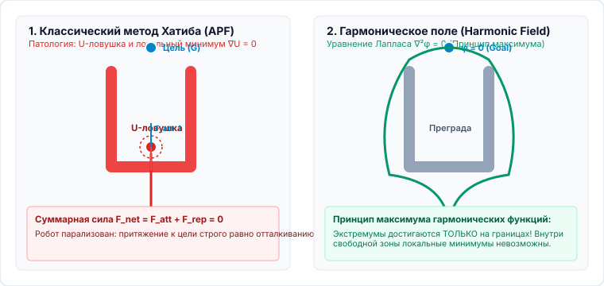
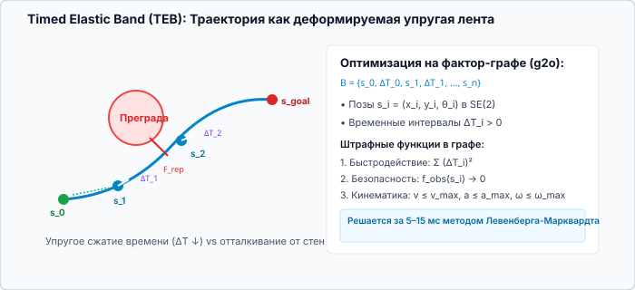

<!-- _class: lead invert -->
<!-- _header: "" -->
<!-- _footer: "" -->

# **Планирование движений мобильных роботов**
## Лекция 04: Реактивные и локальные методы планирования

⏱️ 90 минут
Локальное планирование
Khatib • ETH Zürich (Harmonic Fields) • Fox (DWA) • VO / RVO • TEB

---

<!-- _header: "Лекция 04 | Введение и мотивация" -->

## Чему посвящена эта лекция? Локальный контур

### 🎯 Разрыв между глобальным планом и реальностью

Глобальные алгоритмы ($A^*$, RRT*) строят идеальный маршрут по статической карте. Но в реальном мире перед колесами робота внезапно появляются пешеходы, погрузчики, закрываются двери, а колеса проскальзывают по гладкому бетону.

Эта лекция посвящена <strong>высокочастотному локальному планированию (20–50 Гц)</strong>: как за миллисекунды реагировать на динамические препятствия, гарантировать торможение без столкновений и плавно удерживать робота на глобальной траектории.

**💡 Результат занятия:** Проектировать локальные контуры управления, решать проблему застревания в потенциальных полях через гармонические функции, реализовывать алгоритм DWA с динамическими окнами и настраивать многоагентное избегание столкновений на базе Velocity Obstacles.

### 🔍 Ключевые вопросы лекции

- <strong>Физические аналогии:</strong> Искусственные потенциальные поля Хатиба и почему робот «застревает» в U-образных ловушках?
- <strong>Математическое устранение ловушек:</strong> Гармонические поля (ETH Zürich), уравнение Лапласа $\Delta U = 0$ и принцип максимума.
- <strong>Учет динамики приводов:</strong> Как алгоритм <code>DWA</code> ищет допустимые скорости в окне ускорений?
- <strong>Движущиеся препятствия:</strong> Препятствия в пространстве скоростей (Velocity Obstacles, VO) и устранение «зеркального танца» через RVO/ORCA.
- <strong>Эластичная деформация:</strong> Метод упругой ленты с таймингом (<code>TEB</code>) на факторных графах.

---

<!-- _header: "Лекция 04 | Структура занятия" -->

## План лекции на 90 минут ⏱️ 90 минут

### Часть 1: Потенциальные поля и геометрия (45 мин)

- <strong>00–12 мин:</strong> Иерархия управления: глобальный планировщик ($\sim 1$ Гц) vs локальный ($\sim 30$ Гц) vs контроллер моторов ($\sim 1$ кГц).
- <strong>12–22 мин:</strong> Метод искусственных потенциальных полей (Хатиб 1986): силы притяжения $F_{att}$ и отталкивания $F_{rep}$.
- <strong>22–32 мин:</strong> Патологии полей: локальные минимумы, колебания в узких коридорах (Oscillations) и проблема близких целей (GNRON).
- <strong>32–45 мин:</strong> <strong>Гармонические потенциальные поля (ETH Zürich)</strong>: уравнение Лапласа $\Delta U = 0$, краевые условия Дирихле/Неймана.

### Часть 2: Пространство скоростей и оптимизация (45 мин)

- <strong>45–55 мин:</strong> Интерактивный симулятор: исследование сил в искусственном потенциальном поле и U-ловушках.
- <strong>55–67 мин:</strong> <strong>Dynamic Window Approach (DWA)</strong>: пространство скоростей $(v, \omega)$, окно динамики $V_d$, безопасное торможение $V_a$.
- <strong>67–76 мин:</strong> <strong>Velocity Obstacles (VO)</strong>: конус коллизий, относительная скорость, запаздывание реакции.
- <strong>76–84 мин:</strong> Взаимное избегание: <strong>RVO</strong> и <strong>ORCA</strong>. Метод <strong>Timed Elastic Band (TEB)</strong> на фактор-графах $g2o$.
- <strong>84–90 мин:</strong> Итоги, контрольные вопросы и Q&A.

<!--
Примечание для лектора:
Лекция показывает эволюцию мысли от непрерывных силовых моделей (потенциалы 1986 г.) к чистому кинематическому пространству скоростей (DWA 1997 г., VO 1998 г.) и современной нелинейной оптимизации траекторий во времени (TEB).
-->
---

## 1. Зачем нужны локальные методы? Иерархия контуров 00–12 мин

Глобальный планировщик ($A^*$, RRT*) строит маршрут по статической глобальной карте медленно ($1\text{--}5$ с). В реальной эксплуатации возникают три вызова:

- <strong>Динамические препятствия:</strong> люди, погрузчики, открывающиеся ворота, которых нет на исходной карте.
- <strong>Погрешности приводов и датчиков:</strong> проскальзывание колес (Wheel Slip), дрейф одометрии и задержка передачи команд.
- <strong>Жесткий дедлайн реального времени:</strong> время реакции на появившееся препятствие должно составлять <strong>не более 20–50 мс</strong>.

### Трехуровневая архитектура управления:

$$\begin{aligned}
\text{Миссия / BT} &\xrightarrow{0.1\text{--}1\text{ Гц}} \text{Глобальный путь } \Pi(s) \\
&\xrightarrow{1\text{--}2\text{ Гц}} \mathbf{\text{Локальный планировщик}} \\
&\xrightarrow{20\text{--}50\text{ Гц}} \text{Команды } (v, \omega) \text{ на контроллер} \\
&\xrightarrow{500\text{--}1000\text{ Гц}} \text{Токи/ШИМ моторов } \tau
\end{aligned}$$

Локальный планировщик совмещает <strong>следование глобальному плану</strong> с <strong>реактивным уклонением</strong> от локальных сенсорных препятствий (LiDAR Costmap).

---

## 2. Искусственные потенциальные поля (Хатиб, 1986) 12–22 мин

Робот моделируется как материальная точка в потенциальном поле $U(q) = U_{att}(q) + U_{rep}(q)$ под действием результирующей силы $F(q) = -\nabla U(q)$:

### Притягивающий потенциал цели:

$$U_{att}(q) = \frac{1}{2} k_{att} \|q - q_{goal}\|^2$$
$$F_{att}(q) = -\nabla U_{att} = -k_{att} (q - q_{goal})$$

### Отталкивающий потенциал препятствий:

Действует только в зоне влияния $d_0$ вокруг препятствий:

$$U_{rep}(q) = \begin{cases} \frac{1}{2} k_{rep} \left(\frac{1}{d(q)} - \frac{1}{d_0}\right)^2, & d(q) \le d_0 \\ 0, & d(q) > d_0 \end{cases}$$
$$F_{rep}(q) = k_{rep} \left(\frac{1}{d(q)} - \frac{1}{d_0}\right) \frac{1}{d^2(q)} \nabla d(q)$$

где $d(q) = \min_{c \in \mathcal{O}} \|q - c\|$ — кратчайшее евклидово расстояние до препятствия, а $\nabla d(q)$ — вектор нормали от препятствия.

---

## 3. Патологии классических полей Хатиба 22–32 мин

### 1. Локальные минимумы

В U-образных тупиках и между двумя препятствиями силы взаимно компенсируются:

$$F_{att}(q) + F_{rep}(q) = 0$$

при $q \neq q_{goal}$. Робот полностью останавливается, не доехав до цели.

### 2. Колебания в коридорах

В узких проходах робот отталкивается от левой стены, перелетает к правой, отталкивается от нее — возникает незатухающий автоколебательный процесс (chattering).

### 3. Проблема GNRON

<strong>Goal Non-Reachable with Obstacle Nearby:</strong> если цель лежит вблизи препятствия ($d(q_{goal}) < d_0$), отталкивающая сила выталкивает робота из цели!

<strong>Вывод:</strong> Классический метод Хатиба интуитивен и быстр ($\mathcal{O}(1)$ на шаг), но математически несостоятелен в сложных средах без фундаментальных модификаций.

---

## Патологии APF: U-ловушка vs Гармоническое поле 30–33 мин

---

## 4. Гармонические поля: Ликвидация минимумов (ETH Zürich) 32–45 мин

### Уравнение Лапласа и принцип максимума:

Потенциал $U(q)$ называют <strong>гармоническим</strong>, если он удовлетворяет дифференциальному уравнению Лапласа во всей свободной области $\mathcal{C}_{free}$:

$$\nabla^2 U(q) = \Delta U(q) = \sum_{i=1}^d \frac{\partial^2 U}{\partial q_i^2} = 0$$

<strong>Теорема о максимуме/минимуме:</strong> Неконстантная гармоническая функция на замкнутой области достигает своих экстремумов <em>строго на границах области</em>! Внутри $\mathcal{C}_{free}$ <strong>локальные минимумы отсутствуют в принципе</strong>.

### Граничные условия и численное решение:

- <strong>Цель (сток):</strong> $U(q_{goal}) = 0$ (глобальный минимум).
- <strong>Препятствия:</strong> $U(q_{obs}) = 1$ (условие Дирихле) либо $\frac{\partial U}{\partial n} = 0$ (условие Неймана — непроницаемый поток).

На 2D сетке решается релаксацией Гаусса–Зейделя за несколько итераций:

$$U(i, j) = \frac{1}{4} \Big( U(i+1, j) + U(i-1, j) + U(i, j+1) + U(i, j-1) \Big)$$

Траектория робота строится градиентным спуском $\dot{q} = -\nabla U(q)$ с гарантией достижения цели!

---

<!-- _header: "Интерактивная практика | Потенциальные поля" -->

## Интерактивный симулятор: Потенциальные поля и ловушки ⏱️ 45–55 мин

<i class="interactive-dot"></i> Векторные силы: $F_{att}$ (синий), $F_{rep}$ (красный) и суммарный вектор $F_{net}$ (зеленый)
Перетаскивайте препятствия | Создайте U-ловушку и наблюдайте застревание

<iframe src="http://localhost:5500/widgets/potential-field/index.html" class="interactive-frame"></iframe>

<!-- 
Методические указания лектору:
1. Запустите движение робота по прямой: покажите, как растет сила притяжения Fatt к цели.
2. Поставьте препятствие между стартом и целью: покажите возникновение отталкивающего вектора Frep.
3. Постройте дугу из 3-4 препятствий в виде буквы U (тупик): продемонстрируйте полное зануление зеленой силы Fnet и остановку робота в локальном минимуме.
-->
---

## 5. Dynamic Window Approach (DWA) (Fox et al., 1997) 55–67 мин

В отличие от полей, <strong>DWA</strong> оптимизирует траекторию непосредственно в <strong>пространстве скоростей</strong> $(v, \omega)$ робота с учетом его тормозной динамики.

### Пересечение трех пространств скоростей:

- <strong>Допустимые скорости $V_s$:</strong> конструктивные пределы шасси: $V_s = [v_{min}, v_{max}] \times [-\omega_{max}, \omega_{max}]$.
- <strong>Динамическое окно $V_d$:</strong> скорости, достижимые за квант времени $\tau$ с учетом ускорений $(\dot{v}_{max}, \dot{\omega}_{max})$:
$$V_d = [v - \dot{v}_{max}\tau, v + \dot{v}_{max}\tau] \times [\omega - \dot{\omega}_{max}\tau, \omega + \dot{\omega}_{max}\tau]$$

- <strong>Безопасные скорости $V_a$:</strong> скорости, с которых робот гарантированно успеет затормозить до препятствия:
$$V_a = \left\{(v, \omega) \;\middle|\; v \le \sqrt{2 \cdot \operatorname{dist}(v,\omega) \cdot \dot{v}_{max}}\right\}$$

### Целевая функция выбора скорости $(v^*, \omega^*)$:

$$G(v, \omega) = \alpha \cdot \operatorname{heading}(v, \omega) + \beta \cdot \operatorname{dist}(v, \omega) + \gamma \cdot \operatorname{velocity}(v, \omega)$$

- $\operatorname{heading}(v, \omega)$ — выравнивание по направлению к следующей целевой точке глобального пути.
- $\operatorname{dist}(v, \omega)$ — клиренс (расстояние до ближайшего препятствия по круговой дуге движения).
- $\operatorname{velocity}(v, \omega)$ — поощрение поддержания высокой крейсерской скорости.

Поиск оптимума в результирующем окне $V_r = V_s \cap V_d \cap V_a$ выполняется дискретным перебором на сетке $(v, \omega)$ за доли миллисекунды.

---

## Геометрия DWA: Пространство скоростей $(v, \omega)$ 62–67 мин

---

## 6. Движущиеся препятствия: Velocity Obstacles (VO) 67–76 мин

### Идея Fiorini & Shiller (1998):

Пусть робот $A$ движется со скоростью $v_A$, а препятствие $B$ — со скоростью $v_B$. Относительная скорость сближения: $v_{rel} = v_A - v_B$.

Построим <strong>конус столкновений</strong> $CC_{A|B}$ как множество лучей из центра $A$, пересекающих раздутое препятствие $B \oplus (-A)$:

$$VO_{A|B} = \{ v_A \mid v_A - v_B \in CC_{A|B} \} = v_B \oplus CC_{A|B}$$

<strong>Критерий безопасности:</strong> Если $v_A \in VO_{A|B}$, то при сохранении текущих скоростей столкновение неизбежно. Любая скорость $v_A \notin VO_{A|B}$ гарантирует безопасность!

### Проблема «зеркального танца» (Reciprocal Dance):

Если препятствие $B$ — это <em>другой разумный робот</em>, использующий тот же алгоритм VO:

- Робот $A$ предполагает, что $B$ движется с постоянной скоростью $v_B$, и уклоняется вправо.
- Робот $B$ одновременно предполагает, что $A$ летит прямо, и тоже уклоняется вправо (навстречу $A$!).
- На следующем шаге оба шарахаются влево.
- <strong>Результат:</strong> бесконечные колебания и ступор посреди коридора.

<strong>Решение:</strong> взаимные алгоритмы <strong>RVO</strong> (Reciprocal VO) и <strong>ORCA</strong> (Optimal Reciprocal Collision Avoidance).

---

## 7. Взаимное избегание: RVO, ORCA и Timed Elastic Band 76–84 мин

### RVO и ORCA (van den Berg et al.):

- <strong>RVO:</strong> Каждый робот берет на себя ровно <strong>50% ответственности</strong> за маневр уклонения:
$$v_A \leftarrow \frac{v_A + v_{A}^{cand}}{2}$$

- <strong>ORCA:</strong> Преобразует нелинейный конус столкновений в <strong>линейное полупространство</strong> допустимых скоростей для каждого соседа:
$$\mathbf{n}^T (v_A - (v_A^{pref} + \frac{1}{2}\mathbf{u})) \ge 0$$

- Задача нахождения оптимальной скорости для сотен роботов решается <strong>2D Линейным Программированием (2D LP) за $\mathcal{O}(k)$ микросекунд</strong>!

### Timed Elastic Band (TEB — Rösmann et al.):

Локальная траектория представляется эластичной лентой из поз $s_i = (x_i, y_i, \theta_i)$ и временных интервалов $\Delta T_i$:

$$\mathcal{B} = \{ s_1, \Delta T_1, s_2, \Delta T_2, \dots, s_{n-1}, \Delta T_{n-1}, s_n \}$$

- Формулируется задача нелинейной оптимизации на гиперграфе (фреймворк $g2o$):
$$\min_{\mathcal{B}} \sum_k \left( w_t \Delta T_k^2 + w_{obs} f_{obs}(s_k) + w_{kin} f_{kin}(s_k, s_{k+1}, \Delta T_k) \right)$$

- Учитывает минимальный радиус поворота, пределы ускорений и обход препятствий в едином графе оптимизации.

---

## Геометрия TEB: Деформация эластичной ленты 80–84 мин

---

<!-- _class: invert -->
<!-- _header: "Лекция 04 | Итоги и вопросы" -->

## Резюме лекции и контрольные вопросы 84–90 мин

### Главные выводы:

- <strong>Локальные методы</strong> работают на частотах 20–50 Гц, обеспечивая безопасность в динамической среде.
- <strong>Поля Хатиба</strong> подвержены локальным минимумам в U-ловушках. <strong>Гармонические поля (ETH)</strong> устраняют ловушки благодаря уравнению Лапласа $\Delta U = 0$.
- <strong>DWA</strong> производит поиск непосредственно в динамическом окне достижимых скоростей $(v, \omega)$.
- <strong>VO и ORCA</strong> решают задачу уклонения от движущихся агентов через 2D линейное программирование.
- <strong>TEB</strong> деформирует траекторию во времени на гиперграфах с учетом неголономных связей.

### Контрольные вопросы для самопроверки:

- Какое свойство решений уравнения Лапласа гарантирует отсутствие локальных минимумов внутри области?
- Из каких трех подпространств скоростей формируется результирующее окно $V_r$ в алгоритме DWA?
- Почему алгоритм Velocity Obstacles вызывает «зеркальный танец», если оба робота являются автономными агентами?
- Какую роль в алгоритме TEB играют переменные временных интервалов $\Delta T_i$?

Следующая лекция: Оптимальное управление (ПМП, LQR, Коллокация)

