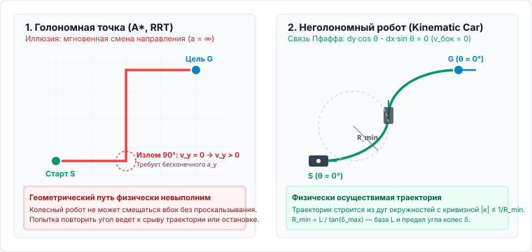
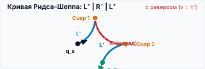
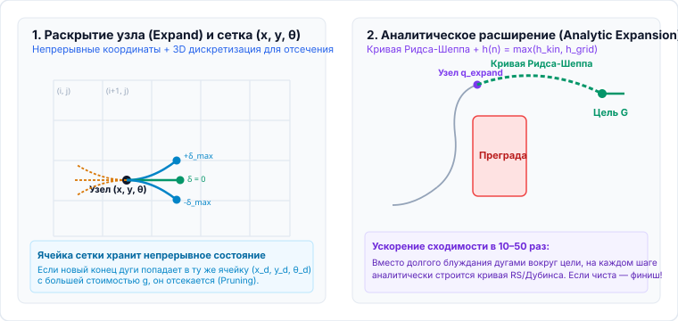
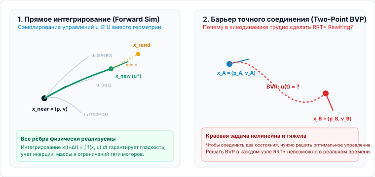
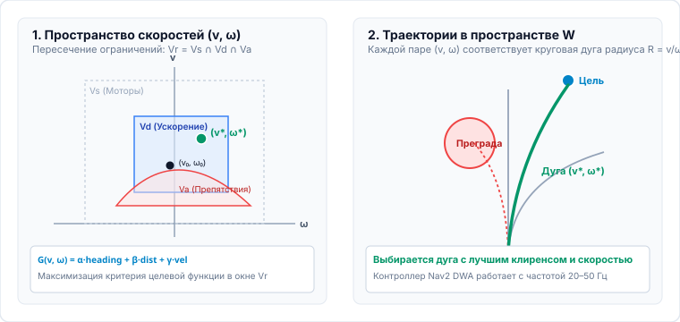
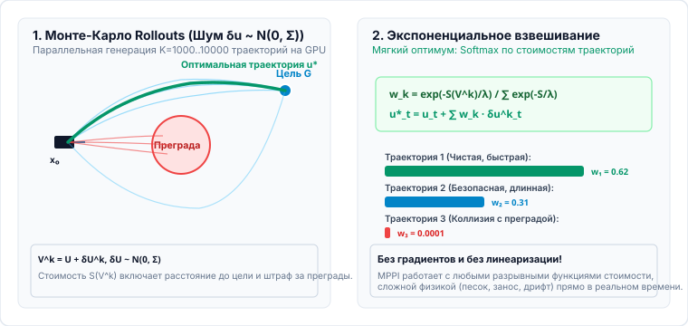

<!-- _class: lead -->
<!-- _header: "" -->
<!-- _footer: "" -->

# **Планирование движений мобильных роботов**
## Лекция 04: Учёт модели объекта: Kinodynamic Planning, DWA и MPPI

⏱️ 90 минут
Кинодинамика и выборочные методы
Hybrid A* • Kinodynamic RRT • DWA • MPPI

---

<!-- _header: "Лекция 04 | Введение и мотивация" -->

## Чему посвящена эта лекция? От геометрии к физике

### 🎯 Разрыв между геометрией и физикой

Раньше мы рассматривали робота как материальную точку, способную мгновенно изменить направление движения под любым углом. Но реальный робот подчиняется <strong>кинематическим и динамическим законам</strong>: автомобиль не может двигаться боком (неголономность), колеса проскальзывают при резких маневрах, а тяжелая платформа не способна затормозить мгновенно из-за сил инерции.

Эта лекция посвящена <strong>планированию с учётом модели объекта (Kinodynamic Planning)</strong>. Мы разберем, почему чисто геометрические подходы оказываются неприменимы на практике, как научить алгоритмы $A^*$ и RRT учитывать кинематические ограничения поворота и пределы ускорений приводов, и как стохастическая оптимизация приводит нас к предиктивному управлению (MPC) через методы DWA и MPPI.

**💡 Результат занятия:** Понимание неголономных ограничений, принципов алгоритмов Hybrid $A^*$ и Kinodynamic RRT, а также практический навык анализа предиктивных регуляторов (DWA, MPPI).

### 🔍 Ключевые вопросы лекции
- Почему стандартные алгоритмы $A^*$ и RRT формируют кинематически и динамически нереализуемые пути для колесных платформ?
- Как модифицировать $A^*$ для поиска в непрерывном пространстве $(x, y, \theta)$ с пространственной фильтрацией состояний (Hybrid $A^*$)?
- Как строить дерево в пространстве состояний через прямое интегрирование уравнений движения (Kinodynamic RRT)?
- В чем заключается фундаментальная сложность двухточечной краевой задачи (Two-Point BVP)?
- Как локальные регуляторы DWA и MPPI оптимизируют управление на скользящем горизонте прогнозирования?

---

## План лекции на 90 минут ⏱️ 90 минут

### Часть 1: Модели и глобальное кинодинамическое планирование (48 мин)
1. **Проблема геометрии:** Неголономность, иллюзия материальной точки.
2. **Иерархия моделей:** Кинематические (Unicycle, Bicycle), кинодинамические и динамические. Сравнительный анализ.
3. **Hybrid $A^*$ и кривые Ридса–Шеппа:** 3D-дискретизация $(x, y, \theta)$, аналитическое решение BVP (Дубинс / Ридс–Шепп), расширение на цель.
4. **Интерактивный симулятор:** Исследование алгоритма Hybrid $A^*$.
5. **Kinodynamic RRT:** Выборка допустимых управлений, фазовая метрика, прямое численное интегрирование (Forward Simulation).
6. **Двухточечная краевая задача (BVP):** Вычислительный барьер точного замыкания состояний и переход к локальному предиктивному управлению (MPC).

### Часть 2: Предиктивные локальные методы (MPC) (42 мин)
7. **Принцип скользящего горизонта (Receding Horizon):** Замкнутый контур управления и прогнозирование.
8. **Dynamic Window Approach (DWA):** Пространство допустимых скоростей $V_r = V_s \cap V_d \cap V_a$, целевая функция $G(v, \omega)$.
9. **Интерактивный симулятор:** Исследование алгоритма DWA.
10. **Model Predictive Path Integral (MPPI):** Стохастическое моделирование ансамбля траекторий на GPU.
11. **Экспоненциальное взвешивание в MPPI:** Информационно-теоретический оператор Softmax и синтез управления.
12. **Интерактивный симулятор:** Исследование алгоритма MPPI.
13. **Сравнительный анализ и выводы:** Сводная матрица методов.

---

<!-- _header: "Лекция 04 | Часть 1: Кинодинамика" -->

## 1. Проблема классических геометрических подходов 02–07 мин

### Иллюзия материальной точки

Геометрические алгоритмы планирования ($A^*$, RRT, PRM) строят кусочно-линейную траекторию в конфигурационном пространстве. Каждое ребро графа — отрезок прямой:
$$\sigma(t) = (1 - t) x_A + t x_B, \quad t \in [0, 1]$$

- В точках излома вектор скорости изменяется скачком: поворот на угол $\Delta \theta \ne 0$ происходит за время $\Delta t = 0$.
- Требуемое центростремительное ускорение стремится к бесконечности:
$$a_n = \lim_{\Delta t \to 0} \frac{v \cdot \Delta \theta}{\Delta t} = \infty$$
- **Физическое противоречие:** Тяговые приводы ограничены по крутящему моменту. При попытке отработки такого пути робот либо сойдет с заданной траектории вследствие динамического заноса (риск аварии), либо будет вынужден совершать полную остановку перед каждой сменой направления.

### Классификация физических ограничений

1. **Голономные ограничения (Геометрические):**
   Ограничения на координаты: $f(q, t) = 0$. Пример: неподвижное препятствие, шарнир манипулятора. Конфигурационное пространство $\mathcal{C}_{free}$ уменьшает размерность.
2. **Неголономные ограничения (Кинематические):**
   Ограничения на скорости, не сводимые к координатам:
   $$A(q) \dot{q} = 0 \quad (\text{неинтегрируемые дифференциальные связи})$$
   Для колесного шасси: боковое проскальзывание равно нулю ($v_{\text{lateral}} = \dot{y}\cos\theta - \dot{x}\sin\theta = 0$).
3. **Динамические ограничения:**
   Пределы по силам, моментам и сцеплению: $|u_i| \le u_{max}$, $F_{\text{fric}} \le \mu m g$.

---

<!-- _header: "Лекция 04 | Кинематический разбор" -->

## Разбор: почему геометрия не работает на колесном шасси 07–10 мин

---

<!-- _header: "Лекция 04 | Иерархия физических моделей" -->

## 2. Иерархия моделей: кинематика, кинодинамика, динамика 10–14 мин

### 1. Кинематические (Скорости)
Описывают геометрию движения **без учета сил и масс**: $\dot{q} = G(q) u$.

- **Одноколесный робот / Unicycle (Дифференциальный привод):**
  $$\dot{x} = v \cos\theta, \quad \dot{y} = v \sin\theta, \quad \dot{\theta} = \omega$$
  Управление: $u = (v, \omega)$. Разворот на месте ($R=0$).
- **Двухколесная модель / Bicycle (Кинематика Аккермана):**
  $$\dot{\theta} = \frac{v}{L} \tan\delta, \quad R_{\min} = \frac{L}{\tan\delta_{\max}}$$
  Управление: $u = (v, \delta)$. Радиус строго ограничен.
- **Всенаправленная платформа (Omnidirectional / Mecanum):** $\dot{x}=v_x, \dot{y}=v_y, \dot{\theta}=\omega$ (голономная система).

### 2. Кинодинамические (Ускорения)
Добавляют к кинематике **ограничения приводов второго порядка**:

- Состояние расширяется скоростями:
  $$x = (p_x, p_y, \theta, v, \omega) \in \mathbb{R}^2 \times S^1 \times \mathbb{R}^2$$
- Управление — ускорения моторов:
  $$u = (a, \alpha) \in \mathbb{R}^2, \quad \dot{v} = a, \quad \dot{\omega} = \alpha$$
- Ограничения приводов:
  $$|a| \le a_{\max}, \quad |\alpha| \le \alpha_{\max}, \quad |v| \le v_{\max}$$
- Учитывается **гарантированный тормозной путь**: $s_{\text{brake}} = \frac{v^2}{2 a_{\text{brake}}}$.

### 3. Динамические (Силы и моменты)
Уравнения движения с учетом **массы, инерции и сил сцепления**:

$$M(q)\ddot{q} + C(q, \dot{q})\dot{q} = B(q)\tau + F_{\text{fric}}$$

- **Управление:** крутящие моменты двигателей $\tau$ (или силы тяги $F$).
- **Круг трения (предел сцепления шин):**
  $$\|F_{\text{contact}}\| \le \mu m g$$
  При превышении предела сцепления колеса переходят в режим заноса и некорректируемого скольжения.
- **Области применения:** Высокие скорости ($> 3$–5 м/с), БПЛА (квадрокоптеры), манипуляторы, транспортировка грузов переменной массы.

---

<!-- _header: "Лекция 04 | Анализ моделей" -->

## Сравнительный анализ моделей мобильных платформ 14–18 мин

| Класс модели | Управление $u$ | Размерность $x$ | Преимущества | Недостатки | Для чего применяется |
| :--- | :--- | :--- | :--- | :--- | :--- |
| **Кинематическая (Unicycle)** | $(v, \omega)$ | 3D $(x, y, \theta)$ | Разворот на месте ($R=0$), минимальная вычислительная сложность | Пренебрежение инерцией, допущение бесконечных ускорений | Складские автономные платформы (AGV), сервисные роботы; маневрирование в тесных помещениях ($v < 1.5$ м/с) |
| **Кинематическая (Bicycle)** | $(v, \delta)$ | 3D $(x, y, \theta)$ | Точное описание шасси с управляемой передней осью | $R_{\min} > 0$, невозможен разворот на месте | Беспилотные автомобили, колесные шасси автомобильного типа; движение и парковка без бокового скольжения |
| **Кинодинамическая** | $(a, \alpha)$ | 5D $(p, \theta, v, \omega)$ | Гладкость профилей скорости класса $C^1$, гарантированный тормозной путь | Увеличение размерности задачи, пренебрежение проскальзыванием колес | Автономные колесные платформы средней скорости; движение с контролем перегрузок и тормозного пути |
| **Динамическая (Лагранж)** | Моменты $\tau$ | 6D–12D | Полный учет массы, инерции, центробежных сил и пределов сцепления | Высокая вычислительная сложность, зависимость от точности знания массы и трения $\mu$ | БПЛА (квадрокоптеры), манипуляторы, перевозка тяжелых грузов, высокоскоростное движение ($v > 5$ м/с) |

**💡 Практическое правило выбора модели:**
- **Кинематика:** Малые скорости ($v < 1.5$ м/с), плотное окружение, пренебрежимо малая инерция платформы.
- **Кинодинамика:** Средние скорости ($v \in [1.5, 5]$ м/с), важна плавность хода, критичен гарантированный тормозной путь.
- **Динамика:** Высокие скорости ($v > 5$ м/с), переменная масса груза, риск скольжения/опрокидывания, 3D-динамика (БПЛА).

**⚠️ Плата за физическую строгость:**
Каждый шаг вверх по иерархии моделей расширяет пространство состояний (3D $\to$ 5D $\to$ 10D). Попытка дискретизировать полное фазовое пространство динамической модели вызывает мгновенный комбинаторный взрыв сетки.

---

<!-- _header: "Лекция 04 | Поиск на графе с кинематикой" -->

## 3. Алгоритм Hybrid $A^*$: синтез непрерывного и дискретного 18–22 мин

### Архитектура Hybrid $A^*$ (Dolgov et al., 2008)

В классическом алгоритме $A^*$ вершины строго привязаны к узлам дискретной координатной сетки. В **Hybrid $A^*$**:
- Состояние робота является **строго непрерывным**: $q = (x, y, \theta) \in \mathbb{R}^2 \times S^1$.
- Раскрытие вершины (генерация потомков) формирует набор **кинематических дуг** фиксированной длины $\Delta s$ для дискретного набора углов поворота передних колес $\delta \in \{-\delta_{\max}, 0, +\delta_{\max}\}$ (при движении вперед и назад).
- Дискретная 3D-сетка $(x_d, y_d, \theta_d)$ используется **исключительно для фильтрации состояний**: если траектория приходит в уже посещенную пространственную ячейку с большей стоимостью пути $g$, она отсекается.

### Двойная допустимая эвристика (Dual Heuristic)

Для обеспечения направленности и допустимости поиска принимается максимум двух эвристических функций:

$$h(q) = \max \left( h_{\text{non-holonomic}}(q), h_{\text{holonomic}}(q) \right)$$

1. $h_{\text{non-holonomic}}$: Точная аналитическая длина пути Ридса-Шеппа (Reeds-Shepp) или Дубинса от текущего состояния $(x, y, \theta)$ до целевого положения без учета препятствий (учитывает кинематику шасси и минимальный радиус поворота $R_{\min}$).
2. $h_{\text{holonomic}}$: Длина кратчайшего пути на двумерной сетке с огибанием препятствий (алгоритм Дейкстры), не учитывающая ориентацию платформы $\theta$.

---

<!-- _header: "Лекция 04 | Аналитическое решение BVP" -->

## Аналитическое BVP: кривые Дубинса и Ридса–Шеппа 22–25 мин

### 1. Кривые Дубинса (Dubins, 1957)
**Движение только вперед ($v > 0$):** оптимальное управление кусочно-постоянно ($u \in \{-1, 0, +1\}$).
- Дуги окружностей ($L, R$) радиуса $R_{\min}$ и прямолинейные отрезки ($S$).
- Ровно **6 канонических слов**: 4 типа $CSC$ ($\{LSL, RSR, LSR, RSL\}$) и 2 типа $CCC$ ($\{LRL, RLR\}$).

### 2. Кривые Ридса–Шеппа (Reeds & Shepp, 1990)
**Движение вперед и назад ($v \in \{-1, +1\}$):** обобщение для систем с реверсом.
- Допускает точки возврата со сменой направления скорости ($|$).
- Кратчайший путь принадлежит одному из **48 канонических слов** (9 базовых семейств).

### 🎯 Роль в Hybrid $A^*$ и решение краевой задачи

В общем случае двухточечная краевая задача (Two-Point BVP) для нелинейных систем требует итерационной численной оптимизации. Для кинематики на плоскости кривые Дубинса и Ридса–Шеппа дают **точное замкнутое аналитическое решение за $< 1$ мкс**!

**Два ключевых применения в Hybrid $A^*$:**
1. **Допустимая эвристика ($h_{\text{non-holonomic}}$):**
   Точная аналитическая длина пути Ридса–Шеппа от $(x, y, \theta)$ до цели $(x_g, y_g, \theta_g)$ в свободном пространстве служит строгой нижней оценкой стоимости в $SE(2)$, направляя поиск с учетом предельного радиуса поворота $R_{\min}$.
2. **Аналитическое расширение (Analytic Expansion):**
   Из каждой раскрываемой вершины вычисляется точная кривая Ридса–Шеппа прямо в целевую позу.
   - Траектория проверяется на отсутствие столкновений с картой препятствий.
   - Если путь свободен — **поиск мгновенно завершается**, обеспечивая аналитически точное попадание в цель с нулевой погрешностью по координатам и углу!

---

<!-- _header: "Лекция 04 | Аналитическое расширение" -->

## Разбор: раскрытие вершин и аналитическое расширение в Hybrid $A^*$ 25–27 мин

---

<!-- _header: "ИНТЕРАКТИВНАЯ ПРАКТИКА | HYBRID A*" -->

## Интерактивный симулятор: Кинематический поиск Hybrid $A^*$ 27–30 мин

<i class="interactive-dot"></i> Исследование Hybrid A*: непрерывные кинематические траектории и фильтрация состояний в 3D-сетке (x, y, θ)
Пошаговое раскрытие вершин «▶ Шаг» | Непрерывный поиск «⚡ Запуск» | Аналитическое расширение (Reeds-Shepp)

<iframe src="http://localhost:5599/widgets/hybrid-astar/index.html" class="interactive-frame"></iframe>

<!-- 
Методические указания лектору:
1. Обратите внимание студентов на ориентацию начального положения S и цели G (векторы направления).
2. Нажмите «▶ Шаг» несколько раз: продемонстрируйте веер кинематических дуг модели автомобиля, формируемых из текущей вершины.
3. Обратите внимание на счетчик Closed (3D): пространственная дискретизация предотвращает комбинаторный взрыв числа состояний.
4. Включите «⚡ Запуск»: как только область поиска приближается к цели, аналитическое расширение (Reeds-Shepp expansion) точно соединяет вершину с целевой позой гладкой кривой.
-->

---

<!-- _header: "Лекция 04 | Выборка в пространстве состояний" -->

## 4. Kinodynamic RRT: Выборка в пространстве управлений 30–35 мин

### Неприменимость прямого геометрического приращения (Steer)

В геометрическом алгоритме RRT шаг приращения вычисляется линейной интерполяцией:
$$x_{new} = x_{near} + \epsilon \frac{x_{rand} - x_{near}}{\|x_{rand} - x_{near}\|}$$

Если вектор состояния включает скорости $x = (p, v) \in \mathcal{X}$, прямое соединение с $x_{rand}$ грубо нарушает дифференциальные уравнения движения $\dot{x} = f(x, u)$.

В **Kinodynamic RRT** (LaValle & Kuffner, 2001) дерево состояний формируется **исключительно путем интегрирования допустимых управлений** $u \in \mathcal{U}$.

### Метод прямого интегрирования (Forward Simulation)

1. Генерируется случайное состояние выборки $x_{rand} = (p_{rand}, v_{rand}) \in \mathcal{X}$.
2. В дереве находится ближайшая вершина $x_{near}$ по фазовой метрике $\operatorname{dist}_{\mathcal{X}}(x_1, x_2)$.
3. Из допустимой области управлений $\mathcal{U}$ формируется выборка кандидатов $u_1, \dots, u_m$ (ускорение $a$, угловая скорость $\omega$).
4. Для каждого варианта уравнения движения численно интегрируются на интервале $\Delta t$:
$$x_i(t + \Delta t) = x_{near} + \int_0^{\Delta t} f(x(\tau), u_i) d\tau$$
5. Выбирается управление $u^*$, минимизирующее расстояние $\operatorname{dist}_{\mathcal{X}}(x_i, x_{rand})$ при условии отсутствия столкновений.

---

<!-- _header: "Лекция 04 | Краевая задача" -->

## Разбор: прямое интегрирование против краевой задачи (BVP) 35–38 мин

---

<!-- _header: "Лекция 04 | Метрика и свойства Kinodynamic RRT" -->

## Метрика фазового пространства и анализ Kinodynamic RRT 38–42 мин

### Проблема метрики расстояния в $\mathcal{X}$

В фазовом пространстве $x = (p_x, p_y, \theta, v, \omega)$ **евклидова метрика некорректна**:
$$\sqrt{\Delta x^2 + \Delta y^2 + \Delta \theta^2 + \Delta v^2} \quad \text{— суммирование метров, радианов и м/с!}$$

- **Кинематическая и динамическая недостижимость:** Точка, расположенная в $0.5$ м позади робота, движущегося вперед со скоростью $5$ м/с, геометрически близка, но динамически требует полного торможения, разворота и нескольких секунд маневрирования.
- **Корректный подход:** Взвешенная квадратичная метрика $\Delta x^T Q \Delta x$ либо функция времени достижения (Time-to-Reach) на основе линеаризованного регулятора LQR.

**✅ Преимущества Kinodynamic RRT:**
- **Принцип «черного ящика» (Black-Box):** Не требуется аналитическая обратимость уравнений движения. Алгоритм совместим с любым физическим симулятором (Bullet, MuJoCo).
- **Физическая реализуемость:** Каждая траектория дерева представляет собой результат интегрирования реальных управляющих воздействий и не требует последующего сглаживания.
- **Сложные динамические режимы:** Способность находить нетривиальные маневры раскачки (swing-up) неустойчивых систем и управляемого скольжения.

**❌ Ограничения Kinodynamic RRT:**
- **Барьер краевой задачи (Two-Point BVP):** Невозможность аналитического локального замыкания траектории исключает процедуру переподключения вершин (Rewiring) $\implies$ отсутствие асимптотической оптимальности (RRT*).
- **Проклятие размерности:** В фазовом пространстве высокой размерности (5D–6D) требуется на порядки большее число точек выборки для адекватного покрытия объема.
- **Искажение свойства расширения областей Вороного (Voronoi Bias):** Ограниченность допустимых управлений $u \in \mathcal{U}$ не позволяет дереву свободно расти в произвольных направлениях, замедляя поиск.

---

<!-- _header: "ИНТЕРАКТИВНАЯ ПРАКТИКА | KINODYNAMIC RRT" -->

## Интерактивный симулятор: Kinodynamic RRT 42–46 мин

<i class="interactive-dot"></i> Исследование Kinodynamic RRT: построение дерева траекторий на основе динамической модели платформы (a, ω)
Нажмите «▶ Шаг» для просмотра пробных траекторий | «⚡ Запуск» для непрерывного поиска | Перетаскивайте S и G

<iframe src="http://localhost:5599/widgets/kinodynamic-rrt/index.html" class="interactive-frame"></iframe>

<!-- 
Методические указания лектору:
1. Нажмите «▶ Шаг»: продемонстрируйте пунктирные траектории — варианты управляющих воздействий u_i, прогнозируемые вперед во времени из x_near.
2. Обратите внимание аудитории, что ребра дерева представляют собой плавные динамические траектории с учетом инерции.
3. Включите «⚡ Запуск»: покажите, как дерево огибает препятствия по физически реализуемым траекториям.
-->

---

<!-- _header: "Лекция 04 | Проблема краевой задачи" -->

## 5. Почему глобальная кинодинамика уступает место предиктивному управлению? 46–50 мин

### Вычислительная сложность двухточечной краевой задачи (Two-Point BVP)

Для работы алгоритмов асимптотической оптимизации класса RRT* необходима процедура локального переподключения вершин (**Rewiring**).
Она требует точного решения двухточечной краевой задачи оптимального управления:
$$\min_{u(t)} \int_0^T L(x, u) dt \quad \text{при} \quad \dot{x} = f(x, u), \quad x(0) = x_A, \quad x(T) = x_B$$

- Для линейных систем без препятствий точное аналитическое решение находится методами LQR или принципа максимума Понтрягина (ПМП) за доли миллисекунды.
- Для нелинейных систем в среде с препятствиями это NP-трудная задача нелинейного программирования (NLP).
- Решение тысяч подобных оптимизационных подзадач на каждом шаге расширения графа вычислительно неосуществимо в реальном времени.

### Иерархический подход в практических системах навигации

Вместо попытки построить единую глобальную траекторию с исчерпывающим учетом динамики приводов на всем маршруте применяется двухуровневая архитектура:
1. **Глобальный уровень:** формирует допустимый геометрический или кинематический опорный путь (Hybrid $A^*$ / RRT*).
2. **Локальный предиктивный уровень (MPC):** решает задачу оптимизации управления на **коротком горизонте прогнозирования (1–3 с)** с высокой частотой (20–60 Гц), непрерывно парируя модельные погрешности и внешние возмущения.

Далее рассмотрим методы локального предиктивного управления: **DWA** и **MPPI**.

---

<!-- _header: "Лекция 04 | Часть 2: Локальное предиктивное планирование" -->

## 6. Принципы предиктивного управления (Model Predictive Control, MPC) 50–55 мин

### Принцип скользящего горизонта (Receding Horizon)

В предиктивном управлении на каждом такте дискретного времени $t_k$:
1. Оценивается действительное состояние робота $x(t_k)$ (по данным одометрии, ИНС, алгоритмов SLAM).
2. На горизонте $H$ шагов вперед прогнозируется поведение системы под действием последовательности управлений:
$$U = \{ u_0, u_1, \dots, u_{H-1} \}$$
3. Численными методами или выборочной оптимизацией минимизируется критерий качества $J(U)$.
4. **Принцип замкнутого цикла:** На исполнительные приводы подается **только первое управляющее воздействие** $u_0^*$.
5. На следующем такте $t_{k+1}$ горизонт сдвигается на один шаг вперед, и процедура оптимизации повторяется.

### Преимущества предиктивного управления в робототехнике

- **Компенсация неточностей модели:** Реальный объект неизбежно отличается от идеализированной математической модели (проскальзывание колес, микропрофиль поверхности, люфты в редукторах). Замкнутая обратная связь на частоте 30–60 Гц непрерывно компенсирует накопление ошибок прогноза.
- **Реакция на динамические препятствия:** При внезапном появлении препятствия в рабочей зоне пересчет на очередном такте позволяет регулятору мгновенно сформировать траекторию безопасного уклонения.
- **Прямой учет физических ограничений:** Пределы по скоростям, ускорениям и тяговым усилиям непосредственно закладываются в ограничения оптимизационной задачи.

---

<!-- _header: "Лекция 04 | Метод динамического окна" -->

## 7. Метод динамического окна (Dynamic Window Approach, DWA) 55–60 мин

### Концепция метода DWA (Fox, Burgard, Thrun, 1997)

Для мобильного робота с дифференциальным приводом вектор управления на элементарном интервале времени представляется парой скоростей:
$$u = (v, \omega) \in \mathbb{R}^2 \quad (\text{линейная и угловая скорости})$$

При постоянных $v$ и $\omega$ на интервале прогнозирования $\Delta t$ траектория движения представляет собой **круговую дугу** радиуса $R = v / \omega$.

Вместо поиска в конфигурационном пространстве метод DWA выполняет **дискретную оптимизацию в пространстве допустимых скоростей $(v, \omega)$**.

### Множество допустимых скоростей: динамическое окно $V_r$

$$V_r = V_s \cap V_d \cap V_a$$

1. **Конструктивно допустимые скорости $V_s$:**
   $$V_s = [v_{\min}, v_{\max}] \times [-\omega_{\max}, \omega_{\max}]$$
2. **Динамически достижимые скорости $V_d$ (пределы по ускорению приводов):**
   $$V_d = [v_c - a \Delta t, v_c + a \Delta t] \times [\omega_c - \alpha \Delta t, \omega_c + \alpha \Delta t]$$
3. **Безопасные скорости $V_a$ (гарантия безаварийной остановки):**
   Множество скоростей, при которых расчетный тормозной путь меньше расстояния до препятствия на дуге:
   $$v \le \sqrt{2 \cdot \operatorname{dist}(v, \omega) \cdot a_{\text{brake}}}$$

---

<!-- _header: "Лекция 04 | Целевая функция DWA" -->

## Целевая функция DWA: поиск оптимума на сетке 60–63 мин

Для каждой допустимой пары $(v, \omega) \in V_r$ моделируется круговая дуга и вычисляется взвешенная целевая функция:

$$G(v, \omega) = \alpha \cdot \operatorname{heading}(v, \omega) + \beta \cdot \operatorname{dist}(v, \omega) + \gamma \cdot \operatorname{velocity}(v, \omega)$$

- $\operatorname{heading}(v, \omega) = \pi - |\theta_{\text{goal}} - \theta_{\text{end}}|$: Курсовой показатель — ориентация продольной оси робота в конечной точке дуги на промежуточную целевую точку.
- $\operatorname{dist}(v, \omega)$: Клиренс безопасности — кратчайшее расстояние от точек траектории до препятствий.
- $\operatorname{velocity}(v, \omega) = v$: Скоростной компонент — поощрение поддержания высокой маршевой скорости.

<strong>Вычислительная эффективность:</strong> Анализ дискретной сетки из $15 \times 20 = 300$ пар скоростей требует менее 1–2 мс процессорного времени, благодаря чему алгоритм DWA долгое время являлся базовым локальным регулятором в стеке ROS Navigation (Nav1).

---

<!-- _header: "Лекция 04 | Пространство скоростей DWA" -->

## Разбор: динамическое окно $V_r$ и семейство дуг в пространстве 63–66 мин

---

<!-- _header: "ИНТЕРАКТИВНАЯ ПРАКТИКА | DWA" -->

## Интерактивный симулятор: Локальный регулятор DWA 66–70 мин

<i class="interactive-dot"></i> Исследование DWA: траектории прогнозирования в декартовом пространстве и окно скоростей Vr = Vs ∩ Vd ∩ Va
Перемещайте робота или препятствия | Наблюдайте смещение динамического окна Vd в панели скоростей | Запустите режим «⚡ Запуск»

<iframe src="http://localhost:5599/widgets/dwa-planner/index.html" class="interactive-frame"></iframe>

<!-- 
Методические указания лектору:
1. Обратите внимание на информационную панель «Окно скоростей» в правом нижнем углу: серая область — Vs, синий прямоугольник — динамическое окно Vd вокруг текущей рабочей точки (черный маркер).
2. Зеленый маркер на панели — оптимальная пара скоростей (v*, ω*), которой соответствует выделенная зеленая дуга в декартовом пространстве.
3. Переместите препятствие ближе к роботу: покажите, как траектории с риском столкновения отсекаются, а множество Va ограничивает предельно допустимую скорость движения.
4. Нажмите «⚡ Запуск»: продемонстрируйте динамическое маневрирование робота вдоль опорного маршрута с частотой пересчета 30–40 Гц.
-->

---

<!-- _header: "Лекция 04 | Стохастическое предиктивное управление" -->

## 8. Стохастический метод MPPI (Model Predictive Path Integral) 70–75 мин

### Область применимости DWA и предпосылки метода MPPI

Алгоритм DWA эффективен для колесных платформ при умеренных скоростях ($< 1.5$ м/с), однако теряет работоспособность в следующих условиях:
- Высокоскоростное движение с выраженным боковым скольжением и риском потери сцепления колес с поверхностью.
- Динамические модели высокой размерности (БПЛА, шагающие роботы, манипуляционные комплексы).
- Необходимость планирования маневров на протяженном горизонте (3–5 с) с непрерывно изменяющимся профилем ускорений.

**MPPI (Williams, Aldrich, Theodorou, 2015)** — современный алгоритм стохастического предиктивного управления, основанный на теоретико-информационном исчислении траекторных интегралов (Information-Theoretic MPC).

### Ансамбль стохастических прогнозных траекторий (Rollouts)

В отличие от кусочно-постоянных управлений DWA, алгоритм MPPI оптимизирует **полную временную последовательность управлений на горизонте $H$**:
$$U = (u_0, u_1, \dots, u_{H-1})$$

1. Вокруг опорной последовательности $U$ формируется ансамбль из $K$ возмущенных последовательностей управлений ($K = 1\,000 \dots 10\,000$):
   $$V^k = U + \delta U^k, \quad \delta u_t^k \sim \mathcal{N}(0, \Sigma)$$
2. Все $K$ вариантов **параллельно интегрируются вперед во времени** с использованием полной нелинейной модели динамики: $x_{t+1} = f(x_t, v_t^k)$.
3. Для каждой смоделированной траектории вычисляется накопленный функционал потерь $S(V^k)$.

---

<!-- _header: "Лекция 04 | Экспоненциальное взвешивание MPPI" -->

## Экспоненциальное взвешивание в MPPI 75–79 мин

Фундаментальное свойство MPPI — **отказ от вычисления градиентов целевой функции и от выбора единственной траектории**. Вместо этого оптимальное управление синтезируется как экспоненциально взвешенное математическое ожидание по ансамблю (оператор Softmax):

$$w_k = \frac{\exp\left(-\frac{1}{\lambda} \left(S(V^k) - S_{\min}\right)\right)}{\sum_{j=1}^K \exp\left(-\frac{1}{\lambda} \left(S(V^j) - S_{\min}\right)\right)}, \qquad u_t^* = u_t + \sum_{k=1}^K w_k \delta u_t^k$$

- **Параметр температуры $\lambda$:** Определяет баланс между селективным выбором ($\lambda \to 0$, доминирование единственной наилучшей траектории) и диффузным усреднением ($\lambda \to \infty$, равнозначный учет всех возмущений).
- **Вычитание минимальной стоимости $S_{\min}$:** Предотвращает арифметическое переполнение разрядной сетки при вычислении экспонент (вычислительный прием Log-Sum-Exp).
- Траектории, пересекающие зоны препятствий, получают большой штраф $S \gg 0$, вследствие чего их относительный вес $w_k \to 0$.
- **Параллельная архитектура:** Численное моделирование тысяч независимых траекторий эффективно выполняется на графических процессорах (GPU) в современных системах (NVIDIA Isaac Sim, фреймворк cuRobo, модуль Nav2 `mppi_controller`).

---

<!-- _header: "Лекция 04 | Разбор MPPI" -->

## Разбор: параллельное прогнозирование траекторий и расчет весов в MPPI 79–82 мин

---

<!-- _header: "ИНТЕРАКТИВНАЯ ПРАКТИКА | MPPI" -->

## Интерактивный симулятор: Стохастический регулятор MPPI 82–86 мин

<i class="interactive-dot"></i> Исследование MPPI: 150 параллельных прогнозных траекторий и взвешенное оптимальное управление E[U]
Кликните «⚡ Live MPPI» | Изменяйте температуру λ и дисперсию шума σ | Перемещайте препятствия на пути робота

<iframe src="http://localhost:5599/widgets/mppi-planner/index.html" class="interactive-frame"></iframe>

<!-- 
Методические указания лектору:
1. Запустите режим «⚡ Live MPPI»: продемонстрируйте пучок стохастических прогнозных траекторий, распространяющихся от текущего положения робота.
2. Зеленая линия — результирующее взвешенное управление E[U]. На приводы робота подается первое управляющее воздействие этой последовательности.
3. Переместите препятствие в зону прогноза: покажите, как пересекающие преграду траектории окрашиваются в красный цвет, их веса обнуляются, а результирующая траектория плавно огибает препятствие без рывков.
4. Измените параметр «Температура λ»: продемонстрируйте, что при малых λ регулятор выбирает единичную лучшую траекторию (агрессивное управление), а при больших λ — консервативно усредняет допустимые варианты.
-->

---

<!-- _header: "Лекция 04 | Сравнительный анализ" -->

## Сравнительный анализ кинодинамических методов 86–88 мин

| Критерий | Геометрический RRT/A* | Hybrid A* | Kinodynamic RRT | DWA | MPPI |
| :--- | :--- | :--- | :--- | :--- | :--- |
| **Пространство поиска** | $\mathcal{C}_{\text{space}} \subset \mathbb{R}^2$ | $(x, y, \theta) \in SE(2)$ | $(p, v) \in \mathcal{X}$ | $(v, \omega) \in \mathbb{R}^2$ | Ансамбль траекторий $U \in \mathbb{R}^{m \times H}$ |
| **Учет модели объекта** | ❌ Отсутствует | Кинематика (дуги) | Динамика ($\dot{x}=f(x,u)$) | Кинематика и ускорения | Произвольная нелинейная динамика |
| **Горизонт планирования** | Глобальный | Глобальный | Глобальный | Скользящий (1–2 с) | Скользящий (2–5 с) |
| **Частота расчета** | Однократно / 1 Гц | 1–5 Гц | 0.5–2 Гц | 20–50 Гц | 40–100 Гц (на GPU) |
| **Реализуемость траектории** | ❌ Требует сглаживания | ✅ Гладкость класса $C^1$ | ✅ Полное соответствие физике | ✅ Гарантия остановки | ✅ Высокая динамическая точность |
| **Вычислительная сложность** | Низкая | Умеренная (3D-сетка) | Высокая (интегрирование) | Низкая (сетка скоростей) | Высокая (требует GPU) |

---

<!-- _class: accent -->
<!-- _header: "Лекция 04 | Итоги и вопросы" -->

## Резюме лекции и контрольные вопросы 88–90 мин

### Главные выводы:

- **Геометрические пути** физически нереализуемы на реальных колесных шасси без остановок на изломах из-за неголономных связей ($\dot{y}\cos\theta - \dot{x}\sin\theta = 0$) и сил инерции.
- **Hybrid $A^*$** объединяет непрерывные кинематические траектории с пространственной фильтрацией состояний в 3D-сетке $(x, y, \theta)$, аналитическим расширением (Reeds-Shepp) и двойной эвристикой.
- **Kinodynamic RRT** наращивает дерево допустимых состояний через прямое интегрирование уравнений движения под действием допустимых управлений, исключая необходимость решения сложной двухточечной краевой задачи (BVP).
- **DWA** выполняет дискретную оптимизацию в пространстве скоростей с учетом ограничений приводов по ускорению и гарантированного безаварийного торможения ($V_r = V_s \cap V_d \cap V_a$).
- **MPPI** реализует параллельное стохастическое прогнозирование тысяч нелинейных траекторий на GPU с вычислением оптимального управления через экспоненциальное взвешивание без градиентных процедур.

### Контрольные вопросы для самопроверки:

- Какое центростремительное ускорение теоретически требуется для отработки излома траектории под углом 90° при постоянной скорости, и к какому поведению реального робота приводит попытка отработки такого плана?
- С какой целью в алгоритме Hybrid $A^*$ используется дискретная 3D-сетка, если координаты состояния робота непрерывны?
- В чем заключается фундаментальная математическая сложность реализации процедуры переподключения вершин (Rewiring) в кинодинамических версиях алгоритма RRT*?
- Из каких физических условий формируется граница множества допустимых скоростей $V_a$ в методе динамического окна (DWA)?
- Каким образом параметр температуры $\lambda$ в алгоритме MPPI влияет на баланс между селективной оптимизацией и диффузным усреднением траекторий?

Следующая лекция: Оптимальное управление (ПМП, LQR, Прямая коллокация)

