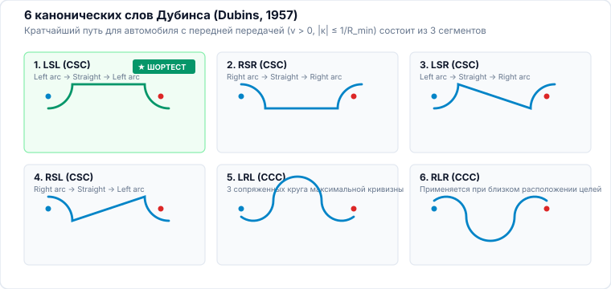
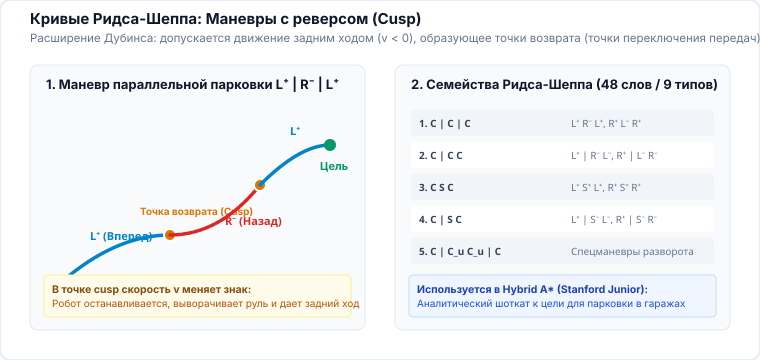

<!-- _class: lead -->
<!-- _header: "" -->
<!-- _footer: "" -->

# **Планирование движений мобильных роботов**
## Лекция 05: Оптимальное управление: от принципа максимума к численным решателям

⏱️ 90 минут
Теория оптимального управления
LaValle (гл. 15) • Pontryagin • Bellman • LQR • Direct Collocation

---

<!-- _header: "Лекция 05 | Введение и мотивация" -->

## Чему посвящена эта лекция? Оптимальное управление

### 🎯 От геометрии к силам, энергиям и времени

Геометрический путь $\sigma(s)$ указывает, <em>куда</em> ехать, но ничего не говорит о том, <em>с какими ускорениями</em>, <em>напряжениями на моторах</em> и <em>минимальным временем</em> робот способен его преодолеть без заноса.

Эта лекция посвящена <strong>теории оптимального управления (Optimal Control)</strong>: как превратить абстрактную задачу движения в строгую оптимизацию функционала качества $J(u)$ с учетом дифференциальной физики $\dot{x} = f(x, u)$ и ограничений приводов.

**💡 Результат занятия:** Формулировать задачи оптимального управления в форме Лагранжа и Больца, находить аналитические кратчайшие пути с ограниченным радиусом кривизны (кривые Дубинса), проектировать оптимальные LQR/TVLQR регуляторы для мобильных роботов и транскрибировать траектории методом прямой коллокации.

### 🔍 Ключевые вопросы лекции

- <strong>Математический базис:</strong> Принцип максимума Понтрягина (ПМП), Гамильтониан $H$ и сопряженные переменные $\lambda(t)$.
- <strong>Аналитические экстремали:</strong> Почему повороты на пределе сцепления порождают Bang-Bang управление и кривые <strong>Дубинса и Ридса-Шеппа</strong>?
- <strong>Динамическое программирование:</strong> Уравнение Гамильтона–Якоби–Беллмана (HJB) и линейно-квадратичный регулятор (<strong>LQR</strong>).
- <strong>Численная транскрипция:</strong> Почему прямая стрельба (Shooting) нестабильна и как <strong>Direct Collocation</strong> решает задачу через разреженные NLP?
- <strong>Стабилизация:</strong> Отслеживание траектории через нестационарный <strong>TVLQR</strong>.

---

<!-- _header: "Лекция 05 | Структура занятия" -->

## План лекции на 90 минут ⏱️ 90 минут

### Часть 1: Аналитическая теория (45 мин)

- <strong>00–12 мин:</strong> Постановка задачи Больца: состояние $x \in \mathcal{X}$, управление $u \in \mathcal{U}$, интегрант потерь $L(x, u)$ и терминальные затраты $\Phi(x_T)$.
- <strong>12–25 мин:</strong> Принцип максимума Понтрягина (ПМП): функция Гамильтона $H(x, u, \lambda)$, сопряженная система $\dot{\lambda} = -\nabla_x H$.
- <strong>25–35 мин:</strong> Релейное управление (Bang-Bang Control): функция переключения и задачи быстродействия.
- <strong>35–45 мин:</strong> Аналитические экстремали для колесных систем: кривые Дубинса (LSL, RSR, LSR...) и Ридса-Шеппа (реверс).

### Часть 2: Численная оптимизация и слежение (45 мин)

- <strong>45–60 мин:</strong> Принцип оптимальности Беллмана, уравнение HJB и вывод LQR (алгебраическое уравнение Риккати CARE).
- <strong>60–72 мин:</strong> Численная оптимизация траекторий: Single/Multiple Shooting vs <strong>Direct Collocation (Эрмит–Симпсон)</strong>. Разреженные NLP (IPOPT).
- <strong>72–82 мин:</strong> Практика слежения за траекторией: линеаризация шасси и нестационарный регулятор <strong>TVLQR</strong>.
- <strong>82–90 мин:</strong> Сравнение аналитики и численных солверов, контрольные вопросы и Q&A.

<!--
Примечание для лектора:
Лекция соединяет золотой классический фонд советской и мировой математики (Понтрягин, Беллман) с современной вычислительной робототехникой (разреженные нелинейные программы и Direct Collocation на базе IPOPT).
-->
---

## 1. Постановка задачи оптимального управления 00–12 мин

В отличие от чисто геометрического пути, в оптимальном управлении мы ищем непрерывную функцию управления $u(t)$ и порождаемую траекторию состояния $x(t)$:

$$\min_{u(t) \in \mathcal{U}} J = \int_{0}^{T} L(x(t), u(t)) \, dt + \Phi(x(T))$$

$$\text{при ограничениях:} \quad \dot{x}(t) = f(x(t), u(t)), \quad x(0) = x_0$$

$$g(x(t), u(t)) \le 0, \quad \psi(x(T)) = 0$$

### Компоненты функционала Больца:

- $L(x, u)$ — текущие затраты (Running Cost / Lagrangian): расход энергии моторов $\int u^2 dt$, квадрат ошибки слежения $\|x - x_{ref}\|^2$, штраф за время.
- $\Phi(x(T))$ — терминальные затраты (Terminal Cost): точность достижения целевой точки $q_{goal}$ в момент $T$.
- $\dot{x} = f(x, u)$ — уравнения движения (неголономная кинематика или динамика шасси).
- $g(x, u) \le 0$ — ограничения на угол поворота колес $|\delta| \le \delta_{max}$, токи моторов, стены коридора.

---

## 2. Принцип максимума Понтрягина (ПМП) 12–25 мин

Для оптимизации вводится <strong>функция Гамильтона (Гамильтониан)</strong> с вектором сопряженных переменных $\lambda(t) \in \mathbb{R}^n$ (множители Лагранжа к динамике):

$$H(x, u, \lambda) = L(x, u) + \lambda^T f(x, u)$$

<strong>Физический смысл $\lambda(t)$ (Costate):</strong> сопряженная переменная показывает чувствительность минимальной стоимости к возмущению состояния: $\lambda(t) = \nabla_x J^*(x, t)$.

### Необходимые условия экстремума (ПМП):

- <strong>Уравнения состояния:</strong> $\dot{x}(t) = \frac{\partial H}{\partial \lambda} = f(x(t), u(t))$.
- <strong>Сопряженная система:</strong> $\dot{\lambda}(t) = -\frac{\partial H}{\partial x} = -\frac{\partial L}{\partial x} - \left(\frac{\partial f}{\partial x}\right)^T \lambda(t)$.
- <strong>Условие минимума по управлению:</strong> оптимальное управление в каждый момент времени доставляет абсолютный минимум Гамильтониану:
$$u^*(t) = \arg\min_{u \in \mathcal{U}} H(x^*(t), u, \lambda^*(t))$$

- <strong>Условие трансверсальности:</strong> $\lambda(T) = \nabla_x \Phi(x(T))$.

---

## 3. Релейное управление (Bang-Bang Control) 25–35 мин

### Линейность по управлению (Control-Affine Systems):

В большинстве мобильных роботов управление входит линейно: $\dot{x} = f_0(x) + f_1(x) u$, а цель — минимизация времени $L(x, u) = 1$ при $|u| \le u_{max}$.

Тогда Гамильтониан имеет вид:

$$H = 1 + \lambda^T f_0(x) + \underbrace{\left(\lambda^T f_1(x)\right)}_{\sigma(t)} u$$

где $\sigma(t) = \lambda(t)^T f_1(x(t))$ называется <strong>функцией переключения (Switching Function)</strong>.

### Релейный закон оптимального управления:

Чтобы минимизировать $H$, управление должно мгновенно принимать экстремальные граничные значения в зависимости от знака $\sigma(t)$:

$$u^*(t) = -u_{max} \operatorname{sign}(\sigma(t)) = \begin{cases} +u_{max}, & \sigma(t) < 0 \\ -u_{max}, & \sigma(t) > 0 \end{cases}$$

<strong>Вывод быстродействия:</strong> Самое быстрое перемещение робота — это всегда <em>предельный разгон</em> на максимум тяги с последующим <em>предельным торможением</em> «в пол» (Bang-Bang маневр).

---

## 4. Кривые Дубинса и Ридса-Шеппа (LaValle гл. 15) 35–48 мин

### Автомобиль Дубинса (Dubins, 1957):

Модель движения только вперед ($v = 1$) с ограниченной кривизной $|\dot{\theta}| \le u_{max} = 1/\rho_{min}$:

$$\dot{x} = \cos\theta, \quad \dot{y} = \sin\theta, \quad \dot{\theta} = u, \quad u \in [-u_{max}, u_{max}]$$

Из ПМП доказано (Sussmann & Tang 1991): кратчайший путь между любыми двумя позами $(x, y, \theta)$ состоит ровно из <strong>3 сегментов</strong> из набора $\{L, R, S\}$:

- <strong>Круговой поворот влево $L$:</strong> $u = +u_{max}$ (дуга окружности).
- <strong>Круговой поворот вправо $R$:</strong> $u = -u_{max}$ (дуга окружности).
- <strong>Прямолинейный отрезок $S$:</strong> $u = 0$ (прямая линия).

Существует ровно 6 оптимальных семейств: <strong>$LSL, RSR, LSR, RSL, LRL, RLR$</strong>.

### Кривые Ридса-Шеппа (Reeds & Shepp, 1990):

Разрешено движение вперед и назад: $v \in \{-1, +1\}$.

- Оптимальные слова содержат смену направления (Cusp): $L^+ S^- R^+$.
- Всего выделено <strong>46 оптимальных комбинаций</strong> в 9 семействах.
- Используются в парковочных автопилотах и складских AGV.

$$\text{Слова RS: } \{ C|C|C, \;\; CC|C, \;\; CSC, \;\; C|CSC, \dots \}$$

<strong>Применение:</strong> Аналитический вызов функции Дубинса/Ридса-Шеппа работает за <strong>$< 1$ микросекунды</strong> и служит идеальным локальным планировщиком для RRT* и Hybrid $A^*$.

---

## Разбор: одна пара поз — шесть кандидатов, один минимум 40–44 мин

---

## Что добавляет задний ход: точки возврата 44–48 мин

---

## 5. Динамическое программирование и LQR 48–60 мин

### Уравнение Гамильтона–Якоби–Беллмана (HJB):

Функция оптимальных затрат (Value function) $V(x, t) = \min_u \int_t^T L dt + \Phi$ удовлетворяет дифференциальному уравнению в частных производных:

$$-\frac{\partial V}{\partial t} = \min_{u \in \mathcal{U}} \left( L(x, u) + \nabla_x V(x, t)^T f(x, u) \right)$$

Для бесконечного горизонта $\partial V / \partial t = 0$.

### Линейно-квадратичный регулятор (LQR):

Для линейной системы $\dot{x} = A x + B u$ и квадратичного функционала $L = x^T Q x + u^T R u$ решение HJB ищется в виде $V(x) = x^T P x$:

$$A^T P + P A - P B R^{-1} B^T P + Q = 0 \quad \text{(CARE)}$$

Решив матричное алгебраическое уравнение Риккати относительно матрицы $P \succ 0$, получаем <strong>оптимальную линейную обратную связь</strong>:

$$u^*(t) = -K x(t), \quad K = R^{-1} B^T P$$

---

## 6. Численная оптимизация: Shooting vs Direct Collocation 60–72 мин

### Прямая стрельба (Single Shooting):

Оптимизируются только управляющие воздействия $u_0, u_1, \dots, u_{N-1}$. Состояния $x_k$ вычисляются прямым интегрированием вперед.

- <strong>Плюс:</strong> малое число оптимизационных переменных ($m \times N$).
- <strong>Минус:</strong> крайняя неустойчивость: малое изменение $u_0$ вызывает экспоненциальное отклонение $x_N$ в конце траектории. Градиенты в нелинейных системах «взрываются».

### Прямая коллокация (Direct Collocation):

И состояния $x_k$, и управления $u_k$ объявляются переменными оптимизации в узлах сетки (Метод Эрмита–Симпсона):

$$\dot{x}_{col} = f\left(x_{k+1/2}, u_{k+1/2}\right) = \frac{x_{k+1} - x_k}{\Delta t_k}$$

- <strong>Плюс:</strong> динамика системы формулируется как локальные алгебраические равенства.
- <strong>Ключевое свойство:</strong> Якобиан и Гессиан задачи имеют <strong>блочно-диагональную разреженную структуру</strong>!
- Решается за десятки миллисекунд методами внутренней точки (Interior Point, солвер <code>IPOPT</code>).

---

## 7. Слежение за траекторией: Time-Varying LQR (TVLQR) 72–82 мин

### Линеаризация вдоль опорной траектории:

Пусть Direct Collocation вернул номинальную пару $\left(x_{nom}(t), u_{nom}(t)\right)$. Определим отклонения (ошибки слежения):

$$\delta x(t) = x(t) - x_{nom}(t), \quad \delta u(t) = u(t) - u_{nom}(t)$$

Линеаризованная динамика в отклонениях становится нестационарной:

$$\delta \dot{x}(t) = A(t) \delta x(t) + B(t) \delta u(t)$$
$$A(t) = \left.\frac{\partial f}{\partial x}\right|_{(x_{nom}, u_{nom})}, \quad B(t) = \left.\frac{\partial f}{\partial u}\right|_{(x_{nom}, u_{nom})}$$

### Дифференциальное уравнение Риккати (DRE):

Интегрируется <em>назад во времени</em> от $t = T$ до $t = 0$ с условием $P(T) = Q_f$:

$$-\dot{P}(t) = A^T(t) P(t) + P(t) A(t) - P(t) B(t) R^{-1} B^T(t) P(t) + Q$$

Результирующее управление на борту мобильного робота:

$$u^*(t) = u_{nom}(t) - K(t) \left(x(t) - x_{nom}(t)\right)$$

<strong>Гарантия:</strong> TVLQR обеспечивает локальную асимптотическую устойчивость и удерживает шасси в безопасной трубке вокруг траектории даже при возмущениях.

---

<!-- _class: accent -->
<!-- _header: "Лекция 05 | Итоги и вопросы" -->

## Резюме лекции и контрольные вопросы 82–90 мин

### Главные выводы:

- <strong>Оптимальное управление</strong> минимизирует функционал потерь $J$ при строгом соблюдении дифференциальных ограничений робота $\dot{x} = f(x, u)$.
- <strong>ПМП Понтрягина</strong> связывает динамику состояния с сопряженной системой через Гамильтониан $H$.
- <strong>Кривые Дубинса и Ридса-Шеппа</strong> представляют аналитическое решение задачи быстродействия для колесного шасси.
- <strong>Direct Collocation</strong> транскрибирует непрерывную задачу в разреженную NLP, решаемую солвером IPOPT.
- <strong>TVLQR</strong> стабилизирует движение вокруг найденной оптимальной траектории.

### Контрольные вопросы для самопроверки:

- Какой физический смысл имеют сопряженные переменные $\lambda(t)$ в принципе максимума Понтрягина?
- Почему в задаче быстродействия с линейным входом управление всегда является кусочно-постоянным (Bang-Bang)?
- Почему кривая Дубинса не всегда является кратчайшим путем, если роботу разрешено сдавать назад?
- В чем фундаментальное преимущество Direct Collocation перед Single Shooting при численной оптимизации нелинейных траекторий?

Следующая лекция: Предиктивное управление (Model Predictive Control — MPC)

