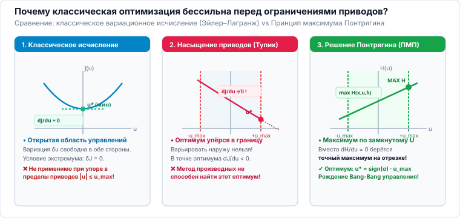
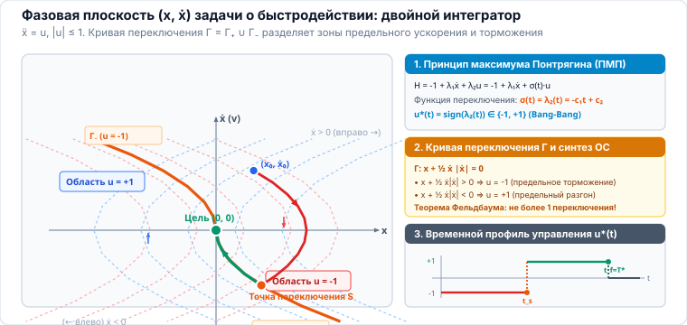
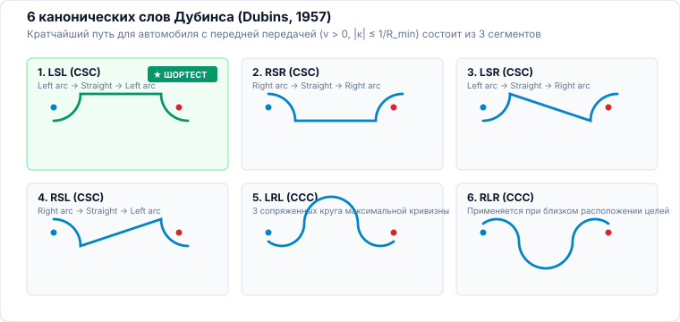

<!-- _class: lead -->
<!-- _header: "" -->
<!-- _footer: "" -->

# **Планирование движений мобильных роботов**
## Лекция 05: Оптимальное управление: от физики моторов к принципу Понтрягина и Bang-Bang

⏱️ 90 минут
Фундаментальные основы
Оптимизация • ПМП • Релейное управление • Фазовая плоскость

---

<!-- _header: "Лекция 05 | Мотивация и введение" -->

## От алгоритмов поиска к математической оптимизации 02–06 мин

### 🤖 Эвристические и выборочные методы

В предыдущих разделах курса движение робота формировалось процедурными методами:
- **Дискретный сеточный поиск ($A^*$, Дейкстра):** дискретизация конфигурационного пространства и поиск кратчайшего пути на графе.
- **Методы случайной выборки (RRT, RRT*):** вероятностное исследование непрерывного $\mathcal{C}$-пространства без явного построения препятствий.
- **Локальные кинематические методы (DWA, MPPI):** численное интегрирование моделей движения в пространстве допустимых скоростей.

Эти алгоритмы гарантируют нахождение допустимого пути, однако не позволяют аналитически определить структуру **оптимального управления**, реализующего предельные динамические возможности приводов.

### 🎯 Вариационная постановка задачи движения

Переход от эвристического планирования к математической оптимизации требует вариационной формулировки:

$$\min_{u(t)} J[u] \quad \text{при динамических связях} \quad \dot{x}(t) = f(x(t), u(t))$$

- Существует ли **аналитическое представление** для оптимального закона управления $u^*(t)$?
- Как синтезировать управление с **предельным быстродействием** при жестких ограничениях на тягу приводов ($|u| \le u_{\max}$)?
- Возможно ли получить закон в форме замкнутой обратной связи по состоянию: $u^*(t) = \psi(x(t), \dot{x}(t))$?

Решением этого класса задач занимается **теория оптимального управления**.

<!-- 
Методические указания лектору:
1. Задайте аудитории методический вопрос: "Если дифференциальное уравнение движения системы точно известно (например, x_ddot = u), целесообразно ли применять стохастическую выборку вместо аналитического вывода оптимального закона?"
2. Подчеркните цель лекции: раскрыть физическую и геометрическую сущность условий оптимальности, избегая избыточного абстрактного формализма.
-->

---

## План лекции на 90 минут 06–09 мин

### Часть 1: Пределы вариационного исчисления и принцип максимума (45 мин)
1. **Постановка задачи:** Вектор состояния, управление приводами и интегральный критерий качества.
2. **Неприменимость классического условия $f'(u) = 0$:** Экстремум на границе допустимой области ($|u| \le u_{\max}$) и линейность по управлению.
3. **Принцип максимума Понтрягина:** Функция Гамильтона $\mathcal{H}$ и локальная оптимизация по управлению.
4. **Сопряженные переменные $\lambda(t)$:** Физический и экономический смысл (теневые цены) множителей Лагранжа.
5. **Каноническая система условий оптимальности:** Прямая система, сопряженная система и условие максимума.

### Часть 2: Аналитический синтез: Двойной интегратор и фазовая плоскость (45 мин)
6. **Задача быстродействия для материальной точки:** Двойной интегратор $\ddot{x} = u, |u| \le 1$.
7. **Релейный закон управления (Bang-Bang):** Предельные режимы при линейности Гамильтониана по управлению.
8. **Число переключений:** Теорема Фельдбаума об $n$ интервалах для линейных систем.
9. **Фазовая плоскость $(x, v)$:** Интегральные параболы и аналитическая кривая переключения $\Gamma$.
10. **Интерактивный практикум:** Исследование фазовых траекторий и предельного закона.
11. **Связь с неголономными роботами:** Траектории Дубинса как результат принципа максимума.
12. **Границы применимости:** Скользящие режимы (chattering) и учет препятствий $\to$ переход к численному OCP.

<!-- 
Методические указания лектору:
1. Кратко обозначьте логическую последовательность: выявление ограничений классического вариационного анализа, знакомство с принципом максимума на примере материальной точки и анализ причин необходимости численных методов для реальных роботов (Лекция 06).
-->

---

<!-- _header: "Лекция 05 | Часть 1: От классического анализа к принципу максимума" -->

## 1. Постановка задачи оптимального управления 09–15 мин

### Динамическая модель системы

Управляемая механическая система мобильного робота задается следующими компонентами:

1. **Вектор состояния $x(t) \in \mathbb{R}^n$:** обобщенные координаты и скорости (положение, ориентация, линейная и угловая скорости).
2. **Вектор управления $u(t) \in \mathcal{U} \subset \mathbb{R}^m$:** управляющие воздействия (напряжения, токи, силы тяги, углы поворота колес).
3. **Уравнения динамики в форме Коши:**
   $$\dot{x}(t) = f(x(t), u(t)), \quad x(0) = x_0$$

**Ограничения на управление:**
Электромеханические приводы обладают естественными пределами насыщения:
$$u_{\min} \le u(t) \le u_{\max} \quad (\text{в нормированном виде: } |u(t)| \le 1)$$

### Функционал качества $J$

Задача состоит в переводе системы из начального состояния $x_0$ в целевое множество $x_f$ с минимизацией функционала Больца:

$$J = \underbrace{\Phi(x(t_f))}_{\text{Терминальный штраф}} + \int_{0}^{t_f} \underbrace{L(x(t), u(t))}_{\text{Интегральные затраты}} dt \longrightarrow \min$$

**Примеры подынтегральной функции $L(x, u)$:**
- **Задача быстродействия (минимизация времени движения):**
  $$L = 1 \implies J = \int_0^{t_f} 1 \, dt = t_f \to \min$$
- **Минимизация тепловых потерь и энергии приводов:**
  $$L = u^2 \implies J = \int_0^{t_f} u^2(t) \, dt \to \min$$

<!-- 
Методические указания лектору:
1. Подчеркните: в задаче быстродействия подынтегральное выражение равно 1. Чем меньше время t_f, тем меньше значение интеграла.
2. Обратите внимание: управление u(t) — это непрерывная функция времени на всем интервале от 0 до t_f.
-->

---

## 2. Неприменимость классического анализа ($f'(u) = 0$) 15–22 мин

### ⚠️ Ограничение 1: Экстремум на границе допустимой области

В классическом дифференциальном исчислении необходимое условие экстремума связывается со стационарностью целевой функции ($\nabla_u f = 0$).

**Особенности инженерных систем:**
Приводы обладают жесткими физическими пределами: $u \in [-u_{\max}, +u_{\max}]$.

В задаче быстродействия предельные возможности системы реализуются строго **на границе допустимого множества**:
- Истинный оптимум достигается на границе допустимого диапазона: $u^* = \pm u_{\max}$.
- В граничной точке производная целевой функции не обращается в ноль: $f'(u) \ne 0$.
- Формальное приравнивание производной к нулю приводит к точке, лежащей далеко за пределами физических возможностей привода.

### ⚠️ Ограничение 2: Линейность системы по управлению

В механических системах управляющая сила входит в уравнения движения линейно (Control-Affine):
$$a = \frac{F}{m} \implies \ddot{x} = \frac{1}{m} u$$

При минимизации времени подынтегральное выражение относительно $u$ представляет собой линейную форму:
$$g(u) = c \cdot u$$

Дифференцирование линейной формы дает константу:
$$g'(u) = c \ne 0 \quad \forall u$$

Линейная функция на замкнутом отрезке $[-u_{\max}, +u_{\max}]$ не имеет внутренних стационарных точек: глобальный минимум и максимум всегда достигаются строго на одной из границ — в точке $-u_{\max}$ либо $+u_{\max}$.

<!-- 
Методические указания лектору:
1. Прокомментируйте инженерную аналогию: при разгоне транспортного средства за минимальное время поддержание промежуточного положения дросселя неоптимально — привод должен развивать предельно допустимое ускорение.
2. Подведите итог: классические методы вариационного исчисления, основанные на равенстве производной нулю, неприменимы при наличии ограничений-неравенств и линейности по управлению.
-->

---

## Диаграмма: Поиск экстремума при наличии ограничений на управление 22–26 мин

<!-- 
Методические указания лектору:
1. Прокомментируйте три графика схемы:
   - Слева: классический гладкий случай открытой области (параболическая целевая функция, внутренний минимум, f'(u) = 0).
   - Посередине: реальность приводов. Минимум зажат на границе u_max, производная ненулевая.
   - Справа: линейная зависимость по управлению. Экстремум строго на границе допустимого отрезка.
-->

---

## 3. Принцип максимума Понтрягина: формулировка и физический смысл 26–33 мин

### Исторический контекст и предпосылки

В конце 1950-х годов задачи динамики летательных аппаратов и космонавтики потребовали строгой теории оптимизации при наличии ограничений-неравенств на управление ($u \in \mathcal{U}$):
- Запас рабочего тела строго ограничен.
- Тяга двигателей имеет конечный диапазон: $0 \le u \le u_{\max}$.
- Требуется обеспечить перевод системы на орбиту за **минимальное время**.

Классическое вариационное исчисление оказалось неприменимо к разрывным управлениям.

Фундаментальное решение проблемы было получено академиком **Л. С. Понтрягиным** и его сотрудниками (В. Г. Болтянским, Р. В. Гамкрелидзе, Е. Ф. Мищенко) в Математическом институте им. В. А. Стеклова АН СССР (Ленинская премия 1962 г.).

### 💡 Функция Гамильтона (Гамильтониан)

Вместо варьирования бесконечномерной траектории Л. С. Понтрягин сформулировал необходимое условие через скалярную функцию Гамильтона $\mathcal{H}$, определенную в каждый момент времени $t \in [0, t_f]$:

$$\mathcal{H}(x, u, \lambda) = \underbrace{-L(x, u)}_{\text{Плотность затрат}} + \underbrace{\lambda^T \cdot f(x, u)}_{\text{Проекция фазовой скорости}}$$

**Условие максимума:**
Оптимальное управление $u^*(t)$ в каждый момент времени доставляет абсолютный максимум функции Гамильтона на множестве допустимых управлений $\mathcal{U}$:

$$u^*(t) = \arg\max_{u \in \mathcal{U}} \mathcal{H}(x(t), u, \lambda(t))$$

<!-- 
Методические указания лектору:
1. Подчеркните фундаментальный смысл принципа максимума: сложная бесконечномерная вариационная задача на всем интервале времени t сводится к последовательности конечномерных задач максимизации функции Гамильтона в каждый текущий момент времени.
-->

---

## 4. Сопряженные переменные $\lambda(t)$ и функция переключения 33–40 мин

### Физический смысл: теневые цены

Вектор сопряженных переменных $\lambda(t) = [\lambda_1, \dots, \lambda_n]^T$ соответствует множителям Лагранжа дифференциальных связей.

Связь с функцией оптимальной стоимости (ценой) $J^*$:
$$\lambda_i(t) = -\frac{\partial J^*}{\partial x_i(t)}$$

1. **Теневая цена (Shadow Price):** $\lambda_i(t)$ определяет приращение функционала качества при единичной вариации фазовой координаты $x_i$.
2. **Вектор направления оптимизации:** $\lambda(t)$ задает градиент поля оптимальной стоимости в фазовом пространстве.
3. **Скалярное произведение $\lambda^T f(x, u)$:** определяет вклад управляющего воздействия в продвижение системы вдоль траектории убывания функции цены.

### 🎯 Механизм релейного переключения

Если система линейна по скалярному управлению:
$$\mathcal{H} = \mathcal{H}_0(x, \lambda) + \sigma(x, \lambda) \cdot u$$

Величина $\sigma(x, \lambda)$ называется **функцией переключения** (switching function). В задаче быстродействия материальной точки $\sigma(t) = \lambda_2(t)$:

- Если $\sigma(t) > 0$: для максимизации Гамильтониана необходимо выбрать верхнюю границу диапазона:
  $$u^*(t) = +u_{\max}$$
- Если $\sigma(t) < 0$: максимум достигается на нижней границе:
  $$u^*(t) = -u_{\max}$$

Управление формируется по релейному закону: **знак функции переключения $\sigma(t)$ однозначно определяет режим работы привода.**

<!-- 
Методические указания лектору:
1. Поясните геометрический смысл: сопряженный вектор lambda задает направление оптимального движения, а управление u ориентирует вектор фазовой скорости f(x, u) так, чтобы максимизировать проекцию на lambda.
-->

---

## 5. Каноническая система условий оптимальности 40–45 мин

### Канонические уравнения Гамильтона

Необходимые условия оптимальности первого порядка формулируются в виде краевой задачи для системы дифференциальных уравнений:

1. **Прямая система фазовых координат:**
   $$\dot{x}(t) = \frac{\partial \mathcal{H}}{\partial \lambda} = f(x, u), \quad x(0) = x_0$$

2. **Сопряженная система:**
   $$\dot{\lambda}(t) = -\frac{\partial \mathcal{H}}{\partial x} = -\left(\frac{\partial f}{\partial x}\right)^T \lambda + \frac{\partial L}{\partial x}$$

3. **Условие максимума Гамильтониана:**
   $$u^*(t) = \arg\max_{u \in \mathcal{U}} \mathcal{H}(x, u, \lambda)$$

Условия на правом конце интервала задаются условиями трансверсальности: $\lambda(t_f) = -\nabla \Phi(x(t_f))$.

### 🏆 Аналитические свойства системы

Особенности структуры канонических уравнений:
- Для линейных стационарных систем сопряженная система уравнений не зависит от вектора состояния $x(t)$ и интегрируется в замкнутом аналитическом виде.
- Знание точного выражения для $\lambda(t)$ позволяет непосредственно определить моменты и число переключений релейного управления.
- Отсутствует необходимость приближенного численного варьирования траектории.

Перейдем к строгому аналитическому выводу оптимального закона для канонической модели робототехники — двойного интегратора.

Посмотрите на три шага:
- Нам **не нужно** численно интегрировать вариации траектории.
- Вектор $\lambda(t)$ для линейных систем вычисляется **аналитически на листке бумаги за пару минут**!
- Как только мы нашли формулу для $\lambda(t)$, мы сразу получаем формулу переключения моторов!

Давайте прямо сейчас сделаем это для классической тележки и убедимся своими глазами!

<!-- 
Методические указания лектору:
1. Сделайте мост ко второй части: "Теория закончена. Теперь берем конкретную модель тележки и за 15 минут выводим формулу управления, которая используется во всех реальных приводах".
-->

---

<!-- _header: "Лекция 05 | Часть 2: Аналитический синтез: Двойной интегратор и фазовая плоскость" -->

## 6. Задача быстродействия для двойного интегратора 45–52 мин

### Динамическая модель механической системы

Рассмотрим каноническую одномерную модель поступательного движения твердого тела единичной массы ($m=1$) под действием ограниченной силы тяги $u(t)$:

$$\ddot{x}(t) = u(t), \quad |u(t)| \le 1$$

- $x(t)$ — координата положения.
- $v(t) = \dot{x}(t)$ — скорость движения.
- $u(t) \in [-1, +1]$ — нормированное управляющее ускорение (тяга / торможение).

**Постановка краевой задачи быстродействия:**
Система находится в произвольном начальном состоянии $(x_0, v_0)$. Требуется перевести ее в начало координат с нулевой конечной скоростью $(x(T)=0, v(T)=0)$ за минимально возможное время $T$:

$$J = \int_0^T 1 \, dt = T \longrightarrow \min$$

### Представление в пространстве состояний $(x_1, x_2)$

Введем фазовые переменные:
$$x_1 = x \quad (\text{координата}), \qquad x_2 = v \quad (\text{скорость})$$

$$\begin{cases}
\dot{x}_1 = x_2 \\
\dot{x}_2 = u
\end{cases}, \qquad |u| \le 1$$

**Шаг 1: Формирование функции Гамильтона $\mathcal{H}$**
$$\mathcal{H} = -1 + \lambda_1 \dot{x}_1 + \lambda_2 \dot{x}_2$$
$$\mathbf{\mathcal{H} = -1 + \lambda_1 x_2 + \lambda_2 \cdot u}$$

Член, содержащий управляющее воздействие: $\mathbf{\lambda_2(t) \cdot u}$.

<!-- 
Методические указания лектору:
1. Поясните структуру Гамильтониана: -1 (штраф за время) + lambda1 * x2 (кинематическая связь) + lambda2 * u (динамическая связь по ускорению).
-->

---

## 7. Релейный закон оптимального управления 52–58 мин

### Шаг 2: Интегрирование сопряженной системы

Дифференцируя Гамильтониан по фазовым координатам, получаем сопряженные уравнения:
$$\dot{\lambda}_1 = -\frac{\partial \mathcal{H}}{\partial x_1} = 0 \implies \mathbf{\lambda_1(t) = c_1 = \text{const}}$$

$$\dot{\lambda}_2 = -\frac{\partial \mathcal{H}}{\partial x_2} = -\lambda_1 \implies \dot{\lambda}_2 = -c_1$$

Интегрируя сопряженное уравнение для $\lambda_2(t)$:
$$\mathbf{\lambda_2(t) = -c_1 t + c_2}$$

Функция $\lambda_2(t)$ представляет собой **аффинную (линейную) функцию времени**.

### Шаг 3: Максимизация Гамильтониана и закон Bang-Bang

Максимизируем линейную форму $\lambda_2(t) \cdot u$ по $u \in [-1, +1]$:

$$\mathbf{u^*(t) = \operatorname{sign}(\lambda_2(t)) = \operatorname{sign}(-c_1 t + c_2) \in \{-1, +1\}}$$

**Свойства релейного режима (Bang-Bang):**
- Оптимальное по быстродействию управление непрерывно принимает исключительно экстремальные значения допустимого диапазона: либо $+1$, либо $-1$.
- Любые промежуточные режимы $|u(t)| < 1$ не реализуются, так как снижают результирующее ускорение и приводят к затягиванию времени маневра.
- Управление является кусочно-постоянной функцией с точками разрыва первого рода (моментами переключения).

<!-- 
Методические указания лектору:
1. Поясните происхождение термина Bang-Bang: контакты электромеханических реле в классических системах автоматического регулирования мгновенно перебрасывались между упорами +1 и -1.
-->

---

## 8. Теорема Фельдбаума о числе переключений 58–63 мин

### Анализ функции переключения

Функция переключения знака управления:
$$\sigma(t) = \lambda_2(t) = -c_1 t + c_2$$

Аффинная функция времени $y = k t + b$ имеет не более одного действительного нуля на временном интервале $[0, T]$.

Следовательно, функция $\operatorname{sign}(\sigma(t))$ изменяет знак **не более одного раза**:
- Режим разгона с последующим торможением: $+1 \longrightarrow -1$.
- Режим торможения с последующим разгоном: $-1 \longrightarrow +1$.
- Однородный предельный режим (без переключения): тождественно $+1$ либо $-1$.

Оптимальное управление для системы второго порядка содержит **не более одного момента переключения**.

### 📜 Теорема А. А. Фельдбаума об $n$ интервалах

Советский ученый Александр Аронович Фельдбаум строго доказал фундаментальную теорему для линейных стационарных систем:

> **Теорема Фельдбаума:**
> Для линейной стационарной системы порядка $n$ с вещественными неположительными собственными значениями матрицы динамики оптимальное по быстродействию управление является кусочно-постоянным со значениями на границах допустимого диапазона и имеет **не более $(n - 1)$ переключений** (состоит не более чем из $n$ интервалов постоянства).

- **1 интегратор ($\dot{x} = u$):** $n=1 \implies 0$ переключений.
- **2 интегратора ($\ddot{x} = u$, двойной интегратор):** $n=2 \implies$ **не более 1 переключения**.
- **3 интегратора ($\dddot{x} = u$, с ограничением на рывок):** $n=3 \implies$ **не более 2 переключений**.

<!-- 
Методические указания лектору:
1. Обратите внимание студентов на фундаментальность теоремы Фельдбаума: структура оптимального решения известна априори — фаза предельного разгона сменяется фазой предельного торможения.
-->

---

## 9. Фазовая плоскость $(x, v)$ и кривая переключения $\Gamma$ 63–70 мин

### Интегрирование фазовых траекторий

При постоянном значении управления $u = \pm 1$:
$$\dot{x} = v, \quad \dot{v} = u \implies \frac{dx}{dv} = \frac{v}{u}$$

Интегрируя разделяющиеся переменные:
$$dx = \frac{v dv}{u} \implies \mathbf{x - \frac{1}{2u} v^2 = C}$$

Уравнение задает семейство **интегральных парабол** на фазовой плоскости $(x, v)$:
- **При $u = +1$ (положительное ускорение):** параболы $x = \frac{1}{2}v^2 + C$, фазовая точка движется снизу вверх ($\dot{v} > 0$).
- **При $u = -1$ (отрицательное ускорение):** параболы $x = -\frac{1}{2}v^2 + C$, фазовая точка движется сверху вниз ($\dot{v} < 0$).

### 🎯 Аналитическая кривая переключения $\Gamma$

Определим фазовые траектории, приводящие систему непосредственно в начало координат $(0, 0)$:
- При $u = -1$ (торможение из области положительных скоростей $v > 0$): ветвь $\Gamma_-: x = -\frac{1}{2}v^2$.
- При $u = +1$ (разгон из области отрицательных скоростей $v < 0$): ветвь $\Gamma_+: x = \frac{1}{2}v^2$.

Объединяя обе ветви, получаем уравнение **кривой переключения $\Gamma$**:
$$\mathbf{\Gamma: \quad x + \frac{1}{2} v |v| = 0}$$

**Закон оптимального управления в форме позиционной обратной связи:**
$$u^*(x, v) = -\operatorname{sign}\left(x + \frac{1}{2} v |v|\right)$$

Закон синтезирован в замкнутой форме и реализуется на микроконтроллере привода безытерационно.

<!-- 
Методические указания лектору:
1. Подчеркните: задача оптимального быстродействия второго порядка решена в замкнутой аналитической форме без необходимости численной оптимизации в реальном времени.
-->

---

## Диаграмма: Фазовая плоскость задачи быстродействия 70–75 мин

<!-- 
Методические указания лектору:
1. Проведите студентов по графику:
   - Стартуем в точке (x0, v0) в первом квадранте: позиция положительна, скорость положительна.
   - Мы выше линии Г, значит u = -1 (тормозим).
   - Скорость v > 0, поэтому точка смещается вправо (x растет) и вниз (v падает).
   - В точке v = 0 скорость меняет знак, и тележка начинает ехать влево.
   - На кривой Г в точке S переключаем u на +1.
   - Тележка скользит по оранжевой кривой Г прямо в начало координат (0, 0)!
-->

---

<!-- _header: "ИНТЕРАКТИВНАЯ ПРАКТИКА | BANG-BANG СИМУЛЯТОР" -->

## Интерактивный симулятор: Фазовая плоскость $(x, v)$ 75–80 мин

<i class="interactive-dot"></i> Исследование двойного интегратора: Время быстродействия $T^*$ (Bang-Bang) против плавного регулятора
Клик по фазовой плоскости: выбор $(x_0, v_0)$ | Переключение режимов | Наблюдение за переключением на кривой $\Gamma$

<iframe src="http://localhost:5599/widgets/bang-bang-simulator/index.html" class="interactive-frame"></iframe>

<!-- 
Методические указания лектору:
1. Запустите симулятор и кликните мышью в точку (x=3.0, v=1.5).
2. Нажмите «▶ Старт»: покажите студентам реальную тележку на рельсе сверху и траекторию на фазовой плоскости снизу.
3. Обратите внимание аудитории: тележка сначала разгоняется, а ровно при пересечении оранжевой линии Г переключает силу мотора на торможение и останавливается точно в нуле!
-->

---

## Аналитическое происхождение экстремалей Дубинса 80–84 мин

### Модель колесного робота с ограниченной кривизной

В лекции 04 кривые Дубинса (1957) рассматривались как геометрическая композиция дуг и отрезков. Принцип максимума раскрывает их строгую вариационную природу.

Кинематическая модель автомобиля Дубинса при постоянной скорости $v$:
$$\dot{x} = v \cos\theta, \quad \dot{y} = v \sin\theta, \quad \dot{\theta} = u, \quad |u| \le u_{\max}$$

Управляющее воздействие $u$ представляет собой угловую скорость рыскания.
Функция Гамильтона задачи быстродействия:
$$\mathcal{H} = -1 + \lambda_x v \cos\theta + \lambda_y v \sin\theta + \mathbf{\lambda_\theta(t) \cdot u}$$

Член с управлением линеен относительно $u$: $\mathbf{\lambda_\theta(t) \cdot u}$.

### Вариационное обоснование структуры слов Дубинса

По принципу максимума оптимальное управление принимает вид:
$$u^*(t) = u_{\max} \operatorname{sign}(\lambda_\theta(t)) \in \{-u_{\max}, +u_{\max}\}$$

- $\lambda_\theta(t) > 0 \implies u = +u_{\max}$ (дуга левого предельного поворота $L$).
- $\lambda_\theta(t) < 0 \implies u = -u_{\max}$ (дуга правого предельного поворота $R$).
- $\lambda_\theta(t) \equiv 0$ на конечном интервале $\implies u = 0$ (особый режим, прямолинейный сегмент $S$).

**Вывод:** Множество экстремалей Дубинса ($LSL, LSR, RLR$) является прямым следствием релейного принципа максимума Понтрягина для неголономных систем с ограниченной кривизной траектории.

<!-- 
Методические указания лектору:
1. Свяжите этот слайд с лекцией 04: продемонстрируйте теоретическое единство курса. Траектории Дубинса строго обоснованы через принцип максимума.
-->

---

## Диаграмма: Шесть канонических слов Дубинса 84–86 мин

<!-- 
Методические указания лектору:
1. Обратите внимание студентов: слова состоят только из предельных дуг L, R и прямых S.
2. Зеленым маркером выделен самый короткий путь для заданной пары поз.
-->

---

## Ограничения аналитического синтеза в робототехнике 86–88 мин

### 1. Скользящие режимы и высокочастотный дребезг (Chattering)
В непрерывной модели фазовая траектория строго следует вдоль линии переключения $\Gamma$.
В микропроцессорных системах управления с дискретным временем ($\Delta t = 10\dots20$ мс) и зашумленными измерениями система многократно пересекает границу $\Gamma$. Управление осциллирует между $+1$ и $-1$ на частоте квантования.
Высокочастотный дребезг (**Chattering**) порождает разрушительные знакопеременные нагрузки в механических редукторах и тепловые перегрузки силовых ключей инвертора.

### 2. Размерность и нелинейность динамики ($n \ge 4$)
Для пространственных робототехнических манипуляторов, БПЛА и шагающих систем двухточечная краевая задача (TPBVP) не имеет аналитического решения в замкнутом виде.

### 3. Невыпуклые фазовые ограничения (препятствия $h(x) \le 0$)

Уравнение кривой переключения $\Gamma: x + \frac{1}{2}v|v| = 0$ получено для свободного пространства.

При наличии препятствий допустимая область становится невыпуклой и многосвязной:
- Фазовые ограничения $h(x) \le 0$ порождают дополнительные множители Лагранжа и скачки сопряженных переменных при выходе на границу препятствия.
- Построение аналитических поверхностей переключения в среде с препятствиями математически неразрешимо в замкнутой форме.

**Итог:** Аналитическая теория Понтрягина определяет фундаментальную структуру оптимального управления приводами (Bang-Bang), однако планирование траекторий в недетерминированных средах требует перехода к **численным методам оптимизации (OCP / MPC)**.

<!-- 
Методические указания лектору:
1. Сформулируйте логический мост к лекции 06: необходимость учета невыпуклых препятствий и динамики высокой размерности диктует переход от аналитических формул к алгоритмам численной оптимизации в реальном времени.
-->

---

## Резюме лекции и переход к численному OCP 88–90 мин

### Ключевые результаты лекции:
1. **Пределы классического вариационного анализа:** при ограничениях на управление экстремум достигается на границе допустимого множества, где производная целевой функции не равна нулю.
2. **Принцип максимума Понтрягина:** оптимизация на всем временном интервале сводится к поточечной максимизации функции Гамильтона $\mathcal{H}$ по допустимым управлениям.
3. **Релейный закон (Bang-Bang):** линейность динамики по управлению определяет кусочно-постоянный характер воздействия с предельными значениями на границах диапазона.
4. **Фазовая плоскость:** для двойного интегратора аналитически синтезирована кривая переключения $\Gamma: x + \frac{1}{2}v|v| = 0$ и получен замкнутый закон обратной связи.
5. **Траектории Дубинса:** канонические дуги $L, R$ и прямолинейные сегменты $S$ строго обоснованы через принцип максимума.

### 🌉 Переход к Лекции 06: Численное OCP и предиктивный контур MPC
*Как обеспечить расчет оптимальных траекторий в реальном времени при наличии препятствий и сложных кинематических связей?*

*В следующей лекции будут рассмотрены:*
- *Методы прямой транскрипции непрерывных задач: **Single и Multiple Shooting, Direct Collocation**.*
- *Алгоритмы нелинейного программирования: последовательное квадратичное программирование (**SQP**) и методы внутренней точки (**IPOPT, FATROP**).*
- *Среды символьного моделирования и автоматического дифференцирования (**CasADi, L4CasADi**).*
- *Контур управления с прогнозирующей моделью (**NMPC**) на скользящем горизонте и схема **Real-Time Iteration (RTI)**.*

<!-- 
Методические указания лектору:
1. Поблагодарите студентов за внимание и пригласите на Лекцию 06.
-->

---

## 📚 Рекомендуемая литература и топовые курсы

### 🇷🇺 Классика отечественной школы: Ф. Л. Черноусько

**Черноусько Феликс Леонидович** — академик РАН, выдающийся советский и российский ученый в области теории управления, механики и робототехники (ИПМех РАН, МФТИ).

- 📖 **Черноусько Ф. Л., Ананьевский И. М., Решмин С. А.**  
  *«Методы управления нелинейными динамическими системами»* (М.: Физматлит, 2006).  
  *Образцовое руководство по аналитическому и релейному синтезу управлений при наличии жестких ограничений на приводы.*
- 📖 **Черноусько Ф. Л., Болотник Н. Н., Градецкий В. Г.**  
  *«Манипуляционные роботы: динамика, управление, оптимизация»* (М.: Наука, 1989).  
  *Классическая монография по оптимальному быстродействию и траекторному планированию в робототехнике.*

### 🌐 Ведущие университетские курсы

- 🎓 **Russ Tedrake (MIT 6.832 / 6.8210):**  
  [*Underactuated Robotics: Algorithms for Walking, Running, Swimming, Flying, and Manipulation*](https://underactuated.csail.mit.edu/)  
  *Эталонный открытый интерактивный курс MIT по физике динамических систем, фазовой плоскости, Bang-Bang и LQR.*
- 📖 **Donald E. Kirk:**  
  *«Optimal Control Theory: An Introduction»* (Dover Books on Electrical Engineering).  
  *Самое ясное и педагогически выверенное англоязычное введение в принцип максимума Понтрягина и фазовые портреты.*

<!-- 
Методические указания лектору:
1. Рекомендуйте студентам книгу Черноусько как глубокий и ясный русскоязычный источник.
2. Дайте ссылку на сайт MIT Underactuated Robotics — там есть интерактивные Jupyter-блокноты с анимациями.
-->

