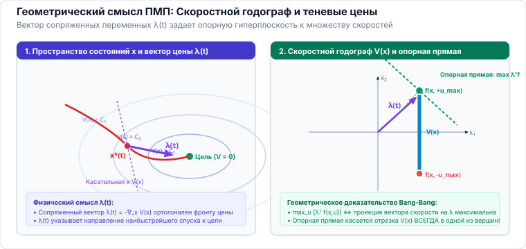

<!-- _class: lead -->
<!-- _header: "" -->
<!-- _footer: "" -->

# **Планирование движений мобильных роботов**
## Лекция 05: Теория оптимального управления: от классической оптимизации к Принципу максимума Понтрягина

⏱️ 90 минут
Фундаментальная теория
Вариационное исчисление • ПМП • Bang-Bang • Фазовая плоскость

---

<!-- _header: "Лекция 05 | Мотивация и введение" -->

## От алгоритмов поиска к математической оптимизации 02–05 мин

### 🤖 Что мы делали в предыдущих лекциях?

До сих пор мы подходили к движению робота **алгоритмически и эвристически**:
- **Дискретные графы ($A^*$, Dijkstra):** рубили пространство на сетку и искали цепочку соседних ячеек.
- **Случайные деревья (RRT, PRM):** бросали случайные точки и соединяли их отрезками.
- **Кинодинамика (Hybrid $A^*$, Kinodynamic RRT):** симулировали примитивы движения вперед во времени.
- **Локальные методы (DWA, MPPI):** перебирали дуги скоростей или генерировали тысячи случайных шумовых траекторий.

Все эти методы — **процедурные алгоритмы**. Они находят *какое-то* допустимое решение, но не отвечают на глубокий вопрос: **а как выглядит идеальное, математически наилучшее управление?**

### 🎯 Новый взгляд: Движение как оптимизация

Что если отбросить случайные выборки и эвристики и взглянуть на робота строго математически?

$$\min_{u(t)} J[u] \quad \text{при физике} \quad \dot{x}(t) = f(x(t), u(t))$$

- Можно ли найти **аналитическую формулу** для лучшего управления $u^*(t)$?
- Как заставить робота двигаться **предельно быстро**, не нарушая физических лимитов моторов $|u| \le u_{\max}$?
- Можно ли получить закон с замкнутой обратной связью: **измерил состояние $(x, \dot{x})$ $\to$ мгновенно выдал оптимальный ток на мотор**?

Ответ на эти фундаментальные вопросы дала **Теория оптимального управления**.

<!-- 
Методические указания лектору:
1. Подчеркните смену мышления: раньше мы думали как программисты (циклы, очереди, генераторы псевдослучайных чисел), теперь мы думаем как прикладные математики и физики.
2. Задайте аудитории риторический вопрос: "Если у нас есть точные дифференциальные уравнения робота, зачем стрелять наугад (как в MPPI), если можно вывести точный закон движения?"
-->

---

## План лекции на 90 минут 05–08 мин

### Часть 1: Тупик классического анализа и прорыв Понтрягина (45 мин)
1. **Математическая постановка OCP:** Состояния, дифференциальные связи и функционал Больца.
2. **Попытка №1: Классический анализ и вариационное исчисление:** Уравнения Эйлера–Лагранжа, множители Лагранжа.
3. **Почему классика ломается в робототехнике:** Ловушка ограничений приводов $|u| \le u_{\max}$ и линейность по управлению.
4. **Исторический прорыв:** Гонка вооружений, космос и рождение Принципа максимума Понтрягина (ПМП).
5. **Анатомия ПМП:** Функция Гамильтона и физический смысл сопряженных переменных $\lambda(t)$ как «теневых цен».
6. **Каноническая система условий:** Прямая динамика, сопряженная динамика и поточечный максимум.
7. **Геометрический смысл ПМП:** Скоростной годограф и опорная гиперплоскость.

### Часть 2: Аналитическое решение и границы метода (45 мин)
8. **Пошаговый практикум: Задача о быстродействии тележки:** Двойной интегратор $\ddot{x} = u, |u| \le 1$.
9. **Рождение релейного управления (Bang-Bang):** Почему оптимально жать педаль строго в пол.
10. **Теорема о числе переключений:** Теорема Фельдбаума для $n$-го порядка.
11. **Фазовая плоскость:** Интегрирование парабол и синтез кривой переключения $\Gamma$.
12. **Интерактивная практика:** Симулятор фазовой плоскости двойного интегратора.
13. **Связь с мобильными роботами:** Кривые Дубинса как прямое следствие ПМП (6 канонических слов).
14. **Пределы чисто аналитического подхода:** Дребезг (chattering), краевая задача (TPBVP), препятствия $\to$ мост к лекции 06.

<!-- 
Методические указания лектору:
1. Кратко обозначьте красную нить лекции: мы пройдем путь от наивной попытки продифференцировать задачу на бумаге до строгого синтеза релейного регулятора на фазовой плоскости.
-->

---

<!-- _header: "Лекция 05 | Часть 1: От классики к Понтрягину" -->

## 1. Постановка задачи оптимального управления (OCP) 08–13 мин

### Математический каркас задачи

Пусть состояние робота в момент времени $t$ описывается вектором $x(t) \in \mathbb{R}^n$, а управляющее воздействие — вектором $u(t) \in \mathbb{R}^m$.

Движение подчиняется **системе дифференциальных уравнений**:
$$\dot{x}(t) = f(x(t), u(t)), \quad x(0) = x_0$$

На управление наложены жесткие **физические ограничения** (мощность моторов, углы поворота руля):
$$u(t) \in \mathcal{U} \subset \mathbb{R}^m \quad \Longleftrightarrow \quad u_{\min} \le u(t) \le u_{\max}$$

Мы хотим перевести робота из $x_0$ в целевое состояние $x_f$ на интервале $t \in [0, t_f]$.

### Функционал качества Больца (Bolza Cost)

Качество движения оценивается скалярным числом $J$:

$$J[u] = \underbrace{\Phi(x(t_f))}_{\text{Терминальная плата}} + \int_{0}^{t_f} \underbrace{L(x(t), u(t))}_{\text{Интегральные затраты}} dt \longrightarrow \min_{u(t)}$$

**Типовые примеры критериев в робототехнике:**
1. **Задача быстродействия (Minimum Time):**
   $$L = 1 \implies J = \int_0^{t_f} 1 \, dt = t_f \to \min$$
2. **Энергоэффективность (Minimum Energy):**
   $$L = u^2(t) \implies J = \int_0^{t_f} u^2(t) \, dt \to \min$$
3. **Точность слежения за траекторией:**
   $$L = \|x(t) - x_{\text{ref}}(t)\|_Q^2 + \|u(t)\|_R^2$$

<!-- 
Методические указания лектору:
1. Объясните студентам разницу между функцией и функционалом: функция принимает число и возвращает число, а функционал принимает ЦЕЛУЮ ТРАЕКТОРИЮ-ФУНКЦИЮ u(t) и возвращает одно число J.
2. Подчеркните: время финиша t_f может быть как фиксированным заранее, так и свободным (как в задаче быстродействия).
-->

---

## 2. Попытка №1: Решить задачу классическим анализом 13–18 мин

### Как нас учили искать минимум?

Вспомним стандартный математический аппарат:

1. **Конечномерный анализ (школа / 1 курс):**
   $$f(x) \to \min \implies f'(x) = 0$$

2. **Условная оптимизация (Лагранж, 2 курс):**
   Минимизировать $f(x)$ при ограничении $g(x) = 0$:
   $$\mathcal{L}(x, \lambda) = f(x) + \lambda g(x), \quad \nabla_x \mathcal{L} = 0, \quad \nabla_\lambda \mathcal{L} = 0$$

3. **Классическое вариационное исчисление (Эйлер, Лагранж, Гамильтон, XVIII век):**
   $$J[x] = \int_{0}^{t_f} L(x, \dot{x}, t) \, dt \to \min$$
   Вариация функционала должна быть равна нулю: $\delta J = 0$. Это приводит к **уравнению Эйлера–Лагранжа**:
   $$\frac{\partial L}{\partial x} - \frac{d}{dt}\left(\frac{\partial L}{\partial \dot{x}}\right) = 0$$

### Естественная идея инженера:

*«Давайте применим вариационное исчисление к нашей задаче управления роботом!»*

Составим расширенный интеграл, добавив дифференциальную связь $\dot{x} - f(x, u) = 0$ с помощью множителей Лагранжа $\lambda(t)$:

$$J_a = \int_0^{t_f} \left[ L(x, u) + \lambda^T(t) \big( f(x, u) - \dot{x} \big) \right] dt$$

Проинтегрируем слагаемое $-\lambda^T \dot{x}$ по частям:
$$\int_0^{t_f} -\lambda^T \dot{x} \, dt = -\lambda^T x \Big|_0^{t_f} + \int_0^{t_f} \dot{\lambda}^T x \, dt$$

Теперь проварьируем по управлению $u(t)$ и потребуем равенства нулю производной:

$$\frac{\partial}{\partial u} \Big[ L(x, u) + \lambda^T f(x, u) \Big] \overset{?}{=} 0$$

Казалось бы, решение найдено: выразить $u$ из производной! **Но тут нас ждёт катастрофический провал...**

<!-- 
Методические указания лектору:
1. Проведите студентов через эту логику: это самый интуитивный шаг любого инженера — попытаться приравнять производную к нулю.
2. Сделайте драматическую паузу перед следующим слайдом: "Почему этот классический метод, открытый величайшими математиками прошлого, абсолютно бесполезен для управления реальным роботом?"
-->

---

## 3. Почему классический подход ломается в робототехнике? 18–24 мин

### 💥 Ловушка 1: Границы приводов (Actuator Saturation)

Классическое вариационное исчисление фундаментально опирается на предположение: **область поиска открыта**, то есть в окрестности оптимума $u^*$ вариация $\delta u(t)$ может принимать любые малые значения (как $+$, так и $-$).

Но у любого робота приводы имеют **жесткие пределы**:
$$u(t) \in [-u_{\max}, +u_{\max}]$$

Что если наибыстрейшее движение требует максимальной тяги: $u^*(t) = +u_{\max}$?
- Мы **не имеем права** варьировать $u$ вправо: $u^* + \delta u > u_{\max}$ физически невозможно!
- В граничной точке производная **НЕ РАВНА НУЛЮ**: $\frac{\partial J}{\partial u} \ne 0$.
- Градиент тянет управление за пределы допустимого, а стенка ограничения его держит. Условие стационарности $\frac{\partial}{\partial u} = 0$ просто не имеет решений внутри допустимого множества!

### 💥 Ловушка 2: Линейность по управлению

Большинство физических моделей роботов **аффинны (линейны)** по силам и моментам:
$$\dot{x} = f_0(x) + B(x) \cdot u$$

Если мы хотим минимизировать время ($L = 1$), то функция под интегралом линейно зависит от $u$:
$$g(u) = c \cdot u$$

Попробуйте найти минимум линейной функции $g(u) = 5u$ на отрезке $[-1, +1]$ через производную:
$$g'(u) = 5 \ne 0 \quad \text{для всех } u!$$

**Производная никогда не обращается в ноль!**
У линейной функции нет локального минимума внутри интервала. Оптимум ВСЕГДА лежит строго на одном из концов: либо $-1$, либо $+1$. Классический метод поиска точек с $g'(u) = 0$ здесь абсолютно бессилен!

<!-- 
Методические указания лектору:
1. Приведите простую геометрическую аналогию: если вы стоите в комнате, минимум потенциальной энергии может быть за окном. Вы уперлись носом в стекло. Ваша скорость равна нулю, но сила давления на стекло НЕ равна нулю!
2. Подчеркните: в робототехнике почти все задачи быстродействия — линейны по управлению. Значит, классика бессильна практически всегда.
-->

---

## Диаграмма: Эйлер–Лагранж vs Насыщение приводов 24–27 мин

<!-- 
Методические указания лектору:
1. Прокомментируйте по шагам три панели:
   - Панель 1: Открытая область, гладкая парабола, дно ямы с горизонтальной касательной (dJ/du = 0).
   - Панель 2: Стена ограничения +u_max. Дно ямы за стеной. В точке касания производная отрицательна, классическое уравнение не разрешимо.
   - Панель 3: Прямая линия Гамильтониана. Производная постоянна. Решение Понтрягина — искать точный максимум на компакте, отбросив равенство производной нулю!
-->

---

## 4. Исторический прорыв: Рождение теории оптимального управления 27–32 мин

### Исторический контекст: Космическая гонка

В 1950-е годы человечество вступило в ракетно-космическую эру (запуск первого Спутника, полет Гагарина, баллистические траектории).

Перед инженерами и математиками встала критическая задача:
- Ракета имеет ограниченный запас топлива и максимальную тягу двигателя $0 \le u(t) \le u_{\max}$.
- Как вывести полезную нагрузку на заданную высоту за **минимальное время** и с минимальным расходом топлива?

Инженеры эмпирически видели, что двигатель должен работать на максимальной мощности («в упор»), но строгой математической теории не существовало — классическое вариационное исчисление давало сбой из-за ограничений неравенств.

### Математическая школа Льва Понтрягина

В Математическом институте им. В. А. Стеклова АН СССР академик **Лев Семёнович Понтрягин** (потерявший зрение в 14 лет и ставший выдающимся топологом) вместе с учениками — **В. Г. Болтянским, Р. В. Гамкрелидзе и Е. Ф. Мищенко** — взялись за эту проблему.

В 1956–1961 гг. они разработали принципиально новый математический аппарат и доказали **Принцип максимума Понтрягина (ПМП)** (Ленинская премия 1962 г.).

**💡 В чем математический секрет доказательства?**
Вместо классической вариации $u(t) + \epsilon \eta(t)$, вылетающей за пределы $[-u_{\max}, u_{\max}]$, Понтрягин применил **игольчатые вариации (needle variations)**: замену управления на узком интервале времени $\Delta t$ на любое произвольное значение $v \in \mathcal{U}$. Это позволило работать с замкнутыми множествами любой формы!

<!-- 
Методические указания лектору:
1. Расскажите кратко о личности Понтрягина: его потрясающая геометрическая интуиция помогла увидеть структуру фазовых траекторий в многомерном пространстве без зрительного восприятия.
2. Упомяните игольчатые вариации: они не требуют гладкости и открытости области управлений.
-->

---

## 5. Анатомия ПМП: Гамильтониан и «теневые цены» 32–38 мин

### Функция Гамильтона–Понтрягина

Для задачи $\min \int_0^{t_f} L(x, u) dt$ при $\dot{x} = f(x, u)$ и $u \in \mathcal{U}$ вводится скалярная функция:

$$\mathcal{H}(x, u, \lambda) = -\lambda_0 L(x, u) + \lambda^T f(x, u)$$

*(обычно нормализуют $\lambda_0 = 1$ для неанормальных задач)*

Вектор $\lambda(t) = [\lambda_1(t), \dots, \lambda_n(t)]^T \in \mathbb{R}^n$ называется вектором **сопряженных переменных (costates)**.

**Разберем два слагаемых:**
- $-L(x, u)$ — текущая «скорость накопления штрафа» (мы хотим её уменьшить, поэтому стоит знак минус).
- $\lambda^T f(x, u)$ — проекция вектора скорости робота $\dot{x} = f(x, u)$ на направление оптимизации $\lambda$.

### 💡 Физический смысл сопряженных переменных $\lambda(t)$

Что такое сопряженная переменная $\lambda_i(t)$ на пальцах?

$$\lambda_i(t) = -\frac{\partial J^*}{\partial x_i(t)}$$

1. **Теневая цена (Shadow Price):** $\lambda_i(t)$ показывает, **на сколько улучшится финальный функционал $J^*$**, если в момент времени $t$ состояние робота $x_i$ сместится на малую величину вперед.
2. **Вектор цели:** $\lambda(t)$ указывает **наивыгоднейшее направление движения** в пространстве состояний робота в данный момент времени.
3. **Скалярное произведение $\lambda^T f(x, u)$:** показывает, насколько эффективно выбранное управление $u$ толкает робота вдоль вектора цели $\lambda$.

<!-- 
Методические указания лектору:
1. Задержитесь на физической интуиции: термин "теневая цена" пришел из экономики (Канторович, Купманс). Если у вас есть дефицитный ресурс (запас скорости, расстояние до цели), сопряженная переменная показывает предельную полезность этого ресурса.
2. Обратите внимание на знак: в литературе встречаются две конвенции (максимум с минусом перед L или минимум с плюсом перед L). Понтрягин формулировал именно ПРИНЦИП МАКСИМУМА.
-->

---

## Каноническая система Понтрягина (Три закона оптимальности) 38–43 мин

### Теорема (Принцип максимума Понтрягина)

Если траектория $x^*(t)$ и управление $u^*(t)$ оптимальны на интервале $t \in [0, t_f]$, то существует ненулевой сопряженный вектор $\lambda^*(t)$, такой что выполняются **три фундаментальных условия**:

1. **Прямая система (физика робота):**
   $$\dot{x}(t) = \frac{\partial \mathcal{H}}{\partial \lambda} = f(x, u), \quad x(0) = x_0$$

2. **Сопряженная система (динамика теневых цен):**
   $$\dot{\lambda}(t) = -\frac{\partial \mathcal{H}}{\partial x} = \frac{\partial L}{\partial x} - \left(\frac{\partial f}{\partial x}\right)^T \lambda(t)$$

3. **Условие глобального максимума по управлению:**
   $$u^*(t) = \arg\max_{u \in \mathcal{U}} \mathcal{H}(x^*(t), u, \lambda^*(t)) \quad \forall t \in [0, t_f]$$

### 🏆 В чем магия Принципа максимума?

Посмотрите, что сделал Понтрягин:

1. **Устранил бесконечномерность:** Исходная задача требовала искать наилучшую непрерывную кривую $u(t)$ на всем отрезке времени. ПМП утверждает: вы можете выбирать $u^*(t)$ **независимо в каждый отдельный момент $t$**, просто максимизируя функцию $\mathcal{H}(u)$!
2. **Победил ограничения приводов:** Множество $\mathcal{U}$ может быть отрезком $[-u_{\max}, u_{\max}]$, дискретным набором или выпуклым многогранником. Максимум функции на компактном множестве **всегда существует** (теорема Вейерштрасса)!
3. **Уравнения Гамильтона:** Прямая и сопряженная системы образуют каноническую пару уравнений, аналогичную классической механике Гамильтона.

**📖 Замечание о конвенциях знаков (SOTA):**
- **Школа Понтрягина (СССР):** $\mathcal{H} = -L + \lambda^T f \implies u^* = \arg\max \mathcal{H}$.
- **Западная литература (Kirk, Diehl):** $\mathcal{H}_{\text{alt}} = L + \lambda^T f \implies u^* = \arg\min \mathcal{H}_{\text{alt}}$ (Принцип минимума).
*Результаты обеих формулировок математически тождественны!*

<!-- 
Методические указания лектору:
1. Подчеркните: сопряженная система дифференциальных уравнений идет со знаком МИНУС перед градиентом H по x.
2. Обратите внимание студентов на врезку о знаках: они будут встречать в статьях и минимум, и максимум, важно не путаться.
-->

---

## Диаграмма: Геометрический смысл ПМП и скоростной годограф 43–45 мин

<!-- 
Методические указания лектору:
1. Обратите внимание студентов на две панели:
   - Слева: линии уровня функции ценности V(x). Вектор сопряженных переменных lambda(t) направлен строго перпендикулярно линиям уровня (в сторону скорейшего убывания штрафа).
   - Справа: множество скоростей V(x). Максимизация скалярного произведения lambda^T f означает поиск опорной прямой к множеству скоростей. Так как множество скоростей — это отрезок, максимум всегда достигается строго в одной из двух вершин!
-->

---

<!-- _header: "Лекция 05 | Часть 2: Пошаговый практикум и анализ" -->

## 6. Пошаговый практикум: Задача о быстродействии тележки 45–50 мин

### Физическая модель: Двойной интегратор

Рассмотрим базовую модель любого мобильного робота или манипулятора — перемещение массы $m=1$ силой тяги двигателя с ограничением:

$$\ddot{x}(t) = u(t), \quad |u(t)| \le 1$$

- $x(t)$ — координата положения робота.
- $\dot{x}(t) = v(t)$ — скорость робота.
- $u(t)$ — сила привода (ускорение), ограниченная диапазоном $[-1, +1]$.

**Постановка задачи быстродействия:**
Перевести робота из произвольной начальной позы и скорости $(x(0) = x_0, \dot{x}(0) = v_0)$ в начало координат с полной остановкой $(x(t_f) = 0, \dot{x}(t_f) = 0)$ за **минимальное возможное время**:

$$J = \int_{0}^{t_f} 1 \, dt = t_f \longrightarrow \min$$

### Векторная форма системы

Введем фазовые переменные:
$$x_1 = x \quad (\text{позиция}), \qquad x_2 = \dot{x} \quad (\text{скорость})$$

Система дифференциальных уравнений 1-го порядка:
$$\begin{cases} 
\dot{x}_1 = x_2 \\
\dot{x}_2 = u
\end{cases} \Longleftrightarrow \dot{x} = \begin{bmatrix} 0 & 1 \\ 0 & 0 \end{bmatrix} x + \begin{bmatrix} 0 \\ 1 \end{bmatrix} u$$

Граничные условия:
$$x(0) = \begin{bmatrix} x_0 \\ v_0 \end{bmatrix}, \qquad x(t_f) = \begin{bmatrix} 0 \\ 0 \end{bmatrix}$$

Давайте применим ПМП шаг за шагом!

<!-- 
Методические указания лектору:
1. Напомните студентам: это классическая задача управления тележкой или лифтом: как разогнаться и затормозить ровно в целевой точке за наименьшее время, не превышая предельной силы моторов?
-->

---

## Шаги 1 и 2: Гамильтониан и сопряженная система 50–55 мин

### Шаг 1: Записываем Гамильтониан $\mathcal{H}$

Критерий времени: $L = 1$. Динамика: $\dot{x}_1 = x_2$, $\dot{x}_2 = u$.
Вектор сопряженных переменных: $\lambda = [\lambda_1, \lambda_2]^T$.

$$\mathcal{H}(x, u, \lambda) = -1 + \lambda_1 \dot{x}_1 + \lambda_2 \dot{x}_2$$

$$\mathbf{\mathcal{H} = -1 + \lambda_1 x_2 + \lambda_2 \cdot u}$$

Посмотрите на Гамильтониан: он распадается на слагаемые:
- слагаемое без управления: $(-1 + \lambda_1 x_2)$;
- слагаемое с управлением: $\mathbf{\lambda_2(t) \cdot u}$.

### Шаг 2: Находим сопряженные переменные

Выписываем сопряженную систему $\dot{\lambda} = -\frac{\partial \mathcal{H}}{\partial x}$:

$$\dot{\lambda}_1 = -\frac{\partial \mathcal{H}}{\partial x_1} = 0 \implies \mathbf{\lambda_1(t) = c_1} = \text{const}$$

$$\dot{\lambda}_2 = -\frac{\partial \mathcal{H}}{\partial x_2} = -\lambda_1 \implies \dot{\lambda}_2 = -c_1$$

Интегрируем уравнение для $\lambda_2$:
$$\mathbf{\lambda_2(t) = -c_1 t + c_2}$$

**🎯 Главный аналитический вывод:**
Сопряженная переменная $\lambda_2(t)$ (теневая цена скорости) является **строго линейной функцией времени**!
График $\lambda_2(t)$ — это обычная прямая линия.

**💡 Условие трансверсальности:**
Так как время финиша $t_f$ свободно, на оптимальной траектории Гамильтониан тождественно равен нулю: $\mathcal{H}(t) \equiv 0 \implies -1 + c_1 x_2 + \lambda_2 u = 0$. Это фиксирует константы $c_1, c_2$!

<!-- 
Методические указания лектору:
1. Обратите внимание аудитории на простоту математики: мы взяли частные производные элементарной функции и получили тривиальные линейные интегралы.
2. Константы интегрирования c_1 и c_2 однозначно фиксируются условием H(t) = 0 и граничными точками.
-->

---

## Шаг 3: Максимум Гамильтониана $\to$ Рождение Bang-Bang 55–60 мин

### Ищем управление, максимизирующее $\mathcal{H}$

Согласно Принципу максимума:
$$u^*(t) = \arg\max_{u \in [-1, 1]} \Big[ -1 + \lambda_1 x_2 + \lambda_2(t) \cdot u \Big]$$

Поскольку первые слагаемые не зависят от $u$, задача сводится к:
$$u^*(t) = \arg\max_{u \in [-1, 1]} \big[ \lambda_2(t) \cdot u \big]$$

Функция $\sigma(t) = \lambda_2(t)$ называется **функцией переключения (Switching Function)**.

**Анализ знаков:**
- Если $\lambda_2(t) > 0$: чтобы сделать $\lambda_2 \cdot u$ максимальным, нужно взять максимально возможное $u \implies \mathbf{u^*(t) = +1}$.
- Если $\lambda_2(t) < 0$: чтобы сделать отрицательное умноженным на $u$ положительным и максимальным, берем минимальное $u \implies \mathbf{u^*(t) = -1}$.

### ⚡ Аналитическая формула закона Bang-Bang

$$u^*(t) = \text{sign}(\lambda_2(t)) = \text{sign}(-c_1 t + c_2)$$

$$u^*(t) \in \{-1, +1\}$$

**Физический смысл:**
- Чтобы перевести робота в цель за минимальное время, двигатель **ни одной миллисекунды не должен работать вполсилы**!
- Управление обязано мгновенно переключаться между крайними пределами: **полный газ ($+1$) $\longleftrightarrow$ экстренное торможение ($-1$)**.
- Любое промежуточное значение $|u| < 1$ затягивает время и является математически неоптимальным.

<!-- 
Методические указания лектору:
1. Объясните происхождение термина Bang-Bang: в релейных контактах и гидроклапанах это звучало как резкие щелчки "хлоп-хлоп" при переброске штока из одного крайнего положения в другое.
2. Подчеркните: мы доказали это строго математически, а не подобрали интуитивно!
-->

---

## Шаг 4: Теорема о переключениях (Сколько раз жать на тормоз?) 60–64 мин

### Сколько переключений знака может быть?

Мы выяснили, что закон управления определяется знаком линейной функции:
$$\sigma(t) = \lambda_2(t) = -c_1 t + c_2$$

Прямая линия на графике пересекает горизонтальную ось $\sigma = 0$ **не более одного раза**!

Следовательно, функция переключения меняет знак **максимум один раз**.

**Возможны всего 4 сценария управления:**
1. Всё время торможение: $u(t) = -1$ на всем интервале.
2. Всё время разгон: $u(t) = +1$ на всем интервале.
3. Разгон, затем торможение: $u(t) = +1 \to -1$ (одно переключение).
4. Торможение, затем разгон: $u(t) = -1 \to +1$ (одно переключение).

Никаких тройных разгонов-торможений быть не может!

### 📜 Теорема Фельдбаума о $n$ переключениях

Александр Аронович Фельдбаум (советский физик и кибернетик) обобщил этот факт для систем произвольного порядка:

> **Теорема Фельдбаума:**
> Для стационарной линейной системы порядка $n$ с действительными собственными числами оптимальное по быстродействию релейное управление имеет **не более $(n - 1)$ переключений**.

- Цепочка из $1$ интегратора ($\dot{x} = u$): $n=1 \implies 0$ переключений ($u = \pm 1$).
- Двойной интегратор ($\ddot{x} = u$): $n=2 \implies$ **не более 1 переключения**.
- Тройной интегратор ($\dddot{x} = u$, ограничение на рывок jerk): $n=3 \implies$ **не более 2 переключений**.

<!-- 
Методические указания лектору:
1. Подчеркните фундаментальность теоремы Фельдбаума: она гарантирует простоту структуры решения. Мы точно знаем, что траектория состоит максимум из двух кусков!
-->

---

## Шаг 5: Фазовая плоскость (Интегрирование парабол) 64–69 мин

### Интегрируем движение при постоянном $u$

Поскольку $u = \text{const} \in \{-1, +1\}$, уравнения движения интегрируются явно:
$$\dot{x}_1 = x_2, \quad \dot{x}_2 = u$$

Разделим второе уравнение на первое, чтобы исключить время $t$:
$$\frac{dx_2}{dx_1} = \frac{u}{x_2} \implies x_2 \, dx_2 = u \, dx_1$$

Интегрируем обе части:
$$\frac{1}{2} x_2^2 = u x_1 + C \implies \mathbf{x_1 - \frac{1}{2u} x_2^2 = C}$$

Это каноническое уравнение семейства **горизонтальных парабол** на фазовой плоскости «позиция–скорость» $(x_1, x_2) = (x, \dot{x})$!

### Анализ двух семейств парабол:

1. **При $u = +1$ (полная тяга вправо):**
   $$x_1 = \frac{1}{2} x_2^2 + C$$
   Параболы с вершинами на оси $x_1$, направленные ветвями вправо.
   Так как $\dot{x}_2 = +1 > 0$, скорость $x_2$ строго растет — движение точки происходит **снизу вверх** ($\uparrow$).

2. **При $u = -1$ (полная тяга влево / тормоз):**
   $$x_1 = -\frac{1}{2} x_2^2 + C$$
   Параболы, направленные ветвями влево.
   Так как $\dot{x}_2 = -1 < 0$, скорость $x_2$ строго падает — движение точки происходит **сверху вниз** ($\downarrow$).

<!-- 
Методические указания лектору:
1. Поясните направление стрелок на фазовой плоскости: в верхней полуплоскости x2 > 0 (скорость положительна), поэтому координата x1 обязана расти (движение вправо). В нижней полуплоскости x2 < 0 — движение всегда влево.
-->

---

## Шаг 6: Синтез кривой переключения $\Gamma$ и обратной связи 69–74 мин

### Как попасть точно в $(0, 0)$?

В целевую точку $(0, 0)$ ведут ровно **две финальные полупараболы**:
- **Ветвь $\Gamma_-$:** приводит в $(0,0)$ сверху при $u = -1$ ($x_2 > 0$): $x_1 = -\frac{1}{2} x_2^2$.
- **Ветвь $\Gamma_+$:** приводит в $(0,0)$ снизу при $u = +1$ ($x_2 < 0$): $x_1 = \frac{1}{2} x_2^2$.

Объединим их в одну формулу, используя функцию $\text{sign}(x_2)$:
$$\mathbf{\Gamma: \quad x + \frac{1}{2 u_{\max}} \dot{x} |\dot{x}| = 0}$$

Кривая $\Gamma = \Gamma_+ \cup \Gamma_-$ делит всю фазовую плоскость на две зоны!

### 🎯 Аналитический закон обратной связи $u^*(x, \dot{x})$

Роботу больше не нужно численно оптимизировать траекторию в реальном времени! Достаточно вычислить знак функции $\psi(x, \dot{x}) = x + \frac{1}{2}\dot{x}|\dot{x}|$:

$$u^*(x, \dot{x}) = \begin{cases}
-u_{\max}, & \text{если } x + \frac{1}{2u_{\max}} \dot{x}|\dot{x}| > 0 \\
+u_{\max}, & \text{если } x + \frac{1}{2u_{\max}} \dot{x}|\dot{x}| < 0 \\
-u_{\max} \text{sign}(\dot{x}), & \text{на самой кривой } \Gamma \\
0, & \text{в точке } (0, 0)
\end{cases}$$

Это **точный синтез замкнутого регулятора**: измерил $(x, \dot{x})$, подставил в формулу, выдал $u^*$!

<!-- 
Методические указания лектору:
1. Подчеркните триумф теории: мы превратили сложнейшую вариационную задачу с интегралом и ограничениями в элементарную строчку кода, требующую всего двух умножений и одного сравнения!
-->

---

## Диаграмма: Фазовая плоскость задачи быстродействия 74–77 мин

<!-- 
Методические указания лектору:
1. Объясните геометрический алгоритм:
   - Пусть робот стартует из точки (x0, v0) в первом квадранте (x > 0, v > 0).
   - Он находится выше кривой Г, поэтому u = -1.
   - Скорость v > 0, поэтому координата x растет вправо, а скорость падает вниз (вершина параболы).
   - Пересекая ось v = 0, скорость становится отрицательной, и робот начинает двигаться влево.
   - На кривой Г+ в точке S управление переключается на u = +1.
   - Робот скользит по Г+ прямо в начало координат (0, 0).
-->

---

<!-- _header: "ИНТЕРАКТИВНАЯ ПРАКТИКА | BANG-BANG НА ФАЗОВОЙ ПЛОСКОСТИ" -->

## Интерактивный симулятор: Фазовая плоскость $(x, \dot{x})$ 77–81 мин

<i class="interactive-dot"></i> Исследование двойного интегратора: Время быстродействия $T^*$ (Bang-Bang) против плавного регулятора
Клик по фазовой плоскости: выбор $(x_0, \dot{x}_0)$ | Переключение режимов | Регулировка $u_{\max}$

<iframe src="http://localhost:5599/widgets/bang-bang-simulator/index.html" class="interactive-frame"></iframe>

<!-- 
Методические указания лектору:
1. Запустите симулятор и кликните в разные квадранты фазовой плоскости.
2. Продемонстрируйте студентам переключение знака управления ровно на оранжевой кривой переключения Г.
3. Обратите внимание на телеметрию: покажите минимальное время T*.
-->

---

## Связь с мобильными роботами: Кривые Дубинса как результат ПМП 81–83 мин

### Автомобиль Дубинса под микроскопом ПМП

В лекции 04 мы изучали кривые Дубинса (Дубинс, 1957) как чисто геометрические шаблоны из дуг окружностей и прямых. **Принцип максимума раскрывает их истинную природу!**

Модель движения автомобиля с постоянной скоростью $v$:
$$\dot{x} = v \cos\theta, \quad \dot{y} = v \sin\theta, \quad \dot{\theta} = u, \quad |u| \le u_{\max}$$

Функционал — время (или длина пути $J = \int 1 dt$).
Гамильтониан:
$$\mathcal{H} = -1 + \lambda_x v \cos\theta + \lambda_y v \sin\theta + \lambda_\theta \cdot u$$

Сопряженная система:
$$\dot{\lambda}_x = 0 \implies \lambda_x = c_1, \quad \dot{\lambda}_y = 0 \implies \lambda_y = c_2$$
$$\dot{\lambda}_\theta = -\frac{\partial \mathcal{H}}{\partial \theta} = v (\lambda_x \sin\theta - \lambda_y \cos\theta) = A \sin(\theta - \phi)$$

### Почему только дуги $L, R$ и прямые $S$?

По Принципу максимума:
$$u^*(t) = \arg\max_{u \in [-u_{\max}, u_{\max}]} \big[ \lambda_\theta(t) \cdot u \big]$$

Функция переключения: $\sigma(t) = \lambda_\theta(t)$.
- $\sigma(t) > 0 \implies u = +u_{\max}$ $\implies$ **предельный поворот влево (дуга $L$)**.
- $\sigma(t) < 0 \implies u = -u_{\max}$ $\implies$ **предельный поворот вправо (дуга $R$)**.
- $\sigma(t) \equiv 0$ на интервале $\implies$ **особый режим (singular)**: $u = 0 \implies$ **прямая линия ($S$)**!

**Вывод:** Знаменитая теорема Дубинса о словах $CSC$ и $CCC$ — это **прямое следствие Принципа максимума Понтрягина** для нелинейной неголономной кинематики!

<!-- 
Методические указания лектору:
1. Свяжите этот материал с лекцией 04: студенты должны увидеть единство теории — геометрические примитивы, которые они использовали для Hybrid A*, родились из ПМП!
-->

---

## Диаграмма: Аналитические слова Дубинса по Понтрягину 83–85 мин

<!-- 
Методические указания лектору:
1. Сопоставьте 6 панелей: слова CSC (LSL, RSR, LSR, RSL) и слова CCC (LRL, RLR).
2. Подчеркните: каждый сегмент L, R или S соответствует постоянному знаку функции переключения sigma(t) = lambda_theta(t).
3. Дубинс доказал, что оптимальная траектория всегда принадлежит этому конечному набору из 6 слов, вытекающему из ПМП!
-->

---

## Пределы чисто аналитического подхода: Почему жизнь сложнее? 85–88 мин

### 1. Эффект дребезга (Chattering)
На фазовой плоскости робот должен идеально скользить по кривой $\Gamma$.
Но в реальном микроконтроллере время дискретно ($\Delta t = 10$–$50$ мс), а датчики имеют шум. Робот неизбежно проскакивает кривую $\Gamma$, мгновенно меняя $+u_{\max} \leftrightarrow -u_{\max}$ на каждом такте процессора (частота 50–100 Гц). Этот высокочастотный дребезг (**Chattering**) разрушает редукторы и сжигает силовые транзисторы!

### 2. Препятствия в пространстве ($h(x) \le 0$)
Если на пути робота есть стена или стол, в момент касания ограничения вектор сопряженных цен $\lambda(t)$ претерпевает **разрывные скачки**. Аналитическая сшивка кусков траектории в окружении 10 препятствий превращается в комбинаторный тупик.

### 3. Барьер краевой задачи (Two-Point BVP)
Для систем размерности $n \ge 4$ (робот с динамикой шасси, манипулятор) аналитически проинтегрировать сопряженную систему невозможно.
Мы получаем систему $2n$ дифференциальных уравнений:
- Начальное состояние $x(0) = x_0$ мы знаем.
- Но начальные теневые цены $\lambda(0)$ нам **неизвестны**! Известны лишь условия на финише $\lambda(t_f)$.

Попытка численно «угадать» $\lambda(0)$ методом стрельбы (Indirect Shooting) расходится: малейшая ошибка в 7-м знаке приводит к экспоненциальному улету траектории в космос за доли секунды!

<!-- 
Методические указания лектору:
1. Подчеркните: аналитическое решение ПМП великолепно объясняет структуру оптимума (почему приводы работают на упоре, почему возникают дуги Дубинса), но для автономной навигации робота на складе нужен другой вычислительный инструмент.
-->

---

## Резюме лекции и мост к численному MPC 88–90 мин

### Ключевые выводы лекции:
1. **От алгоритмов к оптимизации:** Переход к непрерывной OCP формулирует задачу физически строго, без эвристик и сеточных артефактов.
2. **Крах классики:** Уравнение Эйлера–Лагранжа ($\frac{\partial J}{\partial u} = 0$) неприменимо из-за насыщения приводов $|u| \le u_{\max}$ и линейности динамики.
3. **Принцип максимума Понтрягина:** Заменил производную на поточечный глобальный максимум Гамильтониана $\mathcal{H}$, объединяющего текущие затраты $L$ и проекцию скорости на теневые цены $\lambda(t)$.
4. **Bang-Bang управление:** Линейность по управлению строго доказывает, что быстрейшее движение достигается предельными переключениями на границах приводов.
5. **Фазовая плоскость:** Позволяет аналитически синтезировать закон обратной связи $u^*(x, \dot{x})$ через кривую переключения $\Gamma$.

### 🌉 Мост к Лекции 06:
*«Аналитическое решение ПМП красиво, но бессильно перед сложными препятствиями и многомерными моделями. Как преодолеть барьер краевой задачи?*

*На следующей лекции мы совершим смену парадигмы: **прямая дискретизация (Direct Transcription)** переведет задачу в форму нелинейного программирования (NLP). Мы разберем современные численные солверы (SQP, IPOPT), фреймворки CasADi и замкнем всё в контур **Model Predictive Control (MPC)** реального времени!»*

### ❓ Вопросы для самопроверки:
1. Почему вектор $\lambda(t)$ называют «теневыми ценами»?
2. Почему у двойного интегратора не может быть двух переключений знака управления?
3. Что произойдет с Bang-Bang регулятором при увеличении задержки датчиков?

<!-- 
Методические указания лектору:
1. Поблагодарите студентов за внимание и сделайте анонс лекции 06: переход от классической аналитики к современному вычислительному MPC, на котором работают Tesla, Waymo и Boston Dynamics.
-->
