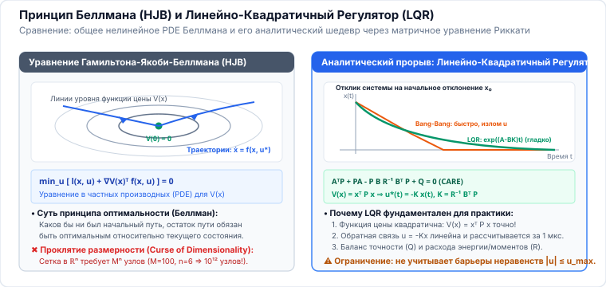

<!-- _class: lead -->
<!-- _header: "" -->
<!-- _footer: "" -->

# **Планирование движений мобильных роботов**
## Лекция 05: Оптимальное управление: аналитические основы и прямая дискретизация

⏱️ 90 минут
Теория оптимального управления
ПМП • Bang-Bang • LQR • Direct Transcription

---

<!-- _header: "Лекция 05 | Введение" -->

## Зачем нужно оптимальное управление?

### 🎯 Что мы уже умеем — и чего не хватает

В лекции 04 мы перешли от чистой геометрии к **учёту физики**: модели движения (кинематика, кинодинамика, динамика), предиктивное управление MPC, локальные методы DWA и MPPI. Эти подходы дают практичные решения, но имеют фундаментальные ограничения:

- **DWA** перебирает лишь дуги постоянной кривизны на коротком горизонте — **нет гарантий оптимальности**, легко застрять в локальном минимуме.
- **MPPI** находит хорошие решения стохастическим семплированием, но не может **доказать**, что найденное управление — лучшее из возможных.
- **Hybrid $A^*$ / Kinodynamic RRT** строят допустимые пути, но результат зависит от дискретизации и не учитывает явного критерия качества (энергия, время, плавность).

**Теория оптимального управления** формулирует задачу строго: явный функционал стоимости $J$, явные ограничения, и математически доказуемые необходимые условия оптимальности. Это даёт **аналитические законы обратной связи** (LQR), **гарантии сходимости** и **фундамент для численных солверов** (лекция 06).

### 📋 Структура лекции

**Часть 1 — Аналитические методы (45 мин):**
Постановка задачи OCP → Принцип Понтрягина → применение к задаче Дубинса → Bang-Bang → фазовая плоскость и кривая переключения → HJB и проклятие размерности → LQR → интерактив.

**Часть 2 — Прямая дискретизация (45 мин):**
Барьер краевой задачи → смена парадигмы → Single Shooting → Multiple Shooting → Direct Collocation → сравнительный анализ.

**Мост к лекции 06:** Результат этой лекции — задача NLP. На следующей лекции: как решить её за 10 мс на бортовом компьютере.

---

<!-- _header: "Лекция 05 | Часть 1: Аналитическая теория" -->

## 1. Постановка задачи оптимального управления (OCP) 03–09 мин

### Функционал Больца (Bolza Objective)

В непрерывном времени задача оптимального управления (**Optimal Control Problem, OCP**) формулируется как поиск закона управления $u(t)$ и траектории $x(t)$ на интервале $t \in [t_0, t_f]$:

$$\min_{u(t)} J = \underbrace{\Phi(x(t_f), t_f)}_{\text{Терминальная цена (Mayer)}} + \int_{t_0}^{t_f} \underbrace{L(x(t), u(t), t)}_{\text{Интегральные затраты (Lagrange)}} dt$$

- **Лагранжиан $L(x, u)$:** Текущие затраты (энергия приводов $u^2$, время $\int 1 dt$, отклонение от траектории $\|x - x_{\text{ref}}\|^2$).
- **Терминальная функция $\Phi(x_f)$:** Штраф за непопадание в целевую точку или терминальная кинетическая энергия.

### Динамика и физические ограничения

Траектория подчиняется дифференциальным уравнениям движения и жестким границам:

$$\dot{x}(t) = f(x(t), u(t)), \quad x(t_0) = x_0$$

$$u(t) \in \mathcal{U} \subset \mathbb{R}^m \quad \Longleftrightarrow \quad u_{\min} \le u(t) \le u_{\max}$$

$$x(t) \in \mathcal{X}_{\text{free}} \subset \mathbb{R}^n \quad \Longleftrightarrow \quad h(x(t)) \le 0$$

- $\mathcal{U}$ — пределы моментов электромоторов, углов поворота руля, тяги винтов.
- $\mathcal{X}_{\text{free}}$ — свободное конфигурационное пространство без коллизий с препятствиями и зон опрокидывания.

<!-- 
Методические указания лектору:
1. Подчеркните студентам структуру функционала: интеграл накапливает затраты в пути, а терминальный член наказывает за финальную ошибку.
2. Обратите внимание: время финиша t_f может быть фиксированным (задача встречи) или свободным (задача быстродействия).
-->

---

## 2. Принцип максимума Понтрягина (ПМП) 09–16 мин

### Гамильтониан как мгновенная «мощность»

Лев Понтрягин и его научная школа (1956–1961) доказали фундаментальные необходимые условия оптимальности. Вводится **функция Гамильтона–Понтрягина**:

$$\mathcal{H}(x(t), u(t), \lambda(t)) = \lambda_0 L(x, u) + \lambda^T(t) f(x, u)$$

где $\lambda(t) \in \mathbb{R}^n$ — вектор **сопряжённых переменных (costates)**.

**💡 Физическая интуиция:**
- Гамильтониан объединяет текущий расход цены $L$ и проекцию скорости движения $\dot{x} = f(x, u)$ на направление оптимизации $\lambda$.
- Переменные $\lambda_i(t)$ являются **теневыми ценами (shadow prices)**: $\lambda_i(t) = \frac{\partial J^*}{\partial x_i(t)}$ — чувствительность финального функционала к возмущению $i$-й координаты состояния.

### Система условий Понтрягина

Для оптимальной траектории $(x^*, u^*, \lambda^*)$ обязаны выполняться три условия:

1. **Фазовая динамика:**
   $$\dot{x}(t) = \frac{\partial \mathcal{H}}{\partial \lambda} = f(x, u), \quad x(0) = x_0$$

2. **Сопряженная динамика (уравнение Эйлера–Лагранжа):**
   $$\dot{\lambda}(t) = -\frac{\partial \mathcal{H}}{\partial x} = -\nabla_x L^T - \left(\frac{\partial f}{\partial x}\right)^T \lambda(t)$$

3. **Условие минимума/максимума по управлению:**
   $$u^*(t) = \arg\min_{u \in \mathcal{U}} \mathcal{H}(x^*(t), u, \lambda^*(t)) \quad \forall t \in [t_0, t_f]$$

<!-- 
Методические указания лектору:
1. Поясните знак перед сопряженной системой: сопряженные переменные эволюционируют назад во времени.
2. Обратите внимание: ПМП переводит сложную вариационную задачу на всем интервале времени в поточечную минимизацию функции H(u) в каждый момент t!
-->

---

## 3. Пример ПМП: Кривые Дубинса 16–22 мин

### Машина Дубинса под призмой Понтрягина

Прежде чем углубляться в общую теорию, покажем мощь ПМП на знакомом примере. В лекции 04 мы использовали кривые Дубинса как геометрический инструмент. Теперь докажем их оптимальность:

$$\dot{x} = v \cos\theta, \quad \dot{y} = v \sin\theta, \quad \dot{\theta} = u, \quad |u| \le u_{\max}, \quad v = \text{const}$$

Функционал — длина пути $J = \int_0^{t_f} v \, dt = v t_f$ (быстродействие при $v=\text{const}$).

Гамильтониан:
$$\mathcal{H} = 1 + \lambda_x v \cos\theta + \lambda_y v \sin\theta + \lambda_\theta u$$

Сопряженная система:
$$\dot{\lambda}_x = 0 \implies \lambda_x = c_1, \quad \dot{\lambda}_y = 0 \implies \lambda_y = c_2$$
$$\dot{\lambda}_\theta = -\frac{\partial \mathcal{H}}{\partial \theta} = v (c_1 \sin\theta - c_2 \cos\theta) = v \cdot A \sin(\theta - \phi)$$

### Почему только слова CCC и CSC?

Функция переключения: $\sigma(t) = \lambda_\theta(t)$.
Управление по ПМП:
$$u^*(t) = -u_{\max} \text{sign}(\sigma(t)) \in \{-u_{\max}, 0, +u_{\max}\}$$

- $u = +u_{\max} \implies$ дуга предельного поворота влево ($L$).
- $u = -u_{\max} \implies$ дуга предельного поворота вправо ($R$).
- $u = 0$ (особый режим при $\sigma(t) \equiv 0$) $\implies$ прямая линия ($S$).

**Теорема Дубинса (1957):**
ПМП строго доказывает, что кратчайший путь между любыми двумя позами в $\mathbb{R}^2 \times S^1$ состоит максимум из **трёх сегментов** одного из двух семейств:
1. $CSC$: $\{LSL, LSR, RSL, RSR\}$
2. $CCC$: $\{RLR, LRL\}$

💡 **Ключевой вывод:** Геометрические примитивы из лекции 04 — **не эвристика**, а строгое следствие ПМП. Для Ридса–Шеппа (задний ход) аналогичный анализ даёт точки разворота (cusps).

<!-- 
Методические указания лектору:
1. Свяжите этот слайд с лекцией 04: покажите, что геометрические примитивы Дубинса — это не эвристика, а строгое решение уравнения Понтрягина.
2. Подчеркните: этот пример демонстрирует паттерн, который мы увидим далее — при линейности H по u оптимум лежит на границе (Bang-Bang).
-->

---

## 4. Релейное управление (Bang-Bang Control) 22–28 мин

### Обобщение: Системы, аффинные по управлению

Мы только что увидели Bang-Bang на примере Дубинса. Теперь покажем, что это **универсальный паттерн** для всех систем, линейных по управлению:

$$\dot{x} = f_0(x) + B(x) u, \quad u \in [u_{\min}, u_{\max}]$$

Для задачи минимального времени $J = \int_{0}^{t_f} 1 \, dt$ ($L=1$) Гамильтониан:

$$\mathcal{H} = 1 + \lambda^T f_0(x) + \underbrace{\lambda^T B(x)}_{\sigma(t)} \cdot u$$

Скалярная функция $\sigma(t) = \lambda^T(t) B(x(t))$ называется **функцией переключения (Switching Function)**.

Поскольку $\mathcal{H}$ линейна по $u$, её минимум по $u \in [u_{\min}, u_{\max}]$ достигается строго на одной из границ отрезка!

### Релейный закон экстремума

$$u^*(t) = \begin{cases} 
u_{\min}, & \text{если } \sigma(t) > 0 \\
u_{\max}, & \text{если } \sigma(t) < 0 \\
\text{особый режим (singular)}, & \text{если } \sigma(t) \equiv 0
\end{cases}$$

**⚡ Почему именно Bang-Bang («Хлоп-Хлоп»)?**
- Управление мгновенно переключается между крайними пределами приводов: полный газ $\to$ экстренное торможение.
- Промежуточные значения $u \in (u_{\min}, u_{\max})$ неоптимальны по быстродействию.
- Моменты переключения определяются нулями функции $\sigma(t) = 0$.

<!-- 
Методические указания лектору:
1. Приведите бытовую аналогию: лифт или трамвай при идеальном разгоне сначала выдает предельный ток моторов, а затем предельный тормозной момент.
2. Упомяните особый режим (singular control), когда переключающая функция тождественно равна нулю на конечном интервале времени (например, полет по орбите).
3. Подчеркните связь с Дубинсом: мы только что видели, как тот же механизм порождает три сегмента L, R, S.
-->

---

## 5. Фазовая плоскость двойного интегратора 28–36 мин

### Задача о быстродействии тележки

Применим Bang-Bang к простейшей, но важнейшей модели — робота 2-го порядка (ускорение задается силой привода):

$$\ddot{x} = u, \quad |u| \le 1, \quad x(0) = x_0, \; \dot{x}(0) = v_0$$

Введем фазовые переменные: $x_1 = x$ (позиция), $x_2 = \dot{x}$ (скорость).
$$\dot{x}_1 = x_2, \quad \dot{x}_2 = u$$

Сопряженная система:
$$\dot{\lambda}_1 = -\frac{\partial \mathcal{H}}{\partial x_1} = 0 \implies \lambda_1(t) = c_1$$
$$\dot{\lambda}_2 = -\frac{\partial \mathcal{H}}{\partial x_2} = -\lambda_1 \implies \lambda_2(t) = -c_1 t + c_2$$

Функция переключения $\sigma(t) = \lambda_2(t)$ — **линейная функция**. Следовательно, $\sigma(t)$ меняет знак **не более одного раза**!

### Интегрирование фазовых траекторий

При постоянном управлении $u = \pm 1$:
$$x_1(t) = \frac{1}{2} u t^2 + v_0 t + x_0, \quad x_2(t) = u t + v_0$$

Исключая время $t = (x_2 - v_0)/u$, получаем семейство парабол:
$$x_1 - \frac{1}{2u} x_2^2 = \text{const}$$

- При $u = +1$: параболы $x_1 = \frac{1}{2} x_2^2 + C$ (движение вправо-вверх).
- При $u = -1$: параболы $x_1 = -\frac{1}{2} x_2^2 + C$ (движение влево-вниз).

В начало координат $(0,0)$ ведут ровно две полупараболы:
- $\Gamma_+$ (при $u = +1$, $x_2 < 0$): $x_1 = \frac{1}{2} x_2^2$
- $\Gamma_-$ (при $u = -1$, $x_2 > 0$): $x_1 = -\frac{1}{2} x_2^2$

<!-- 
Методические указания лектору:
1. Покажите на доске или жестами, как парабола u=-1 уводит точку вниз и вправо, а парабола u=+1 уводит вверх и влево.
2. Подчеркните фундаментальный факт: теорема Фельдбаума о числе переключений n-звенного интегратора утверждает, что для n-го порядка число переключений не более n-1.
-->

---

## 6. Синтез кривой переключения $\Gamma$ 36–42 мин

### Аналитическая обратная связь

Объединяя ветви $\Gamma_+$ и $\Gamma_-$, получаем единое уравнение **кривой переключения $\Gamma$**:

$$\Gamma: \quad x + \frac{1}{2 u_{\max}} \dot{x} |\dot{x}| = 0$$

Оптимальное управление с обратной связью по текущему состоянию $(x, \dot{x})$:

$$u^*(x, \dot{x}) = \begin{cases}
-u_{\max}, & \text{если } x + \frac{1}{2u_{\max}} \dot{x}|\dot{x}| > 0 \\
+u_{\max}, & \text{если } x + \frac{1}{2u_{\max}} \dot{x}|\dot{x}| < 0 \\
-u_{\max} \text{sign}(\dot{x}), & \text{на кривой } \Gamma \text{ (до нуля)} \\
0, & \text{в точке } (0,0)
\end{cases}$$

**Инженерный недостаток:** 
В окрестности кривой $\Gamma$ из-за квантования времени $\Delta t$ и задержек датчиков возникает высокочастотный паразитный дребезг (**Chattering**), разрушающий редукторы приводов. Это мотивирует поиск **гладких альтернатив** (LQR — далее на этой лекции).

<!-- 
Методические указания лектору:
1. Обратите внимание студентов на график: из любой точки фазовой плоскости система движется по параболе до кривой Г, переключает знак u и скользит прямо в начало координат.
2. Объясните причину дребезга: контроллер с дискретностью 100 Гц перескакивает через линию Г туда и обратно.
3. Подведите к мысли: Bang-Bang оптимален по времени, но на практике нужна гладкая альтернатива.
-->

---

## 7. Динамическое программирование и уравнение HJB 42–48 мин

### Принцип оптимальности Беллмана

До сих пор мы шли по пути ПМП: анализ **вдоль одной траектории**. Ричард Беллман (1957) предложил альтернативный подход — решать задачу оптимального управления **сразу для всех начальных состояний**:

> *«Каково бы ни было начальное состояние и начальное решение, последующие решения должны составлять оптимальное управление относительно состояния, полученного в результате первого решения».*

Введем **функцию цены (Value Function)** $V(x, t)$ — минимальную стоимость перехода из состояния $x$ в момент $t$ до финиша $t_f$:

$$V(x, t) = \min_{u_{[t, t_f]}} \left\{ \Phi(x(t_f)) + \int_{t}^{t_f} L(x(\tau), u(\tau)) d\tau \right\}$$

### Уравнение Гамильтона–Якоби–Беллмана (HJB)

Разложив $V(x, t)$ в окрестности $t + \Delta t$ в ряд Тейлора при $\Delta t \to 0$:

$$-\frac{\partial V(x, t)}{\partial t} = \min_{u \in \mathcal{U}} \left[ L(x, u) + \nabla_x V(x, t)^T f(x, u) \right]$$

Для стационарного бесконечного горизонта ($t_f \to \infty, \frac{\partial V}{\partial t} = 0$):
$$\min_{u \in \mathcal{U}} \left[ L(x, u) + \nabla_x V(x)^T f(x, u) \right] = 0$$

**✖ Проклятие размерности (Curse of Dimensionality):**
- HJB — нелинейное уравнение в частных производных в $\mathbb{R}^n$.
- Для численного решения нужна сетка по всему пространству: $M^n$ узлов.
- Для робота с $n=9$ (колесо + манипулятор) при $M=100$ это $100^9 = 10^{18}$ узлов!
- **Но**: для линейных систем с квадратичной стоимостью уравнение HJB решается **точно** → следующий слайд.

<!-- 
Методические указания лектору:
1. Объясните связь между ПМП и HJB: сопряженный вектор Понтрягина lambda(t) — это в точности пространственный градиент функции цены Беллмана: lambda(t) = grad_x V(x, t).
2. Подчеркните: ПМП решает задачу вдоль одной одномерной траектории, а HJB пытается решить задачу сразу для всего пространства.
-->

---

## 8. Линейно-квадратичный регулятор (LQR) 48–58 мин

### Аналитический шедевр теории управления

Существует выдающийся частный случай, когда уравнение HJB решается **точно в замкнутом аналитическом виде** без каких-либо сеток:
1. Линейная модель динамики: $\dot{x} = A x + B u$
2. Квадратичный функционал:
   $$J = \int_0^\infty \left( x^T Q x + u^T R u \right) dt, \quad Q \succeq 0, \; R \succ 0$$

Постулируем квадратичную функцию цены: $V(x) = x^T P x$, где $P = P^T \succ 0$.
Тогда $\nabla_x V(x) = 2 P x$. Подставим в уравнение HJB:

$$\min_u \left[ x^T Q x + u^T R u + 2 x^T P (A x + B u) \right] = 0$$

Минимум по $u$ находится аналитически:
$$2 R u + 2 B^T P x = 0 \implies \mathbf{u^*(t) = -K x(t) = -R^{-1} B^T P x(t)}$$

### Алгебраическое уравнение Риккати (CARE)

Подставляя $u^* = -R^{-1} B^T P x$ обратно в HJB, получаем матричное уравнение:

$$A^T P + P A - P B R^{-1} B^T P + Q = 0$$

- Матрица $P$ находится численно за микросекунды (через метод Шура / спектральное разложение).
- Получаем **линейную обратную связь** $u = -K x$.
- Замкнутая система $\dot{x} = (A - B K) x$ строго асимптотически устойчива!

**⚖️ Сравнение: Bang-Bang vs LQR:**
- **Bang-Bang:** Минимальное возможное время, предельные ускорения, изломы управления, износ моторов, дребезг (chattering).
- **LQR:** Гладкий экспоненциальный отклик, экономия энергии приводов, регулируемый баланс $Q$ и $R$, но не учитывает явные границы $|u| \le u_{\max}$.

<!-- 
Методические указания лектору:
1. Поясните смысл матриц весов: Q наказывает за отклонение от нуля (чем больше Q, тем жестче стабилизация), а R наказывает за величину управляющих воздействий.
2. Обратите внимание: LQR гарантирует бесконечный запас по усилению сверху и минимум 60 градусов запаса по фазе.
-->

---

## Диаграмма: Принцип Беллмана и LQR vs Bang-Bang 55–58 мин

<!-- 
Методические указания лектору:
1. Обратите внимание аудитории на левую панель: линии уровня функции V(x) и спуск траекторий ортогонально градиенту цены.
2. Справа сопоставьте графики отклика x(t): ломаная линия быстродействия Bang-Bang против плавной гладкой экспоненты LQR.
-->

---

<!-- _header: "ИНТЕРАКТИВНАЯ ПРАКТИКА | BANG-BANG VS LQR" -->

## 9. Интерактивный симулятор: Фазовая плоскость $(x, \dot{x})$ 58–62 мин

<i class="interactive-dot"></i> Исследование двойного интегратора: Время быстродействия $T^*$ (Bang-Bang) против плавной стабилизации LQR
Клик по фазовой плоскости: выбор $(x_0, \dot{x}_0)$ | Переключение режимов | Регулировка $u_{\max}, Q, R$

<iframe src="http://localhost:5599/widgets/bang-bang-simulator/index.html" class="interactive-frame"></iframe>

<!-- 
Методические указания лектору:
1. Кликните мышью в точку (x=3.0, v=1.5) на фазовой плоскости.
2. Нажмите «▶ Старт» в режиме сравнения: покажите, как Bang-Bang достигает нуля значительно быстрее, резко переключаясь на кривой Г.
3. Обратите внимание на телеметрию: Bang-Bang выигрывает по времени t, но проигрывает по затраченной энергии интеграла u^2 dt.
4. Измените предел u_max: продемонстрируйте, как кривая переключения Г сжимается или раскрывается.
-->

---

<!-- _header: "Лекция 05 | Часть 2: Прямая дискретизация" -->

## 10. Барьер аналитических методов: Краевая задача (TPBVP) 62–68 мин

### Двухточечная краевая задача (TPBVP)

Мы увидели красивые аналитические решения ПМП для двойного интегратора и машины Дубинса. Но эти системы имели всего 2–3 переменных состояния. Для общей задачи ПМП оставляет нерешённой ключевую вычислительную проблему:

$$\begin{cases}
\dot{x}(t) = \frac{\partial \mathcal{H}}{\partial \lambda} = f(x, u^*(x, \lambda)), & \mathbf{x(0) = x_0} \quad \text{(начало)} \\
\dot{\lambda}(t) = -\frac{\partial \mathcal{H}}{\partial x}, & \mathbf{\lambda(t_f) = \nabla \Phi(x(t_f))} \quad \text{(конец)}
\end{cases}$$

Это **двухточечная краевая задача (Two-Point Boundary Value Problem, TPBVP)**:
- Половина граничных условий задана в начале $t=0$, а вторая половина — в конце $t=t_f$.
- Для решения задачи Коши в $t=0$ необходимо знать вектор $\lambda(0)$, но он нам **неизвестен**!

### Почему метод непрямой стрельбы (Indirect Shooting) не работает на практике?

1. **Отсутствие физического смысла у $\lambda(0)$:** Невозможно интуитивно угадать начальное приближение для вектора теневых цен.
2. **Экстремальная численная неустойчивость:** Сопряженная система $\dot{\lambda} = -(\frac{\partial f}{\partial x})^T \lambda$ часто имеет положительные собственные числа. Ошибка в 8-м знаке $\lambda(0)$ приводит к экспоненциальному улету траектории в бесконечность за доли секунды.
3. **Препятствия и фазовые ограничения $h(x) \le 0$:** При касании границы препятствия вектор $\lambda(t)$ претерпевает **разрывные скачки**. Уравнения ПМП превращаются в сложнейшую комбинаторную задачу поиска моментов входа и схода с ограничений.

💡 **Итог части 1:** Аналитические методы (ПМП, HJB, LQR) дают глубокое понимание структуры решений, но для реальных роботов в средах с препятствиями нужен **принципиально иной подход**.

<!-- 
Методические указания лектору:
1. Приведите аналогию: непрямая стрельба похожа на попытку выстрелить из пушки в яблоко на расстоянии 10 км без прицела, подбирая угол с точностью до миллионных долей градуса.
2. Подведите аудиторию к мысли: аналитические условия ПМП красивы в теории, но для роботов в среде с препятствиями нужен принципиально иной подход — численная дискретизация.
-->

---

## 11. Смена парадигмы: Прямая дискретизация 68–73 мин

### От непрямых методов к прямой оптимизации

В вычислительном оптимальном управлении произошел фундаментальный сдвиг концепции:

- **Непрямые методы (Indirect Methods):**
  $$\text{First Optimize, then Discretize}$$
  Сначала выписываются аналитические условия ПМП ($\delta J = 0$), а затем полученная краевая задача TPBVP решается численно. *Надежно работает только для простейших задач.*

- **Прямые методы (Direct Transcription):**
  $$\text{First Discretize, then Optimize}$$
  Непрерывная траектория сразу аппроксимируется конечным набором параметров, сводя дифференциальную OCP к стандартной конечномерной задаче **нелинейного программирования (NLP)**.

### Конечномерная задача NLP (Nonlinear Programming)

$$\min_{w \in \mathbb{R}^{n_w}} F(w) \quad \text{при условиях} \quad \begin{cases} g(w) = 0 & \text{(динамика)} \\ h(w) \le 0 & \text{(ограничения)} \end{cases}$$

- $w$ — вектор оптимизационных переменных (значения управлений и состояний в узлах сетки).
- $F(w)$ — аппроксимация функционала Больца $J$.
- $g(w) = 0$ — алгебраические равенства, гарантирующие соответствие траектории законам физики робота.
- $h(w) \le 0$ — коридоры безопасности, границы скоростей и моторов.

**Три базовых метода прямой транскрипции:**
1. Single Shooting (Прямая стрельба)
2. Multiple Shooting (Многократная стрельба)
3. Direct Collocation (Прямая коллокация)

<!-- 
Методические указания лектору:
1. Заострите внимание на терминологии: транскрипция — это перевод бесконечномерной функциональной задачи в конечный вектор чисел w.
2. Подчеркните: для решения NLP существуют мощнейшие открытые библиотеки (IPOPT, SQP), которые берут на себя всю рутину поиска минимума.
-->

---

## 12. Single Shooting (Прямая стрельба) 73–77 мин

### Концепция метода

Горизонт времени разбивается на $N$ шагов: $t_0 < t_1 < \dots < t_N = t_f$.
Управление параметризуется кусочно-постоянными значениями: $u(t) = u_k$ при $t \in [t_k, t_{k+1}]$.

**Вектор переменных оптимизации:**
$$w = [u_0, u_1, \dots, u_{N-1}]^T \in \mathbb{R}^{m \cdot N}$$

Состояния робота $x_k$ **не являются** независимыми переменными NLP! Они последовательно вычисляются численным интегратором (RK4):

$$x_{k+1} = \Phi(x_k, u_k), \quad x_0 = \text{const}$$

Целевая функция вычисляется сквозным прогоном:
$$F(w) = \Phi(x_N) + \sum_{k=0}^{N-1} L(x_k, u_k) \Delta t$$

### Достоинства Single Shooting:
- **Минимальный размер задачи NLP:** число переменных $n_w = m \cdot N$ очень мало (например, для $m=2, N=20 \implies 40$ переменных).
- В задаче нет ограничений-равенств на динамику (они удовлетворяются интегратором автоматически).

### Критические недостатки:
- **Взрыв градиентов:** Изменение $u_0$ влияет на всё состояние $x_N$ через длинную цепочку умножений матриц Якоби $\prod_{k=0}^{N-1} \frac{\partial \Phi}{\partial x_k}$.
- **Неустойчивость:** Для систем с неустойчивой динамикой (двуногий робот, дрон) сквозное интегрирование разваливается до того, как оптимизатор сделает первый шаг.
- **Нельзя инициализировать траекторию:** Нельзя задать хорошую начальную догадку для состояний $x(t)$.

<!-- 
Методические указания лектору:
1. Объясните студентам: Single Shooting привлекателен простотой кода, но на практике в робототехнике длиннее 10 шагов почти неприменим из-за численной жесткости.
-->

---

## 13. Multiple Shooting (Многократная стрельба) 77–81 мин

### Разделяй и властвуй: разбиение на интервалы

Чтобы преодолеть неустойчивость Single Shooting, Ханс Георг Бок (Bock & Plitt, 1984) предложил **метод многократной стрельбы**:
- Промежуточные состояния $x_k$ на границах каждого интервала объявляются **самостоятельными переменными оптимизации**!

$$w = [x_0, u_0, x_1, u_1, \dots, x_{N-1}, u_{N-1}, x_N]^T \in \mathbb{R}^{(n+m)N + n}$$

На каждом коротком интервале $[t_k, t_{k+1}]$ выполняется **независимое локальное интегрирование**:
$$\hat{x}_{k+1} = \Phi(x_k, u_k)$$

А непрерывность траектории гарантируется добавлением в NLP ограничений-равенств (**невязок дефекта**):
$$c_k(w) = x_{k+1} - \Phi(x_k, u_k) = 0, \quad k = 0, \dots, N-1$$

### Почему Multiple Shooting — стандарт робототехники:
1. **Численная стабильность:** Интегрирование ведется только на малом интервале $\Delta t$ (10–50 мс) — ошибка не успевает накопиться.
2. **Параллелизм:** Траектории на всех $N$ интервалах можно интегрировать параллельно на разных ядрах CPU/GPU!
3. **Естественный тёплый старт (Warm-Starting):** Можно сразу инициализировать траекторию состояний геометрическим путем от $A^*$ или RRT.

**Цена решения:**
Размерность вектора $w$ возрастает в 5–10 раз, и появляются $N \cdot n$ ограничений-равенств. Однако матрица ограничений оказывается **блочно-ленточной и сверхразреженной**, что позволяет специализированным решателям находить ответ быстрее, чем в Single Shooting!

<!-- 
Методические указания лектору:
1. Подчеркните: на промежуточных итерациях оптимизатора траектория разорвана (швы не сходятся), но в точке оптимума все дефекты c_k строго равны нулю.
2. Multiple Shooting лежит в основе библиотеки acados и контуров управления современных беспилотных автомобилей.
-->

---

## 14. Direct Collocation (Прямая коллокация) 81–85 мин

### Полный отказ от численного интегратора

Прямая коллокация идет еще дальше: **численное дифференциальное интегрирование (RK4) полностью исключается из алгоритма!**

Траектория состояний аппроксимируется непрерывными полиномами (сплайнами). Для схемы **Hermite–Simpson** на каждом интервале вводятся узловые точки $x_k, x_{k+1}$ и средняя точка коллокации $x_{k+1/2}$:

$$x_{k+1/2} = \frac{x_k + x_{k+1}}{2} + \frac{\Delta t}{8} \left( f(x_k, u_k) - f(x_{k+1}, u_{k+1}) \right)$$

Физика движения $\dot{x} = f(x, u)$ заменяется **чисто алгебраическими невязками**:

$$c_k = x_{k+1} - x_k - \frac{\Delta t}{6} \left( f(x_k, u_k) + 4 f(x_{k+1/2}, u_{k+1/2}) + f(x_{k+1}, u_{k+1}) \right) = 0$$

### Преимущества Direct Collocation:
- **Нет шагов интегратора:** Оценка динамики сводится к простым арифметическим вычислениям правых частей $f(x, u)$.
- **Жесткие фазовые ограничения:** Препятствия и границы зон $h(x) \le 0$ накладываются прямо в узлах сетки без риска провалиться сквозь стену между тактами.
- **Экстремальная разреженность:** 98–99% элементов матрицы Якоби и Гессиана равны нулю.

**Ограничение метода:**
Огромное число переменных (десятки тысяч). Требует применения специализированных солверов внутренней точки (таких как **IPOPT** или **FATROP**).

<!-- 
Методические указания лектору:
1. Объясните квадратурную формулу Симпсона: интеграл заменяется взвешенной суммой значений в начале, середине и конце отрезка с весами 1/6, 4/6, 1/6.
2. Direct Collocation — излюбленный метод аэрокосмической отрасли и оптимизации сложных траекторий шагающих роботов (Boston Dynamics, MIT Cheetah).
-->

---

## 15. Диаграмма: Сравнение методов прямой транскрипции 85–87 мин

<!-- 
Методические указания лектору:
1. Сопоставьте визуально три схемы:
   - Слева (Single Shooting): один луч, который «уплывает» от цели при малейшей неточности.
   - Посередине (Multiple Shooting): сегментированные дуги с условиями непрерывности на стыках.
   - Справа (Direct Collocation): полиномиальный сплайн с алгебраической проверкой наклона касательных в контрольных точках.
-->

---

## 16. Сравнительная матрица методов транскрипции 87–88 мин

| Критерий сравнения | Single Shooting (Прямая) | Multiple Shooting (Многократная) | Direct Collocation (Коллокация) |
| :--- | :--- | :--- | :--- |
| **Вектор переменных $w$** | Только управления $u_k$ ($\mathbb{R}^{m \cdot N}$) | Состояния $x_k$ и управления $u_k$ | Узлы $x_k, x_{k+1/2}$ и управления $u_k$ |
| **Размерность NLP** | Минимальная ($10^1 - 10^2$) | Средняя ($10^2 - 10^3$) | Огромная ($10^3 - 10^5$) |
| **Численный интегратор** | Обязателен сквозной (RK4) | Локальный на шаге $\Delta t$ | **Отсутствует** (чистая алгебра) |
| **Численная устойчивость** | ❌ Крайне низкая (взрыв градиентов) | ✔ Высокая (локализация ошибок) | ✔ Максимальная |
| **Тёплый старт состояний** | ❌ Невозможен | ✔ Полный (инициализация $x_k$) | ✔ Полный (сплайны) |
| **Структура KKT-матрицы** | Плотная, неструктурированная | Блочно-ленточная разреженная | Сверхразреженная (>98% нулей) |
| **Учет препятствий** | Сложный (штрафные функции) | Точный на границах сегментов | **Идеальный** во всех узлах сетки |
| **Основное применение** | Простые задачи с $N < 10$ | **Быстрый MPC (acados, SQP)** | **Офлайн планирование (IPOPT)** |

<!-- 
Методические указания лектору:
1. Обратите внимание студентов на последние две строки: в контурах реального времени 50 Гц доминирует Multiple Shooting (благодаря компактности и теплому старту), а для генерации сложных акробатических траекторий доминирует Direct Collocation.
-->

---

## Резюме лекции и контрольные вопросы 88–90 мин

### Главные выводы лекции:
1. **OCP и ПМП:** Задача оптимального управления сводится к минимизации Гамильтониана $\mathcal{H}$ в каждый момент времени. Сопряженные переменные $\lambda(t)$ — «теневые цены» чувствительности.
2. **Bang-Bang:** При линейности $\mathcal{H}$ по управлению оптимум лежит на границах — доказано и для двойного интегратора, и для кривых Дубинса.
3. **Фазовая плоскость:** Кривая переключения $\Gamma: x + \frac{1}{2}\dot{x}|\dot{x}| = 0$ задает аналитическую обратную связь, но подвержена дребезгу (chattering).
4. **LQR как гладкая альтернатива:** Аналитическое решение HJB через CARE дает мгновенную стабилизацию $u = -K x$ без проклятия размерности.
5. **Смена парадигмы:** Из-за барьера краевой задачи (TPBVP) аналитические методы неприменимы в средах с препятствиями. Прямая транскрипция сводит задачу к разреженному NLP.
6. **Multiple Shooting vs Collocation:** Баланс между численным интегратором (устойчивость, параллелизм) и полиномиальной аппроксимацией (точность ограничений, разреженность).

### Вопросы для самопроверки:
1. Почему вектор сопряженных переменных $\lambda(t)$ называют «теневыми ценами» задачи?
2. В каком случае оптимальное управление $u^*(t)$ перестает быть релейным (Bang-Bang)?
3. Какое максимальное число переключений управления может иметь $n$-мерная цепочка интеграторов $\frac{d^n x}{dt^n} = u$?
4. Почему уравнение Риккати (CARE) имеет постоянную матрицу $P$, а в задаче слежения за траекторией матрица $P(t)$ становится переменной (DRE)?
5. Почему в Single Shooting изменение начального управления $u_0$ вызывает явление «взрыва градиентов»?
6. За счет чего в Direct Collocation удается полностью отказаться от численного интегратора дифференциальных уравнений?

<!-- 
Методические указания лектору:
1. Сделайте связку со следующей лекцией 06: «Мы свели задачу к NLP. Но как решить эту задачу за 10 мс на бортовом компьютере робота? На следующей лекции мы разберем алгоритмы SQP, методы внутренней точки IPOPT, фреймворки CasADi и L4CasADi, и замкнем расчет в контур скользящего горизонта MPC».
-->
