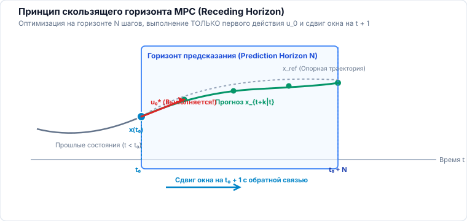
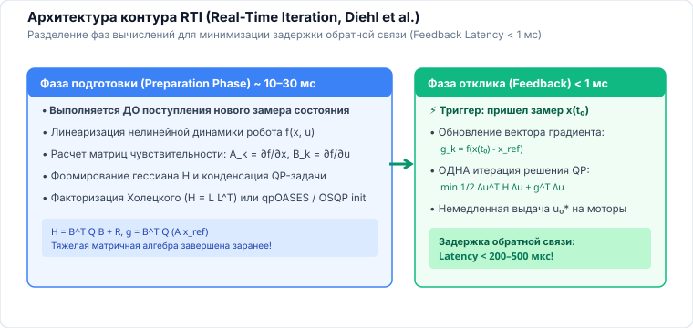

<!-- _class: lead -->
<!-- _header: "" -->
<!-- _footer: "" -->

# **Планирование движений мобильных роботов**
## Лекция 06: Предиктивное управление (Model Predictive Control — MPC)

⏱️ 90 минут
Предиктивное управление
Receding Horizon • Dense vs Sparse QP • NMPC • CBF • acados

---

<!-- _header: "Лекция 06 | Введение и мотивация" -->

## Чему посвящена эта лекция? Предиктивный горизонт

### 🎯 Слияние планирования и стабилизации

В классической архитектуре планировщик строит траекторию, а ПИД- или LQR-регулятор слепо пытается её отслеживать. Но когда перед роботом возникает жесткое физическое ограничение (предел тяги, стена, скользкий поворот), слепой регулятор терпит аварию.

Эта лекция посвящена <strong>Model Predictive Control (MPC)</strong>: передовой парадигме, которая непрерывно решает задачу оптимального управления в скользящем окне времени, прямо учитывая пределы приводов и препятствия.

**💡 Результат занятия:** Формулировать задачи Linear MPC и NMPC для колесных платформ, строить матрицы квадратичного программирования для солверов OSQP/qPOASES, вводить барьерные функции безопасности (CBF) и интегрировать суб-миллисекундные MPC-солверы в бортовой стек мобильного робота.

### 🔍 Ключевые вопросы лекции

- <strong>Принцип скользящего горизонта:</strong> Почему решается оптимизация на $N$ шагов вперед, но выполняется только $u_0^*$?
- <strong>Вычислительная архитектура:</strong> Плотная (Dense) vs разреженная (Sparse) квадратичная программа (QP) и сложность $\mathcal{O}(N)$.
- <strong>Математические гарантии:</strong> Терминальные множества $\mathcal{X}_f$, функции Ляпунова и рекурсивная допустимость.
- <strong>Нелинейный MPC (NMPC):</strong> Кинематика велосипеда, координаты Френе и обход препятствий через коридоры (SFC) и функции барьеров (<strong>CBF</strong>).
- <strong>Инженерия реального времени:</strong> Схема <strong>Real-Time Iteration (RTI)</strong> в солвере <code>acados</code> для работы на 50 Гц.

---

<!-- _header: "Лекция 06 | Структура занятия" -->

## План лекции на 90 минут ⏱️ 90 минут

### Часть 1: Концепция и Linear MPC (45 мин)

- <strong>00–12 мин:</strong> Парадигма скользящего горизонта (Receding Horizon Principle): оптимизация, применение первого шага, сдвиг.
- <strong>12–25 мин:</strong> Дискретный Linear MPC: матрицы состояний $(A, B)$, весовые матрицы $(Q, R, R_\Delta)$, штраф за дергание управления.
- <strong>25–37 мин:</strong> Структура задачи: Dense QP ($\mathcal{O}(N^3)$) vs Sparse QP ($\mathcal{O}(N)$), KKT-условия и солвер <code>OSQP</code>.
- <strong>37–45 мин:</strong> Теория устойчивости MPC: терминальная стоимость $P$ (DARE) и терминальное инвариантное множество $\mathcal{X}_f$.

### Часть 2: NMPC, Препятствия и Солверы (45 мин)

- <strong>45–58 мин:</strong> Нелинейный MPC (NMPC): кинематическая модель велосипеда, координаты Френе (Tracking vs Contour Error).
- <strong>58–70 мин:</strong> Препятствия в MPC: выпуклые безопасные коридоры (Safe Flight Corridors) и Control Barrier Functions (CBF).
- <strong>70–82 мин:</strong> Реализация в реальном времени: схема <strong>Real-Time Iteration (RTI)</strong>, солверы <code>acados</code> и <code>CasADi</code>.
- <strong>82–90 мин:</strong> Инженерные приемы: слак-переменные (мягкие ограничения), задержки в контуре, контрольные вопросы и Q&A.

<!--
Примечание для лектора:
MPC сегодня — фактический стандарт для беспилотных автомобилей, шагающих роботов (Boston Dynamics, ANYbotics) и складских AGV. Объясните слушателям баланс между теоретической строгостью (устойчивость по Ляпунову) и численной скоростью (RTI scheme).
-->
---

## 1. Парадигма скользящего горизонта (Receding Horizon) 00–12 мин

<strong>Model Predictive Control (MPC)</strong> решает задачу оптимального управления во временном окне длиной $N$ тактов дискретизации $\Delta t$ на каждом шаге контура управления:

### Четырехшаговый цикл MPC:

- <strong>Оценка состояния:</strong> получаем текущий вектор $x_k = x(t_k)$ (из фильтра EKF / SLAM).
- <strong>Оптимизация на горизонте $N$:</strong> находим оптимальную последовательность управлений $\mathbf{U}^* = \{u_0^*, u_1^*, \dots, u_{N-1}^*\}$.
- <strong>Исполнение первого шага:</strong> подаем на приводы <em>только</em> первое управление: $u(t) = u_0^*$.
- <strong>Сдвиг горизонта (Recede):</strong> сдвигаем окно на один шаг вперед: $t_{k+1} = t_k + \Delta t$ и повторяем процедуру!

### Почему MPC превосходит PID и LQR?

- <strong>Явный учет жестких неравенств:</strong> физические пределы углов руления $|\delta| \le \delta_{max}$, токов моторов $|I| \le I_{max}$ и границ стен.
- <strong>Упреждающее поведение (Feedforward Foresight):</strong> робот начинает плавно притормаживать перед закрытым поворотом <em>заранее</em>, а не после вылета с траектории.
- <strong>Естественная обратная связь:</strong> пересчет на каждом такте компенсирует проскальзывание колес, ветер и неточности матмодели.

---

## Разбор: почему из всего плана исполняется только первый шаг 08–12 мин

---

## 2. Дискретный Linear MPC: Математическая модель 12–25 мин

Рассматривается линейная дискретная система с шагом $\Delta t$:

$$x_{k+1} = A x_k + B u_k$$

### Квадратичный функционал стоимости:

$$J = \sum_{k=0}^{N-1} \left( x_k^T Q x_k + u_k^T R u_k + \Delta u_k^T R_\Delta \Delta u_k \right) + x_N^T P x_N$$

- $Q \succeq 0$ — штраф за отклонение от опорной точки.
- $R \succ 0$ — штраф за расход энергии / амплитуду управляющих воздействий.
- $R_\Delta \succ 0$ — штраф за скорость изменения управления $\Delta u_k = u_k - u_{k-1}$ (устраняет рывки моторов и механический износ).
- $P \succ 0$ — терминальная стоимость на конце горизонта $N$.

### Множество допустимых ограничений:

$$\begin{aligned}
u_{min} &\le u_k \le u_{max} && \text{(пределы приводов)} \\
\Delta u_{min} &\le u_k - u_{k-1} \le \Delta u_{max} && \text{(ограничение рывка / slew-rate)} \\
x_{min} &\le x_k \le x_{max} && \text{(безопасные зоны состояния)}
\end{aligned}$$

<strong>Ключевая особенность:</strong> Если на шаге $k$ решения, удовлетворяющего всем жестким ограничениям, не существует — оптимизатор выдает ошибку (Infeasible), и робот рискует потерять управление!

---

## 3. Структура задачи: Dense QP vs Sparse QP 25–37 мин

### Плотная форма (Dense / Condensed QP):

Состояния выражаются через начальное $x_0$ и вектор управлений $\mathbf{U} = [u_0^T, \dots, u_{N-1}^T]^T$:

$$x_k = A^k x_0 + \sum_{j=0}^{k-1} A^{k-1-j} B u_j$$

- Оптимизация только по $\mathbf{U} \in \mathbb{R}^{m N}$.
- Матрица Гессиана $H_{dense}$ <strong>полностью заполнена (плотная)</strong>.
- Сложность факторизации: $\mathcal{O}(m^3 N^3)$.
- Эффективно <em>только</em> для коротких горизонтов ($N \le 10$).

### Разреженная форма (Sparse QP):

И состояния $\mathbf{X}$, и управления $\mathbf{U}$ остаются переменными оптимизации. Динамика задается как равенства $x_{k+1} - A x_k - B u_k = 0$:

$$\min_{\mathbf{X}, \mathbf{U}} \frac{1}{2} \mathbf{Z}^T \mathbf{H} \mathbf{Z} \quad \text{при } \mathbf{A}_{eq} \mathbf{Z} = \mathbf{b}_{eq}, \;\; \mathbf{C} \mathbf{Z} \le \mathbf{d}$$

- Гессиан $\mathbf{H}$ и матрица $\mathbf{A}_{eq}$ имеют <strong>блочно-диагональную структуру</strong>!
- Солверы на методе расщепления операторов (<code>OSQP</code>) или Riccati-факторизации решают задачу со сложностью <strong>$\mathcal{O}(N)$</strong>!
- Масштабируется до горизонтов $N = 100$ и более.

---

## 4. Гарантии устойчивости и рекурсивная допустимость 37–48 мин

### Проблема конечного горизонта:

Поскольку горизонт $N$ конечен, оптимальное управление на интервале $[0, N]$ <strong>не гарантирует</strong> асимптотическую устойчивость всей замкнутой бесконечной системы!

Робот может развить максимальную скорость к концу горизонта и физически не успеть затормозить перед стеной на шаге $N+1$.

### Рекурсивная допустимость (Recursive Feasibility):

Если задача имела допустимое решение в момент времени $t$, то гарантируется, что она будет иметь решение и в момент $t + \Delta t$.

### Теорема устойчивости (Mayne et al., 2000):

Система с MPC асимптотически устойчива по Ляпунову, если:

- <strong>Терминальная стоимость $P$:</strong> матрица $P$ удовлетворяет дискретному алгебраическому уравнению Риккати (DARE) для локального LQR-регулятора $u = K_f x$.
- <strong>Терминальное инвариантное множество $\mathcal{X}_f$:</strong> в конце горизонта $x_N \in \mathcal{X}_f$, где $\mathcal{X}_f$ является контрольно-инвариантным множеством:
$$(A + B K_f) \mathcal{X}_f \subseteq \mathcal{X}_f \subseteq \mathcal{X}_{free}$$

Тогда оптимальная функция стоимости $V^*(x)$ выступает строгой <strong>функцией Ляпунова</strong>: $V^*(x_{k+1}) - V^*(x_k) \le -x_k^T Q x_k < 0$.

---

## 5. Нелинейный MPC (NMPC) для мобильных роботов 48–60 мин

### Кинематическая модель велосипеда (Bicycle Model):

$$\begin{aligned}
\dot{x} &= v \cos(\psi + \beta) \\
\dot{y} &= v \sin(\psi + \beta) \\
\dot{\psi} &= \frac{v}{l_r} \sin\beta, \quad \beta = \arctan\left(\frac{l_r}{l_f + l_r} \tan\delta\right) \\
\dot{v} &= a
\end{aligned}$$

где $\delta$ — угол поворота передних колес, $a$ — продольное ускорение, $\beta$ — угол увода центра масс.

### Координаты Френе (Contouring MPC):

Вместо глобальных координат $(x, y)$ состояние проецируется на осевую линию пути $\mathbf{p}(s)$:

- $s$ — пройденная дуговая координата вдоль пути.
- $e_l$ — боковая ошибка отклонения от пути (Lag Error).
- $e_c$ — ошибка контура (Contour Error).

$$J = \sum_{k=0}^{N-1} \Big( w_c e_c^2(k) + w_l e_l^2(k) - w_s v_s(k) \Big)$$

<strong>Эффект:</strong> Слагаемое $-w_s v_s$ поощряет робота мчаться вперед по пути, а $w_c, w_l$ не дают ему срезать повороты и вылетать с трассы.

---

## 6. Препятствия в MPC: Выпуклые коридоры и CBF 58–70 мин

### Safe Flight Corridors (SFC — Выпуклые коридоры):

Свободное пространство $\mathcal{C}_{free}$ невыпукло. Но вдоль глобального пути можно построить цепочку пересекающихся <strong>выпуклых политопов</strong>:

$$\mathcal{P}_k = \{ x \in \mathbb{R}^2 \mid \mathbf{A}_k x \le \mathbf{b}_k \}$$

- Нелинейные препятствия заменяются набором линейных неравенств $\mathbf{A}_k x_k \le \mathbf{b}_k$.
- Задача сохраняет выпуклость (QP) и решается за доли миллисекунды!

### Control Barrier Functions (Дискретные CBF):

Определим безопасное множество $\mathcal{S} = \{x \mid h(x) \ge 0\}$, где $h(x) = \|x - p_{obs}\|^2 - r_{safe}^2$.

Условие дискретной барьерной функции гарантирует инвариантность безопасности множества $\mathcal{S}$:

$$\Delta h(x_k, u_k) = h(x_{k+1}) - h(x_k) \ge -\gamma h(x_k), \quad 0 < \gamma \le 1$$

<strong>Преимущество:</strong> CBF добавляется в квадратичную программу как простое линейное ограничение на $u_k$, обеспечивая 100% математическую гарантию нестолкновения!

---

## 7. Real-Time Iteration (RTI) и стек солверов 70–82 мин

### Схема Real-Time Iteration (Diehl et al.):

Полное решение нелинейной программы (NMPC) методом SQP требует десятков итераций Ньютона (неприемлемо для 50 Гц). Схема RTI разделяет такт на две фазы:

- <strong>Preparation Phase (Фоновая фаза, 80% времени):</strong> интеграция динамики, линеаризация нелинейной модели, расчет матриц KKT-системы <em>до прихода нового замера</em>.
- <strong>Feedback Phase (Мгновенная фаза, < 1 мс):</strong> пришел свежий замер $x_0$ от SLAM $\rightarrow$ решение <strong>ровно одной</strong> задачи QP $\rightarrow$ выдача $u_0^*$ на моторы!

### Индустриальный стек солверов MPC (2026):

- <strong><code>acados</code>:</strong> высокопроизводительный генератор C-кода для NMPC (HPIPM QP-солвер, BLASFEO линейная алгебра). Время цикла: <strong>0.5–2 мс</strong> на ARM Cortex / NVIDIA Jetson.
- <strong><code>CasADi</code>:</strong> символьный инструмент автоматического дифференцирования (C++/Python). Идеален для прототипирования сложных моделей.
- <strong><code>OSQP</code>:</strong> операторное расщепление (ADMM) для разреженных Linear QP. Нечувствителен к вырождению ограничений.

---

## Разбор: куда уходит бюджет такта в реальном контуре 78–82 мин

---

<!-- _class: accent -->
<!-- _header: "Лекция 06 | Итоги и вопросы" -->

## Резюме лекции и контрольные вопросы 82–90 мин

### Главные выводы:

- <strong>MPC</strong> объединяет прогнозирование динамики, оптимизацию функционала и соблюдение физических ограничений в скользящем окне.
- <strong>Sparse QP</strong> формулировка масштабируется линейно $\mathcal{O}(N)$, вытесняя медленный Dense QP.
- <strong>Устойчивость по Ляпунову</strong> строго гарантируется выбором терминального веса Риккати $P$ и инвариантного множества $\mathcal{X}_f$.
- <strong>Выпуклые коридоры (SFC)</strong> и <strong>Control Barrier Functions (CBF)</strong> переводят обход нелинейных препятствий в быстрые QP-ограничения.
- <strong>Схема RTI (acados)</strong> обеспечивает расчет NMPC на частотах 50–100 Гц на бортовых контроллерах.

### Контрольные вопросы для самопроверки:

- Почему в MPC исполняется только первое вычисленное управление $u_0^*$, а не весь найденный профиль?
- В чем вычислительная разница между плотной (Dense) и разреженной (Sparse) постановкой QP в MPC?
- Зачем в целевую функцию включают штраф за скорость изменения управления $\Delta u_k^T R_\Delta \Delta u_k$?
- Как схема Real-Time Iteration (RTI) позволяет запускать нелинейный MPC на частотах 100 Гц?

Следующая лекция: Учёт ограничений (Неголономность, Скобки Ли, TOPP)

