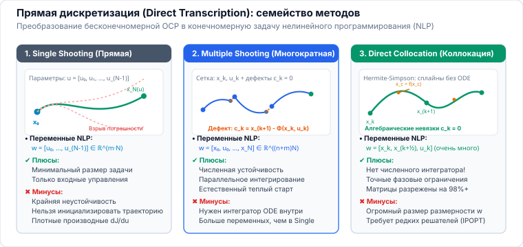
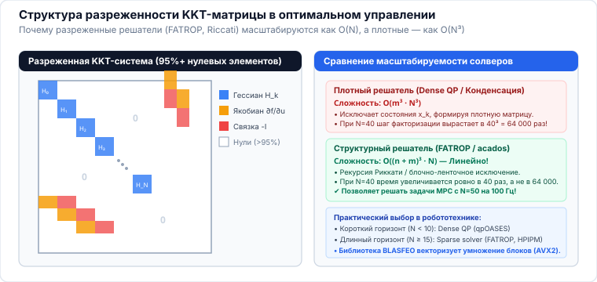
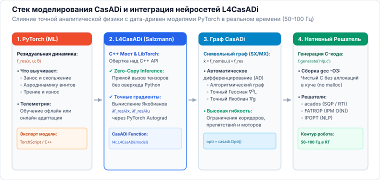

<!-- _class: lead -->
<!-- _header: "" -->
<!-- _footer: "" -->

# **Планирование движений мобильных роботов**
## Лекция 06: Численное оптимальное управление и MPC: как роботы оптимизируют траектории в реальном времени

<div class="mt-4">

<span class="badge badge-blue">⏱️ 90 минут</span>
<span class="badge badge-green">Прикладная оптимизация</span>
<span class="badge badge-purple">Shooting • Collocation • SQP • IPOPT • CasADi • L4CasADi • NMPC</span>

</div>

---

<!-- _header: "Лекция 06 | Введение и мотивация" -->

## Мост от теории к реальным роботам <span class="badge badge-time">02–06 мин</span>

<div class="grid-2 mt-2">

<div class="card card-accent">

### 🤖 Что мы узнали в Лекции 05?

В предыдущей лекции мы увидели, как физика моторов рождает закон **Bang-Bang**: чтобы двигаться быстрее всего, приводы должны работать на пределе. Для простой тележки на рельсе мы вывели точную формулу кривой переключения $\Gamma: x + \frac{1}{2}v|v| = 0$.

**Но что происходит в реальном мире?**
- Робот едет по складу со стенами, колоннами, коробками и людьми.
- Модель движения нелинейна (автомобиль с прицепом, дрон с 4 винтами, шагающий робот).
- Написать аналитическую формулу на листке бумаги для такой задачи **математически невозможно**!

</div>

<div class="card">

### 🎯 Решение: Пусть считает бортовой компьютер!

Вместо поиска формул вручную мы поручаем расчет компьютеру:

$$\min \quad J = \sum_{k=0}^{N-1} L(x_k, u_k) \quad \text{при физике} \quad x_{k+1} = f(x_k, u_k) \quad \text{и препятствиях}$$

**Ключевой вызов робототехники:**
Бортовой компьютер робота должен находить этот оптимум **каждые 10–20 миллисекунд (50–100 Гц)** на ходу!

В этой лекции мы разберем, как устроен современный вычислительный контур оптимального управления (MPC).

</div>

</div>

<!-- 
Методические указания лектору:
1. Подчеркните логический мост: в лекции 05 мы поняли физику предельного управления на бумаге. Теперь мы переходим к тому, как это работает на борту реальных роботов (Tesla, Waymo, DJI, Boston Dynamics).
-->

---

## План лекции на 90 минут <span class="badge badge-time">06–09 мин</span>

<div class="grid-2 mt-4">

<div class="card card-alert">

### Часть 1: Оцифровка движения и численные солверы (45 мин)
1. **Смена парадигмы:** «First Discretize, then Optimize» (от непрерывного времени к шагам).
2. **Три метода оцифровки траектории:**
   - **Single Shooting:** симуляция в лоб и «эффект бабочки».
   - **Multiple Shooting:** нарезка на кусочки и сшивание швов (стандарт индустрии).
   - **Direct Collocation:** сплайны без численного симулятора.
3. **Интерактивная практика №1:** Симулятор методов стрельбы и коллокации.
4. **Как работают солверы:**
   - **SQP (Последовательное QP):** метод Ньютона и магия тёплого старта.
   - **Метод внутренней точки (IPOPT):** отталкивающие силовые поля барьеров.
   - **Секрет скорости:** разреженность матриц ($O(N)$ вместо $O(N^3)$).

</div>

<div class="card card-success">

### Часть 2: Программный стек и контур MPC (45 мин)
5. **Фреймворк CasADi:** Символьные графы, автодифференцирование и генерация C-кода.
6. **Нейросети в оптимизации — L4CasADi:** Встраивание PyTorch в солвер реального времени.
7. **Контур управления MPC (Model Predictive Control):**
   - Скользящий горизонт (Receding Horizon): 4 шага замкнутого цикла.
   - Безопасные коридоры (SFC) для обхода препятствий.
   - Схема Real-Time Iteration (RTI): задержка отклика $< 1$ мс.
8. **Интерактивная практика №2:** Симулятор навигации MPC с препятствиями.
9. **Резюме курса:** Как все изученные методы соединяются в единый стек робота.

</div>

</div>

<!-- 
Методические указания лектору:
1. Обратите внимание аудитории: в этой лекции будет сразу ДВА интерактивных симулятора: сначала разберем оцифровку траекторий, а затем погоняем робота в контуре MPC.
-->

---

<!-- _header: "Лекция 06 | Часть 1: Оцифровка движения и солверы" -->

## 1. Смена парадигмы: Как скормить физику компьютеру? <span class="badge badge-time">09–14 мин</span>

<div class="grid-2">

<div class="col">

### Непрерывный мир vs Дискретный процессор

В реальном мире время непрерывно: $t \in [0, T]$, траектория — гладкая функция.
Но процессор компьютера не умеет работать с бесконечномерными непрерывными функциями. Он умеет оперировать только **конечными массивами чисел**!

**Принцип прямой транскрипции (Direct Transcription):**
$$\text{Сначала оцифруй (дискретизируй), затем оптимизируй!}$$

Мы делим интервал времени $T$ (например, 2 секунды) на $N$ равных шагов по $\Delta t = 50$ мс:
$$t_0, \quad t_1 = t_0 + \Delta t, \quad \dots, \quad t_N = t_0 + N \cdot \Delta t$$

Вместо непрерывного графика $u(t)$ мы ищем $N$ чисел: $u_0, u_1, \dots, u_{N-1}$!

</div>

<div class="col">

<div class="card card-accent">

### Задача нелинейного программирования (NLP)

После оцифровки задача поиска траектории превращается в стандартную задачу поиска минимума функции многих переменных:

$$\min_{w} \quad F(w)$$

$$\text{при условиях:} \quad \begin{cases}
g(w) = 0 & \text{(законы физики не нарушены)} \\
h(w) \le 0 & \text{(робот не врезался в стены и мотор в пределах)}
\end{cases}$$

Вектор оптимизируемых переменных $w$ содержит дискретные точки траектории и команды моторов.

**Вопрос:** Как именно связать между собой соседние точки $x_k$ и $x_{k+1}$? Для этого есть три главных метода!

</div>

</div>

</div>

<!-- 
Методические указания лектору:
1. Приведите аналогию: непрерывный звук на виниловой пластинке vs оцифрованный MP3-файл с частотой дискретизации 44.1 кГц. Мы делаем то же самое с траекторией движения робота.
-->

---

## 2. Три метода оцифровки: Single Shooting, Multiple Shooting, Collocation <span class="badge badge-time">14–22 мин</span>

<div class="grid-2">

<div class="col">

<div class="card card-alert">

### 1. Single Shooting («Симуляция в лоб»)
Оптимизируем **только команды моторов**: $w = [u_0, u_1, \dots, u_{N-1}]^T$.
Точки пути вычисляются последовательным прогоном симулятора от старта $x_0$.
- **Плюс:** Очень мало переменных (всего $N$ чисел).
- **Критический порок — «Эффект бабочки»:** Ошибка на первом шаге $u_0$ накапливается по экспоненте к концу горизонта. Для дронов и шагающих роботов оптимизатор улетает в бесконечность!

</div>

<div class="card card-success mt-2">

### 2. Multiple Shooting («Нарезка на кусочки»)
Индустриальный стандарт робототехники (H. G. Bock, 1984)!
Нарезаем горизонт на короткие интервалы по 50 мс. Оптимизируем **и позы $x_k$, и моторы $u_k$**!
Симулируем каждый кусочек отдельно, а неразрывность задаем условием:
$$c_k = x_{k+1} - \text{физика}(x_k, u_k) = 0$$
- **Суперсила:** Численно сверхустойчив, ошибки не накапливаются, поддерживается легкий **тёплый старт** от $A^*$ или RRT!

</div>

</div>

<div class="col">

<div class="card card-accent">

### 3. Direct Collocation («Без симулятора»)

Что если вообще отказаться от численного интегрирования дифференциальных уравнений?
- Траектория аппроксимируется непрерывным полиномиальным сплайном (например, кубическим полиномом Hermite–Simpson).
- Уравнения физики проверяются как обычные алгебраические равенства в контрольных точках (точках коллокации).
- **Суперсила:** Препятствия и границы коридоров проверяются прямо в узлах сетки! Оптимизатор легко огибает сложные препятствия.
- **Применение:** Расчет сложнейших акробатических прыжков роботов Boston Dynamics (Atlas).

</div>

</div>

</div>

<!-- 
Методические указания лектору:
1. Объясните студентам разницу на простой аналогии:
   - Single Shooting: вы стреляете из лука и пытаетесь попасть в яблоко за 1 км, подбирая только угол вылета стрелы на старте.
   - Multiple Shooting: вы расставили 10 стрелков цепочкой через каждые 100 метров, и каждый передает стрелу следующему. Задача оптимизатора — сшить концы рук.
-->

---

## Диаграмма: Сравнение Single Shooting, Multiple Shooting и Collocation <span class="badge badge-time">22–25 мин</span>

<div class="diagram-box">



</div>

<!-- 
Методические указания лектору:
1. Прокомментируйте три панели схемы:
   - Панель 1: красные линии показывают, как разлетаются траектории при малейшем шуме в u_0.
   - Панель 2: видны независимые короткие отрезки и красные разрывы (дефекты c_k), которые схлопываются в ноль при оптимизации.
   - Панель 3: непрерывная оранжевая кривая сплайна с точками коллокации.
-->

---

<!-- _header: "ИНТЕРАКТИВНАЯ ПРАКТИКА | СИМУЛЯТОР МЕТОДОВ ОЦИФРОВКИ" -->

## Интерактивный симулятор: Single vs Multiple Shooting vs Collocation <span class="badge badge-time">25–30 мин</span>

<div class="interactive-container">

<div class="interactive-header">

<span><i class="interactive-dot"></i> Исследование методов прямой транскрипции: Чувствительность, дефекты неразрывности и сплайны</span>
<span>Переключение режимов [Single / Multi / Colloc] | Ползунки управления | Кнопка «Шаг оптимизации»</span>

</div>
<iframe src="http://localhost:5599/widgets/shooting-collocation-simulator/index.html" class="interactive-frame"></iframe>

</div>

<!-- 
Методические указания лектору:
1. Включите режим Single Shooting: подвигайте ползунок u_0. Обратите внимание студентов, как дико виляет конец траектории (эффект бабочки).
2. Переключитесь в режим Multiple Shooting: покажите красные пунктирные разрывы (дефекты c_k != 0).
3. Нажмите кнопку «⚡ Сделать шаг оптимизации»: покажите, как оптимизатор плавно сшивает швы, превращая кусочки в идеальную непрерывную траекторию!
-->

---

## 3. Как работают численные солверы (SQP и IPOPT)? <span class="badge badge-time">30–38 мин</span>

<div class="grid-2">

<div class="col">

### Метод SQP (Последовательное QP)

Как найти минимум сложной нелинейной функции с препятствиями?
**Метод SQP** обобщает знакомый студентам метод касательных Ньютона!

На каждом шаге $k$:
1. Сложная нелинейная функция заменяется **простой параболой** (квадратичной подзадачей QP):
   $$\min_{\Delta w} \quad \frac{1}{2} \Delta w^T H \Delta w + \nabla F^T \Delta w$$
2. Подзадача QP решается мгновенно (за доли миллисекунды) стандартными алгоритмами.
3. Делаем шаг: $w^{k+1} = w^k + \Delta w$.

**Главный козырь SQP в робототехнике — Тёплый старт (Warm-Starting):**
Робот пересчитывает план каждые 10 мс. За это время он едва сдвинулся на пару сантиметров. Старый план — прекрасная начальная догадка! Метод SQP сходится **всего за 1–2 итерации**!

</div>

<div class="col">

<div class="card card-accent">

### Метод внутренней точки (IPOPT) и FATROP

Что делать, если в задаче тысячи препятствий и ограничений?

Вместо жестких заборов метод внутренней точки ставит **отталкивающее силовое поле** — логарифмический барьер:
$$B(s) = -\mu \sum \ln(s_i)$$

- Чем ближе робот к стене, тем сильнее барьер отталкивает его назад в безопасную зону!
- Параметр $\mu$ постепенно уменьшают ($\mu \to 0$), поджимая траекторию к истинному оптимуму.

**⚡ SOTA-решатель FATROP (KU Leuven, 2023):**
- Классический **IPOPT** универсален, но тяжеловат для бортовых микроконтроллеров.
- **FATROP (Fast Trajectory Optimizer):** специализированный солвер метода внутренней точки для робототехники. За счет блочно-ленточной алгебры и низкоуровневой библиотеки BLASFEO он решает задачи NMPC с препятствиями в разы быстрее IPOPT со строго линейной сложностью $\mathcal{O}(N)$!

</div>

</div>

</div>

<!-- 
Методические указания лектору:
1. Сделайте четкий практический вывод:
   - Если нужно пересчитывать управление на ходу с частотой 100 Гц с тёплым стартом -> классически выбирают SQP (acados).
   - Если задача огромная и забита препятствиями -> классический IPOPT работает слишком медленно, но тут на сцену выходит SOTA-инструмент **FATROP**, делающий метод внутренней точки пригодным для онлайна на микроконтроллерах.
-->

---

## 4. Секрет молниеносной скорости: Разреженность матриц <span class="badge badge-time">38–45 мин</span>

<div class="grid-2">

<div class="col">

### Почему наивный расчет тормозит, а робот успевает за 2 мс?

Если записать все переменные траектории в один вектор, матрица задачи для горизонта $N=40$ шагов имеет размер порядка $400 \times 400$.

Решение общей линейной системы размера $M$ методом Гаусса требует:
$$\mathcal{O}(M^3) \sim 400^3 \approx 64\,000\,000 \text{ операций!}$$
Бортовой микроконтроллер зависнет на полсекунды.

**Но посмотрите на структуру физики робота:**
- Положение в момент времени $k+1$ зависит **ТОЛЬКО от момента $k$**!
- Положение в момент $k+10$ никак прямо не связано с моментом $k+1$.
- **Более 98% элементов матрицы равны чистому нулю!**

</div>

<div class="col">

<div class="card card-success">

### Рекурсия Риккати: Сложность $\mathcal{O}(N)$

Специализированные робототехнические решатели (**acados, FATROP**) не хранят и не умножают нули!
Они используют блочную факторизацию Риккати, идущую от конца горизонта к началу:

$$\text{Сложность:} \quad \mathcal{O}(\mathbf{N}) \quad \text{— СТРОГО ЛИНЕЙНО!}$$

- Увеличили горизонт планирования в 2 раза? Время расчета вырастет ровно в 2 раза, а не в 8 раз!
- Время расчета на процессоре ARM: **всего 1–3 миллисекунды**! Робот успевает работать на частоте 100 Гц.

</div>

<div class="diagram-box mt-2" style="height: 120px;">



</div>

</div>

</div>

<!-- 
Методические указания лектору:
1. Обратите внимание студентов на картинку матрицы: синие и желтые квадратики идут узкой полосой по диагонали, а всё остальное пространство — белые нули.
-->

---

<!-- _header: "Лекция 06 | Часть 2: Программный стек и контур MPC" -->

## 5. Программный стек робототехники: CasADi <span class="badge badge-time">45–52 мин</span>

<div class="grid-2">

<div class="col">

### Никто не берет производные руками!

Чтобы скормить модель робота оптимизатору, нужны матрицы градиентов (якобианы и гессианы).
- Брать их на бумаге для робота с 6 колесами или дрона — сотни страниц формул и верные баги в знаках.
- Численная производная через приращения $f(x+\epsilon) - f(x)$ медленная и неточная.

**Стандарт де-факто мировой робототехники — CasADi (KU Leuven):**
Фреймворк символьных вычислений и алгоритмического дифференцирования (**Algorithmic Differentiation, AD**).
- Вы пишете физику робота на понятном Python (как в NumPy).
- CasADi строит граф вычислений и берет **машинно-точные производные** по цепочке графа.
- В один клик компилирует модель в **чистый, сверхбыстрый C-код** без оверхеда Python!

</div>

<div class="col">

```python
import casadi as ca

# 1. Объявляем символьные переменные
x = ca.SX.sym('x'); y = ca.SX.sym('y'); theta = ca.SX.sym('theta')
v = ca.SX.sym('v'); omega = ca.SX.sym('omega')

state = ca.vertcat(x, y, theta)
control = ca.vertcat(v, omega)

# 2. Задаем физику колесного робота
rhs = ca.vertcat(
    v * ca.cos(theta),
    v * ca.sin(theta),
    omega
)
f = ca.Function('f', [state, control], [rhs])

# 3. Мгновенный точный якобиан по состоянию df/dx:
df_dx = ca.jacobian(rhs, state)

# 4. Генерация C-кода для микроконтроллера:
f.generate('robot_model.c')
```

</div>

</div>

<!-- 
Методические указания лектору:
1. Покажите студентам код: всего 15 строчек на Python, и мы получаем готовую модель с точными производными, экспортируемую прямо в C/C++ для ROS 2 или микроконтроллера.
-->

---

## 6. Нейросети в контуре оптимизации: L4CasADi <span class="badge badge-time">52–60 мин</span>

<div class="grid-2">

<div class="col">

### Проблема: Реальная физика слишком сложна!

Аналитические уравнения прекрасно описывают геометрию. Но что делать с эффектами, которые невозможно записать формулой?
- Скольжение резиновых колес по мокрому бетону или песку;
- Аэродинамические завихрения под винтами квадрокоптера около земли;
- Люфты и упругие деформации в редукторах манипулятора.

**Решение инженеров:** Собрать телеметрию с датчиков реального робота и обучить нейросеть предсказывать невязку физики $\Delta f(x, u)$ в **PyTorch**!

**Но как встроить нейросеть PyTorch в солвер траекторий?**

</div>

<div class="col">

<div class="card card-accent">

### Библиотека L4CasADi (SOTA, 2023–2024)

Фреймворк **L4CasADi (Learning for CasADi)** связывает PyTorch и CasADi:

$$\dot{x} = \underbrace{f_{\text{аналитика}}(x, u)}_{\text{Базовая кинематика/динамика}} + \underbrace{\text{NN}_\theta(x, u)}_{\text{Нейросеть в PyTorch (L4CasADi)}}$$

1. Нейросеть PyTorch компилируется через TorchScript в оптимизированный C++ модуль.
2. L4CasADi пробрасывает тензоры между солвером и видеокартой/процессором за **микросекунды**.
3. При оптимизации градиенты от нейросети берутся через автоматическое дифференцирование PyTorch (`autograd`)!

</div>

</div>

</div>

<!-- 
Методические указания лектору:
1. Подчеркните передний край технологий: это то, что сейчас внедряют в автономных машинах и беспилотных дронах на гонках Formula Student Autonomous и Drone Racing.
-->

---

## Диаграмма: Архитектура стека CasADi + L4CasADi <span class="badge badge-time">60–63 мин</span>

<div class="diagram-box">



</div>

<!-- 
Методические указания лектору:
1. Прокомментируйте цепочку:
   - Сверху: модель робота в Python транслируется в скомпилированный C-код.
   - Снизу: PyTorch нейросеть тренируется оффлайн на логах, а затем встраивается как внешний узел в граф вычислений солвера.
-->

---

## 7. Контур MPC: Принцип скользящего горизонта <span class="badge badge-time">63–70 мин</span>

<div class="grid-2">

<div class="col">

### Идея скользящего горизонта (Receding Horizon)

Пусть наш солвер умеет рассчитывать оптимальную траекторию за 2 миллисекунды. Как применить это к роботу?

**Четырехшаговый цикл обратной связи (Loop 50–100 Гц):**
1. **Измерение:** Опрашиваем одометрию, лидар и IMU: где робот находится прямо сейчас ($x_0$).
2. **Прогноз:** Решаем задачу оптимизации на $N$ шагов вперед (например, на 2 секунды). Получаем последовательность команд:
   $$u_0^*, \quad u_1^*, \quad \dots, \quad u_{N-1}^*$$
3. **Действие:** Посылаем на моторы **ТОЛЬКО ПЕРВУЮ КОМАНДУ $u_0^*$** (на следующие 20 мс)! Все остальные $N-1$ команд выбрасываются!
4. **Сдвиг горизонта:** Спустя 20 мс робот сместился. Сдвигаем окно вперед и повторяем расчет заново!

</div>

<div class="col">

<div class="card card-success">

### 🛡️ Почему MPC так популярен в мире?

1. **Мгновенное подавление возмущений:** Порыв ветра сдул дрон? Колесо пробуксовало на плитке? На следующем такте (через 10 мс) MPC измерит новую позу и мгновенно пересчитает план с учетом ошибки!
2. **Строгое соблюдение ограничений:** Моторы гарантированно не выйдут за допустимый ток, а колеса не вывернутся больше предельного угла.
3. **Естественный объезд препятствий:** Новые препятствия от лидара появляются прямо в задаче оптимизации в реальном времени.

</div>

</div>

</div>

<!-- 
Методические указания лектору:
1. Простая аналогия: водитель за рулем автомобиля. Вы смотрите вперед на 100 метров (горизонт N), но не закрываете глаза на эти 100 метров! Вы непрерывно крутите руль и обновляете свой план каждый миг.
-->

---

## 8. Как обойти препятствия: Безопасные коридоры (SFC) <span class="badge badge-time">70–75 мин</span>

<div class="grid-2">

<div class="col">

### Препятствия — главные враги оптимизации

Почему препятствия делают задачу сложной?
- Допустимое пространство движения становится **невыпуклым**: столб можно объехать слева, а можно справа.
- Между двумя траекториями (слева и справа) лежит сам столб — взять их среднее нельзя, это приведет к аварии!
- Оптимизатор может легко застрять в локальном минимуме (например, упереться носом в угол стола).

**Индустриальное решение: Безопасные выпуклые коридоры (Safe Flight Corridors, SFC):**
1. Глобальный планировщик ($A^*$ или RRT из лекций 02–03) находит грубый геометрический путь сквозь лабиринт.
2. Вокруг этого пути надувается цепочка пересекающихся **выпуклых безопасных многогранников (коробок)**.
3. Внутри каждого полиэдра ограничение становится простым линейным неравенством $A x \le b$, которое солвер щелкает мгновенно!

</div>

<div class="col">

<div class="card card-accent">

### Схема Real-Time Iteration (RTI, Мориц Диль)

Как уложить тяжелый нелинейный расчет в задержку менее 1 миллисекунды?

Алгоритм **RTI** разделяет такт управления на две фазы:

1. **Фаза подготовки (Preparation Phase, ~10–15 мс):**
   Пока робот еще выполняет предыдущую команду, мы заранее линеаризуем физику и строим матрицы QP на следующем шаге.
2. **Фаза обратной связи (Feedback Phase, < 0.5 мс):**
   Приходит свежий замер датчиков $x_0$ $\to$ делаем ровно **одно быстрое решение QP** $\to$ немедленно выдаем команду на моторы!

Задержка между измерением датчика и реакцией мотора составляет **доли миллисекунды**!

</div>

</div>

</div>

<!-- 
Методические указания лектору:
1. Подчеркните гениальность связки: A* находит коридор безопасности, а MPC плавно и на предельной скорости ведет робота внутри этого коридора.
-->

---

<!-- _header: "ИНТЕРАКТИВНАЯ ПРАКТИКА | MPC РЕШАТЕЛЬ В РЕАЛЬНОМ ВРЕМЕНИ" -->

## Интерактивный симулятор: Контур управления NMPC <span class="badge badge-time">75–83 мин</span>

<div class="interactive-container">

<div class="interactive-header">

<span><i class="interactive-dot"></i> Исследование контура MPC: Скользящий горизонт N, обход препятствий и сравнение солверов</span>
<span>Перетаскивайте Робота, Цель и Препятствия | Переключение [SQP / Interior Point] | Регулировка горизонта N</span>

</div>
<iframe src="http://localhost:5599/widgets/mpc-interactive-solver/index.html" class="interactive-frame"></iframe>

</div>

<!-- 
Методические указания лектору:
1. Запустите симулятор кнопкой «▶ Старт».
2. Перетащите круглое препятствие прямо перед носом робота: покажите, как зеленый предиктивный «ус» горизонта мгновенно изгибается и плавно обходит препятствие.
3. Переключите солвер на Interior Point (IPM) и SQP: обратите внимание студентов на время расчета (1-2 мс) и количество итераций с тёплым стартом.
-->

---

## 9. Как всё соединяется в единый стек автономного робота? <span class="badge badge-time">83–87 мин</span>

<div class="grid-2">

<div class="col">

### Иерархия навигационного стека (ROS 2 Nav2 / Autoware)

Вся картина курса складывается в стройную инженерную систему:

```
          [ Карта среды / Лидарная сетка ]
                         │
                         ▼
     Глобальный уровень (Лекции 01–03):
     A*, Theta*, Hybrid A*, RRT*
     (Геометрический путь без задержки моторов)
                         │
                         ▼
     Генерация коридора безопасности (SFC)
                         │
                         ▼
     Локальный предиктивный уровень (Лекция 06):
     NMPC + Multiple Shooting + SQP (acados)
     (Горизонт 2 секунды, частота 50–100 Гц)
                         │
                         ▼
     [ Сигналы скорости v, ω на контроллеры моторов ]
```

</div>

<div class="col">

<div class="card card-accent">

### Сводная таблица методов курса

| Метод | Что оптимизирует? | Время расчета | Где применяется? |
| :--- | :--- | :--- | :--- |
| **$A^*$ / Hybrid $A^*$** | Длина пути / кинематика | 50–200 мс | Глобальный маршрут |
| **DWA (Лекция 04)** | Дуги скоростей на сетке | 10–20 мс | Простые тележки |
| **MPPI (Лекция 04)** | Случайный стохаст. шум | 15–30 мс (GPU) | Агрессивная езда |
| **Bang-Bang (Лекция 05)** | Аналитический предел | $< 0.01$ мс | Приводы 1D/2D |
| **NMPC (Лекция 06)** | Полная физика + ограничения | 1–5 мс (CPU) | **Беспилотные авто, дроны, четвероногие роботы** |

</div>

</div>

</div>

<!-- 
Методические указания лектору:
1. Покажите студентам, как пройденные темы (A*, RRT, кинодинамика, MPPI, Bang-Bang, MPC) дополняют друг друга в реальной индустрии.
-->

---

## Резюме лекции и контрольные вопросы <span class="badge badge-time">87–90 мин</span>

<div class="grid-2">

<div class="col">

<div class="card card-accent">

### Ключевые выводы лекции:
1. **Оцифровка движения:** Multiple Shooting — стандарт индустрии. Он делит горизонт на кусочки, гарантирует численную устойчивость и идеальный тёплый старт.
2. **Разреженность — ключ к 100 Гц:** Состояние $k+1$ зависит только от $k$. Блочная факторизация Риккати снижает сложность с кубической $O(N^3)$ до строго линейной $O(N)$.
3. **SQP vs Метод барьеров:** SQP превосходит всё за счет мгновенного тёплого старта в онлайн-контуре MPC (1–2 итерации на такт).
4. **Инструменты (CasADi + L4CasADi):** Позволяют писать модель на Python, компилировать в С и встраивать обученные нейросети PyTorch с точными градиентами.
5. **MPC:** Принцип скользящего горизонта гарантирует устойчивость к возмущениям, ветру и скольжению колес.

</div>

</div>

<div class="col">

<div class="card card-success">

### ❓ Вопросы для самопроверки:
1. Почему Single Shooting разваливается при увеличении длины горизонта прогноза?
2. За счет чего метод SQP требует всего 1–2 итерации в контуре реального времени?
3. Зачем нужна библиотека L4CasADi, если в CasADi уже есть символьная физика?
4. Почему в алгоритме MPC на приводы робота подается только первое вычисленное управление $u_0^*$?

</div>

</div>

</div>

<!-- 
Методические указания лектору:
1. Поблагодарите студентов за работу на двух взаимосвязанных лекциях по оптимальному управлению.
2. Подведите итог: теперь студенты знают как фундаментальную теорию (Понтрягин, Bang-Bang), так и реальный индустриальный вычислительный стек (Multiple Shooting, CasADi, acados, MPC).
-->

---

## 📚 Рекомендуемые материалы и топовые курсы по численному OCP и MPC

<div class="grid-2">

<div class="card card-accent">

### 🌐 Мировые университетские курсы

- 🎓 **Moritz Diehl (University of Freiburg, syscop):**  
  [*Numerical Optimal Control and Reinforcement Learning*](https://www.syscop.de/teaching/numerical-optimal-control)  
  *Главный мировой эталонный курс по Multiple Shooting, SQP, CasADi, acados и Real-Time Iterations.*
- 🎓 **Zachary Manchester (Carnegie Mellon University, RexLab):**  
  [*Optimal Control and Reinforcement Learning / Trajectory Optimization*](https://rexlab.ri.cmu.edu/)  
  *Курс CMU 16-745 по численной оптимизации траекторий шагающих роботов, манипуляторов и космических аппаратов.*
- 🎓 **Francesco Borrelli (UC Berkeley):**  
  [*Model Predictive Control*](https://mpc.berkeley.edu/)  
  *Канонический университетский курс по теории и приложениям MPC в автономном транспорте.*

</div>

<div class="card card-success">

### 🛠️ Индустриальные инструменты и библиотеки

- 📦 **CasADi (KU Leuven):** [casadi.org](https://web.casadi.org/) — среда моделирования и алгоритмического дифференцирования.
- 📦 **acados:** [acados.org](https://docs.acados.org/) — сверхбыстрый C-пакет для решения нелинейного MPC на базе SQP и BLASFEO.
- 📦 **FATROP:** [github.com/kul-optec/fatrop](https://github.com/kul-optec/fatrop) — высокопроизводительный солвер метода внутренней точки для робототехники (KU Leuven, 2023).
- 📦 **L4CasADi:** [github.com/Tim-Salzmann/l4casadi](https://github.com/Tim-Salzmann/l4casadi) — бесшовная интеграция моделей PyTorch в контур CasADi (Salzmann et al., 2023).

</div>

</div>

<!-- 
Методические указания лектору:
1. Порекомендуйте студентам курс Морица Диля как главный источник по Multiple Shooting и CasADi.
2. Обратите внимание на ссылки на открытые репозитории acados и FATROP — это то, на чем строятся реальные коммерческие автопилоты.
-->

