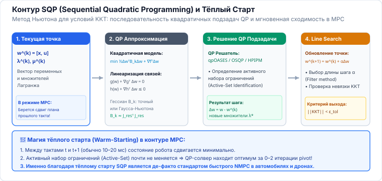
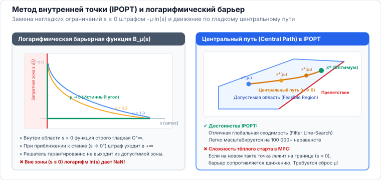
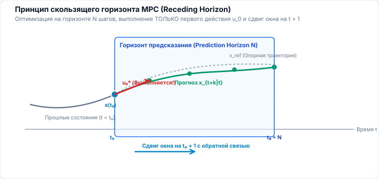
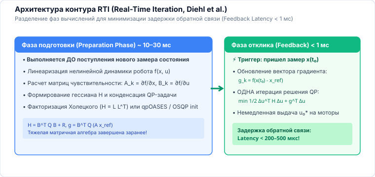

<!-- _class: lead -->
<!-- _header: "" -->
<!-- _footer: "" -->

# **Планирование движений мобильных роботов**
## Лекция 06: Численные решатели и управление с прогнозирующей моделью (MPC)

<div class="mt-4">

<span class="badge badge-blue">⏱️ 90 минут</span>
<span class="badge badge-green">Численная оптимизация и NMPC</span>
<span class="badge badge-purple">SQP • IPOPT • FATROP • CasADi • L4CasADi • Real-Time Iterations</span>

</div>

---

<!-- _header: "Лекция 06 | Введение и мотивация" -->

## Чему посвящена эта лекция? <span class="badge badge-blue">Предиктивный горизонт</span>

<div class="grid-2 mt-2">

<div class="card card-accent">

### 🎯 Слияние оптимизации и реального времени

В лекции 05 мы увидели, как прямая дискретизация (Direct Transcription) переводит бесконечномерную задачу оптимального управления в задачу нелинейного программирования (NLP).

Однако в робототехнике мало просто «найти решение» за несколько минут на сервере. Робот движется в динамической среде со скольжением колес, порывами ветра и внезапными пешеходами.
Ему необходимо **пересчитывать оптимальный план каждые 10–20 миллисекунд (50–100 Гц)** прямо на бортовом компьютере!

Эта лекция посвящена **современным численным решателям** и **парадигме управления с прогнозирующей моделью (Model Predictive Control, MPC)**.

</div>

<div class="card">

### 🔍 Ключевые вопросы лекции

- **Разреженность KKT:** Почему общие солверы требуют $O(N^3)$, а специализированные робототехнические — $O(N)$?
- **SQP vs Метод внутренней точки (IPOPT):** В чем разница между последовательным QP с тёплым стартом и логарифмическими барьерами?
- **FATROP и acados:** Как устроены индустриальные C-библиотеки, работающие на борту дронов и автомобилей?
- **Символьная среда CasADi:** Почему это мировой стандарт де-факто для автоматического дифференцирования и генерации C-кода?
- **L4CasADi:** Как встроить глубокую нейросеть из PyTorch прямо в оптимизационный граф CasADi с сохранением точных градиентов?
- **RTI и Безопасные коридоры:** Как свести задержку управления к 1 мс через схему Real-Time Iteration?

</div>

</div>

---

## План лекции на 90 минут <span class="badge badge-time">⏱️ 90 минут</span>

<div class="grid-2 mt-4">

<div class="card card-alert">

### Часть 1: Численные решатели и экосистема (45 мин)
1. **Формулировка NLP и условия KKT:** Структура ограничений и гессиана.
2. **Секрет скорости — Разреженность KKT:** Блочно-диагональный гессиан, блочно-ленточный якобиан, сложность $O(N)$.
3. **Метод SQP (Последовательное QP):** Квадратичная аппроксимация, активные ограничения, магия тёплого старта (Warm-Starting).
4. **Метод внутренней точки (IPOPT):** Логарифмический барьер $-\mu \ln(s)$, центральный путь (Central Path), плюсы и минусы.
5. **Робототехнические солверы:** FATROP ($O(N)$ IPM) и acados / HPIPM / BLASFEO.
6. **Символьный стек CasADi:** Графы выражений SX/MX, алгоритмическое дифференцирование (AD), экспорт в C.
7. **Нейросети в контуре управления — L4CasADi:** Слияние аналитической физики с PyTorch в реальном времени.

</div>

<div class="card card-success">

### Часть 2: Практический контур NMPC (45 мин)
8. **Парадигма скользящего горизонта (Receding Horizon):** Четырехшаговый цикл обратной связи, подавление возмущений.
9. **NMPC для мобильных роботов:** Кинематика велосипеда, слежение за траекторией и Contouring Control (MPCC).
10. **Учет препятствий в MPC:** Невыпуклость; безопасные выпуклые коридоры (Safe Flight Corridors, SFC); барьерные функции CBF.
11. **Схема Real-Time Iteration (RTI):** Разделение на фазу подготовки (~15 мс) и фазу обратной связи (< 1 мс).
12. **Интерактивный симулятор:** Исследование рецессивного горизонта MPC и переключение решателей (SQP vs IPM).
13. **Сравнительная матрица солверов:** IPOPT vs acados (SQP) vs FATROP vs MPPI.
14. **Резюме и контрольные вопросы:** Итоги и выводы.

</div>

</div>

---

<!-- _header: "Лекция 06 | Часть 1: Численные решатели" -->

## 1. Формулировка траекторной задачи как NLP <span class="badge badge-time">03–09 мин</span>

<div class="grid-2">

<div class="col">

### Задача нелинейного программирования (NLP)

После прямой дискретизации (Multiple Shooting или Direct Collocation) задача OCP принимает канонический вид:

$$\min_{w \in \mathbb{R}^{n_w}} F(w)$$

$$\text{при ограничениях:} \quad \begin{cases}
g(w) = 0 & \text{(неразрывность динамики)} \\
h(w) \le 0 & \text{(пределы приводов, препятствия)}
\end{cases}$$

Вектор переменных $w = [x_0, u_0, x_1, u_1, \dots, x_N]^T$.
Функция Лагранжа:
$$\mathcal{L}(w, \lambda, \mu) = F(w) + \lambda^T g(w) + \mu^T h(w)$$

где $\lambda \in \mathbb{R}^{n_g}$ — множители равенств, $\mu \in \mathbb{R}^{n_h}$ — множители неравенств.

</div>

<div class="col">

### Условия Каруша–Куна–Таккера (KKT)

В точке локального оптимума $(w^*, \lambda^*, \mu^*)$ обязаны выполняться четыре условия первого порядка:

1. **Стационарность Лагранжиана:**
   $$\nabla_w \mathcal{L}(w, \lambda, \mu) = \nabla F(w) + \nabla g(w)^T \lambda + \nabla h(w)^T \mu = 0$$
2. **Допустимость по равенствам:** $g(w) = 0$
3. **Допустимость по неравенствам:** $h(w) \le 0$
4. **Взаимная дополнительность:**
   $$\mu \ge 0, \quad \mu_i \cdot h_i(w) = 0 \quad \forall i$$

- Если ограничение $h_i(w) < 0$ строго пассивно (робот далеко от стены), то $\mu_i = 0$.
- Если ограничение активно $h_i(w) = 0$ (робот едет по границе коридора), то множитель $\mu_i > 0$ равен «силе реакции опоры».

</div>

</div>

<!-- 
Методические указания лектору:
1. Подчеркните студентам аналогию с классической механикой: условия KKT — это обобщение принципа Д'Аламбера–Лагранжа с идеальными связями и связями-неравенствами.
2. Обратите внимание на условие взаимодополнительности: именно оно делает задачу трудной из-за комбинаторики выбора активных ограничений.
-->

---

## 2. Разреженность условий KKT — Секрет скорости <span class="badge badge-time">09–16 мин</span>

<div class="grid-2">

<div class="col">

### Анатомия KKT-матрицы

Применение метода Ньютона к KKT-условиям требует решения системы линейных уравнений на каждом шаге:

$$\begin{bmatrix}
H & G^T \\
G & 0
\end{bmatrix}
\begin{bmatrix}
\Delta w \\
\Delta \lambda
\end{bmatrix}
= -
\begin{bmatrix}
\nabla_w \mathcal{L} \\
g(w)
\end{bmatrix}$$

где $H = \nabla_w^2 \mathcal{L}$ — гессиан, $G = \nabla_w g$ — якобиан ограничений.

**Специальная структура оптимального управления:**
- Состояние $x_{k+1}$ зависит **только** от $x_k$ и $u_k$!
- Гессиан $H$ строго **блочно-диагонален** ($\text{diag}(H_0, \dots, H_N)$).
- Якобиан динамики $G$ имеет **лестничную блочно-двухдиагональную форму** ($[A_k, B_k, -I]$).
- Более **95–98% всех элементов матрицы KKT равны нулю**!

</div>

<div class="col">

<div class="card card-alert">

### Плотный решатель (Dense QP) vs Структурный (Sparse)

- **Плотный подход (Dense Condensation):**
  Исключает состояния $x_k$ через $u_k$. Получается плотная матрица размера $N \cdot m$.
  - Сложность факторизации Холецкого:
    $$\mathcal{O}(m^3 \cdot \mathbf{N^3})$$
  - При $N = 40$: объем работы пропорционален $40^3 = 64\,000$ операций.

</div>

<div class="card card-success mt-2">

- **Структурный разреженный подход (Sparse / Riccati):**
  Сохраняет $x_k$ и $u_k$ в KKT-матрице и использует блочную факторизацию (рекурсию Риккати):
  - Сложность:
    $$\mathcal{O}((n + m)^3 \cdot \mathbf{N}) \quad \text{— СТРОГО ЛИНЕЙНО!}$$
  - При $N = 40$: объем работы растет всего в 40 раз. Прирост скорости в сотни раз!

</div>

</div>

</div>

<!-- 
Методические указания лектору:
1. Заострите внимание на графике сложности: именно переход от кубической O(N^3) к линейной O(N) сложности позволил запускать MPC на дешевых микроконтроллерах и бортовых одноплатниках.
-->

---

## Диаграмма: Структура разреженности матрицы KKT <span class="badge badge-time">16–19 мин</span>

<div class="diagram-box">


</div>

<!-- 
Методические указания лектору:
1. Покажите синие диагональные блоки гессиана H_k и желто-красную «лесенку» якобиана динамики.
2. Обратите внимание на огромное белое пространство: в алгоритмах FATROP и acados эти нули вообще не хранятся в памяти и пропускаются процессором благодаря библиотеке BLASFEO.
-->

---

## 3. Метод SQP (Последовательное квадратичное программирование) <span class="badge badge-time">19–25 мин</span>

<div class="grid-2">

<div class="col">

### Принцип работы алгоритма SQP

Метод **SQP (Sequential Quadratic Programming)** — это применение многомерного метода Ньютона к поиску корней KKT-системы.
На каждой итерации $k$ исходная нелинейная задача аппроксимируется **подзадачей квадратичного программирования (QP)**:

$$\min_{\Delta w} \quad \frac{1}{2} \Delta w^T B_k \Delta w + \nabla F(w^k)^T \Delta w$$

$$\text{при линейных ограничениях:} \quad \begin{cases}
g(w^k) + \nabla g(w^k)^T \Delta w = 0 \\
h(w^k) + \nabla h(w^k)^T \Delta w \le 0
\end{cases}$$

- Матрица $B_k$ — точный гессиан Лагранжиана $\nabla^2 \mathcal{L}$ или его аппроксимация Гаусса–Ньютона $J_r^T J_r$.
- Подзадача QP решается строго выпуклым методом активного набора (**Active-Set Method**) с помощью солверов **qpOASES** или **OSQP / HPIPM**.

</div>

<div class="col">

<div class="card card-accent">

### Ключевые свойства SQP:
1. **Сверхбыстрая локальная сходимость:** В окрестности решения метод сходится квадратично (число верных знаков удваивается на каждой итерации).
2. **Точное распознавание активных связей:** Метод активного набора мгновенно определяет, какие ограничения на моторы и препятствия зажаты, а какие свободны.
3. **Метод линий (Line Search / Filter):** Для глобализации сходимости шаг $\Delta w$ масштабируется: $w^{k+1} = w^k + \alpha \Delta w$.

</div>

<div class="card mt-2">

**Главный вызов:**
Если начальное приближение $w^0$ находится далеко от оптимума, линеаризованные ограничения могут оказаться несовместными (Infeasible QP). Требуется регуляризация слэк-переменными.

</div>

</div>

</div>

<!-- 
Методические указания лектору:
1. Объясните студентам логику Гаусса-Ньютона: если целевая функция представляет собой сумму квадратов ошибок, то второй порядок аппроксимируется произведением первых производных J^T J без вычисления громоздких вторых производных.
-->

---

## 4. Магия тёплого старта (Warm-Starting) в SQP <span class="badge badge-time">25–30 мин</span>

<div class="grid-2">

<div class="col">

### Временная преемственность в контуре MPC

В задачах скользящего горизонта MPC кроется фундаментальное инженерное преимущество, которого нет в статичной оптимизации:

> **Вектор оптимальной траектории между соседними тактами управления $t$ и $t + \Delta t$ сдвигается всего на один временной шаг!**

Пусть на такте $t$ солвер нашел оптимальное решение:
$$w^*_t = [x_0^*, u_0^*, x_1^*, u_1^*, \dots, x_N^*]$$

Тогда для следующего такта $t + \Delta t$ идеальным начальным приближением является **сдвинутая траектория (Warm-Start Shift)**:
$$w^{(0)}_{t+\Delta t} = [x_1^*, u_1^*, x_2^*, u_2^*, \dots, x_N^*, u_{N-1}^*]$$

</div>

<div class="col">

<div class="card card-success">

### Почему SQP идеален для контура 50–100 Гц:
- Активный набор ограничений (Active-Set) между тактами $t$ и $t + \Delta t$ практически **не меняется** (робот продолжает ехать вдоль того же препятствия).
- QP-солвер, стартуя из предыдущего активного набора, находит точный оптимум **всего за 1–2 итерации pivot**!
- Время вычисления сокращается с 50 мс (холодный старт) до **1.0–2.5 мс**!

</div>

<div class="card card-alert mt-2">

**Внимание:**
Именно благодаря теплому старту SQP доминирует в промышленных автопилотах и высокоскоростных квадрокоптерах.

</div>

</div>

</div>

<!-- 
Методические указания лектору:
1. Подчеркните: в статическом планировании каждый раз решается новая задача «с нуля», а в MPC 99% работы уже сделано на предыдущем такте.
-->

---

## Диаграмма: Контур SQP и тёплый старт <span class="badge badge-time">30–33 мин</span>

<div class="diagram-box">



</div>

<!-- 
Методические указания лектору:
1. Проследите по стрелкам цикл SQP: квадратизация -> решение QP -> активный набор -> шаг alpha.
2. Обратите внимание аудитории на нижний баннер: перенос решения с такта t на t+1.
-->

---

## 5. Метод внутренней точки (Interior Point / IPOPT) <span class="badge badge-time">33–39 мин</span>

<div class="grid-2">

<div class="col">

### Логарифмическая барьерная функция

Альтернативой явному перебору активных наборов является **метод внутренней точки (Interior Point Method, IPM)**, реализованный в знаменитом солвере **IPOPT** (Wächter & Biegler, 2006).

Неравенства $h(w) \le 0$ заменяются слэк-переменными $s \ge 0$ и штрафуются гладким **логарифмическим барьером**:

$$\min_{w, s} \quad F(w) - \mathbf{\mu \sum_{i=1}^{n_h} \ln(s_i)} \quad \text{при} \quad \begin{cases} g(w) = 0 \\ h(w) + s = 0 \end{cases}$$

- Параметр барьера $\mu > 0$ управляет «мягкостью» границы.
- При $s_i \to 0^+$ логарифм $-\mu \ln(s_i) \to +\infty$ — барьер создает непреодолимую стену, удерживая переменные строго внутри допустимой области.
- По мере решения задачи параметр $\mu$ ступенчато уменьшается ($\mu \to 0$), и решение сходится к истинному оптимуму.

</div>

<div class="col">

<div class="card card-accent">

### Плюсы IPOPT:
- **Колоссальная масштабируемость:** Легко решает задачи с $100\,000+$ переменных и ограничений (Direct Collocation).
- **Глобальная сходимость:** Фильтр-метод (Filter Line Search) гарантирует сход из произвольных начальных точек без комбинаторных застреваний.

</div>

<div class="card card-alert mt-2">

### Проблема тёплого старта в IPM:
- В методе внутренней точки **нельзя стартовать с границы** ($s_i = 0$), так как $\ln(0)$ неопределен!
- Если между тактами MPC препятствие слегка сместилось и точка оказалась за барьером, логарифм дает `NaN`.
- Приходится искусственно сбрасывать $\mu$ и делать 5–10 итераций, что повышает время такта.

</div>

</div>

</div>

<!-- 
Методические указания лектору:
1. Поясните разницу менталитетов: SQP активно «стучится» в границы и скользит по ним, а Interior Point плавно обходит границы изнутри по центральному пути.
-->

---

## Диаграмма: Барьерная функция и центральный путь <span class="badge badge-time">39–42 мин</span>

<div class="diagram-box">



</div>

<!-- 
Методические указания лектору:
1. Слева покажите семейство кривых -mu*ln(s): при уменьшении mu гладкая функция приближается к идеальному прямому углу индикатора допустимости.
2. Справа покажите центральный путь (Central Path): траектория оптимумов плавно спускается к истинной границе препятствия.
-->

---

## 6. Специализированные робототехнические солверы <span class="badge badge-time">42–48 мин</span>

<div class="grid-2">

<div class="col">

### FATROP (Vanroye et al., 2023)

Классический IPOPT использует общие разреженные линейные решатели (MUMPS, HSL MA57), тратящие время на символьный анализ графа матрицы.

**FATROP (Fast Trajectory Optimizer):**
- Специализированный солвер внутренней точки (IPM), созданный исключительно для задач оптимального управления.
- Алгоритмически использует блочно-ленточную структуру OCP.
- **Сложность строго линейна $\mathcal{O}(N)$**, без оверхеда общих решателей.
- Скорость решения нелинейных задач MPC сопоставима с SQP, но с надежностью внутренней точки!

</div>

<div class="col">

### acados и экосистема HPIPM (Freiburg)

**acados** — ведущий в мире C-фреймворк для встроенного MPC (Verschueren et al., 2022):

1. **Генерация чистого C-кода:** Не использует динамического выделения памяти (`malloc`) в цикле управления — исключены сбои реального времени.
2. **BLASFEO линейная алгебра:** Оптимизированные на ассемблере микроядра для процессоров ARM Cortex и x86 AVX2/AVX-512.
3. **Решатели QP:** Интеграция с **HPIPM** (разреженный решатель внутренней точки) и **qpOASES** (активный набор для плотных задач).
4. **Поддержка RTI:** Контур обратной связи за микросекунды!

</div>

</div>

<!-- 
Методические указания лектору:
1. Обратите внимание студентов на требование Real-Time: в промышленных системах недопустимо выделение памяти на куче во время движения робота, так как задержка сборщика мусора или фрагментация приведет к аварии.
-->

---

## 7. Символьная среда CasADi — Стандарт де-факто <span class="badge badge-time">48–54 мин</span>

<div class="grid-2">

<div class="col">

### Что такое CasADi (Andersson et al., 2019)?

**CasADi** — это не просто библиотека оптимизации, а мощнейший математический инструмент для быстрого формулирования OCP:

1. **Символьные вычислительные графы (SX / MX):** Представление формул динамики в виде направленного ациклического графа (DAG).
2. **Алгоритмическое дифференцирование (AD):** Вычисляет точные градиенты $\nabla F$, якобианы $\nabla g$ и гессианы $\nabla^2 \mathcal{L}$ без погрешностей численных конечных разностей!
3. **C-Code Generation (`generate()`):** Любая функция или вся KKT-система транслируется в самодостаточный C-файл (`model.c`), компилируемый через `gcc -O3` в нативную динамическую библиотеку (`.so`).

</div>

<div class="col">

```python
import casadi as ca

opti = ca.Opti()  # Высокоуровневый интерфейс CasADi
N = 20

# Переменные оптимизации (Multiple Shooting)
X = opti.variable(3, N + 1)  # [x, y, theta]
U = opti.variable(2, N)      # [v, omega]

# Функционал качества
opti.minimize(ca.sumsqr(X[:, -1] - x_goal) + 0.1 * ca.sumsqr(U))

# Ограничения динамики (RK4) и приводов
for k in range(N):
    x_next = rk4_step(X[:, k], U[:, k])
    opti.subject_to(X[:, k + 1] == x_next)
    opti.subject_to(opti.bounded(-1.0, U[0, k], 1.0))

# Подключение солвера (IPOPT или FATROP)
opti.solver('ipopt', {'ipopt.print_level': 0})
sol = opti.solve()
```

</div>

</div>

<!-- 
Методические указания лектору:
1. Разберите краткий код на экране: интерфейс Opti() позволяет студентам и инженерам записывать сложные задачи OCP на Python так же легко, как формулы на доске, при этом вычисления выполняются на чистом Си.
-->

---

## 8. Слияние физики и нейросетей: L4CasADi <span class="badge badge-time">54–60 мин</span>

<div class="grid-2">

<div class="col">

### Проблема чистой физической модели

Аналитические модели (кинематика, динамика Ньютона-Эйлера) великолепно работают на малых скоростях, но **ошибаются в предельных режимах**:
- Скольжение и занос колес на мокрой траве / грунте.
- Аэродинамические завихрения винтов дрона около земли (Ground Effect).
- Нелинейные люфты и упругие деформации редукторов.

**Решение: Гибридная динамика (Residual Physics)**
$$\dot{x} = \underbrace{f_{\text{nominal}}(x, u)}_{\text{Точная физика}} + \underbrace{f_{\text{NN}}(x, u; \theta)}_{\text{Нейросеть PyTorch (Резидуал)}}$$

Обучение ведется по телеметрии реального робота. Но как засунуть PyTorch в C++ солвер оптимизации?

</div>

<div class="col">

### Архитектура L4CasADi (Salzmann et al., 2023)

**L4CasADi (Learning for CasADi)** решает задачу на системном уровне:

1. **Zero-Copy C++ Bridge:** Оборачивает скомпилированную модель PyTorch C++ (TorchScript / LibTorch).
2. **Точные градиенты в реальном времени:** Вычисляет якобианы $\frac{\partial f_{\text{NN}}}{\partial x}$ и $\frac{\partial f_{\text{NN}}}{\partial u}$ через встроенный PyTorch Autograd C++ API.
3. **Бесшовная вставка в CasADi:** Нейросеть становится стандартной функцией CasADi (`l4c.L4CasADi(model)`).
4. Солвер (acados или IPOPT) решает гибридную задачу с частотой **50–100 Гц**!

</div>

</div>

<!-- 
Методические указания лектору:
1. Подчеркните: L4CasADi — это передний край современной робототехники (ICRA / RSS 2023–2025). Робот сохраняет гарантированную устойчивость благодаря номинальной физике, а нейросеть филигранно компенсирует неизвестные силы трения и аэродинамики.
-->

---

## Диаграмма: Стек CasADi и L4CasADi <span class="badge badge-time">60–63 мин</span>

<div class="diagram-box">


</div>

<!-- 
Методические указания лектору:
1. Проследите цепочку слева направо:
   - PyTorch обучает модель заноса на телеметрии.
   - L4CasADi строит C++ мост с автоматическим дифференцированием.
   - CasADi объединяет физику и нейросеть в единый граф.
   - На выходе — чистый C-код, выполняющийся в реальном времени на бортовом компьютере.
-->

---

<!-- _header: "Лекция 06 | Часть 2: Практический контур NMPC" -->

## 9. Парадигма скользящего горизонта (Receding Horizon) <span class="badge badge-time">63–69 мин</span>

<div class="grid-2">

<div class="col">

### Четырехшаговый цикл предиктивного контура

Управление с прогнозирующей моделью (**Model Predictive Control, MPC**) превращает оптимизацию на горизонте в робастную обратную связь:

1. **Замер текущего состояния:** Датчики робота (SLAM, одометрия, IMU) определяют вектор $x(t_0)$.
2. **Оптимизация на горизонте $N$ шагов:** Солвер находит оптимальную последовательность управлений $U^* = [u_0^*, u_1^*, \dots, u_{N-1}^*]$ на интервале $[t_0, t_0 + N \Delta t]$.
3. **Исполнение ТОЛЬКО первого шага:** На приводы робота подается **исключительно $u_0^*$** на время одного такта $\Delta t$. Все остальные шаги $u_1^*, \dots, u_{N-1}^*$ отбрасываются!
4. **Сдвиг горизонта (Receding Horizon):** Время сдвигается на $t_0 + \Delta t$, горизонт смещается вперед, и цикл повторяется с нового состояния.

</div>

<div class="col">

<div class="card card-accent">

### Зачем отбрасывать рассчитанные шаги $u_1^*, \dots, u_{N-1}^*$?

- **Неизбежные возмущения:** Реальный робот никогда не окажется в точности в точке $x_1$ из-за шума приводов, неровностей пола и скольжения.
- **Динамические препятствия:** За время $\Delta t$ человек или другой робот успевает переместиться.
- **Обратная связь (Closed-Loop Feedback):** Повторная оптимизация с фактического состояния парирует любые отклонения и обеспечивает устойчивость системы.

</div>

</div>

</div>

<!-- 
Методические указания лектору:
1. Приведите бытовую метафору водителя автомобиля: вы смотрите на 100 метров вперед (горизонт предсказания), но поворачиваете руль только на текущие 0.1 секунды, непрерывно корректируя траекторию глазами.
-->

---

## Диаграмма: Принцип скользящего горизонта MPC <span class="badge badge-time">69–72 мин</span>

<div class="diagram-box">



</div>

<!-- 
Методические указания лектору:
1. Обратите внимание студентов на зеленые точки прогноза x_{t+k|t} внутри синего скользящего окна.
2. Подчеркните красную стрелку u_0*: исполняется только первое воздействие, после чего окно смещается на t_0 + 1.
-->

---

## 10. Нелинейный MPC для мобильных роботов <span class="badge badge-time">72–76 мин</span>

<div class="grid-2">

<div class="col">

### Модель кинематического велосипеда (Bicycle Model)

Для колесных роботов и беспилотных автомобилей применяется кинематическая модель велосипеда с базой $L$:

$$\begin{cases}
\dot{x} = v \cos(\theta + \beta) \\
\dot{y} = v \sin(\theta + \beta) \\
\dot{\theta} = \frac{v}{L} \cos\beta \tan\delta \\
\dot{v} = a
\end{cases}$$

где $\delta$ — угол поворота передних колес, $a$ — продольное ускорение, $\beta = \arctan(\frac{l_r}{L} \tan\delta)$ — угол увода шасси.

Управления: $u = [a, \delta]^T$.
Ограничения: $|a| \le a_{\max}, |\delta| \le \delta_{\max}, |\dot{\delta}| \le \omega_{\delta,\max}$.

</div>

<div class="col">

### Contouring Control (MPCC)

При обычном слежении за траекторией робот пытается попасть в точку с конкретной временной меткой $x_{\text{ref}}(t)$. Если робот задержался, регулятор резко дергает приводы («догоняет время»).

**Model Predictive Contouring Control (MPCC):**
Разделяет ошибку на две ортогональные компоненты:
1. **Ошибка контура $\epsilon_c$:** Отклонение от кривой пути по нормали (наказывается жестко).
2. **Ошибка запаздывания $\epsilon_l$:** Отставание вдоль касательной к кривой.
3. Вводится виртуальное состояние прогресса $\theta_{\text{path}}$ и максимизируется скорость продвижения вперед $v_{\text{progress}}$. Робот едет плавно и естественно, как профессиональный гонщик!

</div>

</div>

<!-- 
Методические указания лектору:
1. Объясните студентам превосходство MPCC над стандартным tracking MPC: робот не пытается «успеть к расписанию поезда», а стремится двигаться по траектории с максимально безопасной скоростью.
-->

---

## 11. Учет препятствий в MPC: Выпуклые коридоры (SFC) <span class="badge badge-time">76–80 мин</span>

<div class="grid-2">

<div class="col">

### Проблема невыпуклости препятствий

Прямое задание запретных зон через неравенства вида:
$$\|x_k - x_{\text{obs}}\|^2 \ge R_{\text{safe}}^2$$
делает допустимую область **невыпуклой** (в ней образуется «дыра»).
- Гессиан Лагранжиана теряет положительную определенность.
- Солверы SQP и IPOPT застревают в локальных минимумах или не могут обойти препятствие с правильной стороны.

</div>

<div class="col">

### Safe Flight Corridors (SFC — Безопасные коридоры)

Индустриальный метод решения проблемы:
1. Глобальный планировщик ($A^*$ или RRT) находит грубый путь в свободном пространстве.
2. Вокруг пути строится цепочка **выпуклых полиэдров (коридоров)**:
   $$\mathcal{P}_k = \{ x \in \mathbb{R}^2 \mid A_j x \le b_j, \; j = 1, \dots, m_j \}$$
3. В MPC на каждый узел $x_k$ накладываются **линейные ограничения**:
   $$A_j x_k \le b_j \quad \forall j$$

<div class="card card-success mt-2">

**Преимущества SFC:**
- Ограничения строго линейны $\implies$ подзадачи остаются выпуклыми.
- Солвер сходится за доли миллисекунды без риска застрять в локальной яме.

</div>

</div>

</div>

<!-- 
Методические указания лектору:
1. Приведите аналогию: коридор безопасности похож на трубу, проложенную сквозь лабиринт препятствий. Внутри трубы робот может летать и маневрировать как угодно, гарантированно не сталкиваясь со стенами.
-->

---

## 12. Real-Time Iteration (RTI) схема <span class="badge badge-time">80–84 мин</span>

<div class="grid-2">

<div class="col">

### Как свести задержку управления к 1 мс?

В классическом MPC робот измеряет $x(t_0)$, начинает линеаризацию, факторизацию и итерации QP. Если это занимает 20 мс, то воздействие $u_0^*$ прикладывается **с опозданием на 20 мс**, что дестабилизирует быстрые шасси и дроны.

**Схема Real-Time Iteration (Diehl et al.):**
Вычисления разделяются на две фазы:

1. **Фаза подготовки (Preparation Phase) ~ 10–25 мс:**
   - Выполняется **ДО** получения нового замера состояния (пока робот исполняет предыдущую команду).
   - Линеаризуется динамика, формируется гессиан, факторизуются матрицы.
2. **Фаза обратной связи (Feedback Phase) < 1 мс:**
   - Поступает свежий замер $x(t_0)$.
   - Мгновенно решается **ровно одна QP-подзадача** и выдается $u_0^*$ на моторы! Задержка падает до микросекунд.

</div>

<div class="col">

<div class="diagram-box">



</div>

</div>

</div>

<!-- 
Методические указания лектору:
1. Подчеркните: разделение на Preparation и Feedback фазы — это фундаментальный стандарт библиотеки acados, используемый в Формуле-1 и гонках автономных дронов.
-->

---

<!-- _header: "ИНТЕРАКТИВНАЯ ПРАКТИКА | RECEDING HORIZON MPC" -->

## Интерактивный симулятор: Рецессивный горизонт MPC <span class="badge badge-time">84–87 мин</span>

<div class="interactive-container">

<div class="interactive-header">

<span><i class="interactive-dot"></i> Исследование контура скользящего горизонта MPC: Переключение солверов (SQP vs IPOPT) и обход препятствий</span>
<span>Перетаскивайте Робота, Цель и Препятствия | Изменяйте горизонт N | Режим пошагового такта «⏭ Шаг»</span>

</div>
<iframe src="http://localhost:5599/widgets/mpc-interactive-solver/index.html" class="interactive-frame"></iframe>

</div>

<!-- 
Методические указания лектору:
1. Запустите симулятор «▶ Старт»: покажите зеленую нить предиктивного горизонта N и синий след реального пройденного пути.
2. Во время движения робота перетащите мышью препятствие прямо на его путь: продемонстрируйте, как предиктивный горизонт мгновенно огибает препятствие благодаря обратной связи.
3. Переключите солвер на Unconstrained: покажите, как робот идет напролом через препятствия, подтверждая критическую важность учета неравенств.
4. Нажмите «⏭ Шаг»: покажите, как за один такт dt робот исполняет только первое управляющее воздействие u_0.
-->

---

## Сравнительная матрица решателей для мобильных роботов <span class="badge badge-time">87–88 мин</span>

<div class="compact">

| Солвер / Алгоритм | Базовый метод | Время такта (N=20) | Тёплый старт | Сложность по $N$ | Основное применение |
| :--- | :--- | :--- | :--- | :--- | :--- |
| **IPOPT** | Внутренняя точка (IPM) | 20–100 мс | ⚠️ Слабый (сброс $\mu$) | $\mathcal{O}(N)$ со спец. лин. солвером | Офлайн планирование, Direct Collocation |
| **FATROP** | Структурный IPM | 2–8 мс | ⚠️ Ограниченный | $\mathcal{O}(N)$ строго линейно | Онлайн NMPC манипуляторов и колесных роботов |
| **acados (SQP / RTI)** | Последовательное QP | **0.5–2.5 мс** | ✔ **Идеальный (Active-Set)** | $\mathcal{O}(N)$ через HPIPM/Riccati | **Автопилоты, дроны, RT контуры 50–100 Гц** |
| **qpOASES** | Active-Set Dense QP | 1–5 мс | ✔ Идеальный | $\mathcal{O}(N^3)$ (конденсация) | Линейный MPC с коротким горизонтом ($N < 15$) |
| **MPPI** (Лекция 04) | Стохастический семплинг | 5–15 мс (GPU) | ✔ Сдвиг ансамбля | $\mathcal{O}(K \cdot N)$ параллельно | Сложные негладкие среды, безградиентный контур |

</div>

<!-- 
Методические указания лектору:
1. Обратите внимание студентов на выбор между acados и MPPI: если система гладкая и дифференцируемая — acados (SQP) вне конкуренции по точности и скорости. Если среда разрывная (грязь, контакты, ступени) — выигрывает MPPI.
-->

---

## Резюме лекции и контрольные вопросы <span class="badge badge-time">88–90 мин</span>

<div class="grid-2">

<div class="card card-accent">

### Главные выводы лекции:
1. **Разреженность KKT — ключ к RT:** Блочно-ленточная структура сводит сложность к $\mathcal{O}(N)$, делая возможным расчет на 100 Гц.
2. **Преимущество SQP в MPC:** Благодаря теплому старту активный набор ограничений почти не меняется, и солвер сходится за 1–2 итерации.
3. **CasADi и L4CasADi:** Стандарт де-факто для автоматического дифференцирования и слияния аналитической физики с нейросетями PyTorch.
4. **Receding Horizon:** Исполнение только первого шага $u_0^*$ компенсирует внешние возмущения через обратную связь.
5. **Real-Time Iteration:** Разделение на фазы подготовки и обратной связи снижает задержку управления до < 1 мс.

</div>

<div class="card">

### Вопросы для самопроверки:
1. Почему наивный плотный решатель (Dense QP) масштабируется как $\mathcal{O}(N^3)$, а структурный — как $\mathcal{O}(N)$?
2. В чем главное препятствие для быстрого тёплого старта в методе внутренней точки (IPOPT) по сравнению с SQP?
3. Что происходит с множителем Лагранжа $\mu_i$ для ограничения $h_i(x) \le 0$, когда робот удаляется от препятствия вглубь коридора?
4. Зачем в контуре L4CasADi вычислять точные градиенты нейросети через LibTorch C++ API вместо численных конечных разностей?
5. Почему прямое задание круглых препятствий $\|x - x_{\text{obs}}\|^2 \ge R^2$ затрудняет решение NLP, и как безопасные коридоры (SFC) устраняют эту проблему?
6. За счет чего в схеме RTI удается выдать управляющий сигнал $u_0^*$ менее чем через 1 миллисекунду после замера состояния?

</div>

</div>

<!-- 
Методические указания лектору:
1. Завершите занятие анонсом Лекции 07: «В лекциях 05 и 06 мы научились оптимизировать траектории с кинематикой и предиктивным контуром. Но что происходит, когда робот выходит на пределы сцепления колес с дорогой? В Лекции 07 мы разберем динамические ограничения, круг трения Кулона, центростремительные силы и профилирование скорости вдоль кривой».
-->
