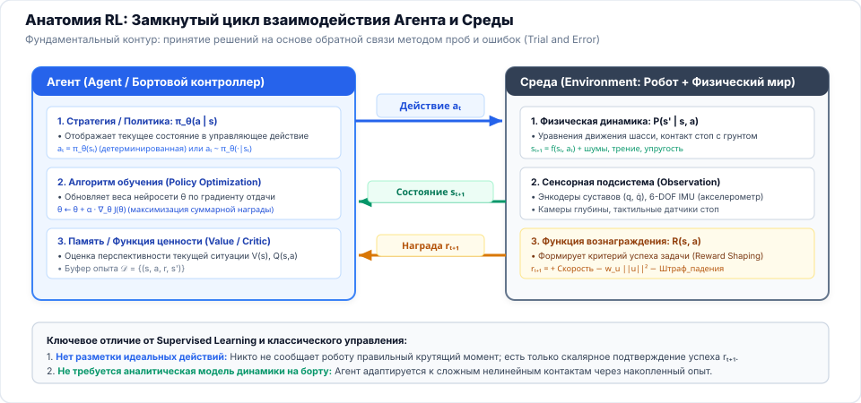
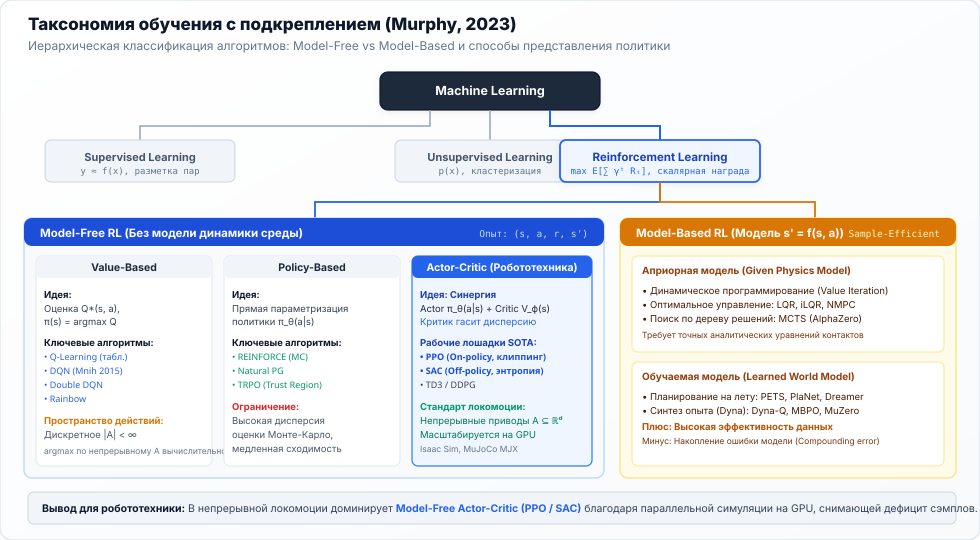
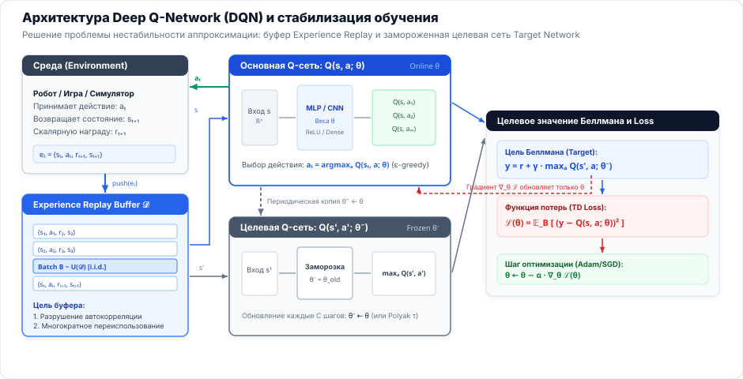
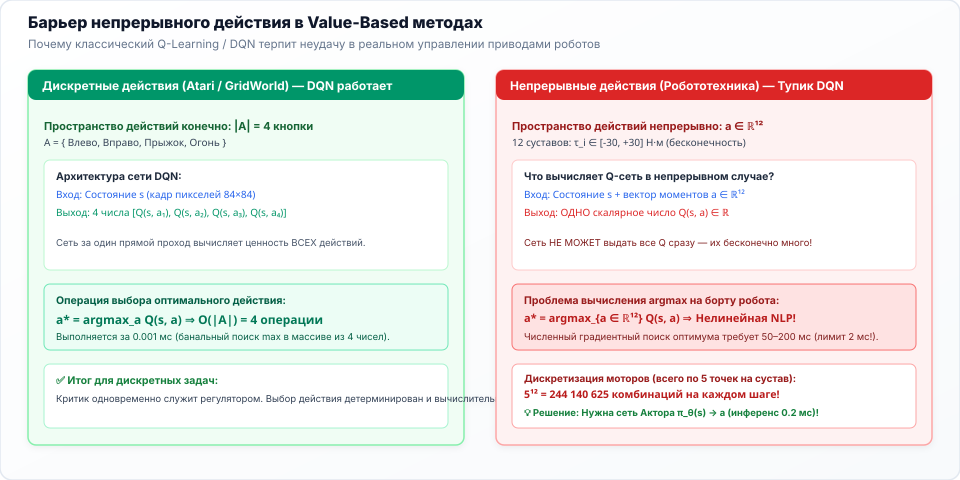
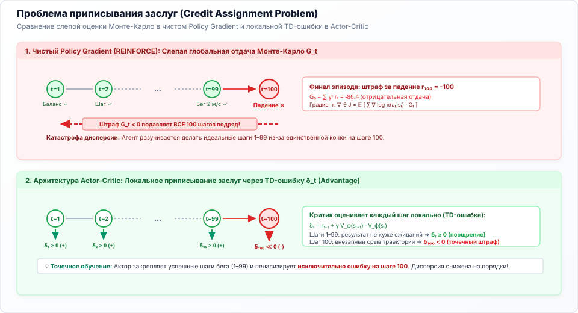
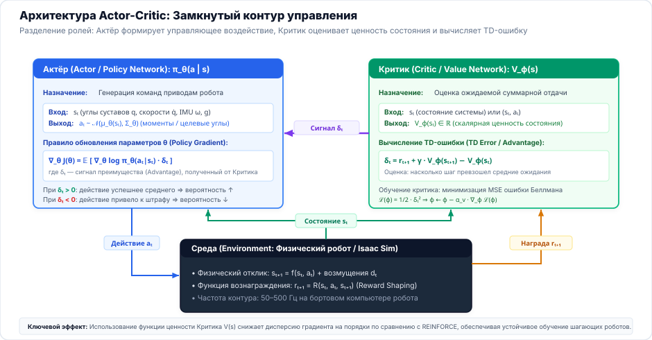
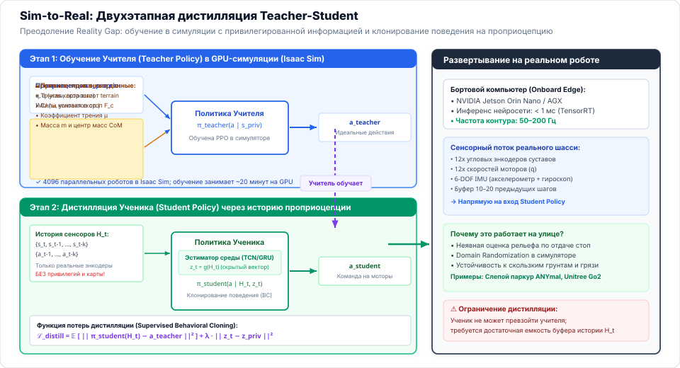

<!-- Slide 1 -->
<!-- _class: lead -->
<!-- _header: "" -->
<!-- _footer: "" -->

# **Планирование движений мобильных роботов**
## Лекция 06: Обучение с подкреплением в робототехнике

⏱️ 90 минут • 24 слайда
Теоретические основы и алгоритмы
MDP • Уравнения Беллмана • Actor-Critic • PPO • SAC • Sim-to-Real

Основы принятия решений в робототехнике: марковские процессы принятия решений (MDP), уравнения Беллмана, ограничения табличных методов в задачах с непрерывным пространством действий, архитектуры Actor-Critic и методы переноса управления из симуляции в реальный мир (Sim-to-Real).

---

<!-- Slide 2 -->
## Особенности управления мобильными роботами 00–04 мин

### 🛑 Ограничения классического машинного обучения
В классических задачах (например, классификации изображений) мы используем обучение с учителем. У нас есть обучающая выборка с заранее известными правильными ответами.

**В задачах управления роботами правильный ответ неизвестен:**
- Невозможно заранее рассчитать идеальные моменты сил на двигателях для каждой миллисекунды движения по неровному грунту.
- Любое отклонение робота от идеальной траектории приводит к тому, что система оказывается в совершенно незнакомом состоянии. Алгоритм не знает, как исправлять ошибки, которых не было в обучающей выборке.

### 🎯 Новый подход: обучение с подкреплением
Вместо того чтобы жестко задавать правильные действия для каждой ситуации, мы оцениваем результат в целом с помощью **функции вознаграждения**:

- Алгоритм учится управлять системой методом проб и ошибок, непосредственно взаимодействуя со средой.
- Главная цель — максимизировать среднее суммарное вознаграждение за всё время работы.

### ⚖️ Сравнение с классическими методами (LQR / MPC)
В отличие от классической теории управления, требующей точных математических моделей, этот подход может справляться со сложными физическими эффектами (трение, жесткие удары о препятствия), для которых трудно составить точные уравнения.

---

<!-- Slide 3 -->
## Интуиция RL: Агент и Среда 04–08 мин

### 🔄 Базовый цикл взаимодействия
Обучение строится на непрерывном взаимодействии двух главных компонентов:
1. **Агент (Agent):** Алгоритм, принимающий решения об управлении.
2. **Среда (Environment):** Сам робот и окружающий его физический мир.

На каждом шаге:
- Агент получает информацию о **состоянии** среды (State).
- Агент выбирает **действие** (Action) и подает команды на приводы.
- Среда переходит в новое состояние, а агент получает скалярную **награду** (Reward), оценивающую успешность действия.

### 📈 Обучение методом проб и ошибок
- Если действие привело к желаемому результату, агент получает положительную награду ($r > 0$). Это увеличивает вероятность выбора такого же действия в будущем.
- Неэффективные или опасные действия штрафуются ($r < 0$).

---

<!-- Slide 4 -->
## Поведение и Цель: Стратегия (Policy) и Накопленная награда (Return) 08–12 мин

### 🧩 Политика и Траектория
Чтобы управлять роботом, агенту необходимо выработать правило принятия решений:
- **Политика (Policy, $\pi$):** Функция, по которой агент выбирает действие в зависимости от текущего состояния. Это и есть то "умение управлять", которое мы хотим получить.
- **Траектория (Эпизод, $\tau$):** Последовательность состояний, действий и наград $(s_0, a_0, r_1, s_1, a_1, \dots)$, возникающая в процессе работы агента.

### ⏳ Проблема отложенной награды
В реальных системах результат действий виден не сразу. Робот может сделать сотни шагов, прежде чем потеряет равновесие. Как понять, какое именно из прошлых действий стало причиной падения? В теории управления это фундаментальное затруднение называют проблемой распределения ответственности во времени (Temporal Credit Assignment Problem).

### 💰 Накопленная награда (Return, $G_t$)
Алгоритм должен стремиться не к мгновенной выгоде (например, сделать быстрый шаг прямо сейчас), а обеспечивать стабильность на протяжении всего движения.
Поэтому цель агента — максимизировать **накопленную награду** (суммарный выигрыш / Return) $G_t$ на всем оставшемся горизонте:

$$ G_t = R_{t+1} + R_{t+2} + R_{t+3} + \dots $$

Мы хотим найти такую политику $\pi$, при которой ожидаемая накопленная награда будет максимальной.

---

<!-- Slide 5 -->
## Формализация: Марковский процесс (MDP) 12–16 мин

### 📐 Формальное определение
Задача обучения с подкреплением строго формулируется как Марковский процесс принятия решений (MDP). Он описывается пятью элементами:

$$ \mathcal{M} = \langle \mathcal{S}, \mathcal{A}, \mathcal{P}, \mathcal{R}, \gamma \rangle $$

- **$\mathcal{S}$:** Пространство всех возможных состояний системы.
- **$\mathcal{A}$:** Пространство всех возможных действий.
- **$\mathcal{P}(s' \mid s, a)$:** Вероятность перехода из состояния $s$ в $s'$ при совершении действия $a$.
- **$\mathcal{R}(s, a)$:** Ожидаемая мгновенная награда.
- **$\gamma \in [0, 1)$:** Коэффициент дисконтирования.

### 📉 Дисконтированная накопленная награда
На практике накопленную награду $G_t$ рассчитывают с учетом коэффициента дисконтирования $\gamma$:

$$ G_t = \sum_{k=0}^\infty \gamma^k R_{t+k+1} $$

**Зачем нужен коэффициент $\gamma$?**
1. **Математическая корректность:** Он гарантирует, что бесконечная сумма не разойдется до бесконечности.
2. **Горизонт планирования:** Он определяет, насколько агента заботит отдаленное будущее. Чем ближе $\gamma$ к единице, тем больший вес имеют долгосрочные последствия. Значения, близкие к нулю, заставляют агента думать только о ближайших шагах.

---

<!-- Slide 6 -->
## Свойство Маркова и неполная наблюдаемость 16–20 мин

### 🔄 Марковское свойство
Фундаментальное предположение MDP заключается в том, что будущее системы зависит только от ее текущего состояния и выбранного действия. То, как именно система пришла в это состояние, значения не имеет:

$$ \mathbb{P}(S_{t+1} \mid S_t, A_t, S_{t-1}, A_{t-1}, \dots) = \mathbb{P}(S_{t+1} \mid S_t, A_t) $$

Вся необходимая для принятия решений информация из прошлого уже содержится в текущем векторе состояния $s_t$.

### ⚠️ Частично наблюдаемые процессы (POMDP)
В реальности роботы никогда не знают истинного состояния мира.
- Датчики предоставляют лишь зашумленные наблюдения $o_t$.
- Многие важные параметры среды нельзя измерить напрямую (например, силу трения о грунт или массу поднятого груза).

**Практическое решение:**
Вместо одного измерения в качестве состояния часто используют историю из нескольких последних наблюдений:
$$ s_t = [o_t, o_{t-1}, \dots, o_{t-H}] $$
Это позволяет алгоритму косвенно оценивать скорости и учитывать скрытые параметры среды.

---

<!-- Slide 7 -->
## Оценка качества: Функции ценности 20–24 мин

### 📊 Функция ценности состояния: $V^\pi(s)$
Математическое ожидание накопленной награды, которую получит агент, начиная движение из состояния $s$ и следуя политике $\pi$:

$$ V^\pi(s) = \mathbb{E}_\pi \left[ \sum_{k=0}^\infty \gamma^k R_{t+k+1} \;\middle|\; S_t = s \right] $$

Эта функция показывает, насколько "выгодно" находиться в данном конкретном состоянии.

### 🎮 Функция ценности действия: $Q^\pi(s, a)$
Ожидаемая накопленная награда, если в состоянии $s$ совершить конкретное действие $a$, а уже затем строго следовать политике $\pi$:

$$ Q^\pi(s, a) = \mathbb{E}_\pi \left[ \sum_{k=0}^\infty \gamma^k R_{t+k+1} \;\middle|\; S_t = s, A_t = a \right] $$

Эта функция оценивает качество конкретных действий. Если мы знаем оптимальную функцию $Q^*(s, a)$, оптимальное управление сводится к простому выбору действия с максимальной оценкой в каждом состоянии.

---

<!-- Slide 8 -->
## Уравнения Беллмана 24–28 мин

### ⚡ Рекурсивная связь состояний
Ценность текущего состояния можно выразить через мгновенную награду и ценность следующего состояния. Это рекурсивное соотношение называется уравнением Беллмана:

$$ V^\pi(s) = \sum_{a} \pi(a|s) \sum_{s', r} p(s', r \mid s, a) \left[ r + \gamma V^\pi(s') \right] $$

Аналогичное уравнение можно записать и для оптимальной Q-функции:

$$ Q^*(s, a) = \mathbb{E} \left[ r_{t+1} + \gamma \max_{a'} Q^*(s_{t+1}, a') \right] $$

### 🚀 Метод бутстрэппинга (Bootstrapping)
Благодаря уравнениям Беллмана агенту не нужно ждать окончания долгого эпизода, чтобы обновить свои оценки.

Мы можем корректировать текущую оценку $Q(s_t, a_t)$, опираясь на оценку следующего шага $V(s_{t+1})$. Обучение "на ходу" с использованием собственных предсказаний называется бутстрэппингом. Этот подход снижает разброс оценок и существенно ускоряет процесс обучения.

---

<!-- Slide 9 -->
## Исследование vs Использование 28–32 мин

### 🔍 Баланс стратегий
Агент постоянно сталкивается с дилеммой:
- **Использование (Exploitation):** Выбор наилучшего действия из уже известных (максимизация текущих оценок Q-функции). Обеспечивает стабильность, но агент может застрять в локальном оптимуме.
- **Исследование (Exploration):** Выбор новых действий, отклоняющихся от текущей политики. Несет риски падений и ошибок, но необходим для поиска более эффективных способов управления.

### 🛠️ Исследование в непрерывных пространствах
Простые методы, такие как случайный выбор действия с небольшой вероятностью, плохо подходят для управления моторами робота. Вместо этого применяют:

1. **Гауссовский шум:**
   Действие выбирается из нормального распределения, где среднее значение задается политикой:
   $$ a_t \sim \mathcal{N}(\mu_\theta(s_t), \, \Sigma) $$
   Параметр $\Sigma$ определяет уровень случайного шума.
2. **Максимизация энтропии:**
   В целевую функцию добавляют штраф за чрезмерную уверенность политики, заставляя агента сохранять вариативность действий.

---

<!-- Slide 10 -->
## Классификация алгоритмов RL 32–36 мин

### 🗺️ Основные подходы
Алгоритмы обучения с подкреплением делятся на несколько больших семейств:

1. **Использование модели среды:**
   - *Model-Free:* Агент учится методом проб и ошибок, не пытаясь строить внутреннюю физическую модель мира.
   - *Model-Based:* Агент предварительно строит модель среды (учится предсказывать следующее состояние) и использует её для планирования.
2. **Что именно оптимизируется:**
   - *Value-Based:* Оценивается только Q-функция, политика неявная (выбираем максимум Q).
   - *Policy-Based:* Оптимизируется непосредственно функция политики $\pi_\theta(a|s)$.
   - *Actor-Critic:* Комбинация подходов: одна сеть (Актор) задает политику, а другая (Критик) оценивает ее с помощью функции ценности.

---

<!-- Slide 11 -->
## Value-Based методы: от Q-Learning к DQN 36–40 мин

### 🎲 Обучение на основе временных разностей (TD)
В этих методых мы итеративно обновляем Q-функцию, стремясь удовлетворить уравнению Беллмана:

$$ Q(s_t, a_t) \leftarrow Q(s_t, a_t) + \alpha \big[ \underbrace{r_{t+1} + \gamma \max_{a'} Q(s_{t+1}, a')}_{\text{Целевое значение}} - Q(s_t, a_t) \big] $$

- **DQN (Deep Q-Network):** Использование нейронных сетей для аппроксимации $Q(s, a)$.
- **Буфер опыта (Experience Replay):** Сохранение прошлых переходов среды в память, из которой случайно извлекаются данные для обучения сети. Это убирает корреляцию между последовательными кадрами.
- **Целевая сеть (Target Network):** Фиксация весов для расчета целевого значения на несколько шагов, что стабилизирует процесс обучения.

---

<!-- Slide 12 -->
## Барьер непрерывных действий 40–44 мин

### 🛑 Сложность применения Value-Based методов
Для выбора лучшего действия в Q-Learning необходимо найти максимум функции:
$$ a_t^* = \arg\max_{a \in \mathcal{A}} Q(s_t, a) $$

- **Дискретное пространство:** Если вариантов действий мало (например, движения вверх/вниз/влево/вправо), мы можем просто вычислить Q-функцию для каждого из них и выбрать максимальное.
- **Непрерывное пространство:** Управление роботом требует задания непрерывных векторов (например, токов на 12 двигателях одновременно).
  Поиск глобального максимума сложной нейросети в таком многомерном непрерывном пространстве на каждом такте управления (сотни раз в секунду) — неразрешимая вычислительная задача для бортового контроллера.

---

<!-- Slide 13 -->
## Методы градиента стратегии (Policy Gradient) 44–48 мин

### 🎯 Прямая оптимизация политики
Вместо оценки действий мы можем напрямую параметризовать политику с помощью нейросети $\pi_\theta(a \mid s)$. Сеть принимает на вход состояние и сразу выдает параметры распределения вероятностей для управляющих команд (например, вектор средних значений и дисперсий).

### 📜 Теорема о градиенте стратегии
Эта теорема строго показывает, как нужно изменить веса сети $\theta$, чтобы увеличить математическое ожидание накопленной награды:

$$ \nabla_\theta J(\theta) = \mathbb{E}_{\tau \sim \pi_\theta} \left[ \sum_{t=0}^T \nabla_\theta \log \pi_\theta(a_t \mid s_t) \cdot G_t \right] $$

### 📐 Интуиция обновления
Градиент логарифма вероятности $\nabla_\theta \log \pi_\theta(a_t \mid s_t)$ указывает направление изменения весов, при котором конкретное действие $a_t$ будет выбираться чаще. Накопленная награда $G_t$ выступает масштабирующим множителем:
- Если суммарный результат $G_t$ положительный, мы увеличиваем вероятность действий, приведших к нему.
- Если отрицательный — уменьшаем вероятность этих действий.

---

<!-- Slide 14 -->
## Распределение награды во времени (Credit Assignment) 48–52 мин

### ⚠️ Недостатки базового градиента стратегии
Использование полной накопленной награды всей траектории $G_t$ порождает две проблемы:

1. **Высокая дисперсия (High Variance):** Траекторная награда $G_t$ зависит от множества случайных факторов и будущих состояний, что делает обучающий сигнал очень шумным.
2. **Сложность оценки отдельного действия (Credit Assignment):**
   Представьте, что робот сделал 99 отличных шагов, но на 100-м шаге оступился и упал. Из-за большого штрафа за падение суммарная накопленная награда траектории $G_t$ станет отрицательной.
   Базовый алгоритм Policy Gradient равномерно снизит вероятности **всех** 100 действий, хотя первые 99 из них были совершенно правильными.

---

<!-- Slide 15 -->
## Архитектура Actor-Critic 52–56 мин

### 🎭 Разделение задач
Чтобы решить проблемы базовых методов, мы объединяем подходы Policy-Based и Value-Based, обучая две параллельные нейросети:

1. **Актор (Actor), $\pi_\theta(a \mid s)$:**
   Принимает решения. Получает состояние и мгновенно выдает управляющую команду. Работает в реальном времени.
2. **Критик (Critic), $V_\phi(s)$:**
   Оценивает решения Актора. Предсказывает математическое ожидание накопленной награды для текущего состояния, формируя стабильную оценку с меньшей дисперсией, чем стохастическая выборка $G_t$.

### 🤝 Синергия
Актор обеспечивает быстрое принятие решений в непрерывном пространстве, а Критик предоставляет стабильную оценку с низким разбросом. Вместе они компенсируют недостатки друг друга.

---

<!-- Slide 16 -->
## Функция преимущества и TD-ошибка 56–60 мин

### 🌟 Функция преимущества (Advantage)
Для точной оценки конкретного действия $a$ вводится функция преимущества $A^\pi(s, a)$. Она показывает, насколько выбранное действие лучше или хуже, чем среднее ожидание от текущей политики:
$$ A^\pi(s, a) = Q^\pi(s, a) - V^\pi(s) $$

### ⚡ TD-ошибка как оценка преимущества
Поскольку точные значения Q и V нам неизвестны, Критик на каждом шаге вычисляет временную разность (TD-ошибку), которая служит отличным приближением для функции преимущества:

$$ \delta_t = r_{t+1} + \gamma V_\phi(s_{t+1}) - V_\phi(s_t) \approx A^\pi(s_t, a_t) $$

### 🏆 Решение проблемы Credit Assignment
В градиентном обновлении Актора мы заменяем траекторную сумму $G_t$ на локальную оценку $\delta_t$:

$$ \nabla_\theta J(\theta) = \mathbb{E} \left[ \nabla_\theta \log \pi_\theta(a_t \mid s_t) \cdot \delta_t \right] $$

- Если $\delta_t > 0$, действие превзошло ожидания Критика — его вероятность нужно увеличить.
- Теперь успешные 99 шагов получат положительную обратную связь, и только ошибочный 100-й шаг будет оштрафован ($\delta_{100} < 0$).

---

<!-- Slide 17 -->
## Алгоритм PPO (Proximal Policy Optimization) 60–64 мин

### 💥 Проблема разрушения политики (Policy Collapse)
Если в процессе градиентного спуска сеть сделает слишком большой шаг в неудачном направлении, политика может полностью "сломаться". В задачах управления это означает, что робот полностью потеряет навык балансировки и не сможет собирать новые данные для дообучения.

### 🛡️ Ограничение изменений (Clipping)
Алгоритм PPO решает эту проблему, жестко ограничивая размер одного обновления. Если мы введем отношение вероятностей новой и старой политики $r_t(\theta) = \frac{\pi_\theta(a_t|s_t)}{\pi_{\theta_{\text{old}}}(a_t|s_t)}$, то целевая функция примет вид:

$$ L^{CLIP}(\theta) = \hat{\mathbb{E}}_t \left[ \min\left( r_t(\theta)\hat{A}_t, \, \operatorname{clip}(r_t(\theta), 1-\epsilon, 1+\epsilon)\hat{A}_t \right) \right] $$

### ⚙️ Практическое значение
Механизм ограничения (с параметром $\epsilon \approx 0.2$) не позволяет политике меняться слишком резко за одну итерацию. Благодаря балансу между простотой реализации и высокой стабильностью работы, PPO стал индустриальным стандартом в робототехнике.

---

<!-- Slide 18 -->
## Алгоритм SAC (Soft Actor-Critic) 64–68 мин

### 🌀 Максимизация энтропии
Алгоритм SAC меняет саму парадигму обучения: он стремится не только максимизировать получаемую награду, но и делать поведение агента максимально случайным (высокоэнтропийным) там, где это не мешает выполнению задачи. Целевая функция приобретает вид:

$$ J(\pi) = \sum_{t} \mathbb{E}_{(s_t, a_t)} \left[ \mathcal{R}(s_t, a_t) + \alpha \, \mathcal{H}(\pi(\cdot \mid s_t)) \right] $$

Здесь $\mathcal{H}(\pi)$ — мера неопределенности (энтропия) распределения действий, а $\alpha$ — коэффициент баланса.

### 🦾 Преимущества для робототехники
1. **Устойчивость к внешним возмущениям:** Стремление к высокой энтропии заставляет агента осваивать разнообразные способы выполнения одной и той же задачи. Если робота толкнут, он с большей вероятностью сохранит равновесие, опираясь на широкую вариативность заученных реакций.
2. **Эффективное использование данных (Sample Efficiency):** SAC является off-policy алгоритмом, что позволяет ему эффективно переиспользовать старый опыт из буфера, значительно сокращая время взаимодействия со средой по сравнению с PPO.

---

<!-- Slide 19 -->
## Обучение с использованием моделей среды 68–72 мин

### 🌍 Построение внутренней модели мира (Model-Based RL)
Вместо того чтобы учиться исключительно методом слепых проб и ошибок, агент пытается выучить законы физики окружающей среды: предсказать следующее состояние по текущему состоянию и действию $\hat{s}_{t+1} = f_\phi(s_t, a_t)$.

- **Обучение в "воображении":** Обладая моделью среды, агент может планировать свои действия и тренировать политику виртуально, без физического взаимодействия с роботом. Это кардинально экономит время и бережет дорогостоящее оборудование.

### ⚠️ Проблема накопления ошибок
Главное препятствие на пути широкого внедрения Model-Based подходов — неточность предсказательных нейросетей.
При планировании траектории на несколько шагов вперед даже небольшая ошибка предсказания накапливается экспоненциально. Агент может найти "оптимальную" стратегию в своей несовершенной модели, которая на реальном физическом роботе неизбежно приведет к сбою или падению.

---

<!-- Slide 20 -->
## Дизайн функции вознаграждения 72–76 мин

### 🎯 Разреженная или плотная награда?
- **Разреженная (Sparse):** Награда выдается только по факту достижения глобальной цели (например, дойти до конца комнаты). Обучение идет крайне медленно из-за отсутствия промежуточных ориентиров.
- **Плотная (Dense):** Награда (или штраф) выдается на каждом шаге за малейшее улучшение состояния. Формирование плотной награды (Reward Shaping) — сложный инженерный процесс, где нужно сбалансировать десятки параметров:
  $$ R_t = w_v R_{\text{speed}} + w_\theta R_{\text{balance}} - w_\tau \|\tau\|^2 - w_{\Delta \tau} \|\Delta \tau\|^2 $$

### ⚠️ Неожиданное поведение (Reward Hacking)
Нейросети феноменально хорошо находят математические "лазейки" в плотных функциях вознаграждения, формально максимизируя функцию, но игнорируя реальную цель:
- Если штраф за потребление энергии слишком велик, роботу выгоднее сразу упасть и лежать, обнулив энергозатраты.
- Если штрафовать за падение, но слабо поощрять движение вперед, робот будет просто стоять на месте.
- Неправильный баланс коэффициентов часто приводит к неестественным походкам и вибрациям суставов.

---

<!-- Slide 21 -->
## Интерактивное моделирование 76–80 мин

<i class="interactive-dot"></i> Исследование алгоритмов управления: Cart-Pole
Сравнение LQR, плотной (Dense) и разреженной (Sparse) наград

<iframe src="http://localhost:5599/widgets/rl-policy-shaping/index.html" class="interactive-frame"></iframe>

---

<!-- Slide 22 -->
## Перенос из симуляции в реальность (Sim-to-Real) 80–84 мин

### 🖥️ Массовое обучение в симуляторах
Обучение современных алгоритмов управления требует миллионов итераций взаимодействия со средой. Проводить такие эксперименты на реальных физических роботах слишком долго и сопряжено с высоким риском поломок.
**Решение:** Использование физически достоверных симуляторов с ускорением на GPU (например, NVIDIA Isaac Sim). Они позволяют запускать тысячи виртуальных копий робота параллельно, сжимая недели реального времени до нескольких минут вычислений.

### 🌉 Рандомизация среды (Domain Randomization)
Ни одна физическая симуляция не идеальна. Чтобы перенесенная на реального робота политика не провалилась из-за неточностей модели, виртуальные условия намеренно искажают:
- Массу звеньев робота и положение центра масс варьируют в случайных пределах.
- Коэффициенты трения поверхностей постоянно меняют.
- В управляющие сигналы добавляют случайные задержки и шум.
Обучившись балансировать в таком постоянном хаосе, нейросеть становится устойчивой к реальным несовершенствам физического мира.

---

<!-- Slide 23 -->
## Двухэтапное обучение (Учитель и Ученик) 84–87 мин

### 🎓 Архитектура передачи опыта
Один из самых эффективных методов обучения роботов движению по сложной местности состоит из двух этапов:

1. **Этап 1 (Обучение Учителя):**
   В симуляции обучается привилегированная политика-"учитель". Ей предоставляется доступ к скрытым параметрам, недоступным в реальности (точная карта высот под ногами, точные значения трения и массы). Имея идеальную информацию, учитель легко осваивает безупречную ходьбу.
2. **Этап 2 (Обучение Ученика):**
   Политика-"ученик" обучается повторять действия учителя, но на вход получает только реалистичные данные с бортовых датчиков робота (углы суставов, показания гироскопа). Анализируя историю этих косвенных измерений, ученик учится неявно "ощущать" свойства грунта.

---

<!-- Slide 24 -->
## Сравнение подходов: Классика (MPC) и Нейросети (RL) 87–90 мин

### ⚖️ Сравнительная таблица
| Характеристика | Классическое управление (MPC) | Обучение с подкреплением (RL) |
| :--- | :--- | :--- |
| **Вычислительная сложность на роботе** | Высокая (решение систем уравнений в реальном времени) | Низкая (быстрый проход через слои нейросети) |
| **Работа с контактами и сложным рельефом** | Сложно математически описать, склонность к сбоям | Естественная адаптация за счет накопленного опыта |
| **Гарантии стабильности** | Строгие аналитические доказательства устойчивости | Эмпирические результаты, отсутствие строгих гарантий |
| **Требования к вычислительным мощностям** | Мощный бортовой процессор на самом роботе | Серверные кластеры (на этапе обучения) |

### 🚀 Гибридные системы управления
В передовых робототехнических системах подходы всё чаще комбинируют:
- **Верхний уровень (MPC):** Решает задачи долгосрочного планирования (поиск безопасного пути, планирование точек опоры).
- **Нижний уровень (RL):** Нейросеть с высокой частотой отрабатывает заданные траектории, стабилизируя робота и быстро реагируя на неожиданные физические возмущения.

### 📚 Рекомендуемая литература
1. **Kevin P. Murphy (2025).** *Reinforcement Learning: A Comprehensive Overview.*
2. **R. Sutton, A. Barto (2018).** *Reinforcement Learning: An Introduction.*
3. **J. Schulman et al. (2017).** *Proximal Policy Optimization Algorithms.*

