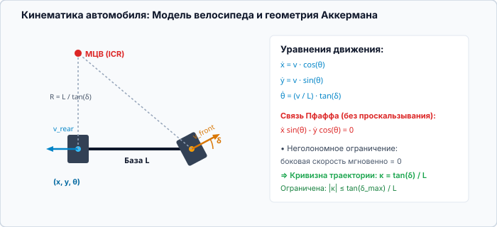
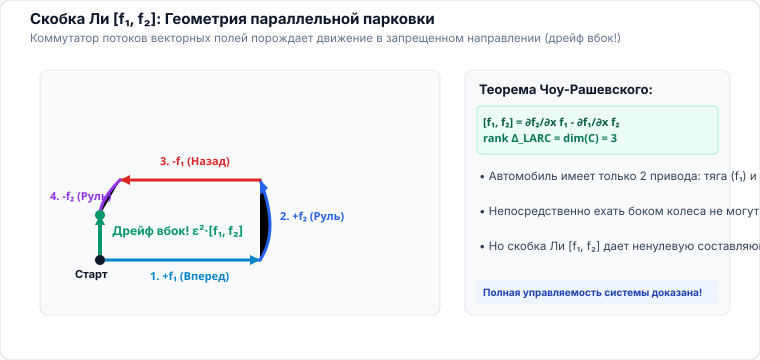

<!-- _class: lead -->
<!-- _header: "" -->
<!-- _footer: "" -->

# **Планирование движений мобильных роботов**
## Лекция 07: Учёт кинематических и динамических ограничений

⏱️ 90 минут
Физические ограничения
LaValle (гл. 13, 14) • Скобки Ли • Chow-Rashevsky • Трение • TOPP

---

<!-- _header: "Лекция 07 | Введение и мотивация" -->

## Чему посвящена эта лекция? Физика и связи

### 🎯 Робот — это физическое тело, а не точка

В теории алгоритмов часто представляют робота всемогущей точкой, способной мгновенно двигаться в любом направлении с бесконечным ускорением. На практике колеса не умеют ехать боком, приводы имеют предел момента, а шины срываются в занос на поворотах.

Эта лекция посвящена <strong>математике и учету физических ограничений</strong>: как дифференциальная геометрия (скобки Ли) доказывает управляемость неголономных систем и как динамические пределы сцепления превращают путь в физически реализуемую траекторию.

**💡 Результат занятия:** Проверять мобильные платформы на управляемость по теореме Чоу-Рашевского через скобки Ли, строить решетки состояний (State Lattices) с клотоидными примитивами, рассчитывать динамические ограничения по сцеплению шин с грунтом и применять алгоритм TOPP-RA для профилирования скорости.

### 🔍 Ключевые вопросы лекции

- <strong>Голономность vs Неголономность:</strong> Форма связей Пфаффа и теорема Фробениуса об интегрируемости.
- <strong>Магия скобок Ли (Lie Brackets):</strong> Почему автомобиль может смещаться вбок при параллельной парковке? Условие ранга алгебры Ли (<strong>LARC</strong>).
- <strong>Дискретизация неголономных систем:</strong> Решетки состояний (<strong>State Lattices</strong>) и примитивы движения.
- <strong>Террамеханика и пределы сцепления:</strong> Круг трения Кулона, ограничение центростремительного ускорения $a_y \le \mu g$.
- <strong>Оптимальный профиль скорости (TOPP):</strong> Как выжать 100% мощности моторов на заданной траектории.

---

<!-- _header: "Лекция 07 | Структура занятия" -->

## План лекции на 90 минут ⏱️ 90 минут

### Часть 1: Неголономность и геометрия Ли (45 мин)

- <strong>00–12 мин:</strong> Классификация ограничений: геометрические ($q \in \mathcal{C}_{free}$), кинематические ($\dot{q}$) и динамические ($\ddot{q}, \tau$).
- <strong>12–25 мин:</strong> Дифференциальные связи Пфаффа $A(q)\dot{q} = 0$, интегрируемость распределений и теорема Фробениуса.
- <strong>25–37 мин:</strong> <strong>Скобки Ли (Lie Brackets)</strong> $[f_1, f_2]$: коммутатор векторных полей и физика параллельной парковки.
- <strong>37–45 мин:</strong> Теорема Чоу-Рашевского (LARC): почему колесный робот полностью управляем в $SE(2)$.

### Часть 2: Динамика, Трение и TOPP (45 мин)

- <strong>45–56 мин:</strong> <strong>State Lattice Planning</strong>: решетки состояний в $(x, y, \theta, \kappa)$ и библиотека примитивов на клотоидах.
- <strong>56–68 мин:</strong> Динамика шасси и трение: круг Кулона, боковой занос ($v^2 \kappa \le \mu g$) и опрокидывание (Rollover).
- <strong>68–80 мин:</strong> <strong>Time-Optimal Path Parameterization (TOPP / TOPP-RA)</strong>: оптимизация на фазовой плоскости $(s, \dot{s}^2)$.
- <strong>80–90 мин:</strong> Многозвенные автопоезда (Jackknifing), контрольные вопросы и Q&A.

<!--
Примечание для лектора:
Лекция раскрывает глубокую дифференциальную геометрию (Стивен Лаваль, глава 13), объясняя скобки Ли через простой бытовой опыт водителя (параллельная парковка), после чего переходит к расчету динамических перегрузок и трения.
-->
---

## 1. Классификация ограничений в робототехнике 00–12 мин

### 1. Геометрические

$$h(q) \le 0$$

- Стены, колонны, двери.
- Границы шарниров манипулятора.
- Зазоры безопасности (Clearance).
- Учитываются напрямую через вырезание $\mathcal{C}_{obs}$ из $\mathcal{C}$.

### 2. Кинематические

$$A(q) \dot{q} = 0, \quad |\kappa| \le \kappa_{max}$$

- Запрет бокового проскальзывания колес (Pure Rolling).
- Минимальный радиус поворота колес руля ($R \ge R_{min}$).
- Зависимость только от скоростей и координат.

### 3. Динамические

$$M(q)\ddot{q} + C\dot{q} + g = B\tau$$

- Пределы крутящих моментов моторов $|\tau| \le \tau_{max}$.
- Сцепление шин с полом (конус трения $\mu$).
- Фазовое пространство размерности $2d$: $(q, \dot{q}) \in T\mathcal{C}$.

---

## 2. Связи Пфаффа и теорема Фробениуса (LaValle гл. 13) 12–25 мин

Кинематические ограничения робота записываются в <strong>дифференциальной форме Пфаффа</strong>:

$$\omega_i(q) \dot{q} = \sum_{j=1}^n a_{ij}(q) \dot{q}_j = 0, \quad i = 1, \dots, k$$

Допустимые скорости в каждой конфигурации $q$ образуют подпространство размерности $m = n - k$ — <strong>распределение</strong> $\Delta(q) = \operatorname{span}\{g_1(q), \dots, g_m(q)\}$.

$$\dot{q} = \sum_{j=1}^m g_j(q) u_j$$

### Теорема Фробениуса об интегрируемости:

Связь называется <strong>голономной</strong>, если она может быть проинтегрирована в форму без производных: $h(q) = 0$.

<strong>Теорема:</strong> Распределение $\Delta$ полностью интегрируемо тогда и только тогда, когда оно <strong>инволютивно</strong> (замкнуто относительно скобок Ли):

$$\forall X, Y \in \Delta \implies [X, Y] \in \Delta$$

Если распределение <strong>НЕ инволютивно</strong>, связь является <strong>неголономной</strong>: робот может достичь любой точки пространства конфигураций $\mathcal{C}$, несмотря на мгновенные ограничения скорости!

---

## Разбор: откуда берётся мгновенный центр поворота 20–25 мин

---

## 3. Скобки Ли (Lie Brackets) и маневрирование 25–37 мин

### Математическое определение скобки Ли:

Для двух гладких векторных полей $f_1(q)$ и $f_2(q)$ их скобкой Ли (коммутатором) называется векторное поле:

$$[f_1, f_2](q) = \frac{\partial f_2}{\partial q} f_1(q) - \frac{\partial f_1}{\partial q} f_2(q)$$

<strong>Геометрический смысл:</strong> Движение по цепочке: вперед по $f_1$ на $\epsilon$, вперед по $f_2$ на $\epsilon$, назад по $-f_1$ на $\epsilon$, назад по $-f_2$ на $\epsilon$ дает чистое смещение:

$$\Delta q = \epsilon^2 [f_1, f_2](q) + \mathcal{O}(\epsilon^3)$$

### Физический пример: Параллельная парковка

Автомобиль имеет два управляющих поля:

- $f_1 = \cos\theta \frac{\partial}{\partial x} + \sin\theta \frac{\partial}{\partial y}$ (продольное движение).
- $f_2 = \frac{\partial}{\partial \theta}$ (поворот руля / рыскание).

Прямое движение боком $f_3 = [f_1, f_2] = \sin\theta \frac{\partial}{\partial x} - \cos\theta \frac{\partial}{\partial y}$ запрещено механикой колес!

Однако чередование руления и прямого хода порождает векторное поле <strong>бокового сдвига</strong>! Именно скобка Ли позволяет заехать на парковочное место в узком зазоре.

---

## Почему параллельная парковка вообще возможна 32–37 мин

---

## 4. Теорема Чоу-Рашевского и условие LARC 37–45 мин

### Условие ранга алгебры Ли (LARC):

Пусть $\operatorname{Lie}(\Delta)$ — алгебра Ли, порожденная векторными полями управления $\{g_1, \dots, g_m\}$ и их повторными скобками Ли $[g_i, g_j]$, $[g_i, [g_j, g_k]]$ и т.д.

Система удовлетворяет условию LARC в конфигурации $q$, если:

$$\operatorname{dim}\left(\operatorname{Lie}(\Delta)(q)\right) = \operatorname{dim}(\mathcal{C}) = n$$

### Теорема Чоу-Рашевского (Chow-Rashevsky Theorem):

Если конфигурационное пространство $\mathcal{C}$ связно и система удовлетворяет условию LARC в каждой точке, то:

$$\forall q_0, q_1 \in \mathcal{C} \quad \exists \text{ допустимая траектория } q(t), \text{ соединяющая } q_0 \text{ и } q_1!$$

<strong>Фундаментальное следствие для робототехники:</strong> Несмотря на то, что робот с дифференциальным приводом имеет всего <strong>2 мотора</strong>, он <strong>полностью управляем в 3D пространстве $SE(2) = (x, y, \theta)$</strong>!

---

## 5. State Lattice Planning: Решетки состояний 45–56 мин

Как применить сеточный поиск ($A^*$) к неголономному роботу без нарушения кинематики? <strong>State Lattice</strong> (Pivtoraiko & Kelly 2005) дискретизирует состояние в $SE(2) \times \mathcal{K}$:

$$\mathbf{s} = (x, y, \theta, \kappa) \in \text{Lattice}$$

### Примитивы движения (Motion Primitives):

- Вместо ребер 8-связной сетки вершины графа соединяются физически реализуемыми микро-траекториями.
- Используются <strong>клотоиды (спирали Эйлера)</strong>: кривые с линейно меняющейся кривизной $\kappa(s) = \kappa_0 + c \cdot s$.
- Гарантируется непрерывность кривизны $C^2$ — отсутствие рывков рулевой рейки!

### Преимущества State Lattice:

- <strong>Сдвиговая инвариантность (Translational Invariance):</strong> библиотека примитивов рассчитывается оффлайн один раз и копируется в каждый узел решетки.
- <strong>Строгая реализуемость:</strong> любой путь, найденный алгоритмом $A^*$ на State Lattice, <strong>на 100% готов к исполнению контроллером</strong> без срезания углов и заносов.
- Используется в беспилотных автомобилях и карьерных самосвалах (Nav2 Smac Planner Lattice).

---

## 6. Динамика шасси: Сцепление и срыв в занос 56–68 мин

### Круг трения Кулона (Friction Circle):

Суммарная сила сцепления колеса с опорной поверхностью ограничена нормальной реакцией $F_z = m g$ и коэффициентом сцепления $\mu$:

$$\sqrt{F_x^2 + F_y^2} \le \mu F_z = \mu m g$$

- $F_x$ — продольная сила тяги/торможения.
- $F_y$ — поперечная сила удержания в повороте.
- Если робот экстренно тормозит ($F_x \to \mu m g$), боковая сила $F_y \to 0$ — робот становится неуправляемым (снос передней оси).

### Предел скорости по центростремительному ускорению:

В повороте радиуса $R = 1/|\kappa(s)|$ возникает центробежная сила:

$$a_y = v^2 |\kappa(s)| \le \mu g$$

Максимально допустимая скорость движения по геометрическому пути:

$$v_{max}(s) = \sqrt{\frac{\mu g}{|\kappa(s)|}}$$

<strong>Опрокидывание (Rollover):</strong> Для высоких роботов (доставка, мобильные манипуляторы) предел наступает еще раньше: $a_y \le g \frac{w}{2 h_{cog}}$, где $w$ — колея, $h_{cog}$ — высота центра тяжести.

---

## 7. Профилирование скорости: Алгоритм TOPP / TOPP-RA 68–80 мин

### Задача Time-Optimal Path Parameterization:

Дана геометрическая кривая $q(s), s \in [0, S]$. Требуется найти временной закон $s(t)$, минимизирующий полное время $T = \int_0^S \frac{1}{\dot{s}} ds$ при ограничениях моторов:

$$\tau_{min} \le M(q)\ddot{q} + C(q, \dot{q})\dot{q} + g(q) \le \tau_{max}$$

Подстановка производных через путь: $\dot{q} = q'(s)\dot{s}$, $\ddot{q} = q'(s)\ddot{s} + q''(s)\dot{s}^2$.

### Выпуклая формулировка TOPP-RA (Pham, 2018):

Введем замену переменной $b(s) = \dot{s}^2(s)$ (удвоенная кинетическая энергия):

$$\ddot{s} = \frac{1}{2} b'(s)$$

- Все нелинейные ограничения на крутящие моменты моторов, ускорения и сцепление становятся <strong>строго линейными неравенствами относительно $b(s)$ и $b'(s)$</strong>!
- Задача нахождения предельного профиля скорости решается через <strong>линейное программирование (LP) за миллисекунды</strong>.
- Гарантирует 100% выжимание динамического потенциала приводов робота.

---

<!-- _class: accent -->
<!-- _header: "Лекция 07 | Итоги и вопросы" -->

## Резюме лекции и контрольные вопросы 80–90 мин

### Главные выводы:

- <strong>Неголономные связи</strong> запрещают боковое смещение колес, но не ограничивают конфигурационное пространство $\mathcal{C}$.
- <strong>Скобки Ли $[f_1, f_2]$</strong> генерируют новые направления движения за счет циклического коммутатора маневров.
- <strong>Теорема Чоу-Рашевского</strong> гарантирует полную управляемость мобильного робота в $SE(2)$ при выполнении LARC.
- <strong>State Lattice</strong> обеспечивает кинематически безупречный сеточный поиск на базе клотоидных примитивов.
- <strong>Круг трения</strong> ограничивает скорость в поворотах $v \le \sqrt{\mu g / \kappa}$, а алгоритм <strong>TOPP-RA</strong> строит оптимальный профиль скорости через LP.

### Контрольные вопросы для самопроверки:

- В чем строгое математическое отличие голономной связи от неголономной согласно теореме Фробениуса?
- Как маневр параллельной парковки соотносится с формулой скобки Ли $[f_1, f_2]$?
- Почему в State Lattice примитивы движения строят на основе клотоид, а не дуг окружностей?
- Как замена переменной $b(s) = \dot{s}^2$ в алгоритме TOPP-RA позволяет свести задачу профилирования скорости к выпуклой оптимизации?

Следующая лекция: Вычислительные аспекты, инженерия и архитектура Nav2

