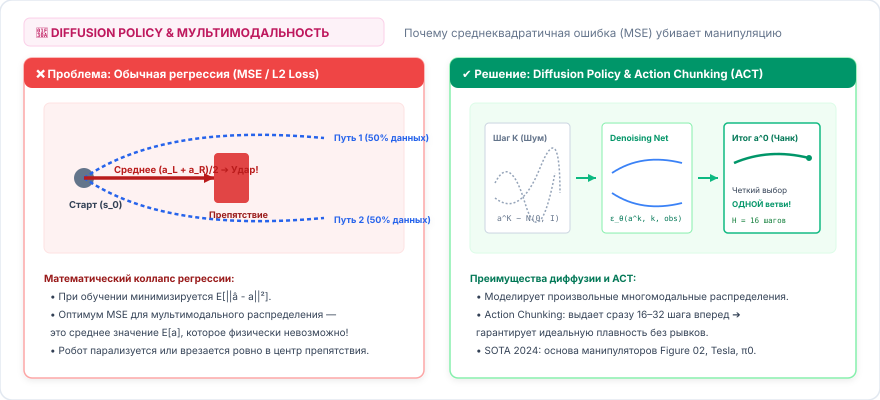
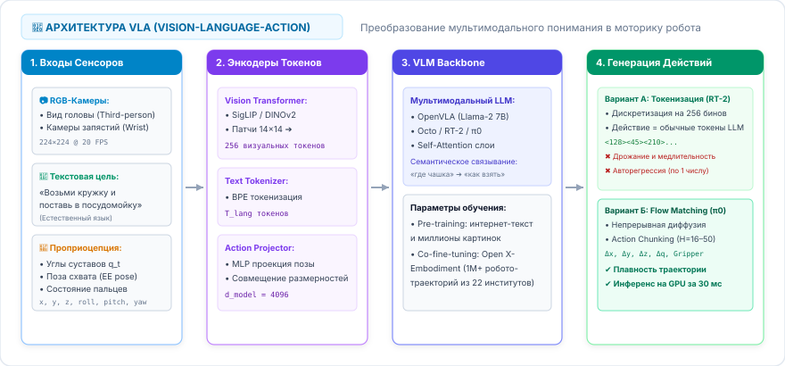
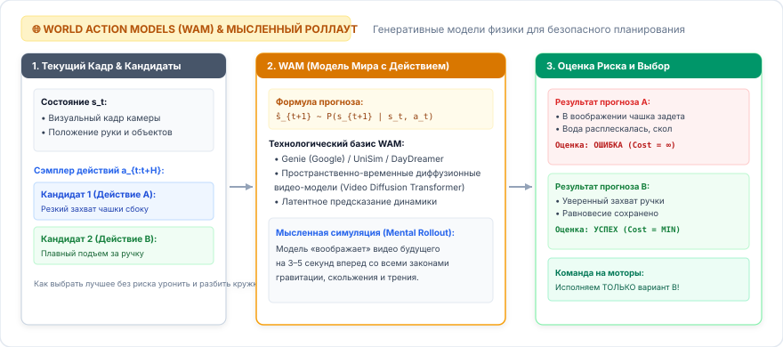
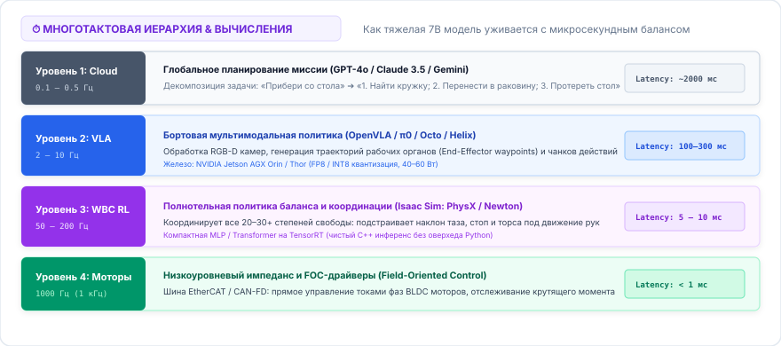

<!-- _class: lead -->
# **Планирование движений мобильных роботов**
## Лекция 07: Мультимодальные модели и генеративные политики управления: VLA, Diffusion Policy, ACT и модели мира (WAM)

  Сложность: Высокая
  Модуль 3

---

## Введение: Переход к открытому миру 00–05 мин

  

    

      <h3>Замкнутые задачи локомоции</h3>
      <ul>
        <li>Строго формализованные функции вознаграждения (Обучение с подкреплением).</li>
        <li>Ограниченное пространство состояний.</li>
        <li>Фокус на стабилизации динамики и устойчивости возмущений.</li>
      </ul>
    

  

  

    

      <h3>Семантические манипуляции</h3>
      <ul>
        <li>Отсутствие явной аналитической модели взаимодействия (неструктурированная среда).</li>
        <li>Высокая размерность входных данных (визуальные и текстовые модальности).</li>
        <li>Требование к обобщению (Zero-shot generalization).</li>
      </ul>
    

  

---

## План лекции на 90 минут 05–07 мин

  

    

      <h3>Часть 1 (45 мин)</h3>
      
<strong>Имитационное обучение и генеративные политики</strong>

      <ul>
        <li>Проблемы клонирования поведения (BC).</li>
        <li>Мультимодальность распределений действий.</li>
        <li>Action Chunking with Transformers (ACT).</li>
        <li>Диффузионные политики (Diffusion Policy) и Flow Matching.</li>
      </ul>
    

  

  

    

      <h3>Часть 2 (45 мин)</h3>
      
<strong>VLA-модели и бортовой инференс</strong>

      <ul>
        <li>Архитектуры Vision-Language-Action (VLA).</li>
        <li>Сравнительный анализ современных моделей (RT-2, OpenVLA, π₀).</li>
        <li>Модели мира действий (World Action Models).</li>
        <li>Вычислительный бюджет и задержки (Latency).</li>
      </ul>
    

  

---

## 1. Ограничения классического клонирования поведения 07–15 мин

  

    
Клонирование поведения (Behavioral Cloning, BC) сводит задачу управления к обучению с учителем, максимизируя правдоподобие действий эксперта:

    
$$ \min_\theta \mathbb{E}_{(s, a) \sim \mathcal{D}} \left[ \mathcal{L}(a, \pi_\theta(s)) \right] $$

    
где $\mathcal{D}$ — набор демонстрационных траекторий.

  

  

    

      <h3>Фундаментальные проблемы</h3>
      <ul>
        <li><strong>Covariate Shift</strong>: Накопление ошибок аппроксимации приводит к выходу траектории за пределы обучающего распределения состояний.</li>
        <li><strong>Квадратичный рост ошибки</strong>: Расхождение между ожидаемой и экспертной траекториями растет как $\mathcal{O}(T^2)$, где $T$ — горизонт планирования.</li>
      </ul>
    

  

---

## 2. Проблема мультимодальности целевого распределения 15–22 мин

  

    
Классическое BC часто использует среднеквадратичную ошибку (MSE Loss), что эквивалентно предположению об унимодальном гауссовском распределении целевой переменной.

    
Если для состояния $s$ возможны два эквивалентных, но топологически различных действия $a_1$ и $a_2$ (например, обход препятствия слева или справа), минимизация MSE сходится к математическому ожиданию:

    
$$ a_{mean} = \mathbb{E}[a|s] \approx \frac{a_1 + a_2}{2} $$

  

  

    

      <h3>Катастрофическое усреднение</h3>
      
Действие $a_{mean}$ может быть физически недопустимым (столкновение с препятствием), что делает среднеквадратичную регрессию неадекватной для задач со сложной топологией пространства решений.

    

  

---

## 3. Архитектура Action Chunking with Transformers (ACT) 22–29 мин

  

    
Метод ACT решает проблему накопления ошибок путем предсказания последовательности (чанка) будущих действий вместо единичного шага:

    
$$ A_t = [a_t, a_{t+1}, \dots, a_{t+K-1}] $$

    
Модель использует архитектуру CVAE (Conditional Variational Autoencoder), обусловленную текущими наблюдениями (изображение и проприоцепция).

  

  

    

      <h3>Временное сглаживание</h3>
      
На каждом шаге $t$ алгоритм прогнозирует новый чанк и агрегирует пересекающиеся прогнозы (Temporal Ensembling) с экспоненциальным затуханием весов. Это радикально повышает гладкость траекторий и устойчивость к локальным ошибкам перцепции.

    

  

---

## 4. Генеративные диффузионные политики 29–38 мин

  

    
Диффузионные политики (Diffusion Policy) моделируют распределение действий $p(a|o)$ через обратный стохастический процесс. Формулировка опирается на стохастические дифференциальные уравнения (DDPM или Score-based generative models):

    
$$ d \mathbf{x} = f(\mathbf{x}, t)dt + g(t)d\mathbf{w} $$

    
Модель нейронной сети $\epsilon_\theta(\mathbf{x}_k, k, \mathbf{o})$ предсказывает инжектированный гауссовский шум.

  

  

    

      <h3>Процесс сэмплирования</h3>
      
Генерация траектории представляет собой процесс итеративного шумоподавления Ланжевена, где начальное случайное действие $\mathbf{x}_K \sim \mathcal{N}(0, I)$ постепенно преобразуется в допустимую управляющую траекторию, с учетом обусловливающего признака $\mathbf{o}$ (наблюдения).

    

  

---

## Мультимодальность: Регрессия против Диффузии 38–41 мин

  

---

## 5. Согласование непрерывных потоков (Flow Matching) 41–45 мин

  

    
Flow Matching представляет собой обобщение диффузионных моделей, определяющее переход от базового распределения к целевому не через дискретные марковские шаги, а через непрерывные векторные поля (Vector Fields) вероятностного потока (Probability Flow ODE):

    
$$ \frac{dx}{dt} = v_\theta(x, t) $$

  

  

    

      <h3>Вычислительные преимущества</h3>
      <ul>
        <li>Более прямые траектории в латентном пространстве.</li>
        <li>Возможность использования решателей ОДУ (Euler, Heun) с большим шагом.</li>
        <li>Сокращение числа итераций инференса (NFE) в 3-5 раз по сравнению со стандартным DDPM без потери выразительной способности.</li>
      </ul>
    

  

---

## 6. Входные модальности и кодирование наблюдений 45–52 мин

  

    

      <h3>Перцептивные модальности</h3>
      <ul>
        <li><strong>Мультиракурсные камеры</strong>: Стерео- и RGB-D сенсоры для пространственной оценки.</li>
        <li><strong>Проприоцепция</strong>: Состояния суставов (углы, скорости, моменты).</li>
        <li><strong>Естественный язык</strong>: Текстовые инструкции для семантического обусловливания.</li>
      </ul>
    

  

  

    
Агрегация разнородных данных требует специализированных архитектур кодировщиков:

    <ul>
      <li>Предварительно обученные <strong>Vision Transformers (ViT)</strong> (например, CLIP) или сверточные сети (ResNet-50) для экстракции визуальных признаков.</li>
      <li>Проекционные слои (MLP) для объединения проприоцептивного состояния и текстовых эмбеддингов.</li>
    </ul>
  

---

## 7. Архитектуры Vision-Language-Action (VLA) 52–60 мин

  

    
Модели VLA расширяют парадигму больших языковых моделей (LLM), вводя действия физического агента как дополнительную выходную модальность.

    
Сквозное (end-to-end) отображение:

    
<strong>Изображение + Текст $\to$ Траектория приводов</strong>

  

  

    

      <h3>Когнитивный базис</h3>
      
Использование весов предобученных мультимодальных LLM (VLM) обеспечивает робототехническую систему пониманием семантики сцены, объектов и физических законов (Common Sense Reasoning), недоступным при обучении исключительно на траекториях с нуля.

    

  

---

## 8. Сравнительный анализ моделей VLA 60–67 мин

  

    

      <h3>Эволюция подходов</h3>
      <ul>
        <li><strong>RT-1 / RT-2 (Google DeepMind)</strong>: Трансформерные архитектуры, рассматривающие действия как языковые токены.</li>
        <li><strong>OpenVLA</strong>: Открытая архитектура на базе Llama 2, оптимизированная под эффективность тонкой настройки (LoRA).</li>
      </ul>
    

  

  

    

      <h3>Новые парадигмы</h3>
      <ul>
        <li><strong>$\pi_0$ (Physical Intelligence)</strong>: Интеграция VLM с Continuous Flow Matching. Отказ от дискретной токенизации действий в пользу генерации непрерывных векторных полей, что критически важно для динамических манипуляций.</li>
      </ul>
    

  

---

## Архитектурный конвейер модели VLA 67–70 мин

  

---

## 9. Представление действий: Дискретные токены vs Диффузия 70–75 мин

  

    

      <h3>Дискретная токенизация (Action Tokens)</h3>
      
Пространство непрерывных действий квантуется на $N$ корзин (bins). Действия генерируются авторегрессионно как элементы словаря.

      <ul>
        <li>Потеря точности из-за дискретизации.</li>
        <li>Разрывность непрерывной динамики манипулятора.</li>
      </ul>
    

  

  

    

      <h3>Непрерывный вывод (Diffusion / Flow Head)</h3>
      
LLM генерирует плотный латентный контекст, который подается в обусловленную диффузионную сеть (UNet или DiT).

      <ul>
        <li>Высокоточный непрерывный контроль.</li>
        <li>Естественное моделирование мультимодальности.</li>
      </ul>
    

  

---

## 10. Модели мира действий (World Action Models) 75–80 мин

  

    
World Action Models (WAM) формируют внутреннее понимание динамики среды агентом. Задачей модели мира является аппроксимация стохастической функции переходов системы:

    
$$ P(s_{t+1}, r_{t} | s_{\le t}, a_{\le t}) $$

    
Обучение производится самоконтролируемо (Self-Supervised) на массивах неразмеченных видеоданных взаимодействий с миром.

  

  

    

      <h3>Генерация будущих состояний</h3>
      
Модель способна генерировать реалистичные прогнозы развития сенсорного потока (изображений) при условии применения заданной последовательности действий, функционируя как ментальный симулятор.

    

  

---

## Предиктивное планирование WAM 80–82 мин

  

---

## 11. Планирование в латентном пространстве 82–85 мин

  

    

      <h3>Latent Imagination</h3>
      
Вместо выполнения действий в физической среде, агент совершает «воображаемые» (latent rollouts) траектории внутри скрытого пространства WAM.

      
Алгоритмы производных безградиентных методов (например, Model Predictive Path Integral, MPPI) могут оценивать тысячи гипотетических планов.

    

  

  

    
<strong>Фундаментальные преимущества:</strong>

    <ul>
      <li>Высокая вычислительная эффективность (отсутствие рендеринга пикселей).</li>
      <li>Нулевой риск повреждения оборудования при исследовании граничных режимов.</li>
      <li>Возможность онлайн-коррекции политик без дополнительного сбора реальных данных.</li>
    </ul>
  

---

## 12. Бюджет вычислений и Latency Gap 85–87 мин

  

    
Интеграция тяжелых генеративных моделей в контур управления мобильного робота порождает критическую проблему асинхронности (Latency Gap) между вычислительными уровнями.

    <ul>
      <li><strong>Уровень сервоприводов</strong> (ПИД-регуляторы): $\sim 1000$ Гц.</li>
      <li><strong>Проприоцептивные контроллеры</strong>: $100$ – $500$ Гц.</li>
    </ul>
  

  

    

      <h3>Низкочастотные ИИ-модели</h3>
      <ul>
        <li><strong>Диффузионные политики (ACT/DDPM)</strong>: генерация чанков с частотой $20$ – $50$ Гц.</li>
        <li><strong>VLA-модели (LLM backbone)</strong>: инференс тяжелых сетей ($>7$B параметров) ограничивается частотой $3$ – $5$ Гц.</li>
      </ul>
      
Необходима строгая иерархия буферизации интерполяций!

    

  

---

## Иерархия вычислительных контуров 87–88 мин

  

---

## 13. Аппаратные платформы бортового инференса 88–89 мин

  

    

      <h3>Edge AI Hardware</h3>
      
Развертывание VLA требует высокой энергоэффективности на ватт (TOPS/W). Текущий индустриальный стандарт представлен SoC-архитектурами:

      <ul>
        <li>NVIDIA Jetson AGX Orin (до 275 TOPS).</li>
        <li>Анонсированная платформа NVIDIA Jetson Thor на базе архитектуры Blackwell для робототехники.</li>
      </ul>
    

  

  

    

      <h3>Программная оптимизация</h3>
      
Для достижения целевых частот инференса применяются методы сжатия графов вычислений:

      <ul>
        <li>Квантование весов: FP8, INT4 (AWQ, GPTQ).</li>
        <li>Фреймворки компиляции: TensorRT-LLM, vLLM.</li>
        <li>Ускорение внимания: FlashAttention.</li>
      </ul>
    

  

---

## Резюме лекции 89–90 мин

  <h3>Эволюция систем управления</h3>
  <ul>
    <li>Произошел фундаментальный сдвиг от аналитической обратной кинематики и классического RL к применению мультимодальных генеративных моделей для сквозного (end-to-end) управления в открытых средах.</li>
    <li>Клонирование поведения масштабировалось через прогнозирование чанков (ACT) и диффузионные процессы, решая проблему мультимодальности сред.</li>
    <li>Интеграция больших языковых моделей с непрерывным планированием (VLA) и симуляция реальности в скрытом пространстве (WAM) определяют современный горизонт исследований в области Embodied AI.</li>
  </ul>

---

## Рекомендуемая академическая литература

  

    <ul>
      <li><strong>Chi et al.</strong> (2023). <em>Diffusion Policy: Visuomotor Policy Learning via Action Diffusion</em>.</li>
      <li><strong>Zhao et al.</strong> (2023). <em>Learning Fine-Grained Bimanual Manipulation with Low-Cost Hardware (ACT)</em>.</li>
      <li><strong>Brohan et al.</strong> (2023). <em>RT-2: Vision-Language-Action Models Transfer Web Knowledge to Robotic Control</em>.</li>
    </ul>
  

  

    <ul>
      <li><strong>Kim et al.</strong> (2024). <em>OpenVLA: An Open-Source Vision-Language-Action Model</em>.</li>
      <li><strong>Black et al.</strong> (2024). <em>$\pi_0$: A Vision-Language-Action Flow Model for General Robot Control</em>. (Physical Intelligence).</li>
    </ul>
  

