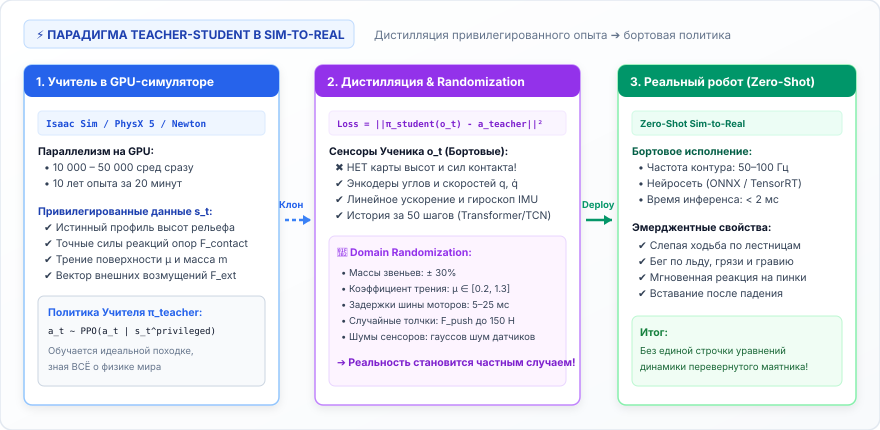

<!-- _class: lead -->
<!-- _header: "" -->
<!-- _footer: "" -->

# **Планирование движений мобильных роботов**
## Лекция 07: Обучение с подкреплением и фундаментальные модели: RL, VLA и World Action Models (WAM)

⏱️ 90 минут
Embodied AI &amp; Foundation Models
Sim-to-Real • Isaac Sim • Diffusion Policy • ACT • VLA • WAM

---

<!-- _header: "Лекция 07 | Мотивация и введение" -->

## Кризис аналитического управления при сложных контактах 02–06 мин

### 📉 Где спотыкается классический MPC?

В лекциях 05 и 06 мы строили математически идеальные траектории:
- Мы полагались на точные дифференциальные уравнения: $\dot{x} = f(x, u)$.
- Но что происходит, когда робот наступает ногой на гравий, мокрый кафель или заснеженную лестницу?
- **Проблема контактов:** удар стопы о землю создает мгновенный разрыв сил и переключение динамических режимов (гибридная динамика).
- Традиционные модели (перевернутый маятник ZMP) заставляют робота ходить на полусогнутых «деревянных» ногах. Любой непредвиденный толчок приводит к падению.

### 🚀 Прорыв нейросетевого управления (2020–2026)

Вместо ручного вывода уравнений физики мы передаем управление глубоким нейросетям:

1. **Обучение с подкреплением (RL):** робот сам находит динамические компенсации ударов и скольжения, падая миллионы раз в параллельной GPU-симуляции.
2. **Имитационное обучение (Diffusion / ACT):** моделирование сложных человеческих манипуляций без программирования логики захватов.
3. **Фундаментальные модели действий (VLA &amp; WAM):** слияние зрения, языка и предсказания динамики среды в масштабируемые нейросетевые архитектуры.

<!-- 
Методические указания лектору:
1. Напомните студентам пройденный материал: MPC великолепен для колесных шасси и манипуляторов в чистой среде, но когда число степеней свободы > 25, а контакты нестационарны, QP-солверы не справляются с неопределенностью.
2. Сформулируйте главную интригу лекции: почему за последние 4 года вся шагающая робототехника перешла на RL.
-->

---

## План лекции на 90 минут 06–09 мин

### 1. Почему выстрелил RL в робототехнике?
- Тупик аналитических маятников при ударах и контактах.
- Параллельная GPU-симуляция: **NVIDIA Isaac Sim (PhysX 5, Newton / Warp)** и MuJoCo MJX.
- Схема **Teacher-Student** (привилегированное обучение).
- Преодоление разрыва реальности: **Domain Randomization**.

### 2. Имитационное обучение: Diffusion &amp; ACT
- Коллапс наивного клонирования поведения (Behavioral Cloning, Covariate Shift).
- Почему MSE-регрессия усредняет действия и врезается в стену.
- **Action Chunking with Transformers (ACT)** и **Diffusion Policy**.

### 3. Архитектуры VLA (Vision-Language-Action)
- От VLM к физическому действию: OpenVLA, Octo, $\pi_0$.
- Дискретная токенизация действий против **Flow Matching**.

### 4. WAM (World Action Models)
- Предсказание будущего мира по вектору действия: $P(s_{t+1} \mid s_t, a_t)$.
- «Мысленный роллаут» (Mental Rollouts) до подачи токов на моторы.

### 5. Вычислительный бюджет и Edge-инференс
- Проблема задержки (Latency): 7B VLA на 3 Гц vs моторы на 1000 Гц.
- Многотактовая иерархия и чипы NVIDIA Jetson Orin / Thor.

<!-- 
Методические указания лектору:
Кратко обозначьте логическую цепочку: от базового моторного рефлекса (RL локомоция) через манипуляцию (диффузия) к мышлению (VLA и WAM) и аппаратному инференсу.
-->

---

## 1. Почему выстрелил RL в робототехнике? 09–16 мин

### 🧱 Предел аналитики: Уравнения контакта

Классический подход (ZMP — Zero Moment Point, захват точки нуля момента) требует упрощать робота до линейного перевернутого маятника (LIPM):

$$x_{\text{zmp}} = x - \frac{z_c}{g}\ddot{x}$$

- **В чем ложь модели?** Маятник предполагает, что масса сосредоточена в одной точке, ноги невесомы, а контакт со стопой абсолютно жесткий и сухой.
- В реальности: суставы имеют люфты, резина подошвы деформируется, центр масс смещается при махе руками, а контакт проскальзывает.
- Классический контроллер требует сотен ручных эвристик на каждый тип препятствия.

### ⚡ Формулировка задачи через MDP

В обучении с подкреплением задача решается без упрощения геометрии:

$$\max_{\pi_\theta} \mathbb{E} \left[ \sum_{t=0}^T \gamma^t r(s_t, a_t) \right]$$

- **Состояние $s_t$:** углы и скорости суставов $q, \dot{q}$, показания акселерометра и гироскопа IMU.
- **Действие $a_t$:** целевые углы для низкоуровневых PD-регуляторов моторов:
$$\tau = K_p(q^* - q) - K_d \dot{q}$$
- **Награда $r(s,a)$:** стимулирует скорость вперед, наказывает падения, удары стоп и перерасход энергии моторов.

<!-- 
Методические указания лектору:
Подчеркните: RL не заменяет моторы и PD-регуляторы! RL-политика выдает целевые уставки углов q* для встроенных в приводы микроконтроллеров, работающих на частоте 1 кГц.
-->

---

## Взрыв параллельных GPU-симуляторов 16–23 мин

### 🐢 Проблема симуляторов прошлого поколения

Раньше физику робота считали на CPU (Gazebo, ODE, Bullet):
- 1 ядро процессора моделировало 1 робота со скоростью реального времени ($1\times$).
- Чтобы собрать **10 лет опыта** падений и ходьбы, требовалось физически ждать **10 календарных лет** (или арендовать кластер из 5000 серверов).
- Это делало сквозное обучение шагающих роботов непрактичным.

### 🚀 Эра тензорных физических движков (Isaac Sim)

Появление **NVIDIA Isaac Sim (Isaac Lab / Orbit)** на движках **PhysX 5** и **Newton / Warp**, а также **MuJoCo MJX**:

- Вся физика твердых тел, контактов и столкновений перенесена на тензорные ядра GPU (CUDA).
- На одной видеокарте RTX 4090 параллельно обсчитываются **от 10 000 до 50 000 роботов** одновременно!
- Тензоры состояний не покидают видеопамять (Zero-Copy): расчет градиентов PPO происходит прямо на GPU.
- **Результат:** 10 лет опыта робот проживает за **15–20 минут** обучения!

  
50 000 Роботов в 1 GPU-инстансе

  
100 000× Ускорение относительно реального времени

  
20 минут Полный цикл обучения походки с нуля

<!-- 
Методические указания лектору:
Объясните студентам термин Zero-Copy: в старых пайплайнах передача данных из симулятора C++ в PyTorch через оперативную память тормозила обучение. В Isaac Sim все вычисления происходят внутри VRAM одного GPU.
-->

---

## Схема Teacher-Student и Domain Randomization 23–30 мин

### 👨‍🏫 Привилегированное обучение (Teacher-Student)

Как обучить робота ходить по рельефу, если на борту нет идеальных дальномеров?

1. **Фаза 1: Обучение Учителя ($\pi_{\text{teacher}}$)**
   - В симуляции Учителю открыты **привилегированные данные**: точная карта высот под ногами, коэффициенты трения $\mu$, массы и внешние силы ударов.
   - Учитель учится идеальной адаптивной походке методом PPO.
2. **Фаза 2: Дистилляция в Ученика ($\pi_{\text{student}}$)**
   - Ученик получает **только бортовые сенсоры**: IMU, энкодеры суставов и **историю наблюдений за 50 шагов** ($h_t$).
   - По временной истории просадки моторов скрытые слои Ученика (Transformer/TCN) сами восстанавливают рельеф и трение!
   - Функция потерь: $\mathcal{L}_{\text{distill}} = \|\pi_{\text{student}}(o_t, h_t) - a_{\text{teacher}}\|^2$.

### 🎲 Domain Randomization: Взлом реальности

Симуляция никогда не равна реальности (*Reality Gap*). Как гарантировать, что робот не упадет на настоящем асфальте?

Мы делаем виртуальный мир **намеренно хаотичным**:
- Массы звеньев случайным образом меняются на $\pm 30\%$.
- Трение варьируется от мокрого льда ($\mu = 0.1$) до наждачной бумаги ($\mu = 1.3$).
- Вводятся случайные задержки команд приводов (от 5 до 30 мс).
- Робота ежесекундно толкают случайными импульсами сил до 150 Н.

**Вывод:** Настоящий физический мир становится для нейросети просто *еще одной вариацией симуляции*!

<!-- 
Методические указания лектору:
Подчеркните фундаментальную мысль: робот понимает, что идет по скользкому льду, не глазами, а по истории проскальзывания суставов за последние 500 миллисекунд.
-->

---

## Архитектура Sim-to-Real: От GPU к живому роботу 30–34 мин

<!-- 
Методические указания лектору:
Разберите со студентами три колонки диаграммы:
1. Левая: Привилегированный Учитель в Isaac Sim.
2. Центральная: Контролируемая дистилляция через MSE и Domain Randomization.
3. Правая: Инференс компактной нейросети TensorRT на физическом роботе со временем отклика < 2 мс.
-->

---

## 2. Имитационное обучение: Крах наивного BC 34–40 мин

### 🎮 Телеоперация и датасеты действий

Для манипуляций (взять чашку, вставить ключ в замок) функцию награды RL составить почти невозможно.
- Человек-оператор управляет роботом через VR-шлем и захваты (телеоперация), записывая траектории демонстраций: $\mathcal{D} = \{(o_t, a_t)\}_{t=1}^M$.
- **Наивный подход: Behavioral Cloning (BC)**
  Обычное обучение с учителем (Supervised Learning): минимизируем невязку между действием сети и действием человека:
  $$\mathcal{L}_{\text{BC}}(\theta) = \sum \| \pi_\theta(o_t) - a_t^* \|^2$$

### ⚠️ Проблема Covariate Shift (Накопление ошибки)

В теории BC выглядит просто, но на реальном роботе **катастрофически проваливается**:

1. На шаге 1 робот ошибся на 1 миллиметр.
2. Сенсоры зафиксировали состояние, которого **никогда не было в обучающем датасете** от человека-эксперта.
3. Сеть выдает случайное действие, ошибка возрастает до 5 мм, затем до 10 см.
4. Робот впадает в ступор или бьется о стол.

**Проблема мультимодальности:** Человек может обойти кружку слева или справа. Обычная сеть усредняет оба пути и пытается пройти сквозь кружку!

<!-- 
Методические указания лектору:
Продемонстрируйте простую аналогию: если водитель учится водить машину, глядя только на идеальные действия мастера, он не знает, что делать, если колесо уже занесло на обочину, потому что мастер туда никогда не заезжал.
-->

---

## Решение: Diffusion Policy и Action Chunking (ACT) 40–48 мин

### 🌊 Идея Diffusion Policy (Chi et al., 2023)

Вместо регрессии одного действия мы заимствуем алгоритмы генерации изображений (Stable Diffusion / DDPM):

1. Политика начинает с **чистого шума в пространстве действий**: $a^K \sim \mathcal{N}(0, I)$.
2. За 10–16 шагов денойзинга сеть убирает шум, кондиционируясь на кадры камер:
   $$a^{k-1} = \alpha_k (a^k - \epsilon_\theta(a^k, k, o_t)) + \sigma_k z$$
3. **Победа над мультимодальностью:** диффузия не усредняет траектории, а выбирает одну четкую моду распределения (либо четко слева, либо четко справа).

### 📦 Action Chunking with Transformers (ACT)

Почему нельзя предсказывать действия по одному шагу ($a_t$)?
- Одиночные действия на частоте 50 Гц приводят к **дрожанию суставов (jitter)** и застреванию.
- **Идея ACT (Zhao et al., 2023):** нейросеть предсказывает **пакет (чанк) из 16–50 шагов вперед**:
  $$A_{t:t+H} = [a_t, a_{t+1}, \dots, a_{t+H}]$$
- Робот плавно исполняет этот чанк, применяя сглаживающее скользящее окно (Temporal Ensembling).
- Движения становятся кинематографически плавными и естественными, как у человека.

<!-- 
Методические указания лектору:
Подчеркните: Diffusion Policy и ACT стали индустриальным стандартом 2024 года. Именно на них работают манипуляторы в Tesla Optimus, Figure 02 и лабораториях Stanford (Mobile ALOHA).
-->

---

## Мультимодальность: Регрессия против Диффузии 48–52 мин

<!-- 
Методические указания лектору:
Обратите внимание студентов на левую часть: математика минимизации квадратичной ошибки неизбежно выдает среднее арифметическое (прямо в препятствие). Справа: пошаговое обесшумливание восстанавливает гладкую валидную траекторию.
-->

---

## 3. Архитектуры VLA (Vision-Language-Action) 52–60 мин

### 🧠 Слияние интернет-интеллекта и робототехники

До 2023 года роботы были «слепоглухонемыми специалистами»: одна сеть умела открывать только один конкретный шкаф.
- **Цель VLA:** создать единую фундаментальную модель, понимающую естественный язык и произвольные визуальные сцены.
- **Анатомия VLA (OpenVLA, Octo, RT-2):**
  1. **Vision Encoder (SigLIP / DINOv2):** режет изображение с камер на патчи и переводит в токены.
  2. **Языковой трансформер (Llama-2 / Gemma):** связывает текстовую команду («положи яблоко в тарелку») с объектами на столе.
  3. **Action Head:** генерирует физические команды приводов.

### ⚔️ Битва представлений: Токены vs Flow Matching

Как заставить LLM выдавать непрерывные числа (углы моторов)?

1. **Дискретная токенизация (RT-1, RT-2):**
   - Непрерывный диапазон $[-1, +1]$ делят на 256 бинов.
   - Моторы управляются как обычные слова: `<action_128><action_45>...`.
   - *Минус:* авторегрессия медленная, теряется точность.
2. **Flow Matching и Непрерывная Диффузия ($\pi_0$, 2024):**
   - Модель Physical Intelligence ($\pi_0$) отказалась от токенизации действий.
   - Действия генерируются через непрерывный векторный поток (Flow Matching) параллельно за 30 мс!

<!-- 
Методические указания лектору:
Расскажите про открытый датасет Open X-Embodiment: более миллиона траекторий от 22 робототехнических лабораторий мира, на которых обучаются модели OpenVLA и Octo.
-->

---

## Архитектурный конвейер модели VLA 60–64 мин

<!-- 
Методические указания лектору:
Детально пройдитесь по блокам: 
1. Входы камер и текстового промпта.
2. Токенизаторы.
3. Мультимодальный бэкбон (7 миллиардов параметров).
4. Разница между дискретной выдачей и диффузионным Flow Matching.
-->

---

## 4. WAM (World Action Models — Модели мира действий) 64–72 мин

### 🌐 Что такое модель мира в робототехнике?

Человек не двигает рукой наугад — мы сначала **представляем в воображении**, что произойдет, если толкнуть чашку.
- **World Action Model (WAM):** генеративная нейросеть, предсказывающая следующее сенсорное состояние мира с условием на подаваемое действие:
  $$\hat{s}_{t+1} \sim P(s_{t+1} \mid s_t, a_t)$$
- Примеры архитектур: **Genie** (Google), **UniSim**, **DayDreamer** (DreamerV3 на реальных роботах), **DriveDreamer**.
- Вход: текущий кадр $s_t$ + предполагаемая траектория моторов $a_t$.
- Выход: реалистичный видеокадр того, как деформируется объект или сместится робот.

### 🔮 Мысленное планирование (Mental Rollouts)

Зачем тратить ресурсы на генерацию видео на борту робота?

1. **Безопасная оценка рисков:**
   - Робот генерирует 10 вариантов траекторий.
   - Модель мира делает видео-прогноз каждого варианта на 3 секунды вперед.
   - Если на прогнозе чашка опрокидывается или ломается палец, траектория отбрасывается **до подачи тока на моторы**!
2. **Генерация синтетических данных:**
   - Модель мира становится бесконечным генератором обучающих примеров для RL-политики внутри памяти компьютера.

<!-- 
Методические указания лектору:
Подчеркните фундаментальное различие: классический MPC предсказывает будущее по формуле x_{k+1} = Ax + Bu, а WAM предсказывает будущее в пикселях или латентных эмбеддингах через генеративные диффузионные трансформеры.
-->

---

## Мысленный роллаут WAM: Планирование в воображении 72–76 мин

<!-- 
Методические указания лектору:
Обратите внимание студентов на блок отбора действий: робот в симуляции воображения отбрасывает рискованное действие А (пролив воды) и физически исполняет только безопасный вариант Б.
-->

---

## 5. Вычислительный бюджет и Edge-инференс 76–84 мин

### ⏱️ Проблема «Latency Gap» (Задержки)

В робототехнике нейросети упираются в законы физики и времени:
- Модель OpenVLA (7B параметров) требует сотен миллиардов операций матричного умножения на 1 кадр.
- Даже на мощнейшем бортовом чипе время инференса составляет **150–300 мс (частота 3–5 Гц)**.
- **Физический парадокс:** Двуногий робот упадет за **80 миллисекунд**, если суставы не скорректируют равновесие!
- Нельзя управлять устойчивостью всего тела напрямую из тяжелой VLA-модели.

### ⚡ Многотактовое разделение контуров

Индустриальное решение — строгая иерархия по частотам:

1. **Медленный контур (2–5 Гц, VLA / WAM):** анализирует сцену, понимает речь, генерирует подцели для кистей рук (End-Effector waypoints).
2. **Быстрый контур (50–200 Гц, Full-Body RL WBC):** компактная сеть на TensorRT, координирующая суставы тела и удерживающая баланс.
3. **Моторный контур (1 кГц, MCU / FOC):** аппаратные драйверы токов фаз и жесткости в суставах.

<!-- 
Методические указания лектору:
Сделайте акцент: разделение частот — это закон робототехники. Точно так же у человека спинной мозг отдергивает руку от горячего за миллисекунды (рефлекс), пока кора головного мозга только начинает осознавать произошедшее.
-->

---

## Иерархия вычислительных контуров робота 84–87 мин

<!-- 
Методические указания лектору:
Пройдитесь по строкам диаграммы сверху вниз: от облачного планировщика (0.1 Гц) через бортовой VLA (3 Гц, 50 Вт) и Full-body RL (100 Гц, 5 мс) до моторов (1000 Гц, < 1 мс).
-->

---

## 📚 Рекомендуемая литература и открытые репозитории 87–90 мин

### 📄 Фундаментальные научные статьи

- 📖 **Miki et al. (Science Robotics, 2022):**  
  *«Learning robust quadrupedal locomotion over challenging terrain»*  
  *Эталонная работа ETH Zurich по схеме Teacher-Student и экстремальной слепой проходимости.*
- 📖 **Chi et al. (RSS, 2023):**  
  *«Diffusion Policy: Visuomotor Policy Learning via Action Diffusion»*  
  *Статья, перевернувшая манипуляционную робототехнику.*
- 📖 **Black et al. (Physical Intelligence, 2024):**  
  *«$\pi_0$: A Vision-Language-Action Flow Model for General Robot Control»*  
  *Современный манифест Flow Matching в робототехнике.*
- 📖 **Wu, Hafner et al. (CoRL, 2022) / Hafner et al. (Nature, 2023):**  
  *«DayDreamer: World Models for Physical Robot Learning» &amp; «Mastering Diverse Domains through World Models»*  
  *Фундаментальные работы по обучению роботов внутри генеративных моделей мира.*

### 🛠️ Open-Source инструменты и кодовые базы

- 📦 **NVIDIA Isaac Lab (бывший Orbit):** [isaac-sim.github.io/IsaacLab](https://isaac-sim.github.io/IsaacLab/) — стандарт для параллельного обучения на GPU.
- 📦 **OpenVLA:** [openvla.github.io](https://openvla.github.io/) — открытая 7B мультимодальная робототехническая модель.
- 📦 **HuggingFace LeRobot:** [github.com/huggingface/lerobot](https://github.com/huggingface/lerobot) — популярнейший репозиторий со сквозными реализациями ACT и Diffusion Policy.

<!-- 
Методические указания лектору:
1. Завершите лекцию мостом к следующей теме: мы изучили все базовые блоки современного интеллекта роботов (RL, Diffusion, VLA, WAM).
2. Анонсируйте финальную Лекцию 08: как все эти технологии сливаются воедино в современных гуманоидных роботах (Figure 02, Tesla Optimus, Unitree G1) и почему Китай стал эпицентром железной революции.
-->
