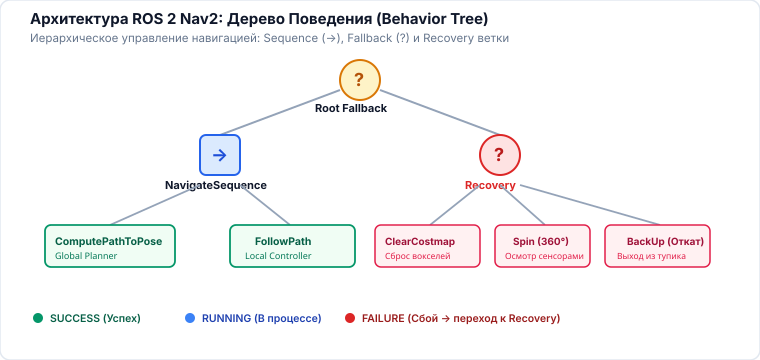

<!-- _class: lead -->
<!-- _header: "" -->
<!-- _footer: "" -->

# **Планирование движений мобильных роботов**
## Лекция 08: Вычислительные аспекты и инженерные компромиссы

⏱️ 90 минут
Инженерия и архитектура
D* Lite • Multi-Rate • ROS 2 Nav2 • Behavior Trees • Sim-to-Real

---

<!-- _header: "Лекция 08 | Введение и мотивация" -->

## Чему посвящена эта лекция? Инженерия и архитектура

### 🎯 От математических теорем к реальному железу

Алгоритмы $A^*$, RRT*, MPC и TVLQR безупречны на бумаге. Но когда вы запускаете их на бортовом компьютере реального робота (NVIDIA Jetson или x86 SoC), они сталкиваются с суровой инженерной реальностью: ограниченным бюджетом CPU, задержками сенсорных очередей, ложными препятствиями в облаках точек и системными сбоями.

Эта лекция посвящена <strong>системной интеграции и вычислительной инженерии</strong>: как объединить разрозненные алгоритмы в промышленно надежный навигационный стек (ROS 2 Nav2) с гарантированным реальным временем.

**💡 Результат занятия:** Проектировать многотактовую архитектуру реального времени, настраивать слоеные карты стоимости Costmap 2D/3D с быстрым раздутием, описывать миссии автономного движения через XML Behavior Trees и строить отказоустойчивые промышленные AGV/AMR комплексы.

### 🔍 Ключевые вопросы лекции

- <strong>Многотактовость и задержки:</strong> Как связать контуры 1 Гц, 30 Гц и 1 кГц без рассинхронизации и отставания от датчиков?
- <strong>Динамическое перепланирование:</strong> Алгоритм <strong>$D^*$ Lite</strong> (ETH / Koenig & Likhachev) и починка графа за миллисекунды.
- <strong>Быстрые карты стоимости:</strong> Алгоритм Фельценшвальба для расчета Евклидова расстояния (<strong>EDT</strong>) за $\mathcal{O}(N)$ без сеточных волн.
- <strong>Деревья поведения (Behavior Trees):</strong> Почему конечные автоматы (FSM) не масштабируются и как Nav2 управляет миссиями?
- <strong>Отказоустойчивость:</strong> Иерархия аварийного восстановления (Recovery Behaviors) и преодоление разрыва <strong>Sim-to-Real</strong>.

---

<!-- _header: "Лекция 08 | Структура занятия" -->

## План лекции на 90 минут ⏱️ 90 минут

### Часть 1: Системы реального времени и алгоритмы (45 мин)

- <strong>00–12 мин:</strong> Инженерные компромиссы: точность vs частота, память vs скорость, распределение ядер CPU/GPU.
- <strong>12–22 мин:</strong> Многотактовая архитектура (Multi-Rate System): компенсация аппаратной задержки сенсоров (Latency Prediction).
- <strong>22–35 мин:</strong> Динамическое перепланирование: <strong>$D^*$ Lite</strong> (Koenig & Likhachev) — инкрементальный поиск с правыми частями $rhs(s)$.
- <strong>35–45 мин:</strong> Быстрые алгоритмы раздутия: <strong>Euclidean Distance Transform (EDT)</strong> Фельценшвальба за $\mathcal{O}(W \times H)$.

### Часть 2: Архитектура Nav2 и Надежность (45 мин)

- <strong>45–58 мин:</strong> Архитектура ROS 2 Nav2: асинхронные Action-серверы и <strong>Деревья Поведения (Behavior Trees)</strong>.
- <strong>58–68 мин:</strong> Слоеные карты стоимости (Layered Costmaps): Static, Obstacle, Voxel, Inflation Layer.
- <strong>68–78 мин:</strong> Отказоустойчивость: иерархия восстановления (Spin, Backup, Costmap Clearing, E-Stop).
- <strong>78–90 мин:</strong> Преодоление <strong>Sim-to-Real</strong> (калибровка, задержки, шум). <strong>Итоги всего курса лекций</strong> и Q&A.

<!--
Примечание для лектора:
Это финальная, венчающая лекция курса. Покажите студентам, как все концепции предыдущих 7 лекций (C-space, A*, RRT*, DWA, MPC, связи Ли) сходятся в единую стройную систему промышленного робота.
-->
---

## 1. Инженерные компромиссы в реальном роботе 00–12 мин

### 1. Горизонт vs Частота

- <strong>Длинный горизонт:</strong> находит глобально оптимальные объезды, но требует сотен миллисекунд CPU.
- <strong>Короткий горизонт:</strong> мгновенный пересчет ($> 50$ Гц), но риск упереться в локальный тупик.
- <strong>Решение:</strong> разделение на глобальный ($1\text{--}2$ Гц) и локальный ($30\text{--}50$ Гц) контуры.

### 2. Точность vs Память

- Разрешение 1 см дает идеальную точность в дверных проемах, но взрывает память и кэш L3 процессора.
- Разрешение 10 см считается мгновенно, но сглаживает проходы и заставляет робота думать, что дверь заперта.
- <strong>Решение:</strong> иерархические структуры (OctoMap, ESDF).

### 3. Бюджет бортового SoC

- На одноплатном компьютере (NVIDIA Jetson / x86) одновременно работают: SLAM, нейросети детекции людей и планировщик.
- Лимит на поток планирования: не более <strong>1–2 ядер CPU</strong> и <strong>$\le 30$ мс</strong> на цикл.
- Вынуждает использовать генерацию кода на C/C++ и lock-free структуры.

---

## 2. Многотактовая архитектура и компенсация задержки 12–22 мин

### Иерархия временных контуров (Multi-Rate):

$$\begin{array}{lcl}
\text{Миссия (Behavior Tree)} &\sim 1\text{ Гц} &\Delta t = 1000\text{ мс} \\
\text{Глобальный планировщик } (A^*) &\sim 1\text{--}2\text{ Гц} &\Delta t = 500\text{ мс} \\
\text{Локальный планировщик / MPC} &\sim 20\text{--}50\text{ Гц} &\Delta t = 20\text{--}50\text{ мс} \\
\text{Контроллер приводов (RTOS)} &\sim 500\text{--}1000\text{ Гц} &\Delta t = 1\text{--}2\text{ мс}
\end{array}$$

Потоки обмениваются данными асинхронно через кольцевые буферы без взаимных блокировок (Lock-free Ring Buffers).

### Проблема аппаратной задержки (Latency):

Пока лидар отсканировал точки ($20$ мс), фильтр SLAM обновил позу ($15$ мс), а MPC посчитал траекторию ($25$ мс), проходит суммарная задержка $\Delta t_{lat} = 60$ мс.

Если робот мчится со скоростью $2$ м/с, он проезжает <strong>12 сантиметров "вслепую"</strong> до применения команды!

<strong>Решение (State Forward Prediction):</strong> MPC должен оптимизировать траекторию не от текущей замеренной позы $x(t)$, а от прогнозируемой позы на момент завершения расчета:
$$x_{init}^{mpc} = x(t) + \int_{t}^{t + \Delta t_{lat}} f(x, u_{current}) dt$$

---

## Разбор: кто с какой частотой обязан успевать 18–22 мин

---

## 3. Динамическое перепланирование: Алгоритм $D^*$ Lite 22–35 мин

### Идея инкрементального поиска (Koenig & Likhachev):

Пусть робот едет по найденному пути, и лидар обнаруживает новое препятствие. Полный перезапуск $A^*$ неэффективен!

<strong>$D^*$ Lite</strong> выполняет поиск <em>в обратном направлении</em> (от цели к текущей позе) и поддерживает две оценки:

- $g(s)$ — текущая оценка стоимости пути от $s$ до $s_{goal}$.
- $rhs(s)$ — одношаговая упреждающая оценка через соседей:
$$rhs(s) = \min_{s' \in \operatorname{Succ}(s)} \Big( c(s, s') + g(s') \Big)$$

Узел называется <strong>локально согласованным</strong>, если $g(s) = rhs(s)$.

### Ремонт графа при обнаружении препятствия:

- При обнаружении нового препятствия стоимость затронутых ребер $c(u, v)$ меняется на $\infty$.
- Только узлы с $g(u) \neq rhs(u)$ помещаются в приоритетную очередь <code>PriorityQueue</code> с составным ключом:
$$k(s) = \Big[ \min(g, rhs) + h(s_{start}, s) + k_m, \;\; \min(g, rhs) \Big]$$

- Алгоритм быстро «раскручивает» только поврежденные ветви графа, не пересчитывая 95% оставшейся карты!

<strong>Скорость:</strong> $D^*$ Lite обновляет маршрут в 10–100 раз быстрее полного перезапуска $A^*$, обеспечивая бесшовное огибание внезапных препятствий.

---

## 4. Быстрое Евклидово Преобразование (EDT за $\mathcal{O}(N)$) 35–45 мин

### Проблема наивного раздутия препятствий:

Для безопасного движения робота радиуса $R$ карту занятости нужно раздуть (Inflation). Волновой алгоритм Дейкстры (BFS) от каждого занятого пикселя работает крайне медленно:

$$\mathcal{O}(K \cdot N_{cells})$$

При карте склада $2000 \times 2000$ ячеек обновление занимает секунды, блокируя поток планировщика.

### Алгоритм Фельценшвальба (Felzenszwalb & Huttenlocher):

Точное преобразование евклидова расстояния (Squared Euclidean Distance Transform) вычисляется как нижняя огибающая парабол:

$$D_f(p) = \min_{q} \Big( (p - q)^2 + f(q) \Big)$$

- <strong>Свойство сепарабельности:</strong> 2D задача разделяется на два независимых 1D прохода — сначала по строкам матрицы, затем по столбцам!
- Каждый 1D проход выполняется за строго линейное время через стек пересечения парабол.
- Итоговая асимптотика: <strong>строго $\mathcal{O}(W \times H)$</strong>!

Полная карта расстояний $2000 \times 2000$ рассчитывается за <strong>менее чем 5 миллисекунд</strong> на одном ядре CPU!

---

## 5. Архитектура ROS 2 Nav2: Деревья Поведения 45–58 мин

### Почему Behavior Trees (BT) вытеснили FSM?

- <strong>Конечные автоматы (FSM):</strong> при росте числа состояний число переходов взрывается комбинаторно ($\mathcal{O}(N^2)$), порождая спагетти-код.
- <strong>Behavior Trees (Nav2):</strong> дерево реактивных узлов, возвращающих <code>SUCCESS</code>, <code>FAILURE</code> или <code>RUNNING</code>. Высокая модульность и переиспользование.

<strong>Типы узлов:</strong>

- <code>Sequence (->)</code>: выполняет дочерние узлы по очереди, пока они успешны.
- <code>Fallback (?)</code>: выполняет альтернативы, пока хотя бы одна не сработает (логика восстановления).

### Пример фрагмента дерева Nav2:

    <pre><code>&lt;root main_tree_to_execute="MainTree"&gt;
  &lt;BehaviorTree ID="MainTree"&gt;
    &lt;RecoveryNode number_of_retries="3"&gt;
      &lt;PipelineSequence&gt;
        &lt;ComputePathToPose goal="{goal}" path="{path}"/&gt;
        &lt;FollowPath path="{path}" controller_id="FollowPath"/&gt;
      &lt;/PipelineSequence&gt;
      &lt;ReactiveFallback&gt;
        &lt;ClearEntireCostmap/&gt;
        &lt;Spin spin_dist="1.57"/&gt;
        &lt;BackUp backup_dist="0.3"/&gt;
      &lt;/ReactiveFallback&gt;
    &lt;/RecoveryNode&gt;
  &lt;/BehaviorTree&gt;
&lt;/root&gt;</code></pre>
  

---

## Разбор: как дерево решает, что делать при отказе 52–58 мин

---

## 6. Слоеные карты стоимости (Layered Costmaps) 58–68 мин

В современных системах (Nav2 Costmap2D) карта не является плоским массивом. Она собирается из независимых <strong>плагинов-слоев</strong>:

### Слои Costmap:

- <strong>Static Layer:</strong> постоянная карта стен здания из SLAM (черно-белая сетка).
- <strong>Obstacle Layer / Voxel Layer:</strong> 2D/3D данные от лидаров и камер глубины (с рейкастингом для стирания исчезнувших препятствий).
- <strong>Range Layer:</strong> конусы безопасности от сонаров и бамперов.
- <strong>Inflation Layer:</strong> экспоненциальное раздутие стоимости вокруг препятствий:
$$\operatorname{cost}(d) = 254 \cdot \exp\left( -\alpha (d - r_{inscribed}) \right)$$

### Шкала стоимостей ячейки (0–255):

- <code>0 (FREE_SPACE)</code>: абсолютно свободная зона (нет штрафа).
- <code>1–252</code>: зона градиента раздутия (поощряет планировщик держаться по центру коридора).
- <code>253 (INSCRIBED)</code>: робот еще не касается препятствия, но вписанная окружность уже пересекает его — риск коллизии при развороте!
- <code>254 (LETHAL)</code>: прямое геометрическое препятствие.
- <code>255 (NO_INFORMATION)</code>: неисследованная область.

---

## 7. Отказоустойчивость: Иерархия восстановления 68–78 мин

Что делать, если глобальный путь заблокирован или локальный контроллер не может продвинуться вперед? Nav2 запускает <strong>эскалацию поведений восстановления (Recovery Behaviors)</strong>:

### Каскад восстановления (Recovery Pipeline):

- <strong>1. Clear Stale Costmap:</strong> Очистка динамических препятствий за пределами локального радиуса (удаление артефактов призраков и шума лидара).
- <strong>2. Wait (Пауза 1–3 с):</strong> Ожидание, пока пешеход или встречный погрузчик проедет сам.
- <strong>3. Spin (Поворот на месте на 360°):</strong> Сенсорный осмотр окружения и обновление всех слоев карты.
- <strong>4. BackUp (Откат назад на 30–50 см):</strong> Выезд из тупика по ранее проверенной свободной траектории.
- <strong>5. E-Stop & Operator Alert:</strong> Если 3 попытки исчерпаны — безопасная остановка и вызов диспетчера.

### Принцип «Не навреди»:

- Любое восстановительное действие (особенно BackUp) <strong>обязано производить непрерывную проверку коллизий</strong> сзади!
- Если сзади робота неожиданно встал человек — действие отката немедленно прерывается.

Использование Behavior Tree позволяет декларативно настраивать порядок и параметры восстановления без изменения единой строчки C++ кода.

---

## 8. Преодоление Sim-to-Real и Финал Курса 78–86 мин

### Факторы расхождения Sim-to-Real:

- <strong>Террамеханика:</strong> идеальное трение в Gazebo vs переменный коэффициент $\mu$ (пыль, влажный бетон, ковры).
- <strong>Датчики:</strong> идеальные лучи симулятора vs переотражения лидара от стекол и зеркальных поверхностей, слепые зоны камер.
- <strong>Аппаратная задержка (Jitter):</strong> нерегулярные кванты времени операционной системы Linux без RT-Preempt патча.

<strong>Рецепт надежности:</strong> Domain Randomization (рандомизация массы и трения в симуляции), HIL-тестирование на реальном железе и аппаратный watchdog.

### Связующий мост всех 8 лекций курса:

$$\begin{array}{rcl}
\text{Мир и проходимость} &\rightarrow &\text{Лекция 01} \\
\text{Сетки, графы, Theta*, CBS} &\rightarrow &\text{Лекция 02} \\
\text{Сэмплинг в C-space (RRT*)} &\rightarrow &\text{Лекция 03} \\
\text{Реактивное уклонение (DWA)} &\rightarrow &\text{Лекция 04} \\
\text{Оптимальное управление (LQR)} &\rightarrow &\text{Лекция 05} \\
\text{Предиктивный горизонт (MPC)} &\rightarrow &\text{Лекция 06} \\
\text{Связи Ли, трение и TOPP} &\rightarrow &\text{Лекция 07} \\
\mathbf{\text{Инженерия и Nav2 BT}} &\rightarrow &\mathbf{\text{Лекция 08}}
\end{array}$$

---

<!-- _class: accent -->
<!-- _header: "Лекция 08 | Итоги и вопросы" -->

## Резюме лекции и завершение курса 86–90 мин

### Главные выводы:

- <strong>Многотактовая архитектура</strong> согласует разные частоты планирования и компенсирует сенсорные задержки упреждающим прогнозом состояния.
- <strong>$D^*$ Lite</strong> пересчитывает только затронутые участки графа, решая задачу перепланирования за миллисекунды.
- <strong>Алгоритм EDT</strong> строит карты расстояний за линейное время $\mathcal{O}(N)$ через разделение по осям.
- <strong>ROS 2 Nav2 и Behavior Trees</strong> обеспечивают масштабируемость логики миссий и автоматическое восстановление при сбоях.

### Контрольные вопросы курса:

- Зачем локальному планировщику необходимо компенсировать аппаратную задержку (Latency Prediction)?
- В чем заключается ключевое отличие алгоритма $D^*$ Lite от полного перезапуска алгоритма $A^*$?
- Почему алгоритм вычисления EDT Фельценшвальба работает за строго линейное время $\mathcal{O}(N)$?
- Какую роль играют Recovery Behaviors в предотвращении тупиковых ситуаций автономного мобильного робота?

Курс завершен! Желаем успехов в разработке автономных роботов! 🚀

