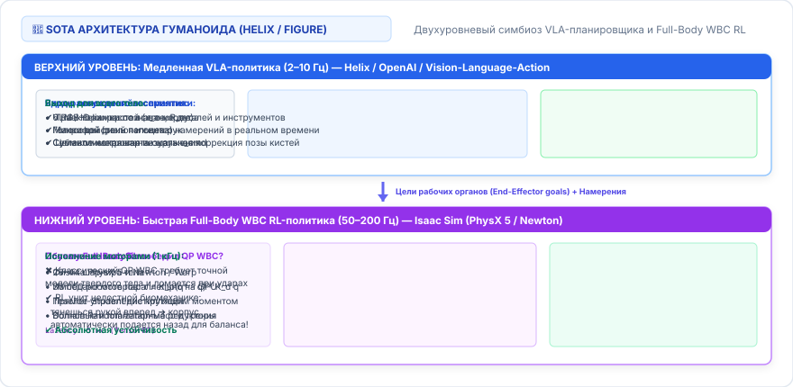
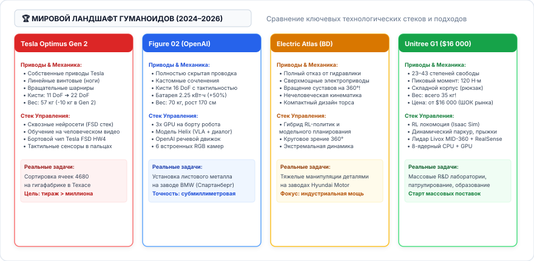
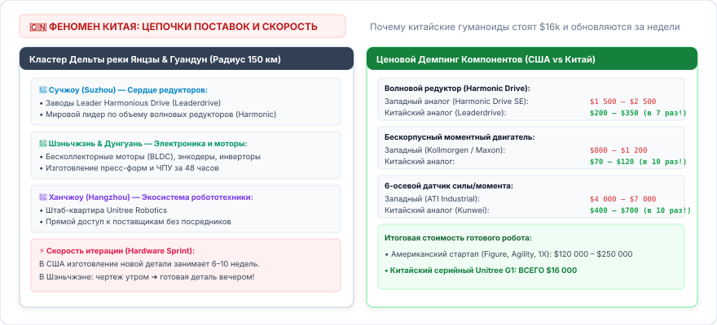
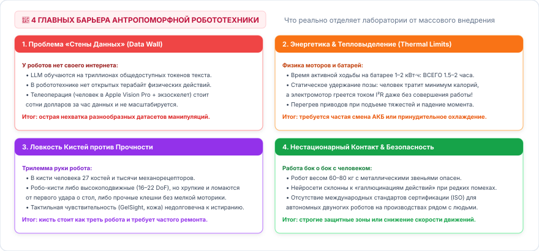

<!-- _class: lead -->
<!-- _header: "" -->
<!-- _footer: "" -->

# **Планирование движений мобильных роботов**
## Лекция 08: Современная антропоморфная робототехника: архитектура SOTA, индустрия, бум в Китае и фундаментальные вызовы

⏱️ 90 минут
Humanoid Robotics &amp; Embodied AI
Helix • Full-Body WBC RL • Tesla Optimus • Figure 02 • Unitree • Data Wall

---

<!-- _header: "Лекция 08 | Мотивация и введение" -->

## Предпосылки развития антропоморфных платформ 02–06 мин

### 🌍 Адаптация искусственной среды к антропоморфной биомеханике

Факторы концентрации научно-индустриальных инвестиций в области двуногих шагающих систем:
- **Организация антропогенного пространства:** лестничные пролеты, стандартные дверные проемы (80–90 см), стеллажи на высоте 1.5–2.0 м, органы управления технологическим оборудованием и транспортом оптимизированы под кинематику и габариты человека.
- **Инструментальная среда:** ручной инструмент, электрооборудование, технологические интерфейсы и манипуляционные приспособления рассчитаны на кинематику многопалой кисти с противопоставленным большим пальцем.
- Колесные мобильные платформы ограничены движением по плоским горизонтальным поверхностям, а четвероногие шагающие системы обладают ограниченной рабочей зоной манипулирования в вертикальной плоскости.

### 💡 Научно-технологические предпосылки перехода (2020–2026)

Исторически антропоморфные системы (например, Honda ASIMO) представляли собой демонстрационные платформы с жестким программным управлением и высокой чувствительностью к возмущениям.

Современный этап обусловлен конвергенцией трех ключевых направлений:
1. **Иерархические мультимодальные архитектуры (VLA / Helix):** интеграция зрительного восприятия и семантической интерпретации команд.
2. **Синтез полнотельных политик управления (Full-Body RL в среде Isaac Sim):** обеспечение естественной динамической устойчивости при ударных и нестационарных контактах.
3. **Трансформация глобальной компонентной базы:** снижение себестоимости прецизионных электромеханических приводов и датчиков более чем на порядок.

<!-- 
Методические указания лектору:
1. Задайте аудитории инженерный вопрос: «В каких сценариях двуногая схема кинематически оправдана по сравнению с колесными и гусеничными движителями?»
2. Подведите к выводу: колесные шасси эффективны в плоскости склада, но подавляющая часть индустриальной и бытовой инфраструктуры человека требует преодоления ступеней и манипулирования в вертикальном диапазоне роста человека.
-->

---

## План лекции на 90 минут 06–09 мин

### 1. Архитектура SOTA-гуманоида (Helix)
- Двухуровневый контур управления: верхнеуровневое планирование (VLA, 2–10 Гц) и низкоуровневая **полнотельная политика (Full-Body WBC RL, 50–200 Гц)**.
- Сравнительный анализ сквозного обучения с подкреплением и классического квадратичного программирования (QP WBC).
- Моделирование в среде параллельной физической симуляции NVIDIA Isaac Sim (PhysX 5 / Newton) на GPU.

### 2. Анализ мировых платформ и натурные результаты
- **Figure AI (Figure 01 / 02 + архитектура Helix):** опыт пилотной интеграции на автосборочном производстве BMW.
- **Tesla Optimus (Gen 2):** специализированные линейные и ротационные электроприводы, перенос автопилотного стека FSD.
- **Boston Dynamics (Electric Atlas):** электромеханическая трансмиссия, суставы с неограниченным вращением ($360^\circ$).
- **1X Technologies (NEO):** концепция податливых тросовых передач.
- Методология объективной оценки: автономность против скрытой телеоперации.

### 3. Развитие компонентной базы и производство в КНР
- Промышленные платформы: **Unitree (G1, H1)**, Fourier Intelligence (серия GR), LimX Dynamics, AgiBot, UBTECH Walker S.
- Концентрация цепочек поставок в кластере дельты реки Янцзы.
- Динамика себестоимости волновых редукторов и бескорпусных моментных двигателей.

### 4. Критические инженерные и физические ограничения
- Проблема нехватки демонстрационных данных («Стена данных», Data Wall).
- Тепловые режимы электроприводов и удельная энергоемкость бортовых источников питания.
- Компромисс между ловкостью многопалых кистей, прочностью и ресурсом тактильных датчиков.
- Безопасность взаимодействия и проблемы стандартизации сертификации.

<!-- 
Методические указания лектору:
Обозначьте академический научно-критический тон лекции: сопоставить рекламные материалы с физическими и алгоритмическими барьерами, ограничивающими полномасштабное внедрение двуногих роботов.
-->

---

## 1. Архитектура SOTA-гуманоида: Структура контуров управления 09–17 мин

### 🧠 Верхнеуровневый когнитивный контур: VLA-планировщик (Helix)

На верхнем уровне функционирует мультимодальная модель восприятия и планирования (тактовая частота **2–10 Гц**):
- **Входной вектор:** видеопотоки с многокамерного комплекса RGB-D (головной блок, торс, запястья), аудиоинформация, текстовые и речевые команды оператора.
- **Функциональные задачи:** семантическая сегментация рабочей сцены, оценка пространственной позы объектов (6D Pose Estimation), декомпозиция комплексного задания на последовательность двигательных примитивов.
- **Выходной вектор:** пространственно-временные уставки траекторий рабочих органов (End-Effector waypoints), ориентация кистей и дискретные команды схватов.
- Характеризуется значительной вычислительной латентностью (100–300 мс) при высоком уровне обобщения семантической информации.

### ⚡ Нижнеуровневый динамический контур: Full-Body WBC RL-политика

Управление динамикой тела возложено на высокочастотную нейросетевую политику (**50–200 Гц**):
- Синтезирована в среде параллельной физической симуляции **NVIDIA Isaac Sim (PhysX 5 / Newton)** алгоритмом PPO.
- **Входной вектор:** сигналы IMU, текущие обобщенные координаты и скорости суставов $q, \dot{q}$, опорные целевые позы рабочих органов от верхнего уровня.
- **Сквозная координация всех степеней свободы:** одновременное управление 25–40 шарнирами кинематической цепи.
- Обеспечивает согласованное движение звеньев опорного контура (ноги, таз), позвоночника и манипуляторов для сохранения динамического баланса при точном слежении за целевыми траекториями.

<!-- 
Методические указания лектору:
Обратите особое внимание: современная архитектура SOTA отказывается от искусственной изоляции контуров «отдельно ноги (локомоция), отдельно руки (манипулирование)». Управление формируется монолитной политикой полного тела (Full-Body Control).
-->

---

## Сравнение Full-Body RL и классического Whole-Body Control (QP) 17–25 мин

### 📐 Ограничения аналитического Whole-Body Control (QP)

Традиционный подход базируется на решении задачи квадратичного программирования на каждом шаге дискретизации:

$$\min_{\ddot{q}, \tau, \lambda} \|\ddot{x}_{\text{task}} - J \ddot{q} - \dot{J}\dot{q}\|^2 \quad \text{при} \quad M(q)\ddot{q} + C(q,\dot{q})\dot{q} + G(q) = \tau + J_c^T \lambda$$

- **Критические уязвимости метода:**
  1. Высокая чувствительность к точности аналитической идентификации матрицы инерции $M(q)$, нелинейных членов Кориолиса и параметров конусов трения Кулона.
  2. При ударном контакте или локальном срыве сцепления стопы система ограничений может стать несовместной (infeasible QP), приводя к срыву управления и падению робота.
  3. Затруднен учет распределенных нелинейных биомеханических компенсаций.

### 🏃 Преимущества сквозных RL-политик управления полным телом

Политика управления, обученная в параллельной среде симуляции:

1. **Органический биомеханический баланс:**
   - При манипулировании массивным объектом на вытянутых конечностях политика **автоматически смещает центр масс звеньев таза и корпуса назад**, удерживая проекцию общего центра масс внутри площади опоры стоп.
   - Закономерность выявляется в процессе стохастической оптимизации без аналитического задавания эвристик.
2. **Робастность при импульсных возмущениях:**
   - При внешних силовых воздействиях реализуется адаптивная реакция упреждающего перешагивания (Cross-step recovery) без риска прерывания оптимизатора.
3. **Вычислительная детерминированность:** время инференса нейросетевого модуля на базе TensorRT составляет **2–4 мс** с гарантированным постоянством времени выполнения.

<!-- 
Методические указания лектору:
Приведите аналогию из биомеханики: при подъеме тяжелого предмета с пола человек автоматически сгибает колени и отклоняет корпус для компенсации опрокидывающего момента. В классическом QP данный паттерн требует ручной параметризации и весовых коэффициентов, тогда как RL синтезирует его органически.
-->

---

## Двухуровневая архитектура Helix / Full-Body RL 25–29 мин

<!-- 
Методические указания лектору:
Детально разберите схему:
1. Верхний уровень (VLA / Helix): интеграция потока камер, семантики речи и формирование пространственных траекторий конечных звеньев.
2. Межуровневый интерфейс: высокоуровневые уставки позиций и ориентаций рабочих органов.
3. Нижний уровень: высокоскоростная нейросеть, обученная в Isaac Sim и формирующая моменты на всех шарнирах системы.
-->

---

## 2. Мировой ландшафт: Индустриальные лидеры 29–38 мин

### 🚗 Tesla Optimus (Gen 2, США)

- **Вертикальная интеграция и масштабируемое производство:** унификация компонентной базы с автомобильными решениями.
- **Собственные электромеханические приводы:** разработаны оригинальные ротационные узлы и компактные **планетарно-роликовые винтовые приводы** для тазобедренных и коленных суставов.
- **Многопалые кисти:** переход от 11 DoF (с тросовым приводом в предплечьях) к кинематике **22 DoF**, приближенной к естественной анатомической подвижности кисти человека.
- **Архитектура программного обеспечения:** сквозной перенос нейросетевого стека FSD (Full Self-Driving), оптимизированного под видеопоток, в задачи автономной сортировки аккумуляторных элементов 4680 на заводе в Остине.

### 🦾 Figure AI (Figure 01 / Figure 02, США)

- Основана Бреттом Эдкоком (Brett Adcock) в 2022 году. Стратегические партнеры: OpenAI, Microsoft, NVIDIA, Jeff Bezos.
- **Интеграция мультимодального интеллекта (Helix):** прямое сопряжение с моделями OpenAI для распознавания естественной речи и контекстного семантического планирования.
- **Конструктивные особенности Figure 02 (2024):**
  - Герметизация шарниров с полностью скрытой внутризвенной кабельной проводкой;
  - Бортовой вычислительный комплекс с **тремя встроенными GPU** для локального инференса нейросетевых моделей без задержек облачного канала;
  - **Пилотное внедрение на автосборочном заводе BMW (Спартанберг):** выполнение операций прецизионного позиционирования деталей из листового металла на сборочных линиях.

<!-- 
Методические указания лектору:
Сопоставьте стратегии компаний: Tesla ориентируется на вертикальную интеграцию и крупносерийное производство при жесткой оптимизации себестоимости, в то время как Figure концентрируется на прецизионном сегменте промышленной автоматизации автосборочных производств.
-->

---

## Мировой ландшафт: Boston Dynamics и 1X 38–46 мин

### ⚡ Boston Dynamics: New Electric Atlas (США)

- **Переход на электромеханическую трансмиссию (2024):** вывод из эксплуатации гидравлического прототипа Atlas и переход на полностью электрические приводы.
- **Кинематическая схема расширенной подвижности:**
  - Шарниры тазового пояса, плечевых узлов и шеи обладают **неограниченным диапазоном вращения ($360^\circ$) без механических упоров**;
  - Возможность мгновенного реверса направления движения за счет поворота тазобедренных узлов без изменения пространственной ориентации корпуса.
- **Высокомоментные приводы:** специализированные бескорпусные электродвигатели высокой удельной мощности, разработанные совместно с Hyundai Motor.

### 🕊️ 1X Technologies: NEO и EVE (Норвегия / США)

- Стартап при технологической поддержке OpenAI и SoftBank.
- **Концепция механической безопасности (Passive Compliance):**
  - Отказ от жестких высокоредукторных зубчатых передач в пользу **податливых тросовых трансмиссий (tendon-driven)**;
  - При непреднамеренном контакте с человеком эластичность приводов обеспечивает рассеивание механической энергии, исключая травматизм.
- **Ориентация на сервисную и бытовую среду:** разработка антропоморфных ассистентов для жилых помещений и учреждений персонального ухода.

<!-- 
Методические указания лектору:
Обсудите со студентами инженерный компромисс: жесткие редукторные приводы (Atlas, Figure) обеспечивают субмиллиметровую точность, но требуют строгих мер безопасности; податливые тросовые передачи (1X) безопасны при взаимодействии, но усложняют калибровку и снижают грузоподъемность.
-->

---

## 🇷🇺 Отечественные разработки: Робот «Грин» (Центр робототехники Сбера) 46–51 мин

### 🤖 Антропоморфная платформа «Грин» (Green)

Центр робототехники Сбера ведет разработку собственной полноразмерной двуногой платформы:
- **Кинематическая схема и механика:**
  - Полноразмерный двуногий гуманоид с анатомическими пропорциями взрослого человека.
  - Двуногие конечности высокой подвижности для шагающей локомоции по неровным поверхностям и ступеням.
  - Две руки-манипулятора с многопалыми антропоморфными кистями для работы с реальными предметами человеческого обихода.
- **Сенсорный комплекс:**
  - Головной модуль: стереокамеры RGB-D для 3D-восприятия сцены и круговой компактный лидар.
  - Высокочастотные датчики IMU, энкодеры суставов и силомоментные датчики в стопах для контроля реакций опор.

### 🧠 Стек управления и интеграция с экосистемой Сбера

- **Двухуровневое управление и мультимодальный ИИ:**
  - *Верхний уровень:* интеграция с семейством больших моделей **GigaChat** (распознавание речи, естественный диалог, декомпозиция сложных инструкций человека на цепочки подзадач) и визуальными моделями для детекции объектов.
  - *Нижний уровень:* замкнутый контур локомоции и динамического удержания баланса на базе современных методов RL и MPC.
- **Целевые сценарии применения в РФ:**
  1. **Складская и грузовая логистика (СберЛогистика):** сортировка, паллетирование и перемещение нестандартных коробок.
  2. **Офисные и клиентские пространства:** навигация в потоке людей, консультирование и инспекция помещений.
  3. **Суверенная R&amp;D база:** создание национального стенда для обучения Embodied AI в РФ.

<!-- 
Методические указания лектору:
1. Подчеркните важность развития суверенных антропоморфных платформ: Россия обладает передовой математической школой и собственными LLM (GigaChat), но критическим вызовом остается компонентная база (моментные моторы, высокоточные редукторы и силомоментные датчики).
2. Расскажите о роли Центра робототехники Сбера как ключевого R&D центра сервисной робототехники в стране.
-->

---

## Оценка уровня зрелости: Натурные результаты против демонстрационных материалов 51–57 мин

### 🎬 Анализ демонстрационных материалов в робототехнике

Критический инженерный анализ видеоматериалов требует идентификации типичных демонстрационных искажений:

1. **Выборочный видеомонтаж с частой сменой планов:** скрывает высокую частоту отказов между успешными попытками выполнения операции.
2. **Масштабирование скорости воспроизведения ($1.5\times$ – $2.0\times$):** маскирует временную задержку бортовых нейросетевых моделей принятия решений.
3. **Скрытая дистанционная телеоперация (Teleoperation):** управление рабочими органами робота оператором в VR-комплексе, выдаваемое за автономное нейросетевое поведение.
4. **Жесткая калибровка внешнего освещения и использование меток:** искусственное упрощение задачи технического зрения, теряющее работоспособность при оптических помехах в производственном цеху.

### 📊 Степень технологической зрелости подсистем на 2026 год

- **Локомоция и преодоление препятствий (RL):** Высокая зрелость (TRL 7–8). Роботы демонстрируют скорости свыше 3.5 м/с, преодолевают лестничные марши при дефиците освещения и сохраняют динамическую устойчивость при ударных импульсах.
- **Крупноразмерное манипулирование (Pick-and-Place):** Умеренная зрелость (TRL 6–7). Надежная сортировка тары, перемещение ящиков и логистических контейнеров в полуструктурированных условиях.
- **Прецизионная механическая сборка:** Начальная промышленная стадия (TRL 4–5). Сопряжение разъемов и закручивание резьбовых соединений реализуется преимущественно в лабораторных стендах с оптическим контролем.
- **Полная автономность непрерывного цикла:** Низкая зрелость (TRL 3–4). Системы требуют постоянного супервизорного мониторинга оператором вследствие накопления ошибок и рисков кинематического заклинивания.

<!-- 
Методические указания лектору:
Прививайте студентам культуру объективной научной верификации: достоверная оценка надежности требует непрерывных записей без монтажных склеек для расчета средней наработки на отказ (Mean Time Between Failures, MTBF).
-->

---

## Сводная матрица ведущих гуманоидных платформ 57–61 мин

<!-- 
Методические указания лектору:
Разберите со студентами ключевые параметры:
1. Массы роботов (от 35 кг у G1 до 70 кг у Figure).
2. Типы приводов (винтовые у Tesla, 360° у Atlas, ультра-бюджетные у G1).
3. Позиционирование на рынке.
-->

---

## 3. Развитие компонентной базы и производство в КНР 61–68 мин

### 🇨🇳 Динамика развития антропоморфных платформ в КНР

За последние годы китайская робототехническая индустрия представила широкий спектр коммерческих платформ:
- **Unitree Robotics (Ханчжоу):**
  - **H1:** полноразмерная антропоморфная платформа, рекордная скорость прямолинейного бега (3.3 м/с), исполнение динамических акробатических элементов на базе RL-политик;
  - **Unitree G1 (2024):** компактная модульная платформа со складным корпусом при **себестоимости порядка $16 000**;
- **Fourier Intelligence (Шанхай):** серия платформ GR-1 и GR-2, ориентированная на ассистивную и медицинскую реабилитацию;
- **AgiBot (Zhiyuan Robotics):** разработка модульного гуманоида Expedition A1 командой инженеров под эгидой открытых аппаратных спецификаций;
- **UBTECH (Шэньчжэнь):** модель Walker S, проходящая опытную эксплуатацию на производственных линиях автоконцернов NIO, Zeekr и Dongfeng.

### 🏭 Факторы конкурентного преимущества производственной экосистемы

1. **Территориальная концентрация цепочек поставок (кластер дельты реки Янцзы):**
   Полный цикл производства (электродвигатели, редукторы, контроллеры, оптические сенсоры, литье корпусных элементов) сосредоточен в радиусе 100 км от сборочных площадок.
2. **Высокий темп аппаратных итераций:**
   Цикл изготовления опытных прототипов и модифицированных механических компонентов составляет от нескольких часов до суток благодаря локальной инфраструктуре высокоточной металлообработки.
3. **Наличие крупномасштабных индустриальных полигонов:**
   Автомобильные заводы по выпуску электротранспорта формируют естественную среду для апробации антропоморфных манипуляторов в реальных производственных сценариях.

<!-- 
Методические указания лектору:
Подчеркните структуру глобальной конкуренции: лидерство в фундаментальных алгоритмах и мультимодальных архитектурах сосредоточено преимущественно в США, тогда как КНР доминирует по скорости прототипирования, глубине локализации цепочек поставок и снижению себестоимости электромеханических компонентов.
-->

---

## Экосистема Дельты реки Янцзы и динамика себестоимости 68–72 мин

<!-- 
Методические указания лектору:
Обратите особое внимание аудитории на таблицу цен справа:
- Волновой редуктор Leaderdrive: $250 против $2000 у Harmonic Drive.
- Моментный бескорпусный двигатель: $80 против $800.
- Именно эта 10-кратная разница в стоимости комплектующих сделала возможным выпуск Unitree G1 за $16 000.
-->

---

## 4. Критические инженерные ограничения: Дефицит данных и Энергетика 72–79 мин

### 🧱 Ограничение 1: Дефицит физических демонстраций («Стена данных», Data Wall)

Принципиальное отличие воплощенного искусственного интеллекта от больших языковых моделей (LLM):
- LLM обучаются на массивах триллионов токенов из общедоступных интернет-источников.
- **В робототехнике отсутствует сопоставимый открытый массив физических взаимодействий.** Физический опыт взаимодействия со средой невозможно собрать пассивным веб-скрейпингом.
- **Ограничения телеоперации:** получение одного часа качественных демонстраций манипулирования с использованием систем телеприсутствия требует значительных временных и финансовых затрат квалифицированного оператора. Обучение фундаментальной VLA-модели требует миллионов часов разнородных траекторий.

### 🔋 Ограничение 2: Тепловыделение приводов и автономность источников питания

- **Энергетическая автономность:** бортовые аккумуляторные блоки емкостью 1.5–2.2 кВт·ч обеспечивают **не более 1.5–2 часов активной работы**. Статическая стабилизация вертикального положения и балансировка потребляют от 300 до 800 Вт мощности.
- **Тепловой режим электроприводов:**
  В отличие от мышечной ткани с пассивными биомеханическими фиксаторами, электродвигатель при статическом удержании полезного груза рассеивает мощность в виде омического тепла ($P = I^2 R$), не совершая внешней механической работы. Тепловой нагрев обмоток квазипрямых приводов (QDD) вынуждает снижать допустимый момент для предотвращения термической деградации изоляции.

<!-- 
Методические указания лектору:
Разберите физику статического удержания: электромеханический привод вынужден непрерывно поддерживать ток в фазных обмотках для создания момента сопротивления силе тяжести, что приводит к экспоненциальному росту тепловыделения при отсутствии механических тормозов или податливых фиксаторов.
-->

---

## Критические инженерные ограничения: Манипуляторы и Безопасность 79–85 мин

### 🖐️ Ограничение 3: Компромисс кинематической ловкости, прочности и ресурса кистей

Антропоморфная кисть представляет собой наиболее уязвимый мехатронный узел:
1. **Размерность кинематической цепи:** реализация тонких манипуляций требует от 16 до 22 степеней свободы при жестких ограничениях по массе и габаритам.
2. **Механическая прочность:** миниатюрные электроприводы и тросовые передачи фаланг пальцев подвержены механическим повреждениям при случайных соударениях.
3. **Ресурс тактильных сенсоров:** оптические и емкостные тактильные матрицы (например, GelSight) обеспечивают высокую плотность осязания, однако эластомерные полимерные покрытия подвержены ускоренному абразивному износу при контакте с промышленными деталями.
- Себестоимость комплекта антропоморфных кистей достигает **30–40% от общей стоимости платформы** при повышенных требованиях к регулярному сервисному обслуживанию.

### 🦺 Ограничение 4: Безопасность взаимодействия и сертификация

- Антропоморфная платформа массой 60–80 кг из титано-алюминиевых сплавов, перемещающаяся со скоростью порядка 2 м/с, представляет собой **источник повышенного кинематического травматизма при совместной работе с человеком**.
- Стохастический характер предсказаний нейросетевых моделей (VLA) создает риск нештатных управляющих воздействий при редких аномалиях в сенсорном потоке.
- **Отсутствие общепринятых стандартов безопасности:** существующие нормативы охраны труда (OSHA, ГОСТ) запрещают нахождение людей в зоне досягаемости тяжелых автономных роботов без защитных световых барьеров и физических ограждений.

<!-- 
Методические указания лектору:
Подведите итог: именно данные четыре фундаментальных барьера (дефицит физических данных, тепловые потери, ресурс прецизионных кистей и сертификация безопасности) определяют передний край научных и инженерных исследований в отрасли.
-->

---

## Четыре фундаментальных барьера антропоморфной робототехники 85–87 мин

<!-- 
Методические указания лектору:
Кратко резюмируйте каждый из четырех квадрантов диаграммы перед переходом к завершающему слайду курса.
-->

---

## 🎓 Итоги курса: Эволюция методов планирования и управления 87–89 мин

### 🗺️ Систематизация пройденного материала (8 лекций)

1. **Лекция 01–02:** Дискретная геометрия, конфигурационные сетки занятости, $A^*$, $D^*$ Lite, JPS.
2. **Лекция 03:** Выборочные методы в $C$-пространстве (PRM, RRT, RRT*, Informed RRT*).
3. **Лекция 04:** Кинематические модели шасси, неголономность, алгоритмы DWA и MPPI.
4. **Лекция 05:** Аналитическое оптимальное управление, принцип максимума Понтрягина, Bang-Bang законы.
5. **Лекция 06:** Численная прямая транскрипция (Shooting, Collocation), SQP, acados, CasADi, контур NMPC.
6. **Лекция 07:** Обучение с подкреплением (Sim-to-Real), Diffusion Policy, ACT, архитектуры VLA и WAM.
7. **Лекция 08:** Антропоморфные платформы, архитектура Helix, индустриальный ландшафт, фундаментальные ограничения.

### 🚀 Заключение и перспективы развития

Современная робототехника переходит к этапу технологической зрелости:
- Эра упрощенных квазистатических моделей и изолированных эвристик сменяется сквозными вычислительными архитектурами.
- Доминирующим направлением становятся **гибридные системы**: синергия строгих физических моделей мехатроники, численной оптимизации в реальном времени (WBC / MPC) и адаптивных нейросетевых представлений (RL, VLA, WAM).
- Применение масштабируемой параллельной симуляции на GPU сокращает цикл разработки алгоритмов с месяцев до часов, открывая путь к созданию универсальных автономных систем.

<!-- 
Методические указания лектору:
1. Поблагодарите студентов за продуктивную работу на протяжении всего семестрового курса.
2. Ответьте на заключительные вопросы аудитории по тематике курса и квалификационным проектам.
-->

---

## 📚 Рекомендуемые технические отчеты, статьи и ресурсы

### 📄 Ключевые публикации и технические отчеты

- 📖 **Adcock et al. (Figure AI, 2024):**  
  *«Figure 02: Hardware and Software Architecture of an Autonomous Commercial Humanoid»*  
  *Технический отчет о мехатронной конструкции шарниров, скрытой проводке и двухуровневом контуре управления.*
- 📖 **Radosavovic et al. (UC Berkeley, 2024):**  
  *«Humanoid Locomotion as Next Token Prediction»*  
  *Применение авторегрессионных трансформерных моделей для синтеза адаптивной шагающей локомоции.*
- 📖 **Kumar et al. (CMU, 2023):**  
  *«RMA: Rapid Motor Adaptation for Bipedal Robots»*  
  *Основополагающая методология онлайн-адаптации походки к неидентифицированным свойствам опорной поверхности.*

### 🛠️ Открытые программные платформы и бенчмарки

- 📦 **Humanoid-Bench:** [humanoid-bench.github.io](https://humanoid-bench.github.io/) — общепринятый открытый симуляционный бенчмарк для верификации алгоритмов локомоции и манипулирования.
- 📦 **Unitree Robotics Open SDK:** [github.com/unitreerobotics](https://github.com/unitreerobotics) — программный интерфейс и симуляционные модели платформ Unitree H1 и G1.
- 📦 **AgiBot Open-Source:** [github.com/AgiBot-Humanoid](https://github.com/AgiBot-Humanoid) — аппаратные спецификации, кинематика и алгоритмы управления китайских модульных платформ.

<!-- 
Методические указания лектору:
Порекомендуйте студентам репозитории для исследовательских и магистерских проектов: среда Humanoid-Bench в связке с Isaac Lab предоставляет готовую инфраструктуру для апробации новых алгоритмов.
-->

